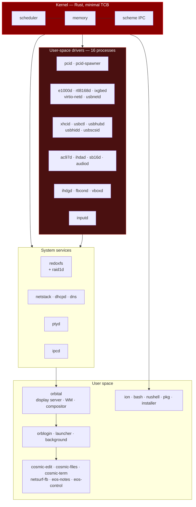
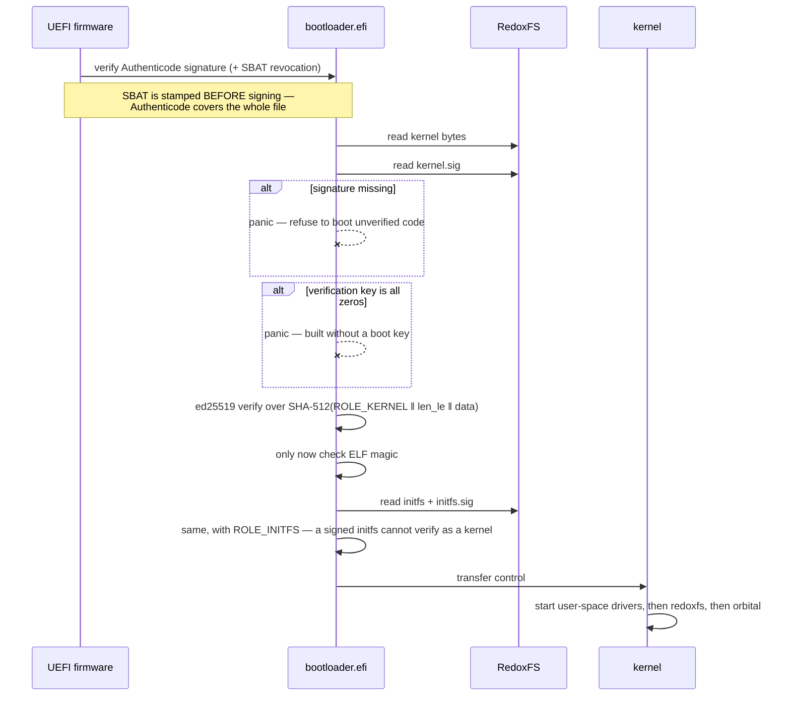
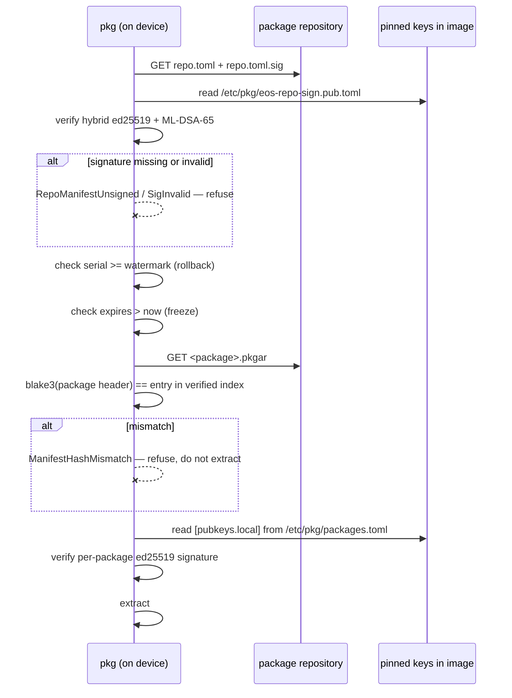
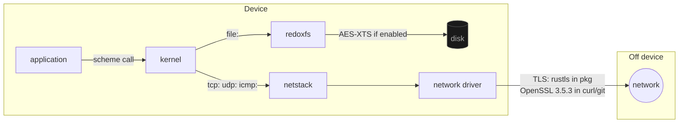
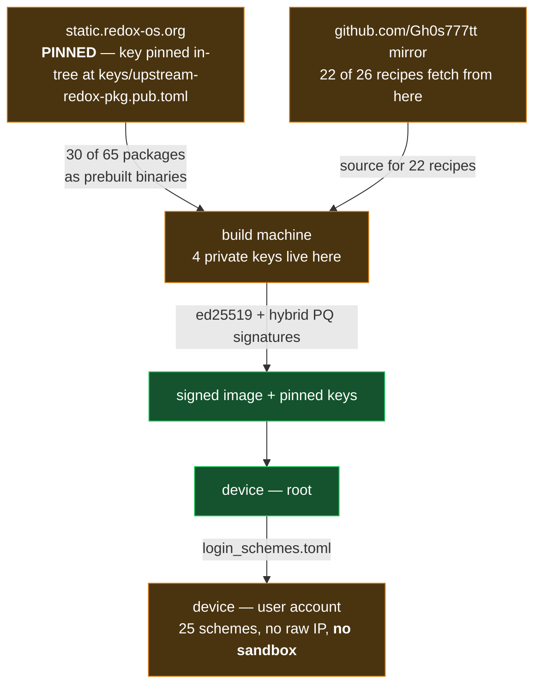
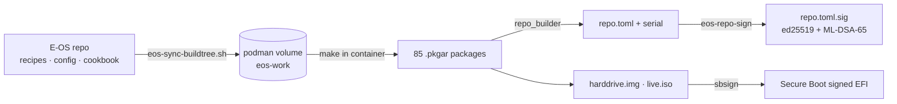

# Architecture

This document describes what the code does, verified against the built image on 2026-08-30. Where a
diagram shows a boundary, that boundary exists in the source and the file:line is given.

## Contents

- [Component map](#component-map)
- [Boot flow](#boot-flow)
- [Update flow](#update-flow)
- [Data flow](#data-flow)
- [Trust boundaries](#trust-boundaries)
- [Build topology](#build-topology)

---

## Component map

E-OS is a microkernel system. The kernel provides scheduling, memory and IPC; **drivers,
filesystems, the RAID layer and the network stack are ordinary user-space processes**. A driver
fault does not take the kernel with it.

Resources are addressed as **schemes** — URL-like namespaces such as `file:`, `tcp:`, `display:`,
`proc:`. Access is granted per user by an explicit allowlist in `/etc/login_schemes.toml`.

**Verified:** the driver list is `/lib/drivers` and `/usr/lib/drivers` in the built image; the
application list is `/usr/bin` plus `/ui/apps` launcher entries.

---

## Boot flow

The distinguishing property of E-OS: **the bootloader authenticates what it loads before it uses
it**. Not after, and not by magic bytes.

**Source:** `eos-bootloader/src/main.rs:436-451` and `src/eos_boot_verify.rs:16-17, 49-56, 72-81`.

**Known weakness — closed.** The whole block is behind `#[cfg(feature = "verify-boot")]`, and the
feature is enabled only when `build/boot-signing/boot.pub.bin` exists
(`recipes/core/bootloader/recipe.toml:26-36`). Without that key the recipe now **refuses to
build**: it writes the reason to stderr and exits 1, unless `EOS_ALLOW_UNVERIFIED_BOOT=1` is set
explicitly.

It used to fail **open** — print a warning and build a bootloader that verifies nothing. That was
worse than it sounds: `scripts/eos-build.sh` pipes make through `tail`, so the warning never
reached the operator, and a machine without the key produced an image indistinguishable from a
verified one. Recorded as `C-2`; the fix asked for was exactly the explicit opt-in that is now
in place.

---

## Update flow

Complete, correct, and **switched off** on x86_64.

**Two facts that belong together.** The mechanism above is real and tested (33 tests in
`eos-pkgutils`). And **both entries in `/etc/pkg.d/` are commented out**, so on x86_64 no update can
occur at all. The aarch64 channel is published but its live index predates `serial`/`expires`.
Tracked as `C-4` and `C-12`.

The index-enforcement exemption is load-bearing rather than lax: during an image build
`redox_installer` has already written the pinned key into the new sysroot while `repo.toml.sig` does
not exist yet, so a source with no remotes is exempt. Without that exemption every build would fail.
It is a named function with its own test so it is not deleted as redundant.

---

## Data flow

- **At rest:** AES-XTS in RedoxFS, offered by the installer, **not on by default**. Hardware
  accelerated on aarch64; software path on x86_64. The key-derivation function has **not** been
  audited — recorded as an open question.
- **In transit:** `pkg` uses rustls (currently carrying `rustls-webpki 0.103.4` with six advisories,
  finding `C-3`); `curl`, `git` and `wget` use OpenSSL 3.5.3.
- **Passwords:** argon2id, `m=19456, t=2, p=1`, in `/etc/shadow`.

---

## Trust boundaries

| Boundary | Enforced by | State |
|---|---|---|
| Firmware → bootloader | Authenticode + SBAT | **enforced** |
| Bootloader → kernel/initfs | ed25519 with domain separation | **enforced**, fail-closed at runtime **and** at build time — a missing key aborts the bootloader build unless `EOS_ALLOW_UNVERIFIED_BOOT=1` (`C-2`) |
| Repository → device | hybrid signature + pinned key + blake3 on bytes + serial/expires | **enforced**, currently unused (`C-4`) |
| Upstream binaries → build | key pinned in-tree at `keys/upstream-redox-pkg.pub.toml`, written over whatever `sync_keys()` fetches | **partly enforced** — the key no longer comes from the serving host; the binaries themselves are still upstream's (`C-1`) |
| Source mirror → build | nothing compares GitLab and GitHub heads | **not enforced** |
| root → user | `/etc/login_schemes.toml` allowlist, `ip` removed | **enforced per account** |
| application → application | — | **absent** (`C-5`) |

The weakest link is at the **start** of the chain, not the end. Layers 3–5 are carefully built and
work; the entry — fetching upstream binaries and sources from a mirror — has no anchor.

---

## Build topology

The checkout lives on exFAT, which podman cannot bind-mount, so the build tree is a **separate git
history inside a podman volume**. Two consequences that have both caused real defects: `make` from
the project directory does not work, and anything counting commits inside the container counts the
wrong history (which is why the index `serial` is computed on the host).
