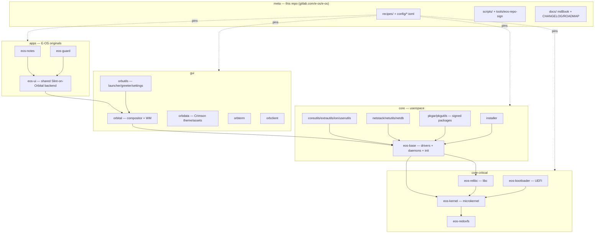

# E-OS Architecture

A top-down map of the system, so a first-time reader can place any component in
one read. E-OS is a **hardened downstream of [Redox OS](https://redox-os.org)** —
a Rust microkernel OS — rebranded "Crimson" (red/black `#E50914`) with original
apps and security hardening on top.

> This file is the entry point. Each layer links to its deep docs. The canonical
> component + pin list is [`repos.toml`](repos.toml); the working standard is
> [`CLAUDE.md`](CLAUDE.md).

## The layers

## What each layer is

- **core-critical** — the trusted base. `eos-kernel` (capability-secure Rust
  microkernel: scheduling, memory, IPC, IRQ), `eos-relibc` (the C library every
  program links; also the dynamic loader `ld.so`), `eos-redoxfs` (the filesystem,
  incl. AES-XTS full-disk encryption), `eos-bootloader` (UEFI boot + FDE prompt).
  These carry E-OS's kernel/loader hardening — see [docs/hardening.md](docs/hardening.md).
- **core (userspace)** — `eos-base` is the big one: all **drivers** (PCI, NVMe,
  xHCI/USB, e1000/virtio net, graphics, audio) and **daemons** (`pcid`, `randd`,
  `rtcd`, netstack) plus init. Around it: the shell (`ion`), core/extra utils,
  `userutils` (login + first-boot password enforcement), the **signed package**
  tools (`pkgar`/`pkgutils`, see [docs/update-system-design.md](docs/update-system-design.md)),
  and the `installer`.
- **gui** — `orbital` is the single-process software compositor + window manager +
  display server. `orbutils` ships the Crimson launcher/taskbar, the `orblogin`
  greeter, and `eos-settings`; `orbdata` holds the theme/wallpaper/icons; `orbterm`
  the terminal. Full plan in [docs/design-desktop-environment.md](docs/design-desktop-environment.md).
- **apps (E-OS originals)** — first-party applications. `eos-ui` is the **shared
  crate** that lets modern [Slint](https://slint.dev) run on Redox: it drives
  Slint's software renderer over `orbclient` (winit cannot run on Redox) and
  bootstraps fonts. `eos-notes` (notes, SQLite/WAL) and `eos-guard` (file-integrity
  monitor, blake3 baseline) both build on it — the pattern for any new app is in
  [docs/creating-an-eos-app.md](docs/creating-an-eos-app.md).
- **meta (this repo)** — no OS code; it **assembles** the OS. `recipes/` +
  `config/*.toml` pin every component to an exact fork revision and define the
  image; `scripts/eos-repos.sh` manages the repo/pin manifest; `tools/eos-repo-sign`
  signs the package repo; `docs/` is this manual. See [docs/ci.md](docs/ci.md).

## How it is built & shipped

The meta repo pins each component to an exact revision in [`repos.toml`](repos.toml)
and the `recipes/`. The build runs in a container (`make CI=1 … all`), producing a
bootable image that is **boot-smoke verified** (`scripts/ci-boot-smoke.sh`) and
accompanied by a generated **SBOM** (`scripts/gen-sbom.py`). Hosting: GitLab
`e-os/e-os` is the source of truth; GitHub `Gh0s777tt/*` is the read-only mirror the
recipes fetch from. Two-tier CI (light shared-runner checks + a self-hosted heavy
OS build) is documented in [docs/ci.md](docs/ci.md).

A map of the meta repo itself: `src/` is the **vendored upstream
`redox_cookbook`** (the recipe build engine — upstream code, carrying no E-OS
modifications, so the CLAUDE.md §3 doc-comment standard does not apply to it);
`recipes/` are the package definitions with the E-OS fork pins; `patches/`
holds *reference copies* of the branding diffs whose real life is commits in
the forks (see `patches/README.md` — nothing applies them at build time);
`tools/` is E-OS-authored host tooling (e.g. `eos-repo-sign`); `mk/` +
`Makefile` + `build.sh` are the upstream build entry points; `scripts/` mixes
upstream helpers with the E-OS-authored CI/ops scripts (each E-OS script
carries a what+why header).

## Where to go next

- **Internals** (boot flow, schemes, the trusted computing base): [docs/architecture.md](docs/architecture.md)
- Build it: [docs/building.md](docs/building.md) · [docs/getting-started.md](docs/getting-started.md)
- Write an app: [docs/creating-an-eos-app.md](docs/creating-an-eos-app.md)
- Design records: [docs/ SUMMARY → Design & proposals](docs/SUMMARY.md)
- Security posture: [SECURITY.md](SECURITY.md) · [docs/threat-model.md](docs/threat-model.md)
- What's done vs claimed: [docs/reality-ledger.md](docs/reality-ledger.md)
- The working standard: [CLAUDE.md](CLAUDE.md)
</content>
