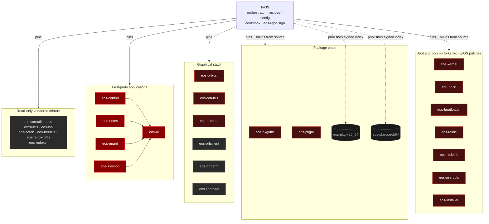
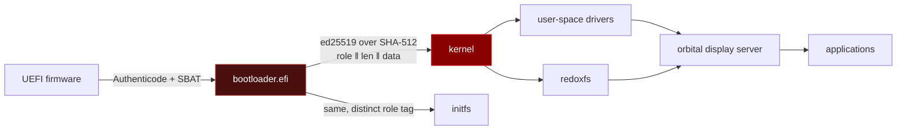

<!-- SYNC: v0.2.0 · Unreleased U-224 · 2026-08-30 — keep this file in step with CHANGELOG.md and ROADMAP.md.
     NOTE: ci-integrity.sh check 3 verifies that this marker EXISTS, not that its value is current.
     Keeping it accurate is a human obligation until that gate is tightened (see ROADMAP, P0). -->
# E-OS

A hardened downstream distribution of [Redox OS](https://www.redox-os.org) — a Unix-like operating
system with a microkernel written in Rust, packaged with a verified boot chain, a post-quantum
signed package index, and a curated desktop.

[](https://gitlab.com/e-os/e-os/-/pipelines)
[](https://gitlab.com/e-os/e-os/-/pipelines)
[](https://github.com/Gh0s777tt/E-OS/tags)
[](LICENSE)
[](https://gitlab.com/e-os/e-os/-/commits/main)

> **On the badges.** The pipeline badge currently reads **failed** and the coverage badge reads
> **unknown**. Both are accurate, but not for the reason first written here: the shared-runner
> quota exhausts **intermittently**, not permanently. It was out from 2026-08-28 until the
> 2026-09-01 reset, ran green all that day, and was out again by evening. The self-hosted
> `eos-heavy` tier spends no shared minutes and is unaffected — `build-image` succeeded on
> 2026-09-01 in 1299 s, running boot-smoke on two images and install-smoke through to a login
> prompt — see [`docs/audit/03-security-audit-2026-08-30.md`](docs/audit/03-security-audit-2026-08-30.md) §2.
> An OpenSSF Scorecard badge is deliberately absent: the project is not registered with Scorecard,
> and the badge would render `invalid repo path`. A GitLab release badge is absent for the same
> reason — it renders `none`, because tags exist but Release objects do not.

---

## Table of contents

- [What this repository is](#what-this-repository-is)
- [The repository graph](#the-repository-graph)
- [Features](#features)
- [Quick start](#quick-start)
- [Usage](#usage)
- [Requirements and supported platforms](#requirements-and-supported-platforms)
- [Documentation](#documentation)
- [Project documents](#project-documents)
- [Architecture](#architecture)
- [Security](#security)
- [License, authors, acknowledgements](#license-authors-acknowledgements)

---

## What this repository is

This repository is the **orchestrator** of the E-OS ecosystem. It contains no operating-system
source code of its own. What it holds is:

| Directory | Contents |
|---|---|
| `recipes/` | build recipes — which upstream or forked source becomes which package |
| `config/` | image definitions per architecture and variant (`eos.toml`, `desktop.toml`, …) |
| `src/` | the vendored upstream `redox_cookbook` build engine (binaries `repo`, `repo_builder`, `cookbook_redoxer`) |
| `tools/eos-repo-sign` | E-OS-authored: hybrid ed25519 + ML-DSA-65 signing of the package index |
| `scripts/` | build, signing, publication and verification automation |
| `mk/`, `Makefile` | the GNU Make build system |
| `podman/` | container definitions for the hermetic build environment |
| `docs/` | the documentation set, including audit reports |

The operating system itself lives in **29 sibling repositories**, pinned by revision in
[`repos.toml`](repos.toml). Nothing is fetched by a floating branch: every pinned revision is
verified against the published branch head by `scripts/eos-repos.sh pins --strict`.

### The repository graph



**Repository types**, enforced by `scripts/eos-mirror-drift.sh` and `ci-integrity.sh` check 6:

| Type | Meaning | Count |
|---|---|---|
| **A** | E-OS-authored components | 6 |
| **B** | read-only vendored mirrors of upstream Redox — never hand-edited | 10 |
| **C** | forks carrying E-OS patches, kept rebasable | 12 |
| **D** | published package artefacts | 2 |

---

## Features

Everything in the **Shipped** table was verified on 2026-08-30 by mounting the built image
(`eos-x86_64-harddrive.img`) and reading its contents — not from documentation. Method and evidence:
[`docs/audit/02-feature-inventory-2026-08-30.md`](docs/audit/02-feature-inventory-2026-08-30.md).

### Shipped

| Area | What is in the image |
|---|---|
| **Verified boot chain** | The bootloader authenticates the kernel and initfs with ed25519 over `SHA-512(role ‖ len_le ‖ data)` **before** the magic-byte check and before any byte is used. A missing signature or a zero key refuses to boot. Domain separation means a signed initfs cannot verify as a kernel. |
| **Post-quantum signed package index** | `repo.toml` is signed with a **hybrid ed25519 + ML-DSA-65 (FIPS 204)** signature. Verified against the live published aarch64 index (79 packages): both halves pass; a single flipped byte makes both refuse. |
| **Pinned trust anchors in the image** | `/etc/pkg/eos-repo-sign.pub.toml` (index key) and `/etc/pkg/packages.toml` → `[pubkeys.local]` (package key), byte-identical to the committed public halves. |
| **Package bytes enforced against the signed index** | blake3 from the authenticated manifest is checked against the bytes about to be extracted, on every install path including `pkg install`. Rollback and freeze protection via `serial` and `expires`. |
| **Secure Boot** | Both UEFI bootloaders carry SBAT and are Authenticode-signed; SBAT is stamped **before** signing, because Authenticode covers the whole file. |
| **Desktop** | The Crimson desktop on the `orbital` display server: greeter, launcher, taskbar, tray, notifications, screenshot tool. |
| **Applications** | `cosmic-edit`, `cosmic-files`, `cosmic-term`, NetSurf 3.11 — **shipped as the upstream prebuilt, not PIE** ([#28](https://gitlab.com/e-os/e-os/-/issues/28), measured 2026-09-02: `readelf` Type `EXEC` at `0x400000`, no `about:welcome` patch, foreign `commit_identifier`); the recipe builds it from source as PIE, the artefact in the image is not that build, **eos-notes**, **eos-control** (system overview, processes, security, storage, power, sound, live network). |
| **Shells and tooling** | `ion` (default), `bash`, `nushell`; `vim`, `nano`, `kibi`, `ripgrep`, `git`, `curl`, `wget`, OpenSSH 9.8, OpenSSL 3.5.3. |
| **Full-disk encryption** | RedoxFS AES-XTS, offered by the installer. Hardware-accelerated on aarch64 via ARMv8 Crypto Extensions, software path on x86_64. |
| **Forced first-boot password** | Both the text login and the graphical greeter refuse to proceed while the account has no password. |
| **Per-user kernel-scheme allowlist** | `/etc/login_schemes.toml` grants `root` everything and the unprivileged user an explicit 25-scheme list. Raw IP sockets (`ip`) are **removed** from that list. |
| **User-space drivers** | 16 drivers as ordinary processes — a driver fault does not take down the kernel. |
| **RAID-1** | `raid1d`: write-both / read-fallback, degraded boot, resync of a re-added member. |
| **Password hashing** | Two paths, measured 2026-09-02 ([#27](https://gitlab.com/e-os/e-os/-/issues/27)): passwords hashed **at image-build time** use argon2id (`m=19456, t=2, p=1`, `rust-argon2 3.0.0`); passwords set **in the running system** — `passwd`, the first-boot enrolment, the `orblogin` greeter — go through `redox_users 0.4.6` → `rust-argon2 0.8.3`, whose default is **argon2i, `m=4096, t=3`**: 4.0 ms per guess against 14.1 ms, on one core. This row used to state only the stronger of the two. |

### Planned

| Item | Status | Tracked as |
|---|---|---|
| Application sandboxing (per-process scheme sets) | 📋 planned | [ROADMAP](ROADMAP.md) · audit `C-5` |
| Persistent audit log | 📋 planned | [ROADMAP](ROADMAP.md) · audit `C-9` |
| Packet filtering / firewall | 📋 planned | [ROADMAP](ROADMAP.md) · audit `C-10` |
| Published x86_64 package channel | 🚧 in progress | [ROADMAP](ROADMAP.md) · audit `C-4` |
| Wi-Fi | 📋 planned | [ROADMAP](ROADMAP.md) |
| Microsoft-signed shim path | 📋 planned | `docs/adr/0006-path-to-microsoft-verification.md` |

### Deliberately absent

No antivirus, no VPN/Tor, no backup tool, no SELinux/AppArmor. The access-control model is the
per-user scheme allowlist above; file integrity monitoring lives inside `eos-control`. These are
choices, not omissions — the reasoning is in
[`docs/audit/02-feature-inventory-2026-08-30.md`](docs/audit/02-feature-inventory-2026-08-30.md) §3.

---

## Quick start

Every command below was executed on 2026-08-30 on the reference host (Apple Silicon macOS +
podman) and its real output is shown.

```bash
git clone https://gitlab.com/e-os/e-os.git && cd e-os
```

**Build an x86_64 image.** Use the script, not bare `make`: this project directory lives on exFAT,
which podman cannot bind-mount, so the build runs inside a podman volume. `make all` from the
project directory does not work here.

```bash
bash scripts/eos-build.sh x86_64
```

Ends with:

```
==> export image + live ISO
    /Users/<you>/eos-artifacts/eos-x86_64-harddrive.img (1400 MiB)
    /Users/<you>/eos-artifacts/eos-0.2.0-x86_64-installer.img (1400 MiB)
Done.
```

The second file is the **installation medium** — the one you write to a USB stick. It used to be
called `eos-x86_64-live.iso`; `R-611a` renamed it to `eos-<version>-<arch>-installer.img`, and
the name comes from `make print-installer-medium` rather than being spelled out in each caller.
Both are raw GPT images.

**Boot the image headlessly and assert it reaches userspace:**

```bash
bash scripts/ci-boot-smoke.sh ~/eos-artifacts/eos-x86_64-harddrive.img 300 --arch x86_64
```

Real output:

```
boot-smoke: x86_64, qemu pid 13690, up to 300s to reach login (TCG: 19s measured)…
boot-smoke: PASS — reached userspace login
```

Both architectures reach a login prompt (measured 2026-09-01). aarch64 was broken for part of
August and is fixed: the bootloader is now built without LTO on that target, because LTO merged
callee stack frames into their caller and the kernel-load path overran the firmware's ~124 KiB
DXE stack.

**Install onto a second disk and boot the result** — the stronger claim, because booting a
pre-built image proves nothing about installing:

```bash
bash scripts/ci-install-smoke.sh ~/eos-artifacts/eos-0.2.0-aarch64-installer.img 2400 --arch aarch64
```

```
install-smoke:   saw the installer refusing a name that matches no disk
install-smoke:   the target disk is byte-for-byte untouched by the refusal (0 blocks)
install-smoke: PASS — installed to a second disk and booted it to a login prompt
```

This passes on **aarch64** and, since 2026-09-02, on **x86_64** as well
([#6](https://gitlab.com/e-os/e-os/-/issues/6),
[#24](https://gitlab.com/e-os/e-os/-/issues/24)): a clean build runs the harness through to
*"PASS — installed to a second disk and booted it to a login prompt"*, stage 2 included.
Two separate causes had to go. The `getty` terminal-size probe was swallowing typed input —
not, as first supposed, a stray newline left in `login`. That alone still left the x86_64 run
**intermittent**, passing 2 runs out of 7, because a *second* getty on the same serial console
answered the next line typed with "Login incorrect"; with one getty per console it passes 5 of
5. Both causes were confirmed the same way: put them back, and the harness fails again.

`EOS_SMOKE_FDE=1` runs the same harness against an **encrypted** install. Stage 2 then proves
the encryption in three steps, each of which can fail on its own: the bootloader must ask for
the disk password, a deliberately wrong password must not unlock the disk, and only then may the
right one reach `eos login:`. `EOS_SMOKE_FDE_NEGATIVE=1` is the negative control — it installs
*without* encryption while still running stage 2 in FDE mode, so the first step has to fail, and
be seen to fail for the right reason.

### Do the gates work?

On 2026-09-02 two multi-agent rounds read every gate in the repository — all 65 scripts,
`.gitlab-ci.yml`, the eight GitHub Actions workflows, the git hooks, and `Makefile` with
`mk/*.mk` — and asked one question of each: *can this check fail?* 34 defects were confirmed and
fixed, among them a secret scan that failed **open** when `gitleaks` was absent, a release
pipeline that signed without ever verifying what it signed, and a Secure Boot check that
reported success having examined no files. Each fix carries a measurement in both directions;
the register is [`ROADMAP.md` §1.4](ROADMAP.md#14-gate-quality-audit-2026-09-02).

---

## Usage

**Verify every pinned revision against the published branch head:**

```bash
bash scripts/eos-repos.sh pins --strict
```

```
eos-liborbital   | master       | 76ba2e79ac  | 76ba2e79ac  | OK(tip)
eos-redox-fatfs  | master       | 26caa09089  | 26caa09089  | OK(tip)
eos-redoxer      | master       | 974c1482c2  | 974c1482c2  | OK(tip)
---- pins ok=25 drift=1 (non-allowlisted=0) split-pin=0 ----
```

**Run the repository integrity gate** — the same checks CI runs:

```bash
bash scripts/ci-integrity.sh
```

```
ok: README SYNC marker present
ok: every unsafe in E-OS-owned Rust is justified
ok: CRLF-pinned files keep their line endings
ok: no image ships an active unauthenticated package source
ok: no repo-signing secret material in tracked files
ok: no fork source vendored into this repo
integrity: PASS
```

**Sign and verify a repository index:**

```bash
tools/eos-repo-sign/target/release/eos-repo-sign sign  <secret.toml> repo.toml
tools/eos-repo-sign/target/release/eos-repo-sign verify keys/eos-repo-sign.pub.toml repo.toml
```

```
ed25519 (classical):  OK
ml-dsa-65 (PQ):       OK
VERIFIED: repo.toml
```

Exit status is `0` on success and `1` on failure; a single flipped byte makes both algorithms
report `FAIL`.

---

## Requirements and supported platforms

### Build host

| | |
|---|---|
| **Operating system** | macOS (Apple Silicon, the reference host) or Linux |
| **Container runtime** | podman — the build is hermetic and runs inside `localhost/redox-base:latest` |
| **Toolchain** | Rust nightly pinned by [`rust-toolchain.toml`](rust-toolchain.toml); installed inside the container |
| **QEMU** | `qemu-system-x86_64` / `qemu-system-aarch64`, for boot-smoke and local runs |
| **Disk** | ~90 GB free. A full build tree with caches measures ~70 GB |
| **Filesystem caveat** | if the checkout is on exFAT, podman cannot bind-mount it; `scripts/eos-build.sh` handles this by building inside a podman volume |

### Build targets

| Target | Status |
|---|---|
| `x86_64-unknown-redox` | supported — image and live ISO, boot-verified under QEMU |
| `aarch64-unknown-redox` | supported — additionally the only architecture with a **published** package channel |
| `i586`, `riscv64gc` | inherited upstream configuration, **not built by E-OS** |

### Runtime hardware

Verified under QEMU. Hardware coverage is described in [`HARDWARE.md`](HARDWARE.md); the image
carries 16 user-space drivers: `ac97d`, `e1000d`, `ihdad`, `ihdgd`, `ixgbed`, `rtl8139d`,
`rtl8168d`, `sb16d`, `usbctl`, `usbhidd`, `usbhubd`, `usbnetd`, `usbscsid`, `vboxd`,
`virtio-netd`, `xhcid`.

**No Wi-Fi, Bluetooth, NVMe or non-Intel GPU driver ships today.**

---

## Documentation

The full documentation set lives in [`docs/`](docs/) and is published as an mdBook at
<https://e-os.gitlab.io/e-os/>.

| Area | Entry point |
|---|---|
| Getting started | [`docs/getting-started/index.md`](docs/getting-started/index.md) |
| Building | [`docs/getting-started/building.md`](docs/getting-started/building.md) · [`docs/getting-started/build-troubleshooting.md`](docs/getting-started/build-troubleshooting.md) |
| Installing | [`docs/getting-started/install.md`](docs/getting-started/install.md) |
| Architecture | [`docs/architecture/`](docs/architecture/) |
| Security | [`docs/security/index.md`](docs/security/index.md) · [`docs/security/hardening.md`](docs/security/hardening.md) · [`docs/security/threat-model.md`](docs/security/threat-model.md) |
| Packages | [`docs/reference/packages.md`](docs/reference/packages.md) |
| Decision records | [`docs/adr/`](docs/adr/) |
| Audit reports | [`docs/audit/`](docs/audit/) |

> The GitHub Pages copy of the documentation site is **not maintained** and currently returns 404.
> GitLab Pages is canonical.

- 🎬 **Animated crimson desktop** — a per-frame smoke-and-sparks wallpaper, a
  floating launcher, and labelled, double-clickable desktop icons.
- 🔒 **Full-disk encryption with hardware AES** — RedoxFS AES-XTS that uses the
  **ARMv8 Crypto Extensions** at runtime (with a clean software fallback), gated
  by a kernel-exported CPU-feature channel.
- 🪞 **RAID-1 mirroring** — a userspace `raid1d` block daemon: write-both /
  read-fallback, degraded boot, **resync/rebuild** of a re-added member, and
  split-brain safety.
- 🌐 **USB networking & storage** — a Rust **USB RNDIS** network driver
  (`usbnetd`; **full duplex** — a complete DHCP handshake, pcap-verified) and USB
  mass-storage support.
- 🔑 **Post-quantum-ready signing** — a tool that signs the package repo manifest
  with a **hybrid ed25519 + ML-DSA-65 (FIPS 204)** signature at publish time.
  *Verification is implemented on both ends and the key exists:* `pkg-lib` checks the
  signature, `keys/eos-repo-sign.pub.toml` is tracked (4075 B, added 2026-08-28) and is
  pinned into the image at `/etc/pkg/eos-repo-sign.pub.toml`, so a bad index is fatal.
  What is still missing is the published x86_64 repository the key would sign for
  (`R-701`, finding `C-4`).

**Since then — the `U-081`–`U-114` wave** (all verified on-device under QEMU)

- 🎛️ **eos-control** — a native Crimson **control center**: system overview,
  processes + capabilities, security, storage, **Power**, **Sound** and a live
  **Network** pane (read the running `netcfg:` stack, apply a static IPv4 config
  through a privileged `eos-netcfg` shim — never running the GUI as root).
- 📝 **eos-notes** — a Slint + SQLite (WAL) notes app, and **eos-ui**, the shared
  Slint-on-Orbital backend crate every E-OS GUI app builds on.
- 🛡️ **Filesystem-integrity and system monitoring** — shipped as tabs inside
  **eos-control**, not as separate apps. `recipes/gui/eos-guard` and
  `recipes/gui/eos-sysmon` exist, but neither is packaged into the image: `U-095`
  consolidated both into the control center (`config/x86_64/eos.toml:22-23`). A booted
  E-OS has the functionality and does not have two extra binaries.
- 🌍 **NetSurf built from source as a PIE** — real web browsing on E-OS.
- 🧭 **Graphical OOBE** — first-boot password enrolment in the crimson greeter,
  plus a system tray, toast notifications, a screenshot tool and launcher search.

## Project documents

| Document | Purpose |
|---|---|
| [`ROADMAP.md`](ROADMAP.md) | delivered work, planned work, security roadmap, installer epics |
| [`CONTRIBUTING.md`](CONTRIBUTING.md) | environment, branch strategy, commit format, PR checklist, release process |
| [`SECURITY.md`](SECURITY.md) | supported versions, private reporting, disclosure policy, scope |
| [`CHANGELOG.md`](CHANGELOG.md) | Keep a Changelog history grouped by release |
| [`ARCHITECTURE.md`](ARCHITECTURE.md) | components, boot flow, update flow, trust boundaries |
| [`CLAUDE.md`](CLAUDE.md) | working agreement and the mandatory verification protocol |
| [`CODE_OF_CONDUCT.md`](CODE_OF_CONDUCT.md) | Contributor Covenant 2.1 |
| [`NOTICE`](NOTICE) · [`TRADEMARK.md`](TRADEMARK.md) | attribution and upstream trademark policy |

---

## Architecture

E-OS is a Redox downstream: a Rust microkernel with drivers, filesystems, the RAID layer and the
network stack running in **user space** as ordinary processes. Resources are addressed as
**schemes** — URL-like namespaces — and access is granted per user by an explicit allowlist.



Full description, including the update and data flows: [`ARCHITECTURE.md`](ARCHITECTURE.md).

---

## Security

Report vulnerabilities privately — see [`SECURITY.md`](SECURITY.md) for the channels, the supported
version table, and the disclosure policy. **Please do not open a public issue for a security bug.**

### Threat model in brief

| Adversary | Position |
|---|---|
| Network attacker between device and repository | **Addressed** — hybrid signature, image-pinned key, blake3 enforced on package bytes, rollback/freeze counters |
| Whoever controls `static.redox-os.org` | **Partly addressed** — 30 of 65 packages are still prebuilt upstream binaries, but their signing key is now pinned in-tree (`keys/upstream-redox-pkg.pub.toml`) and written over whatever the sync fetches, so the key no longer comes from the serving host |
| Local unprivileged user | **Partly addressed** — no raw IP sockets; but the boundary is per-account, and there is no application sandbox |
| Device theft | **Addressed if enabled** — AES-XTS full-disk encryption is offered at install, not default |
| Build-machine compromise | **Not addressed** — signing keys live on the build host |

The complete model, with evidence for each row, is in
[`docs/audit/03-security-audit-2026-08-30.md`](docs/audit/03-security-audit-2026-08-30.md) §1.

---

## License, authors, acknowledgements

**License:** [AGPL-3.0-or-later](LICENSE). Files inherited from Redox OS remain under **MIT** —
see [`NOTICE`](NOTICE) and [`docs/reference/third-party-licenses.md`](docs/reference/third-party-licenses.md).

**Authors:** Damian (`Gh0s777tt`) and the E-OS contributors.

**Acknowledgements.** E-OS is a downstream distribution and does not claim to be a from-scratch
operating system. It stands on **Redox OS**, created by Jeremy Soller and the Redox community, and
on the Rust ecosystem. Upstream trademark policy is reproduced in [`TRADEMARK.md`](TRADEMARK.md).
The desktop applications `cosmic-edit`, `cosmic-files` and `cosmic-term` come from System76's
COSMIC project; the browser is **NetSurf**.

**Source of truth:** <https://gitlab.com/e-os/e-os>. The GitHub repository is a read-only mirror.
