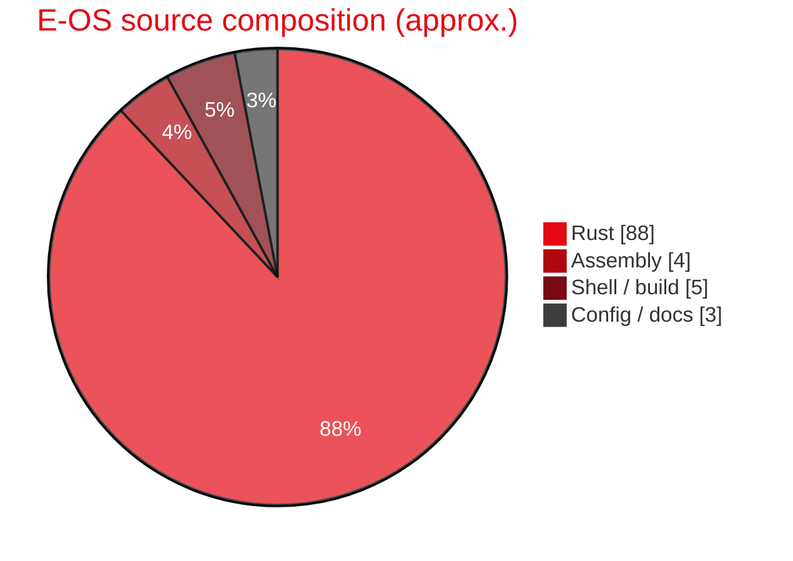
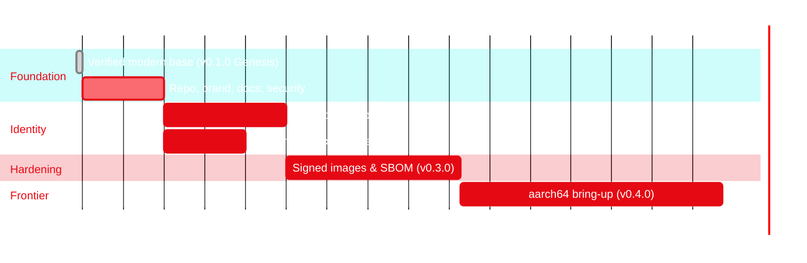

<!-- ╔══════════════════════════════════════════════════════════════════════╗ -->
<!-- ║                              E-OS  README                              ║ -->
<!-- ║                  Theme: deep red (#E50914) on black                    ║ -->
<!-- ╚══════════════════════════════════════════════════════════════════════╝ -->

<a name="top"></a>

<p align="center">
  
</p>

<p align="center">
  
</p>

<p align="center">
  <a href="LICENSE"></a>
  
  
  
  
</p>

<p align="center">
  
  
  
  
</p>

<p align="center">
  <b>
  <a href="#-what-is-e-os">What</a> ·
  <a href="#-quick-start">Quick&nbsp;Start</a> ·
  <a href="docs/getting-started.md">Docs</a> ·
  <a href="ROADMAP.md">Roadmap</a> ·
  <a href="CHANGELOG.md">Changelog</a> ·
  <a href="SECURITY.md">Security</a> ·
  <a href="CONTRIBUTING.md">Contributing</a>
  </b>
</p>

<p align="center"></p>

---

## 🖥️ Preview

<p align="center">
  
  <br/>
  <sub><b>E-OS 0.1.0 “Genesis”</b> — the COSMIC desktop, booted under QEMU/KVM.</sub>
</p>

---

## ⚡ What is E-OS

**E-OS** is a modern, memory-safe **operating system written in Rust**. It is a
**downstream distribution of [Redox OS](https://www.redox-os.org)** — building on
Redox's proven microkernel foundation while pursuing its own identity, roadmap,
and hardening goals.

> E-OS is **not** a from-scratch OS, and never claims to be. It stands on the
> shoulders of Redox OS (MIT) and the Rust ecosystem. Our work is the
> distribution: curation, hardening, branding, tooling, documentation, and the
> features on the [roadmap](ROADMAP.md). Credit to upstream is permanent — see
> [Built on Redox OS](#-built-on-redox-os).

### Why E-OS?

| | |
|---|---|
| 🦀 **Rust everywhere** | Kernel, drivers, libc (relibc) and userland in a language that eliminates whole classes of memory-safety bugs. |
| 🧩 **True microkernel** | Drivers, filesystems and the network stack run in **user space** as isolated processes. A driver crash isn't a kernel panic. |
| 🔐 **Capability-secure** | Everything is a **scheme** (URL-like resource). Least-privilege by construction — the AGPL-3.0 license keeps derivatives open. |
| 🖥️ **COSMIC desktop** | Ships the System76 **COSMIC** desktop environment, also written in Rust. |
| 📦 **Reproducible builds** | Containerized (Podman) build system, pinned toolchain, verified-bootable base image. |

---

## ✨ Highlights

- **Microkernel architecture** — minimal trusted computing base; servers in userspace.
- **`relibc`** — a clean-room C library in Rust (Linux + Redox targets).
- **RedoxFS** — a modern, copy-on-write, optionally-encrypted filesystem.
- **Everything-is-a-scheme** — uniform, capability-style resource model.
- **COSMIC** — a fast, modern Rust desktop.
- **Source-compatible** — runs many Rust, Linux and BSD programs via the cookbook.
- **Verified base** — E-OS `0.1.0` boots end-to-end under QEMU/KVM to a login. ([proof](EOS_BUILD_STATE.md))

---

## 🧱 Architecture


Everything a program touches — files, devices, pipes, the display — is a
**scheme**, accessed through a URL-like path (`file:`, `disk:`, `display:` …).
Drivers and services are ordinary user-space processes that *provide* schemes,
so the kernel stays small and faults stay contained.

---

## 🧰 Tech Stack

| Layer | Technology |
|------|------------|
| Language | **Rust** (nightly, pinned) + a little assembly |
| Kernel | Custom **microkernel** (x86_64, UEFI boot) |
| libc | **relibc** (Rust) |
| Filesystem | **RedoxFS** (CoW, encryptable) |
| Desktop | **COSMIC** (System76) |
| Drivers | user-space: `nvmed`, `e1000d`, `xhcid`, `ihdad`, `ahcid`, … |
| Build | **Podman** containers · cookbook · `pkgar` packages |
| Emulation | **QEMU 10 + KVM**, OVMF (UEFI) |
| CI / Quality | GitHub Actions · CodeQL · gitleaks · Dependabot |



---

## 🚀 Quick Start

> **Host:** Linux or **Windows 11 + WSL2 (Ubuntu)**. Builds run inside rootless
> **Podman** containers — you do not pollute your host toolchain.

```bash
# 1) Get the build system
git clone https://github.com/Gh0s777tt/E-OS.git eos && cd eos

# 2) Bootstrap deps (Podman build, QEMU full, runtime crun)
curl -sf https://gitlab.redox-os.org/redox-os/redox/-/raw/master/podman_bootstrap.sh -o podman_bootstrap.sh
bash -e podman_bootstrap.sh
source ~/.cargo/env

# 3) Build the full desktop image  ── CI=1 is REQUIRED for headless/CI builds *
make CI=1 all

# 4) Boot it (COSMIC desktop)
make qemu                 # GUI
make qemu gpu=no          # headless serial console
```

> \* **`CI=1` is mandatory when building non-interactively.** The cookbook `repo`
> tool renders a TUI that panics (`slice index … repo.rs:1693`) when stdout is
> not a real terminal. `CI=1` disables the TUI and prints plain logs. See
> [`EOS_BUILD_STATE.md`](EOS_BUILD_STATE.md) and [docs/building.md](docs/building.md).

Output image: `build/x86_64/desktop/harddrive.img`. Default logins:
`user` (no password) · `root` / `password`.

➡️ Full guide: **[docs/getting-started.md](docs/getting-started.md)** ·
Troubleshooting: **[docs/building.md](docs/building.md)**

---

## 🗺️ Roadmap



See the full, numbered plan in **[ROADMAP.md](ROADMAP.md)**.

---

## 🧩 Core Components

| Component | Role | Upstream |
|-----------|------|----------|
| `kernel` | The microkernel | redox-os/kernel |
| `relibc` | C library in Rust | redox-os/relibc |
| `redoxfs` | Filesystem | redox-os/redoxfs |
| `bootloader` | UEFI/BIOS boot | redox-os/bootloader |
| `drivers` | User-space device drivers | redox-os/drivers |
| `cookbook` | Package/recipe build system | redox-os/cookbook |
| `cosmic-*` | Desktop environment | pop-os/cosmic-* |

---

## 🔐 Security

E-OS is **AGPL-3.0** — strong copyleft. Anyone who runs a modified E-OS,
**including over a network**, must make their source available. This is a
deliberate **anti-appropriation** choice.

Repository hardening:

- 🔑 **Secret scanning + push protection** (GitHub) and **gitleaks** CI.
- 🤖 **Dependabot** + **CodeQL** code scanning.
- 👮 **Branch protection** on the default branch + **CODEOWNERS** reviews.
- ✍️ **Signed commits** encouraged (see [docs/security.md](docs/security.md)).

Found a vulnerability? **Do not** open a public issue — read
**[SECURITY.md](SECURITY.md)** for private disclosure.

---

## 🤝 Contributing

PRs and issues welcome. Start with **[CONTRIBUTING.md](CONTRIBUTING.md)** and the
**[Code of Conduct](CODE_OF_CONDUCT.md)**. Good first steps live in
[docs/getting-started.md](docs/getting-started.md).

By contributing you agree your work is licensed under **AGPL-3.0-or-later**.

---

## 📦 Releases & Changelog

Current: **v0.1.0 "Genesis"** — first verified-bootable E-OS base.
Every change is recorded, numbered and described in **[CHANGELOG.md](CHANGELOG.md)**
([Keep a Changelog](https://keepachangelog.com) · [SemVer](https://semver.org)).

---

## 🙏 Built on Redox OS

E-OS exists because of **[Redox OS](https://www.redox-os.org)** and its community,
led by **Jeremy Soller**. The kernel, relibc, RedoxFS, drivers and build system
are Redox's work, under the **MIT License** (`licenses/Redox-OS-MIT.txt`).

If you like E-OS, please **support upstream**:
[Redox Donate](https://redox-os.org/donate/) ·
[The Redox Book](https://doc.redox-os.org/book/) ·
[Matrix chat](https://matrix.to/#/#redox-join:matrix.org).

"Redox" is a trademark of its owners; E-OS is independent and unaffiliated.
See [TRADEMARK.md](TRADEMARK.md).

---

## ⚖️ License

- **E-OS as a whole:** [GNU AGPL-3.0-or-later](LICENSE).
- **Inherited Redox components:** [MIT](licenses/Redox-OS-MIT.txt) (notices retained).
- Details: [NOTICE](NOTICE).

<p align="center"></p>

<p align="center">
  <sub>Made with 🦀 and ❤️ · © 2026 E-OS contributors · AGPL-3.0 · <a href="#top">back to top ↑</a></sub>
</p>

<p align="center">
  
</p>
