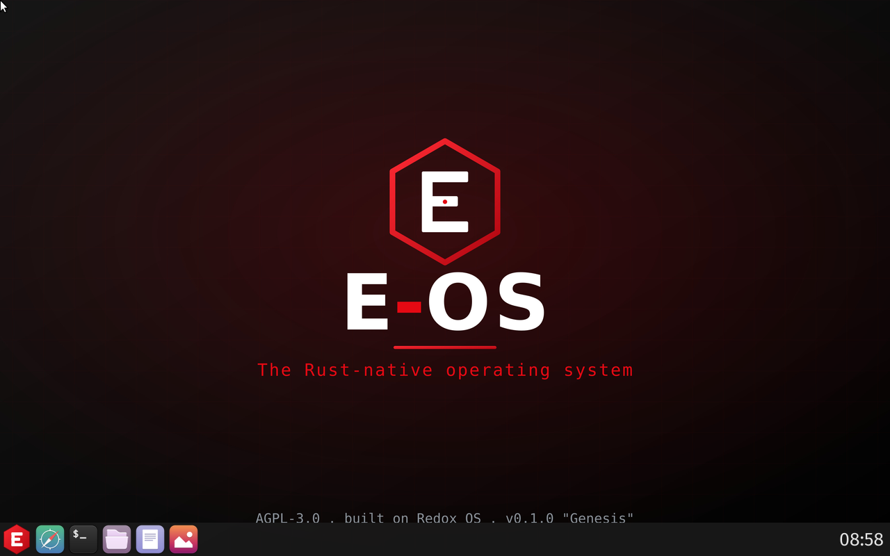
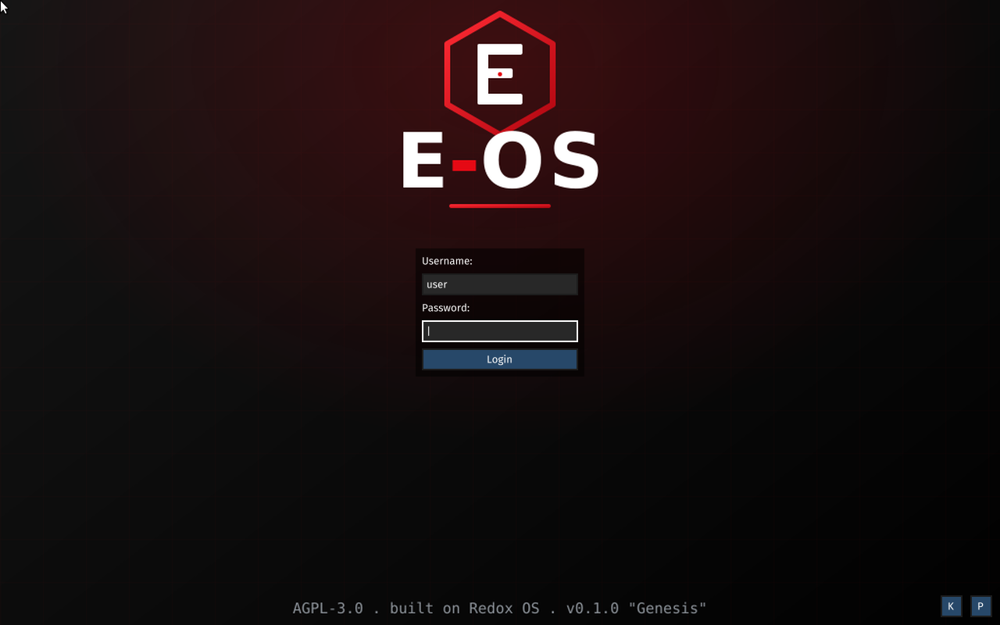
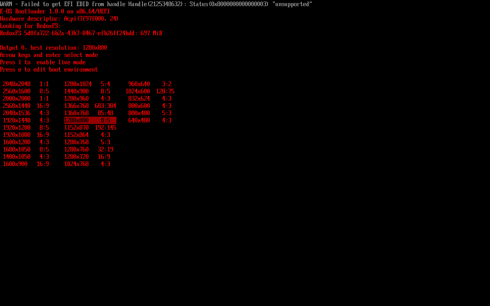
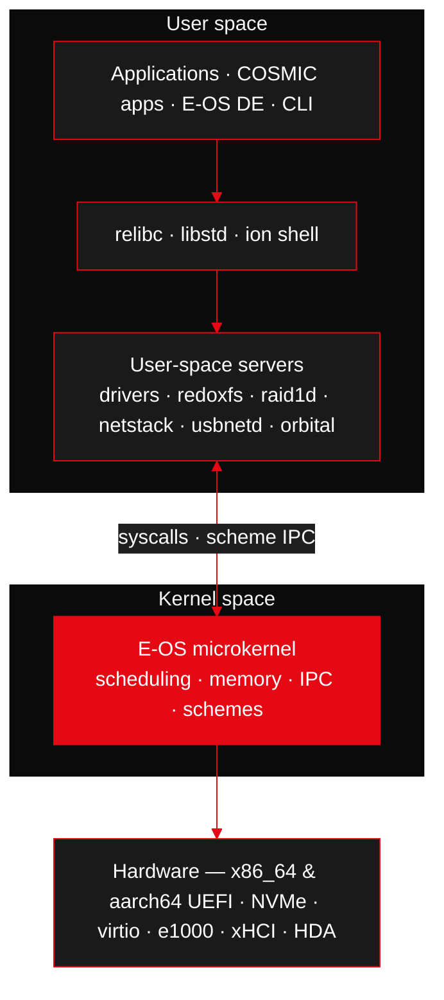
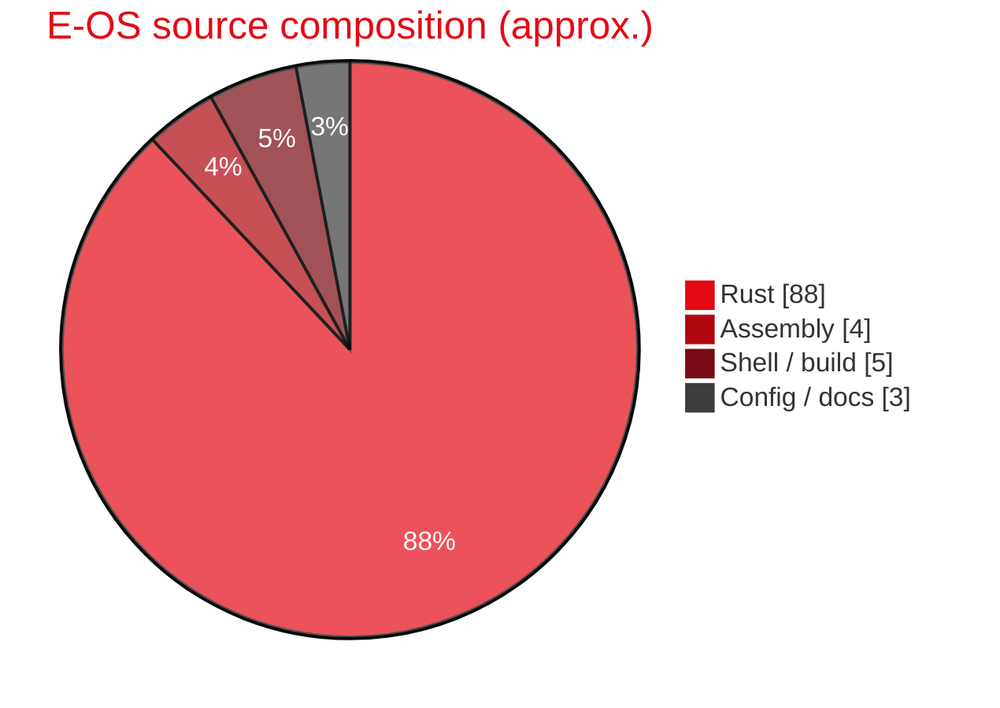
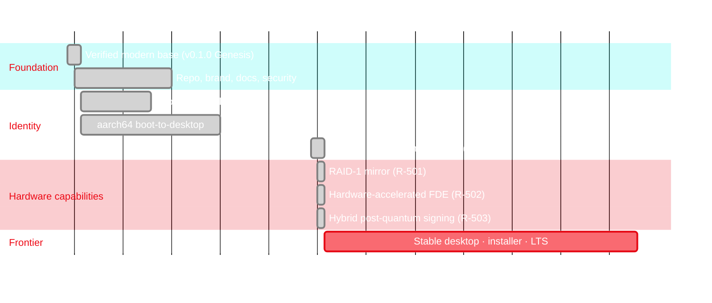

<!-- ╔══════════════════════════════════════════════════════════════════════╗ -->
<!-- ║                              E-OS  README                              ║ -->
<!-- ║                  Theme: deep red (#E50914) on black                    ║ -->
<!-- ╚══════════════════════════════════════════════════════════════════════╝ -->
<!-- SYNC: v0.2.0 · Unreleased U-152 · 2026-08-22 — keep this file in step with CHANGELOG.md/ROADMAP.md on every feature. -->

<a name="top"></a>

<p align="center">
  
</p>

<p align="center">
  
</p>

<p align="center">
  <a href="LICENSE"></a>
  
  
  
  
</p>

<p align="center">
  
  
  
  
  
  
</p>

<p align="center">
  <b>
  <a href="#-what-is-e-os">What</a> ·
  <a href="#-quick-start">Quick&nbsp;Start</a> ·
  <a href="https://e-os.gitlab.io/e-os/">Docs</a> ·
  <a href="ROADMAP.md">Roadmap</a> ·
  <a href="CHANGELOG.md">Changelog</a> ·
  <a href="SECURITY.md">Security</a> ·
  <a href="CONTRIBUTING.md">Contributing</a>
  </b>
</p>

<p align="center">
  <sub>🦊 <b>Development &amp; CI live on <a href="https://gitlab.com/e-os/e-os">GitLab</a></b> — this GitHub repo is a <b>read-only mirror</b> (GitHub Actions is off account-wide). File issues / merge requests on GitLab.</sub>
</p>

<p align="center"></p>

---

## 🖥️ Preview

<p align="center">
  
  <br/>
  <sub><b>E-OS 0.1.0 “Genesis”</b> — the Crimson desktop (orbital + <code>eos-orbutils</code>), booted under QEMU/KVM.</sub>
</p>

<p align="center">
  
  <br/>
  <sub>The red/black <b>E-OS login greeter</b> — wallpaper and launcher icon built from source.</sub>
</p>

<p align="center">
  
  <br/>
  <sub>The red-on-black <b>E-OS bootloader</b> — themed and built from source.</sub>
</p>

---

## ⚡ What is E-OS

**E-OS** is a modern, memory-safe **operating system written in Rust**. It is a
**downstream distribution of [Redox OS](https://www.redox-os.org)** — building on
Redox's proven microkernel foundation while pursuing its own identity, roadmap,
and hardening goals.

> E-OS is **not** a from-scratch OS, and never claims to be. It stands on the
> shoulders of Redox OS (MIT) and the Rust ecosystem. Our work is the
> distribution: curation, hardening, branding, a custom **crimson desktop
> environment**, storage/crypto/network features, tooling, documentation, and the
> features on the [roadmap](ROADMAP.md). Credit to upstream is permanent — see
> [Built on Redox OS](#-built-on-redox-os).

### Why E-OS?

| | |
|---|---|
| 🦀 **Rust everywhere** | Kernel, drivers, libc (relibc) and userland in a language that eliminates whole classes of memory-safety bugs. |
| 🧩 **True microkernel** | Drivers, filesystems, the RAID layer and the network stack run in **user space** as isolated processes. A driver crash isn't a kernel panic. |
| 🔐 **Capability-secure + encrypted** | Everything is a **scheme** (URL-like resource). Least-privilege by construction; optional full-disk encryption with **hardware-accelerated AES**. |
| 🎨 **Crimson desktop** | A custom **E-OS desktop environment** on the Rust **orbital** display server (`eos-orbutils`) — animated crimson wallpaper, labelled desktop icons, floating launcher — running **COSMIC apps** as clients under a crimson `cosmic-theme`. |
| 📦 **Reproducible builds** | Containerized (Podman) build system, pinned toolchain; patched recipes pinned to **E-OS source forks**, so a fresh clone reproduces every change. |

---

## ✨ Highlights

**Foundation**

- **Microkernel architecture** — minimal trusted computing base; servers in userspace.
- **`relibc`** — a clean-room C library in Rust (Linux + Redox targets).
- **RedoxFS** — a modern, copy-on-write, optionally-encrypted filesystem.
- **Everything-is-a-scheme** — uniform, capability-style resource model.
- **Crimson desktop** — the E-OS DE on **orbital** (Rust display server + window
  manager + software compositor), running **COSMIC apps** as clients.
  *(`cosmic-comp`, the COSMIC compositor, does **not** run on either arch — see
  [known-issues](docs/known-issues.md).)*
- **Dual-arch** — builds for **x86_64 and aarch64**, both booting to the desktop
  under QEMU. ([build state](EOS_BUILD_STATE.md))

**Shipped in the 0.1.0 line** (see [CHANGELOG.md](CHANGELOG.md), verified under QEMU)

- 🎬 **Animated crimson desktop** — a per-frame smoke-and-sparks wallpaper, a
  floating launcher, and labelled, double-clickable desktop icons.
- 🔒 **Full-disk encryption with hardware AES** — RedoxFS AES-XTS that uses the
  **ARMv8 Crypto Extensions** at runtime (with a clean software fallback), gated
  by a kernel-exported CPU-feature channel.
- 🪞 **RAID-1 mirroring** — a userspace `raid1d` block daemon: write-both /
  read-fallback, degraded boot, **resync/rebuild** of a re-added member, and
  split-brain safety.
- 🌐 **USB networking & storage** — a Rust **USB RNDIS** network driver
  (`usbnetd`; **full duplex** — a complete DHCP handshake, pcap-verified) and USB
  mass-storage support.
- 🔑 **Post-quantum-ready signing** — a tool that signs the package repo manifest
  with a **hybrid ed25519 + ML-DSA-65 (FIPS 204)** signature at publish time.
  *Verification is implemented on both ends but has no key between them:* `pkg-lib`
  checks the signature, and once a key is pinned in the image a bad index is fatal —
  but `keys/eos-repo-sign.pub.toml` does not exist yet (`R-702`).

**Since then — the `U-081`–`U-114` wave** (all verified on-device under QEMU)

- 🎛️ **eos-control** — a native Crimson **control center**: system overview,
  processes + capabilities, security, storage, **Power**, **Sound** and a live
  **Network** pane (read the running `netcfg:` stack, apply a static IPv4 config
  through a privileged `eos-netcfg` shim — never running the GUI as root).
- 📝 **eos-notes** — a Slint + SQLite (WAL) notes app, and **eos-ui**, the shared
  Slint-on-Orbital backend crate every E-OS GUI app builds on.
- 🛡️ **eos-guard** (filesystem-integrity monitor) and 📈 **eos-sysmon** (system
  monitor), both native Crimson apps.
- 🌍 **NetSurf built from source as a PIE** — real web browsing on E-OS.
- 🧭 **Graphical OOBE** — first-boot password enrolment in the crimson greeter,
  plus a system tray, toast notifications, a screenshot tool and launcher search.

---

## 🧱 Architecture



Everything a program touches — files, disks, the display, even the RAID mirror —
is a **scheme**, accessed through a URL-like path (`file:`, `disk.*:`,
`display:` …). Drivers and services are ordinary user-space processes that
*provide* schemes, so the kernel stays small and faults stay contained.

---

## 🧰 Tech Stack

| Layer | Technology |
|------|------------|
| Language | **Rust** (nightly, pinned) + a little assembly |
| Kernel | Custom **microkernel** (x86_64 + aarch64, UEFI boot) |
| libc | **relibc** (Rust) |
| Filesystem | **RedoxFS** (CoW, AES-XTS encryptable, hardware AES on aarch64) |
| Storage | **RAID-1** mirror daemon (`raid1d`) over any disk schemes |
| Desktop | **orbital** display server + the **E-OS DE** (`eos-orbutils`: greeter, launcher, wallpaper, desktop icons) with **COSMIC apps** (System76) as clients, crimson-themed |
| Drivers | user-space: `nvmed`, `virtio-blkd`, `e1000d`, `xhcid`, `usbnetd`, `ihdad`, `ahcid`, … |
| Build | **Podman** containers · cookbook · `pkgar` packages |
| Emulation | **QEMU 10+**, OVMF/EDK2 (UEFI), KVM/HVF |
| CI / Quality | **GitLab CI, two-tier** ([docs/ci.md](docs/ci.md)): light gates on shared runners (`secret-scan` · `integrity` · `pin-check` · `docs-currency` · `rust-checks`/cargo-deny · `pages`) + the heavy **OS image build & boot-smoke** on the self-hosted `eos-heavy` runner · local gitleaks/cargo-audit via `scripts/local-scan.sh` |



---

## 🚀 Quick Start

> **Host:** Linux, **Windows 11 + WSL2 (Ubuntu)**, or **macOS (Apple Silicon)**.
> Builds run inside rootless **Podman** containers — you do not pollute your host
> toolchain.

```bash
# 1) Get the build system
git clone https://github.com/Gh0s777tt/E-OS.git eos && cd eos

# 2) Bootstrap deps (Podman build, QEMU full, runtime crun)
curl -sf https://gitlab.redox-os.org/redox-os/redox/-/raw/master/podman_bootstrap.sh -o podman_bootstrap.sh
bash -e podman_bootstrap.sh
source ~/.cargo/env

# 3a) Build the full x86_64 desktop image  ── CI=1 is REQUIRED for headless/CI builds *
make CI=1 all

# 3b) …or the aarch64 E-OS image (crimson desktop + backend features)
make CI=1 ARCH=aarch64 CONFIG_NAME=eos all

# 4) Boot it
make qemu                 # x86_64 Crimson desktop (GUI)
make qemu gpu=no          # headless serial console
```

> \* **`CI=1` is mandatory when building non-interactively.** The cookbook `repo`
> tool renders a TUI that panics (`slice index … repo.rs:1693`) when stdout is
> not a real terminal. `CI=1` disables the TUI and prints plain logs. See
> [`EOS_BUILD_STATE.md`](EOS_BUILD_STATE.md) and [docs/building.md](docs/building.md).

Output images: `build/x86_64/desktop/harddrive.img` ·
`build/aarch64/eos/harddrive.img`. First-boot logins: `user` (no password) ·
`root` / `password` — the **OOBE forces a password change on first login** on
every path (text, serial and the graphical greeter), so the shipped defaults
can't reach a shell (`R-602`).

➡️ Full guide: **[docs/getting-started.md](docs/getting-started.md)** ·
Troubleshooting: **[docs/build-troubleshooting.md](docs/build-troubleshooting.md)** ·
Hardware roadmap: **[docs/hardware-capabilities-roadmap.md](docs/hardware-capabilities-roadmap.md)**

---

## 🗺️ Roadmap



See the full, numbered plan in **[ROADMAP.md](ROADMAP.md)** and the storage/crypto
track in **[docs/hardware-capabilities-roadmap.md](docs/hardware-capabilities-roadmap.md)**.

---

## 🧩 Core Components

| Component | Role | Origin |
|-----------|------|--------|
| `kernel` | The microkernel (+ aarch64 CPU-feature detection) | redox-os/kernel → **eos-kernel** |
| `relibc` | C library in Rust (+ ld.so hardening/fixes) | redox-os/relibc → **eos-relibc** |
| `redoxfs` | Filesystem + hardware AES-XTS | redox-os/redoxfs → **eos-redoxfs** |
| `base` | Drivers & daemons, incl. **`raid1d`** and `usbnetd` | redox-os/base → **eos-base** |
| `orbutils` | Launcher + **E-OS desktop** (icons, wallpaper) | redox-os/orbutils → **eos-orbutils** |
| `bootloader` | UEFI/BIOS boot (crimson theme) | redox-os/bootloader → **eos-bootloader** |
| `cookbook` | Package/recipe build system (vendored in `src/`) | redox-os/cookbook |
| `orbital` | Display server + window manager + software compositor | redox-os/orbital → **eos-orbital** |
| `cosmic-*` | Desktop **applications** (edit / files / term) + icon & theme assets — clients of orbital, not a compositor | pop-os/cosmic-* |
| `eos-control` | Native control center (network, sound, power, storage, security) | **E-OS** |
| `eos-notes` / `eos-guard` / `eos-sysmon` | Notes · FS-integrity monitor · system monitor | **E-OS** |
| `eos-ui` | Shared Slint-on-Orbital backend for all E-OS GUI apps | **E-OS** |
| `tools/eos-repo-sign` | Hybrid PQ package-signing prototype | **E-OS** |

---

## 🔐 Security

E-OS is **AGPL-3.0** — strong copyleft. Anyone who runs a modified E-OS,
**including over a network**, must make their source available. This is a
deliberate **anti-appropriation** choice.

- 🔒 **Full-disk encryption** — RedoxFS **AES-XTS**, hardware-accelerated (ARMv8
  Crypto Extensions) with a constant-time software fallback.
- 🧬 **Post-quantum-ready** — **hybrid ed25519 + ML-DSA-65** signing of the package
  manifest, enforced at publish time (an unsigned publish hard-fails unless
  `EOS_ALLOW_UNSIGNED=1`). ⚠️ **One missing key, not a missing subsystem**: `pkg-lib`
  verifies the manifest (`verify_repo_manifest` → `verify_manifest_ed25519`, with
  tamper tests), but no public key is pinned in any image (`R-702`), so it warns and
  proceeds. Until that key exists, treat the package *index* as unauthenticated on
  the device; per-package pkgar ed25519 is enforced regardless. Migration plan and the exact
  trust boundary: [SECURITY.md](SECURITY.md), [docs/security.md](docs/security.md).
- 🔑 **Secret scanning, end to end** — gitleaks runs at three points: a `pre-commit`
  hook that **fails closed** (`U-140` — it previously ended in `|| true` and blocked
  nothing), a `secret-scan` CI job over the **full history** (`GIT_DEPTH: 0`), and
  `scripts/local-scan.sh` on demand; GitHub push protection is on as a backstop.
- 🤖 **Supply-chain checks in CI** — `cargo-deny` (RustSec advisories, licenses,
  bans, sources) in `rust-checks`, plus `pin-check` (`eos-repos.sh pins
  --strict`) so recipes can't silently drift from the pinned fork revisions.
  Every binary the build fetches is **SHA256-pinned** (`U-118`); the residual
  gaps are listed under *Supply-chain gates* in
  [docs/hardening.md](docs/hardening.md).
- 👮 **Branch protection** — force-push and deletion blocked on GitHub; GitLab `main`
  restricted to Maintainers. ⚠️ **Review is not enforced**: `CODEOWNERS` exists but is
  advisory, `only_allow_merge_if_pipeline_succeeds` is off, and the project has had
  **0 merge requests** — so CI gates report *after* a push rather than blocking it
  (`R-F12`).
- ✍️ **Signed commits and tags** — ✅ **live**. Commits are SSH-signed and GitLab
  reports them *verified*; `v0.2.0` is the first **annotated, signed** tag. The two older
  tags are *lightweight*, so they could never have carried a signature (`U-152`).
  ⚠️ Not yet confirmed on the GitHub mirror — if the signing key is not registered there,
  mirrored commits read *Unverified*. Detail in [CLAUDE.md §10.1](CLAUDE.md); status in
  [docs/security.md](docs/security.md).

Found a vulnerability? **Do not** open a public issue — read
**[SECURITY.md](SECURITY.md)** for private disclosure.

---

## 🤝 Contributing

PRs and issues welcome. Start with **[CONTRIBUTING.md](CONTRIBUTING.md)** and the
**[Code of Conduct](CODE_OF_CONDUCT.md)**. Good first steps live in
[docs/getting-started.md](docs/getting-started.md); open items are tracked in
[docs/known-issues.md](docs/known-issues.md).

By contributing you agree your work is licensed under **AGPL-3.0-or-later**.

---

## 📦 Releases & Changelog

Current: **v0.2.0** — a **development milestone, not a published release**: the tag
marks a tree, and **no images are published**. It supersedes `v0.1.0 "Genesis"`, which
stays as a historical marker 232 commits back. Since Genesis: crimson DE, RAID-1,
hardware FDE, USB networking/storage, PQ signing, plus the supply-chain and boot work of
`U-137`…`U-152`.

> ⚠️ **Known limitation on aarch64 (`R-F16`, open):** a **second PCI storage controller**
> stalls the boot before the root filesystem is mounted — silently, with no panic. A
> single disk boots normally, and a second disk attached over **USB** is unaffected. Do
> not expect a two-NVMe aarch64 machine to boot this tag. Every change is recorded, numbered (`U-NNN`) and described in
**[CHANGELOG.md](CHANGELOG.md)** ([Keep a Changelog](https://keepachangelog.com) ·
[SemVer](https://semver.org)).

---

## 🙏 Built on Redox OS

E-OS exists because of **[Redox OS](https://www.redox-os.org)** and its community,
led by **Jeremy Soller**. The kernel, relibc, RedoxFS, drivers and build system
are Redox's work, under the **MIT License** (`licenses/Redox-OS-MIT.txt`).

If you like E-OS, please **support upstream**:
[Redox Donate](https://redox-os.org/donate/) ·
[The Redox Book](https://doc.redox-os.org/book/) ·
[Matrix chat](https://matrix.to/#/#redox-join:matrix.org).

"Redox" is a trademark of its owners; E-OS is independent and unaffiliated.
See [TRADEMARK.md](TRADEMARK.md).

---

## ⚖️ License

- **E-OS as a whole:** [GNU AGPL-3.0-or-later](LICENSE).
- **Inherited Redox components:** [MIT](licenses/Redox-OS-MIT.txt) (notices retained).
- Details: [NOTICE](NOTICE).

<p align="center"></p>

<p align="center">
  <sub>Made with 🦀 and ❤️ · © 2026 E-OS contributors · AGPL-3.0 · <a href="#top">back to top ↑</a></sub>
</p>

<p align="center">
  
</p>
