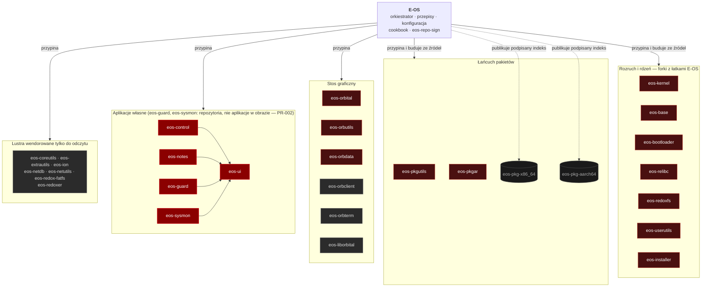
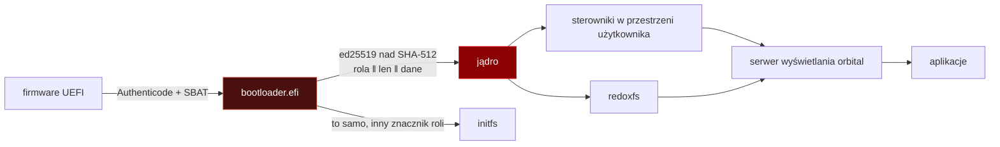

<!-- I18N-SOURCE: README.md@7065367493508d033e7ad668b58651cb1ffb80c6
     Tłumaczenie README.md z tej rewizji. Gdy README.md dostanie nowy commit, a ten znacznik zostanie
     w tyle, bramka i18n (ci-integrity.sh) ma paść i wypisać, o ile commitów. To ma być sprawdzenie
     WARTOŚCI, nie obecności — znacznik `SYNC:` sprawdzany przez `grep -q` zdążył się zestarzeć
     dokładnie dlatego, że sprawdzano tylko, czy istnieje. -->

[`[en]`](README.md) · `[pl]`

# E-OS

Utwardzona dystrybucja pochodna [Redox OS](https://www.redox-os.org) — uniksopodobnego systemu
operacyjnego z mikrojądrem napisanym w Ruście — z weryfikowanym łańcuchem rozruchu, postkwantowo
podpisanym indeksem pakietów i dobranym pulpitem.

[](https://gitlab.com/e-os/e-os/-/pipelines)
[](https://gitlab.com/e-os/e-os/-/pipelines)
[](https://github.com/Gh0s777tt/E-OS/tags)
[](LICENSE)

```
─── stan ────────────────────────────────── zmierzone 2026-09-12 ───
  rejestr      zrobione 91   częściowe 26   planowane 137  pomysły 18
               ████████░░░░░░░░░░░░░░░░  33,2% z 274 wierszy
  bramka       scripts/verify.sh   20 etapów   20 PASS   0 FAIL
  testy        31 funkcji · 16 na kodzie E-OS · 661 wierszy
  mutacje      60,0%  (próg 58)      pokrycie  55,2%  (próg 38)
  piny         ok=30  drift=0  non-allowlisted=0  split-pin=0
  pakiety      aarch64  78 opublikowanych    x86_64  brak  (C-4)
  wydanie      tag v0.2.0 · brak obiektu Release na obu hostach
───────────────────────────────────────────────────────────────────
```

> **O plakietkach.** Plakietka potoku pokazuje **failed**, a pokrycia — **unknown**. Obie są
> prawdziwe i żadna nie jest sygnałem o kodzie: limit współdzielonych runnerów wyczerpuje się
> okresowo, więc 9 z 10 zadań w potoku MR-a przerywa się po ~0 s z `ci_quota_exceeded` — nigdy nie
> dostają runnera i nigdy nie startują. Własny runner `eos-heavy` nie zużywa współdzielonych minut i
> to on uruchamia `local-gates`, a `local-gates` jest tym, na co czeka każde scalenie. Plakietki
> OpenSSF Scorecard celowo nie ma (projekt nie jest zarejestrowany, plakietka pokazałaby
> `invalid repo path`), a plakietki wydania nie ma, bo tagi istnieją, a obiekty Release nie.

---

## Spis treści

- [Czym jest to repozytorium](#czym-jest-to-repozytorium) · [Graf repozytoriów](#graf-repozytoriów)
- [Funkcje](#funkcje) — [Dostarczone](#dostarczone) · [Planowane](#planowane) · [Świadomie nieobecne](#świadomie-nieobecne)
- [Szybki start](#szybki-start) — [Czy bramki działają?](#czy-bramki-działają)
- [Użycie](#użycie)
- [Wymagania i wspierane platformy](#wymagania-i-wspierane-platformy)
- [Dokumentacja](#dokumentacja) · [Dokumenty projektu](#dokumenty-projektu)
- [Architektura](#architektura) · [Bezpieczeństwo](#bezpieczeństwo)
- [Licencja, autorzy, podziękowania](#licencja-autorzy-podziękowania)

---

## Czym jest to repozytorium

To repozytorium jest **orkiestratorem** ekosystemu E-OS. Nie zawiera własnego kodu systemu
operacyjnego. Zawiera:

| Katalog | Zawartość |
|---|---|
| `recipes/` | przepisy budowania — które źródło, upstreamowe czy forkowane, staje się którym pakietem |
| `config/` | definicje obrazów per architektura i wariant (`eos.toml`, `desktop.toml`, …) |
| `src/` | wendorowany upstreamowy silnik budowania `redox_cookbook` (binarki `repo`, `repo_builder`, `cookbook_redoxer`) |
| `tools/eos-repo-sign` | autorstwa E-OS: hybrydowe podpisywanie indeksu pakietów ed25519 + ML-DSA-65 |
| `scripts/` | automatyzacja budowania, podpisywania, publikacji i weryfikacji — 75 śledzonych skryptów |
| `mk/`, `Makefile` | system budowania na GNU Make |
| `podman/` | definicje kontenerów hermetycznego środowiska budowania |
| `docs/` | zestaw dokumentacji wraz z raportami audytu |

Sam system operacyjny żyje w **36 siostrzanych repozytoriach**, przypiętych po rewizji w
[`repos.toml`](repos.toml). Nic nie jest pobierane z ruchomej gałęzi: każda przypięta rewizja jest
sprawdzana względem opublikowanej głowy gałęzi przez `scripts/eos-repos.sh pins --strict`.

### Graf repozytoriów



**Typy repozytoriów**, pilnowane przez `scripts/eos-mirror-drift.sh` i `ci-integrity.sh`:

```
  A  komponenty autorstwa E-OS ............................. 12
  B  lustra upstreamu tylko do odczytu — nigdy ręcznie ..... 10
  C  forki z łatkami E-OS, utrzymywane rebasowalnie ........ 13
  D  opublikowane artefakty pakietowe ....................... 2
                                                           ----
     bloków w repos.toml ................................... 37   (36 siostrzanych + to repozytorium)
```

---

## Funkcje

Wszystko w tabeli **Dostarczone** zweryfikowano 2026-08-30 przez zamontowanie zbudowanego obrazu
(`eos-x86_64-harddrive.img`) i odczytanie jego zawartości — nie z dokumentacji. Metoda i dowody:
[`docs/audit/02-feature-inventory-2026-08-30.md`](docs/audit/02-feature-inventory-2026-08-30.md).

### Dostarczone

| Obszar | Co jest w obrazie |
|---|---|
| **Weryfikowany łańcuch rozruchu** | Bootloader uwierzytelnia jądro i initfs podpisem ed25519 nad `SHA-512(rola ‖ len_le ‖ dane)` **przed** sprawdzeniem bajtów magicznych i przed użyciem jakiegokolwiek bajtu. Brak podpisu albo zerowy klucz to odmowa rozruchu. Separacja domen sprawia, że podpisany initfs nie zweryfikuje się jako jądro. |
| **Postkwantowo podpisany indeks pakietów** | `repo.toml` jest podpisany **hybrydowo ed25519 + ML-DSA-65 (FIPS 204)**. Sprawdzone na żywym opublikowanym indeksie aarch64 (78 pakietów): obie połowy przechodzą, a jeden przestawiony bajt sprawia, że obie odmawiają. |
| **Zakotwiczone punkty zaufania w obrazie** | `/etc/pkg/eos-repo-sign.pub.toml` (klucz indeksu) i `/etc/pkg/packages.toml` → `[pubkeys.local]` (klucz pakietów), bajt w bajt zgodne z zacommitowanymi połowami publicznymi. |
| **Bajty pakietu egzekwowane względem podpisanego indeksu** | blake3 z uwierzytelnionego manifestu jest sprawdzany względem bajtów tuż przed rozpakowaniem, na każdej ścieżce instalacji, `pkg install` włącznie. Ochrona przed cofnięciem i zamrożeniem przez `serial` i `expires`. |
| **Secure Boot** | Oba bootloadery UEFI niosą SBAT i są podpisane Authenticode; SBAT jest wstawiany **przed** podpisem, bo Authenticode obejmuje cały plik. |
| **Pulpit** | Pulpit Crimson na serwerze wyświetlania `orbital`: ekran logowania, launcher, pasek zadań, zasobnik, powiadomienia, narzędzie zrzutów, animowana tapeta, wyszukiwanie w launcherze. |
| **Aplikacje** | `cosmic-edit`, `cosmic-files`, `cosmic-term`, NetSurf 3.11 — **w obrazie jako gotowa binarka upstreamu, nie PIE** ([#28](https://gitlab.com/e-os/e-os/-/issues/28), zmierzone 2026-09-02: `readelf` typ `EXEC` pod `0x400000`, brak łatki `about:welcome`, obcy `commit_identifier`); przepis buduje ją ze źródła jako PIE, ale artefakt w obrazie nie pochodzi z tej budowy. Do tego **eos-notes** (Slint + SQLite WAL) i **eos-control** — przegląd systemu, procesy i uprawnienia, bezpieczeństwo, dyski, zasilanie, dźwięk oraz żywy panel sieci, który czyta działający stos `netcfg:` i stosuje statyczne IPv4 przez uprzywilejowany shim `eos-netcfg`, nigdy nie uruchamiając GUI jako root. |
| **Powłoki i narzędzia** | `ion` (domyślna), `bash`, `nushell`; `vim`, `nano`, `kibi`, `ripgrep`, `git`, `curl`, `wget`, OpenSSH 9.8, OpenSSL 3.5.3. |
| **Szyfrowanie całego dysku** | RedoxFS AES-XTS, oferowane przez instalator. Sprzętowo przyspieszone na aarch64 przez ARMv8 Crypto Extensions, ścieżka programowa na x86_64, sterowane kanałem cech CPU eksportowanym przez jądro. |
| **Wymuszone hasło przy pierwszym rozruchu** | Zarówno logowanie tekstowe, jak i graficzne odmawiają przejścia dalej, dopóki konto nie ma hasła. |
| **Lista dozwolonych schematów jądra per użytkownik** | `/etc/login_schemes.toml` daje `root`-owi wszystko, a użytkownikowi nieuprzywilejowanemu jawną listę 25 schematów. Surowe gniazda IP (`ip`) są z tej listy **usunięte**. |
| **Sterowniki w przestrzeni użytkownika** | 16 sterowników jako zwykłe procesy — awaria sterownika nie kładzie jądra. W tym rustowy sterownik sieciowy **USB RNDIS** (`usbnetd`, pełny dupleks, kompletny handshake DHCP potwierdzony pcapem) i pamięć masowa USB. |
| **RAID-1** | `raid1d`: zapis na oba / odczyt z zapasowego, rozruch w trybie zdegradowanym, resynchronizacja ponownie dodanego dysku, ochrona przed split-brain. |
| **Integralność plików i monitoring systemu** | Dostarczone jako zakładki w **eos-control**, nie jako osobne aplikacje. `recipes/gui/eos-guard` i `recipes/gui/eos-sysmon` istnieją, ale żadne nie trafia do obrazu (`U-095` scalił oba w centrum sterowania). Uruchomiony E-OS ma tę funkcjonalność i nie ma dwóch dodatkowych binarek. |
| **Haszowanie haseł** | Dwie ścieżki, zmierzone 2026-09-02 ([#27](https://gitlab.com/e-os/e-os/-/issues/27)): hasła haszowane **przy budowie obrazu** używają argon2id (`m=19456, t=2, p=1`, `rust-argon2 3.0.0`); hasła ustawiane **w działającym systemie** — `passwd`, rejestracja przy pierwszym rozruchu, ekran `orblogin` — idą przez `redox_users 0.4.6` → `rust-argon2 0.8.3`, którego domyślną konfiguracją jest **argon2i, `m=4096, t=3`**: 4,0 ms na próbę wobec 14,1 ms, na jednym rdzeniu. Ten wiersz podawał wcześniej tylko mocniejszą z dwóch. |

### Planowane

| Pozycja | Stan | Śledzone jako |
|---|---|---|
| Opublikowany kanał pakietów x86_64 | 🟡 w toku | [ROADMAP](ROADMAP.md) · audyt `C-4` · `R-701` |
| Piaskownica aplikacji (zestawy schematów per proces) | 🔴 planowane | [ROADMAP](ROADMAP.md) · audyt `C-5` |
| Trwały dziennik audytu | 🔴 planowane | [ROADMAP](ROADMAP.md) · audyt `C-9` |
| Filtrowanie pakietów / zapora | 🔴 planowane | [ROADMAP](ROADMAP.md) · audyt `C-10` |
| Wi-Fi | 🔴 planowane | [ROADMAP](ROADMAP.md) |
| Ścieżka shima podpisanego przez Microsoft | 🔴 planowane | [`docs/adr/0006-path-to-microsoft-verification.md`](docs/adr/0006-path-to-microsoft-verification.md) |

Symbole stanu zgodne z [`ROADMAP.md` §0.1](ROADMAP.md): ✅ zrobione · 🟡 częściowe · 🔴 planowane · 💡 pomysł.

### Świadomie nieobecne

Brak antywirusa, brak VPN/Tora, brak narzędzia do kopii zapasowych, brak SELinuksa/AppArmora. Modelem
kontroli dostępu jest powyższa lista schematów per użytkownik; monitorowanie integralności plików
mieszka w `eos-control`.

Dwa z tych czterech to **wybory**, a dwa to **luki**, i wcześniejsze sformułowanie je zacierało
(wychwycił to przebieg adwersaryjny inwentaryzacji z 2026-09-02): antywirus i MAC są odrzucone z
podaniem powodów (`ROADMAP.md` §13; pełna odpowiedź o antywirusie to
[§7.5.3](ROADMAP.md#753-the-antivirus-answer) — produktem bezpieczeństwa jest **E-OS Guard**,
monitorowanie integralności i uprawnień, a słowo „antywirus" nie pada, dopóki nie powstanie silnik
on-access). Kopie zapasowe oraz VPN/Tor to luki, które plan śledzi jako `L-4` / `CS-002` (kopie) oraz
`R-616c` / `CS-006` (VPN, Tor jako nowe podsystemy).

---

## Szybki start

Każde polecenie poniżej wykonano na hoście referencyjnym (Apple Silicon macOS + podman); pokazane
wyjście jest prawdziwe.

```console
$ git clone https://gitlab.com/e-os/e-os.git && cd e-os
```

**Zbuduj obraz x86_64.** Używaj skryptu, nie gołego `make`: katalog projektu leży na exFAT, którego
podman nie potrafi podmontować, więc budowa idzie w wolumenie podmana. `make all` z katalogu projektu
tutaj nie zadziała.

```console
$ bash scripts/eos-build.sh x86_64
==> export image + live ISO
    ~/eos-artifacts/eos-x86_64-harddrive.img          (1400 MiB)
    ~/eos-artifacts/eos-0.2.0-x86_64-installer.img    (1400 MiB)
Done.
```

Drugi plik to **nośnik instalacyjny** — ten, który zapisuje się na pendrive. Nazywał się kiedyś
`eos-x86_64-live.iso`; `R-611a` zmienił nazwę na `eos-<wersja>-<arch>-installer.img`, a nazwa pochodzi
z `make print-installer-medium`, zamiast być wpisywana w każdym miejscu wywołania. Oba to surowe
obrazy GPT.

**Uruchom obraz bez ekranu i sprawdź, że dochodzi do przestrzeni użytkownika:**

```console
$ bash scripts/ci-boot-smoke.sh ~/eos-artifacts/eos-x86_64-harddrive.img 300 --arch x86_64
boot-smoke: x86_64, qemu pid 13690, up to 300s to reach login (TCG: 19s measured)…
boot-smoke: PASS — reached userspace login
```

Obie architektury dochodzą do znaku zachęty logowania (zmierzone 2026-09-01). aarch64 był zepsuty
przez część sierpnia i jest naprawiony: bootloader na tym celu jest budowany bez LTO, ponieważ LTO
scalało ramki stosu wywoływanych funkcji z wywołującą, a ścieżka ładowania jądra przepełniała stos DXE
firmware'u (~124 KiB).

**Zainstaluj na drugim dysku i uruchom wynik** — mocniejsze twierdzenie, bo uruchomienie gotowego
obrazu nie dowodzi niczego o instalacji:

```console
$ bash scripts/ci-install-smoke.sh ~/eos-artifacts/eos-0.2.0-aarch64-installer.img 2400 --arch aarch64
install-smoke:   saw the installer refusing a name that matches no disk
install-smoke:   the target disk is byte-for-byte untouched by the refusal (0 blocks)
install-smoke: PASS — installed to a second disk and booted it to a login prompt
```

Przechodzi na **aarch64** i, od 2026-09-02, również na **x86_64**
([#6](https://gitlab.com/e-os/e-os/-/issues/6), [#24](https://gitlab.com/e-os/e-os/-/issues/24)).
Musiały zniknąć dwie osobne przyczyny. Sonda rozmiaru terminala w `getty` połykała wpisywane znaki —
a nie, jak najpierw sądzono, zabłąkany znak nowej linii zostawiony przez `login`. To samo w sobie
zostawiało przebieg x86_64 **niestabilnym**, przechodzącym 2 razy na 7, bo *drugie* `getty` na tej
samej konsoli szeregowej odpowiadało na następny wpisany wiersz „Login incorrect"; przy jednym `getty`
na konsolę przechodzi 5 na 5. Obie przyczyny potwierdzono tak samo: przywróć je, a harness znów pada.

`EOS_SMOKE_FDE=1` uruchamia ten sam harness na **zaszyfrowanej** instalacji. Etap 2 dowodzi wtedy
szyfrowania w trzech krokach, z których każdy może paść osobno: bootloader musi poprosić o hasło
dysku, celowo błędne hasło nie może odblokować dysku i dopiero potem właściwe może dojść do
`eos login:`. `EOS_SMOKE_FDE_NEGATIVE=1` to kontrola negatywna — instaluje *bez* szyfrowania, wciąż
uruchamiając etap 2 w trybie FDE, więc pierwszy krok **musi** paść i musi być widać, że padł z
właściwego powodu.

### Czy bramki działają?

2026-09-02 dwie rundy wieloagentowe przeczytały każdą bramkę w repozytorium — wszystkie skrypty,
`.gitlab-ci.yml`, przepływy GitHub Actions, haki gita oraz `Makefile` z `mk/*.mk` — i zadały każdej
jedno pytanie: *czy ta kontrola potrafi paść?* Potwierdzono i naprawiono 34 wady, w tym skanowanie
sekretów, które padało **otwarte**, gdy brakowało `gitleaks`, potok wydania, który podpisywał, nigdy
nie weryfikując tego, co podpisał, oraz kontrolę Secure Boot, która zgłaszała sukces, nie obejrzawszy
żadnego pliku. Każda poprawka ma pomiar w obie strony; rejestr to
[`ROADMAP.md` §1.4](ROADMAP.md#14-gate-quality-audit-2026-09-02).

---

## Użycie

**Sprawdź każdą przypiętą rewizję względem opublikowanej głowy gałęzi:**

```console
$ bash scripts/eos-repos.sh pins --strict
eos-liborbital   | master       | 76ba2e79ac  | 76ba2e79ac  | OK(tip)
eos-redox-fatfs  | master       | 26caa09089  | 26caa09089  | OK(tip)
eos-redoxer      | master       | 974c1482c2  | 974c1482c2  | OK(tip)
---- pins ok=30 drift=0 (non-allowlisted=0) split-pin=0 ----
```

**Uruchom bramkę integralności repozytorium** — te same kontrole co w CI. Wypisuje 24 wiersze `ok:`
i werdykt; poniższy fragment jest **skrócony**:

```console
$ bash scripts/ci-integrity.sh
  ok: README SYNC marker present
  ok: every unsafe in E-OS-owned Rust is justified
  ok: CRLF-pinned files keep their line endings
  ok: no repo-signing secret material in tracked files
  …20 dalszych wierszy ok:, 14 ostrzeżeń doradczych…
integrity: PASS
```

**Uruchom cały lokalny łańcuch bramek** — to jest to, na co czeka każde scalenie:

```console
$ bash scripts/verify.sh
  total: 20 stages — 20 PASS · 0 FAIL · 0 SKIPPED (could not run) · 0 SKIPPED (--fast)
verify: PASS
```

---

## Wymagania i wspierane platformy

### Host budujący

| | |
|---|---|
| **System operacyjny** | macOS (Apple Silicon, host referencyjny) albo Linux |
| **Runtime kontenerów** | podman — budowa jest hermetyczna i idzie w `localhost/redox-base:latest` |
| **Łańcuch narzędzi** | Rust nightly przypięty przez [`rust-toolchain.toml`](rust-toolchain.toml); instalowany w kontenerze |
| **QEMU** | `qemu-system-x86_64` / `qemu-system-aarch64`, do boot-smoke i lokalnych uruchomień |
| **Dysk** | ~90 GB wolnego. Pełne drzewo budowania z cache'ami waży ~70 GB |
| **Zastrzeżenie o systemie plików** | jeśli klon leży na exFAT, podman nie podmontuje go bind-mountem; `scripts/eos-build.sh` obchodzi to, budując w wolumenie podmana |

### Cele budowania

| Cel | Stan |
|---|---|
| `x86_64-unknown-redox` | wspierany — obraz i nośnik instalacyjny, rozruch sprawdzony pod QEMU |
| `aarch64-unknown-redox` | wspierany — dodatkowo jedyna architektura z **opublikowanym** kanałem pakietów (78 pakietów) |
| `i586`, `riscv64gc` | odziedziczona konfiguracja upstreamu, **nie budowane przez E-OS** |

### Sprzęt docelowy

Sprawdzone pod QEMU. Pokrycie sprzętowe opisuje [`HARDWARE.md`](HARDWARE.md); obraz niesie 16
sterowników w przestrzeni użytkownika:

```
  ac97d      e1000d     ihdad      ihdgd      ixgbed     rtl8139d
  rtl8168d   sb16d      usbctl     usbhidd    usbhubd    usbnetd
  usbscsid   vboxd      virtio-netd           xhcid
```

**Dziś nie ma sterownika Wi-Fi, Bluetooth, NVMe ani GPU innego niż Intel.**

---

## Dokumentacja

Pełny zestaw dokumentacji leży w [`docs/`](docs/) i jest publikowany jako mdBook pod
<https://e-os.gitlab.io/e-os/>. Dokumentacja jest **po angielsku** — tłumaczone jest wyłącznie to
README. `ROADMAP.md` (106 261 słów) i `CHANGELOG.md` (39 122 słowa) pozostają angielskie z rozmysłu:
ich tłumaczenie nie jest decyzją redakcyjną, tylko drugim projektem.

| Obszar | Punkt wejścia |
|---|---|
| Pierwsze kroki | [`docs/getting-started/index.md`](docs/getting-started/index.md) |
| Budowanie | [`docs/getting-started/building.md`](docs/getting-started/building.md) |
| Instalacja | [`docs/getting-started/install.md`](docs/getting-started/install.md) |
| Architektura | [`docs/architecture/`](docs/architecture/) |
| Bezpieczeństwo | [`docs/security/index.md`](docs/security/index.md) |
| Pakiety | [`docs/reference/packages.md`](docs/reference/packages.md) |
| Decyzje architektoniczne | [`docs/adr/`](docs/adr/) |
| Raporty audytu | [`docs/audit/`](docs/audit/) |

> Kopia dokumentacji na GitHub Pages **nie jest utrzymywana** i obecnie zwraca 404. Kanoniczne jest
> GitLab Pages.

## Dokumenty projektu

| Dokument | Przeznaczenie |
|---|---|
| [`ROADMAP.md`](ROADMAP.md) | **jedyny plan** — praca dostarczona, każda otwarta pozycja uporządkowana od najszybszej do najcięższej (§3.0), rejestry tematyczne i sześć planów scalonych z `docs/archive/` (§17–§21) |
| [`CONTRIBUTING.md`](CONTRIBUTING.md) | środowisko, strategia gałęzi, format commitów, lista kontrolna MR-a, proces wydania |
| [`SECURITY.md`](SECURITY.md) | wspierane wersje, prywatne zgłaszanie, polityka ujawniania, zakres |
| [`CHANGELOG.md`](CHANGELOG.md) | historia w formacie Keep a Changelog, grupowana po wydaniach |
| [`ARCHITECTURE.md`](ARCHITECTURE.md) | komponenty, przepływ rozruchu, przepływ aktualizacji, granice zaufania |
| [`CLAUDE.md`](CLAUDE.md) | umowa robocza i obowiązkowy protokół weryfikacji |

---

## Architektura

E-OS jest pochodną Redoksa: rustowe mikrojądro, a sterowniki, systemy plików, warstwa RAID i stos
sieciowy działają w **przestrzeni użytkownika** jako zwykłe procesy. Zasoby adresuje się przez
**schematy** — przestrzenie nazw podobne do URL-i — a dostęp przyznaje się per użytkownik jawną listą.



Pełny opis wraz z przepływami aktualizacji i danych: [`ARCHITECTURE.md`](ARCHITECTURE.md).

---

## Bezpieczeństwo

Podatności zgłaszaj prywatnie — kanały, tabela wspieranych wersji i polityka ujawniania są w
[`SECURITY.md`](SECURITY.md). **Nie zakładaj publicznego zgłoszenia dla błędu bezpieczeństwa.**

### Model zagrożeń w skrócie

| Przeciwnik | Pozycja |
|---|---|
| Atakujący w sieci między urządzeniem a repozytorium | **Zaadresowane** — podpis hybrydowy, klucz zakotwiczony w obrazie, blake3 egzekwowany na bajtach pakietu, liczniki cofnięcia i zamrożenia |
| Ktokolwiek kontroluje `static.redox-os.org` | **Częściowo** — 30 z 65 pakietów to wciąż gotowe binarki upstreamu, ale ich klucz podpisujący jest przypięty w drzewie (`keys/upstream-redox-pkg.pub.toml`) i nadpisuje to, co pobierze synchronizacja, więc klucz nie pochodzi już z serwującego hosta |
| Lokalny użytkownik nieuprzywilejowany | **Częściowo** — brak surowych gniazd IP, ale granica jest per konto i nie ma piaskownicy aplikacji |
| Kradzież urządzenia | **Zaadresowane, jeśli włączone** — szyfrowanie AES-XTS jest oferowane przy instalacji, nie domyślne |
| Kompromitacja maszyny budującej | **Niezaadresowane** — klucze podpisujące leżą na hoście budującym |

Pełny model z dowodami dla każdego wiersza:
[`docs/audit/03-security-audit-2026-08-30.md`](docs/audit/03-security-audit-2026-08-30.md) §1.

---

## Licencja, autorzy, podziękowania

**Licencja:** [AGPL-3.0-or-later](LICENSE). Pliki odziedziczone po Redox OS pozostają na **MIT** — patrz
[`NOTICE`](NOTICE) i [`docs/reference/third-party-licenses.md`](docs/reference/third-party-licenses.md).

**Autorzy:** Damian (`Gh0s777tt`) i współtwórcy E-OS.

**Podziękowania.** E-OS jest dystrybucją pochodną i nie rości sobie prawa do bycia systemem pisanym od
zera. Stoi na **Redox OS**, stworzonym przez Jeremy'ego Sollera i społeczność Redoksa, oraz na
ekosystemie Rusta. Polityka znaków towarowych upstreamu jest odtworzona w
[`TRADEMARK.md`](TRADEMARK.md). Aplikacje `cosmic-edit`, `cosmic-files` i `cosmic-term` pochodzą z
projektu COSMIC firmy System76; przeglądarką jest **NetSurf**.

**Źródło prawdy:** <https://gitlab.com/e-os/e-os>. Repozytorium na GitHubie jest lustrem tylko do
odczytu.
