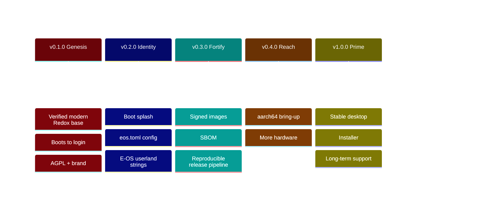

# 🗺️ E-OS Roadmap

> Living document — updated every release. Status keys: ✅ done · 🚧 in progress ·
> ⏳ planned · 💡 idea. Versions follow [SemVer](https://semver.org); each
> milestone maps to a numbered set of deliverables tracked in
> [CHANGELOG.md](CHANGELOG.md).

---

## ✅ v0.1.0 — "Genesis" (2026-06-06)

**Theme: a base that actually builds and boots.**

- ✅ `R-101` Re-base onto modern upstream Redox (`84d78137`, COSMIC desktop).
- ✅ `R-102` Reproducible WSL2 + Podman + QEMU/KVM build environment.
- ✅ `R-103` Diagnose & fix the headless `repo cook` TUI panic (`CI=1`).
- ✅ `R-104` Build + **verify boot** to login (`harddrive.img`).
- ✅ `R-105` Adopt **AGPL-3.0**; preserve Redox MIT attribution.
- ✅ `R-106` Brand & document the repository (this roadmap included).

---

## 🚧 v0.2.0 — "Identity" (target: 2026-07)

**Theme: E-OS looks and feels like E-OS.**

- 🚧 `R-201` Repository: full docs site, CI green, security hardening live.
- ✅ `R-202` Custom build config `config/x86_64/eos.toml` (E-OS desktop variant).
- ✅ `R-203` E-OS bootloader theming (red/black) — `"E-OS Bootloader"` banner +
  red-on-black, built from source (`patches/bootloader-eos-red-black.patch`).
- 🚧 `R-204` Rebrand user-visible OS strings — `/etc/os-release`, `/etc/issue`
  banner and MOTD **done**; the `redox login:` prompt (getty uses the kernel
  hostname) needs a getty/init source change.
- ⏳ `R-205` E-OS wallpaper + COSMIC default theme (Netflix red/black).
- 💡 `R-206` `eos` meta-package + first-boot welcome.

---

## ⏳ v0.3.0 — "Fortify" (target: 2026-08)

**Theme: supply-chain & release integrity.**

- ⏳ `R-301` **Signed** release images (cosign / minisign) + published checksums.
- ⏳ `R-302` **SBOM** (CycloneDX) generated per build.
- ⏳ `R-303` Reproducible, automated release pipeline (tag → image → release).
- ⏳ `R-304` Security policy v2: threat model, hardening guide.
- 💡 `R-305` Optional full-disk encryption defaults (RedoxFS).

---

## ⏳ v0.4.0 — "Reach" (target: 2026-10)

**Theme: beyond x86_64.**

- ⏳ `R-401` **aarch64** bring-up (build + QEMU virt boot).
- ⏳ `R-402` Expanded hardware/driver coverage.
- 💡 `R-403` Real-hardware test matrix.

---

## 💡 v1.0.0 — "Prime" (horizon)

**Theme: a daily-drivable desktop.**

- 💡 `R-1001` Graphical installer.
- 💡 `R-1002` Stable ABI surface + LTS branch.
- 💡 `R-1003` App ecosystem & package repository.
- 💡 `R-1004` Documentation site at a custom domain.

---

### How to propose a change

Open an issue using the **Roadmap / Feature** template, or a discussion. Roadmap
items are reviewed each release. Anything shipped moves to [CHANGELOG.md](CHANGELOG.md).
