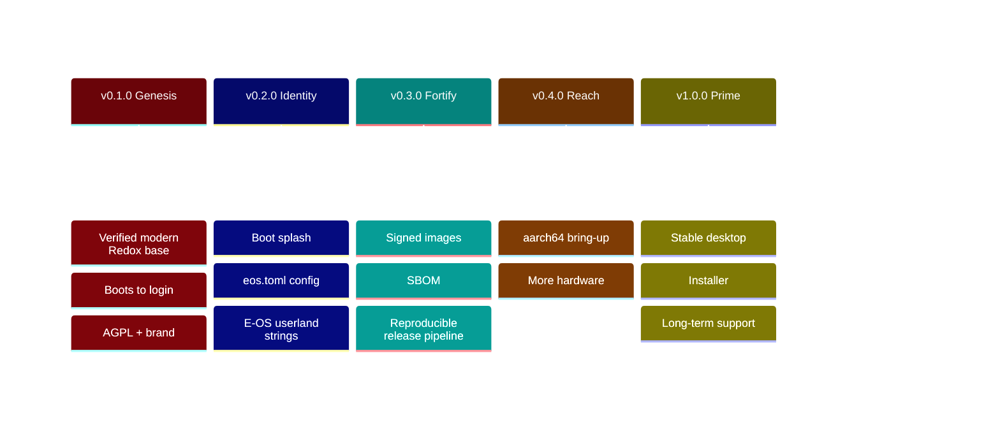

# 🗺️ E-OS Roadmap

> Living document — updated every release. Status keys: ✅ done · 🚧 in progress ·
> ⏳ planned · 💡 idea. Versions follow [SemVer](https://semver.org); each
> milestone maps to a numbered set of deliverables tracked in
> [CHANGELOG.md](CHANGELOG.md).

---

## ✅ v0.1.0 — "Genesis" (2026-06-06)

**Theme: a base that actually builds and boots.**

- ✅ `R-101` Re-base onto modern upstream Redox (`84d78137`, orbital session + COSMIC apps).
- ✅ `R-102` Reproducible WSL2 + Podman + QEMU/KVM build environment.
- ✅ `R-103` Diagnose & fix the headless `repo cook` TUI panic (`CI=1`).
- ✅ `R-104` Build + **verify boot** to login (`harddrive.img`).
- ✅ `R-105` Adopt **AGPL-3.0**; preserve Redox MIT attribution.
- ✅ `R-106` Brand & document the repository (this roadmap included).

---

## 🚧 v0.2.0 — "Identity" (original target: 2026-07 — still 🚧 as of 2026-08-14)

**Theme: E-OS looks and feels like E-OS.**

- 🚧 `R-201` Repository: full docs site, CI green, security hardening live.
- ✅ `R-202` Custom build config `config/x86_64/eos.toml` (E-OS desktop variant).
- ✅ `R-203` E-OS bootloader theming (red/black) — `"E-OS Bootloader"` banner +
  red-on-black, built from source (`patches/bootloader-eos-red-black.patch`).
- ✅ `R-204` Rebrand user-visible OS strings — `/etc/os-release`, `/etc/issue`,
  MOTD, and the **`eos login:`** console prompt (it was a hardcoded literal in
  `userutils`, **not** the kernel hostname — patched and built from source).
- ✅ `R-205` E-OS red/black login greeter + desktop wallpaper + launcher icon,
  built from source via the `orbdata` fork.
- ✅ `R-206` `eos` meta-package + first-boot welcome — recipe `recipes/other/eos`
  ships `/usr/bin/eos-welcome` (quick-start command) + `/usr/share/eos/eos-release`;
  `config/*/eos.toml` registers the package, adds `/home/user/Welcome.txt` and
  points the MOTD at `eos-welcome`. **Boot-verified** (2026-07-10, aarch64 QEMU,
  serial session): login → `eos-welcome` prints the full quick start; `uname -a`
  reports the fork kernel; `whoami` runs with 0 aborts.
- 🚧 `R-207` **Usable out-of-the-box toolbox** — a fresh E-OS install now ships a
  practical CLI toolbox (`nano`, `vim`, `git`, `curl`, `wget`, `ripgrep`, `nushell`,
  `openssh`) in `config/*/eos.toml` (filesystem grown to 1400 MiB). The extra COSMIC
  GUI apps (store/settings/reader) are a follow-up — a cookbook host-tool build quirk.
- ✅ `R-208` **Vendor the core Redox OS into E-OS repos** — all 22 Redox-authored
  packages in the image build from `Gh0s777tt/eos-*` (6 modified forks + 16 pinned
  mirrors), independent of `gitlab.redox-os.org`. **Verified** (2026-07-11): every
  `recipes/core/*` + vendored recipe resolves to a `Gh0s777tt/eos-*` fork (22 distinct);
  only the third-party ports point at their own upstreams (by policy). See
  [docs/forks.md](docs/forks.md); keep current with `scripts/sync-forks.sh`.
- ✅ `R-209` **`eos` system command** — `recipes/other/eos` ships `/usr/bin/eos`
  (`eos info` / `eos doctor` / `eos welcome` / `eos help`) alongside `eos-welcome`.
  **Runtime-verified** (aarch64 boot self-test): all four subcommands print correct
  output; `eos info` reports the fork kernel `cf54bc11`.
- ✅ `R-210` **Quieter kernel** — the aarch64/riscv64 `debug!` flood (a `DEBUG` per
  `call_fdread`, printed unconditionally upstream) is now gated behind `KERNEL_DEBUG`
  (default off) in `eos-kernel@cf54bc11`. Zero `DEBUG` lines on the serial console;
  faster TCG boots.

---

## ⏳ v0.3.0 — "Fortify" (target: 2026-08)

**Theme: supply-chain & release integrity.**

- ✅ `R-301` **Signed** release checksums — `SHA256SUMS` + a **minisign**
  signature (`SHA256SUMS.minisig`), public key `keys/eos-release.pub`. Produced +
  signed **locally** by `scripts/make-release.sh` when `MINISIGN_SECRET_KEY` is set
  (GitHub Actions is disabled, so the old `release.yml` never ran; checksums ship as
  release assets, not a committed file — see `U-080`).
- ✅ `R-302` **SBOM** (CycloneDX 1.5) generated per build — `scripts/gen-sbom.py`
  → `sbom/eos-<ver>-<arch>.cdx.json` (59 components, each with its source git ref
  + BLAKE3 hash; provenance includes the E-OS source forks).
- 🚧 `R-303` Reproducible, automated release pipeline (tag → image → release), now on
  **GitLab CI** (GitHub Actions is inert — see the R-0xx note below). **Source builds are
  reproducible** (recipes pinned to the `Gh0s777tt/eos-*` forks). The wiring is in
  `.gitlab-ci.yml`: `semantic-release` cuts a tag + GitLab Release from Conventional
  Commits, and `build-image` builds the x86_64 + aarch64 images on a **self-hosted**
  runner (tag `eos-heavy`) on tags/schedules. The heavy runner is **registered and
  proven** (`U-092`: build-image + boot-smoke passed on it). Remaining: enable the
  release token, **restore the `eosbuild` build container on the runner** (gone
  since early Aug — `build-image`/`docs-pdf` fail with *"no container … eosbuild"*,
  see `U-114`), and byte-reproducible checksums (image timestamps still differ
  run-to-run).
- ✅ `R-304` Security policy v2 — **threat model** (`docs/threat-model.md`) +
  **hardening guide** (`docs/hardening.md`), linked from `SECURITY.md`.
- ✅ `R-305` Optional full-disk encryption (RedoxFS **AES-XTS-128**) — documented
  (`docs/encryption.md`) and **verified end-to-end** (2026-07-11): an image installed with
  `[general] encrypt_disk` boots the encrypted root all the way to `eos login:` — the
  bootloader prompts `RedoxFS password`, unlocks the AES-XTS root, loads the kernel from it,
  0 exceptions (`U-049`). This surfaced and fixed a real boot bug: the UEFI bootloader
  **panicked** on an encrypted root instead of prompting; the `eos-bootloader` fork was
  pinned to a rev predating mainline's fix, so it was **rebased onto current mainline**
  (`U-050`), which carries the fix natively. Default-on for a public image is an anti-pattern
  (baked password) — the installer's one-prompt encryption is the right first-class path.
- ✅ `R-306` **Fala B — memory-safety hardening the E-OS kernel owns** (upstream Redox has
  none of these; all boot-verified on **aarch64 + x86_64**, 0 exceptions):
  **`overflow-checks`** across `eos-kernel` + `eos-base` + `eos-relibc` so an unintended
  integer overflow aborts instead of wrapping (`U-044`); user-space **mmap ASLR**
  (`find_free_near` randomizes non-fixed mappings; randomization empirically proven across
  two boots) (`U-045`); user-space **W⊕X** (no simultaneously writable+executable pages,
  enforced at the mmap/mprotect/mremap syscall boundary) (`U-046`); plus an audit closing
  the W+X / RUSTFLAGS / least-privilege-scheme items (`U-047`). See
  [docs/hardening.md](docs/hardening.md).

---

## ⏳ v0.4.0 — "Reach" (target: 2026-10)

**Theme: beyond x86_64.**

- ✅ `R-401` **aarch64** bring-up — a full E-OS aarch64 desktop image builds with
  complete branding (`config/aarch64/eos.toml`) and the red/black E-OS bootloader
  boots under QEMU `virt` on `aarch64/UEFI`
  (`assets/screenshots/eos-aarch64-bootloader.png`).
- ✅ `R-401b` **Full aarch64 boot-to-login — achieved** (2026-06-08). aarch64 boots
  to the graphical E-OS Crimson desktop under QEMU `virt` — now under **both** ACPI and
  device tree (`acpi=off` is **no longer required**, see `R-401f`).
  The original `redoxfs` Data-Abort report was the *last symptom*, not the cause —
  the real bug was a 4-layer cascade starting with `randd` executing `RNDRRS`
  (FEAT_RNG / ARMv8.5) on a non-FEAT_RNG CPU. Fixed in the
  [`eos-kernel`](https://github.com/Gh0s777tt/eos-kernel) + [`eos-base`](https://github.com/Gh0s777tt/eos-base)
  forks: kernel RNDR/RNDRRS emulation (`R-401b`) + shared INTx IRQ (`R-401d`) + the
  `sched_yield`/signal `x0`-clobber fix (`R-401e`, the kernel root cause behind the relibc
  `verify()` abort); base nvmed INTx mode (`R-401c`) + ACPI `_PRT` INTx routing so `acpi=off`
  is no longer required (`R-401f`). Recipes are pinned to the forks; clean upstream patches
  in [`upstream/`](upstream/README.md). Details: [docs/known-issues.md](docs/known-issues.md),
  issue [#2](https://github.com/Gh0s777tt/E-OS/issues/2) (closed).
- ⏳ `R-402` Expanded hardware/driver coverage. *(Note: `R-402a` — a relibc static-TLS
  bug that crashed every thread on exit on both arches — is **resolved**; see
  [docs/known-issues.md](docs/known-issues.md).)*
- 💡 `R-403` Real-hardware test matrix. Starting map of what carries over from QEMU and
  what does not: [docs/hardware-bringup.md](docs/hardware-bringup.md) (forward-looking;
  nothing hardware-tested yet).

---

## 🧱 Hardware capabilities (`R-50x`)

**Theme: storage resilience + crypto performance + future-proof signing.**
Recommended order, realistic per-item scope and QEMU verification plans live in
[docs/hardware-capabilities-roadmap.md](docs/hardware-capabilities-roadmap.md).

- ✅ `R-501` **RAID-1 mirror daemon (`raid1d`)** — userspace block-scheme mirror
  over two disks, degraded-mode reads, `create`/`status` tooling.
- ✅ `R-502` **aarch64 crypto-extension acceleration** for the RedoxFS FDE path
  (ARMv8 CE via the `aes` crate hardware backend; benchmarked).
- ✅ `R-503` **Post-quantum (hybrid) package signing** — ed25519 + ML-DSA on the
  pkgar repo tooling, with a written migration plan.

---

---

## 💡 v1.0.0 — "Prime" (horizon)

**Theme: a daily-drivable desktop.**

- ✅ `R-1001` **Graphical installer + bootable live medium** — E-OS ships
  `redox_installer_gui` (+ a TUI installer and the `redox_installer` engine); launch
  **Installer** from the desktop to install to a disk, with an optional encrypted root.
  A **bootable live/installer ISO** (`make CONFIG_NAME=eos build/<arch>/eos/redox-live.iso`)
  boots the full system read-only (greeter + installer) like a Linux live USB — verified to
  `eos login:` on **both aarch64 and x86_64** (`U-048`; screenshot
  `assets/screenshots/eos-aarch64-live-iso-greeter.png`). See [docs/install.md](docs/install.md).
- 🚧 `R-1002` **LTS branch + stability policy** — the `lts/0.1` branch (pushed to
  both remotes) tracks the 0.1 “Genesis” line with security backports; documented
  in [SECURITY.md](SECURITY.md) + a [stability/ABI policy](docs/stability.md). The
  binding *stable ABI surface* lands at 1.0 (upstream-dependent).
- 🚧 `R-1003` **Package repository** — every build produces a signed (ed25519)
  `.pkgar` repo (`repo/<target>/` + `repo.toml`, ~58 pkgs/arch); documented
  ([docs/packages.md](docs/packages.md)). **Hosting infrastructure is live**:
  per-arch GitHub Pages repos ([`eos-pkg-x86_64`](https://github.com/Gh0s777tt/eos-pkg-x86_64),
  [`eos-pkg-aarch64`](https://github.com/Gh0s777tt/eos-pkg-aarch64)) + the
  `scripts/publish-repo-pages.sh` publisher (orphan-commit force-push, so the
  hosting repos never grow). Remaining: first publish from a build rig, wire
  `/etc/pkg.d/50_eos` into the images, an E-OS-owned signing key, and the app
  ecosystem.
- ✅ `R-1004` **Documentation site** — mdBook built + deployed by the GitLab CI
  `pages` job, **live at <https://e-os.gitlab.io/e-os/>**. (The old GitHub Pages
  copy at gh0s777tt.github.io/E-OS is frozen — its Actions workflow was removed
  with the CI migration; treat the GitLab site as canonical.) A *custom domain*
  is a one-step add once a domain is owned.

## 🧭 Execution roadmap — from QEMU to an installable daily-driver

> **Who this is for and in what order:** see **[docs/plan.md](docs/plan.md)** (`U-142`) — the
> three editions (desktop / gaming / server), which Qubes and Tails patterns map onto the
> scheme model and which cannot without an IOMMU, and the ten-step ordering where the order
> *is* the security control. This file stays the item list; that file is the argument.

> Added 2026-07-13 from a 23-agent grounded audit (recon → adversarial verify → flagship design → completeness critic). **Living document** — every shipped item moves to [CHANGELOG.md](CHANGELOG.md) with its `[U-NNN]`. Status `✅ done · 🚧 partial · ⏳ planned · 💡 idea`; priority `P0–P3`; effort `S–XL`; **where** it can be done (`Mac/QEMU` on the Apple-Silicon dev host · `x86-rig` needs the Windows/WSL box · `metal` needs real hardware · `any` · `CI`).

### Two critical paths

- **Foundation A — signed delivery that survives dead GitHub Actions:** `R-002` local `make release` → `R-701` E-OS key + first non-Actions publish → `R-702` pin the pubkey (kill TOFU) → `R-703` client-verified signed manifest. *Both* the update system and the driver manager pull from this backend; the R-503 post-quantum signatures are inert until `R-703` connects them.

- **Foundation B — the Settings shell:** `R-D01` a native orbital/orbclient control-panel (no libcosmic/fontconfig/gperf, so it builds on the aarch64 host and dodges the host-toolchain 404 + dead CI) is the *only* place `Settings → Update` (`R-708`) and `Settings → Drivers` (`R-806`) can live.

"Critical path runs through two shared foundations that must land before any flagship subsystem can honestly claim to work. FOUNDATION A — signed delivery backend that survives dead Actions: R-002 (make release + real checksums) → R-701 (generate E-OS key, first non-Actions publish, wire+repoint /etc/pkg.d) → R-702 (pin the pubkey, kill TOFU) → R-703 (wire eos-repo-sign so the manifest is client-verified). Both the update system AND the driver manager pull from this backend, and R-503's PQ signing is security-theater until R-703 connects it. FOUNDATION B — the Settings shell: R-D01 (native orbital control-panel, deliberately avoiding libcosmic/fontconfig/gperf so it builds on the aarch64 host and dodges the 404 + dead CI) is the ONLY place Settings→Update (R-708) and Settings→Drivers (R-806) can live; cosmic-settings is a dead end on the primary dev arch. In parallel and independent: R-601 (install-to-disk harness) → R-602 (OOBE) closes the daily-driver install claim and retires the CRITICAL live default-credentials exposure, and R-801 (eos-devd read-side) can start immediately on aarch64. Cheap trust-gating fixes go first regardless (R-F01 plaintext password, R-F03 read_at panic, R-002/R-003 phantom checksums) because they are outright violations sitting in the exact code the flagships reuse. Update daemon R-705 ⇐ R-703; the hardest safety work — staged/rollback R-706 then apply-on-reboot R-707 — gates real-disk resilience and precedes A/B (R-710). Driver write-side (R-802 catalog ⇐ R-703; R-804 per-driver packages; R-805 spawn-on-demand; R-806 GUI ⇐ R-D01+R-802+R-705) all sits behind both foundations. Connectivity GUI/firewall (R-902/R-904) and the T2 driver work (R-910/R-911/R-912/R-913) are parallelizable once the foundations exist. Everything Wi-Fi/BT/GPU/HDR/USB4/NPU/cellular/biometric (R-920+, R-930+) is real-hardware, cannot be emulated on the Mac/QEMU dev loop, and is OFF the critical path — tier as research and never version-promise. The hard gating truth: x86_64 parity and 100% of real-hardware validation are blocked on the Windows/x86 rig and cannot be closed from the Apple-Silicon host, so the roadmap has two physically separate critical paths and the metal one is the longer pole."

### `R-0xx` — CI / Release-integrity recovery (Actions dead) — cross-cut

*Historical context: GitHub Actions is disabled account-wide (HTTP 422, 0 runs
complete), which at audit time (2026-07-13) made every advertised pipeline inert.
**That framing no longer applies** (see [docs/reality-ledger.md](reality-ledger.md)
note of 2026-07-23): integrity has moved to **GitLab CI** — light gates
(`secret-scan` · `integrity` · `pin-check` · `docs-currency` · `rust-checks`) on
shared runners plus the heavy `build-image` + boot-smoke on the self-hosted
`eos-heavy` runner ([docs/ci.md](ci.md)). Only the `.github/` workflows themselves
remain dead, and GitHub `Gh0s777tt/*` is a read-only mirror. The items below are
kept with their final statuses as the record of that recovery.*

- ✅ `R-001` **Reality-ledger / verification matrix doc** — DONE: the doc exists
  and is maintained at [docs/reality-ledger.md](reality-ledger.md) (generated
  2026-07-13, reconciliation note 2026-07-23; listed in `docs/SUMMARY.md`).
  Follow-up: refresh it at every release. `[P0·S·any]`
- ✅ `R-002` **Local `make release` (non-Actions) with real checksums** — DONE (`U-069`: `scripts/make-release.sh`; `release/SHA256SUMS` regenerated over the real images). — Build eos-<ver>-<arch>.img, regenerate SHA256SUMS over the ACTUAL retained artifact (current release/SHA256SUMS is dated Jul-5 and lists phantom eos-0.1.0-<arch>.img while builds are build/<arch>/eos/harddrive.img at 1400 MiB), and minisign locally so install.md's verify/dd steps work. `[P0·M·any]`
- ✅ `R-003` **Correct doc↔reality claims now blocked by Actions** — DONE (`U-069`: install.md + README no longer advertise a phantom download / inactive scanning). — Downgrade R-303 CI-build prose and R-1004 'live Pages site' claims, mark CodeQL/gitleaks/cargo-audit/release-signing as Actions-blocked in SECURITY.md/README, and remove the phantom-artifact instructions. `[P0·S·any]` · needs `R-002`
- ✅ `R-004` **Non-Actions CI: self-hosted runner or GitLab CI** — DONE: GitLab CI
  light gates live since `U-070`; the heavy `build-image` + boot-smoke runs on the
  registered self-hosted **`eos-heavy`** runner and passed even with shared minutes
  exhausted (`U-092`). *Current operational note (2026-08-14): the `eosbuild`
  container on that runner is missing and must be recreated before heavy jobs go
  green again — see `U-114`.* `[P1·L·x86-rig]` · needs `R-002`
- ✅ `R-005` **Local scheduled security scans + git hooks** — DONE (`U-070`: `.gitlab-ci.yml` gitleaks+integrity, `scripts/local-scan.sh`, `scripts/hooks/pre-push`; launchd timer optional). — Replace dead Actions scanning with launchd-timed gitleaks + cargo-audit + cargo-deny plus a pre-commit/pre-push hook; add a grep gate failing on `println!.*password` / `TODO: Remove this debug`. `[P1·S·Mac/QEMU]`
- ✅ `R-006` **Configure and verify the GitLab mirror** — DONE, and the roles have
  since inverted: **gitlab.com/e-os is the source of truth** (dev + CI) and GitHub
  `Gh0s777tt/*` is the read-only mirror (GitLab→GitHub push-mirroring for the meta
  repo). Verified 2026-08-14: all 30 `repos.toml` repos have identical branches +
  tags on both hosts. `[P2·S·any]`
- ✅ `R-007` **Push unpushed main; prune moot Dependabot branches** — DONE: `main`
  has long been pushed (the GitLab migration superseded the unpushed-commit
  concern), and the three `github_actions/*` Dependabot PRs (#8 #9 #10 — they
  targeted the deleted `.github/workflows/build.yml`) were closed 2026-08-14.
  The `cargo/*` bumps stay open pending a build-container-verified update round.
  `[P2·S·any]`
- ✅ `R-008` **First non-Actions signed pkgar repo publish** — Run scripts/publish-repo-pages.sh (orphan-commit git push to eos-pkg-<arch> Pages, already Actions-independent) for the first time to produce a live signed repo/Pages host that the update system and driver manager can pull from. `[P0·M·any]` · needs `R-002`, `R-701` **ZROBIONE (`U-209`) — operator wykonał pierwszą podpisaną publikację.** `publish-repo-pages.sh aarch64-unknown-redox` podpisał `repo.toml` hybrydowo (ed25519 64 B + ML-DSA-65 3309 B) i opublikował **78 pakietów (893 MB)** na `https://gh0s777tt.github.io/eos-pkg-aarch64/`. Zweryfikowane na żywo: `repo.toml`, `repo.toml.sig` i `eos-repo-sign.pub.toml` zwracają HTTP 200. To odblokowuje `R-701` (można wpiąć `50_eos` wskazujące na to repozytorium) i pozwala **na żywo** sprawdzić ścieżkę zamykającą weryfikacji podpisu u klienta (`R-703`). x86_64 jeszcze nieopublikowane.

### `R-Fxx` — Immediate correctness / security fixes surfaced by audit

*Cheap, high-leverage fixes that gate trustworthiness of the install/update path. Several are outright CLAUDE.md security violations or crash regressions in the exact code the flagship subsystems will reuse.*

- ✅ `R-F01` **Verified — no plaintext-password leak on the shipping installer** (pinned rev `05bf2eb`: only `Password: set/unset` state is printed). The leak was a **stale-clone artifact**; the real work is `R-F02` (resync/delete the stale vendored source). — Remove the two println! lines leaking entered passwords (lib.rs:79 and :182, with a literal 'TODO: Remove this debug msg') — a direct CLAUDE.md security violation — and keep the grep gate from R-005. `[P0·S·any]`
- ✅ `R-F02` **Resync/delete stale vendored src/eos-installer; provenance gate** — The exported src/eos-installer is a stale v0.1 dead branch (68616dc) that misrepresents the shipping installer (recipe pins 05bf2eb, cargo checkout 1c2534e, source_info 35734c6 — three hashes); resync or delete it and add a gate asserting vendored source == recipe rev. `[P1·M·any]` **ZAMKNIĘTE (`U-187`).** Sprawdzone, nie założone: `src/eos-installer` **już nie istnieje** — vendorowana kopia została w międzyczasie usunięta, więc połowa „resync albo skasuj" jest zrobiona. Brakowało drugiej połowy, czyli **bramki**, i to ona jest tu dostarczona: **kontrola 11** w `ci-integrity.sh` czyta nazwy forków z `repos.toml` (28 wpisów) i odrzuca każdy commit, który wstawia źródło forka do `src/`, `vendor/` albo katalogu głównego. Typy A (`eos-control`, `eos-sysmon`, `eos-ui`, `eos-guard`, `eos-notes`) są wyłączone, bo tam ich miejsce. **Widziałem, jak zawodzi:** podstawiony `src/eos-installer/main.rs` daje `FAIL` ze wskazaniem katalogu, po usunięciu wraca `PASS`. To ta sama klasa usterki co migawki z `U-186` — kopia, której nie da się przypiąć i która po cichu rozjeżdża się z tym, co naprawdę trafia do obrazu — tyle że zacommitowana.
- ✅ `R-F07` **Graphical session no longer blocked by audio** — greeter `20_orbital` dropped its `requires_weak 20_audiod.service`; `audiod` exits without readiness on no-audio HW and hung the whole desktop (U-072). Verified: `orbital` now starts (`/scheme/orbital` present). `[P0·S·mac-aarch64-qemu]`
- ✅ `R-F08` **greeter auto-activated on boot (no more `Super+F3`)** — DONE `U-078`, verified: booting the aarch64 image lands directly on the crimson E-OS greeter (`assets/screenshots/eos-greeter.png`), zero key presses. Real root cause (via an `inputd` serial trace): the installer **concatenates** `[[files]]` entries (no dedup), and because `desktop.toml` includes BOTH `desktop-minimal.toml` and `server.toml` — each pulling `minimal.toml` — `minimal.toml`'s `30_console` (which runs `inputd -A 2`) lands LAST on disk via the `server.toml` path and re-steals the foreground to the text console (VT2) *after* `20_orbital` activates the greeter's VT3. Fix: `eos.toml` (merged dead-last, so it wins) pins `30_console` **without** `inputd -A 2` on both arches; the VT2 getty stays available via `Super+F2`. This corrects the earlier hypothesis (VT2 activation was `inputd -A 2` in an init service, not a display-handoff artifact). `[P1·S·mac-aarch64-qemu]`
- ✅ `R-F09` **vesad: env parse bez paniki** — `split_once('=').unwrap()` → `filter_map` (nie panikuje na linii `/scheme/sys/env` bez `=`; znalezione przy R-F08). DONE `U-075`. `[P2·S·either]`
- ✅ `R-F03` **Fix pkgar-core read_at panic on truncated segment** — DONE (`U-067`, eos-pkgar `cb8ae7b`, regression test). — read_at uses copy_from_slice after clamping end to src.len() so a short data segment panics (reachable via a truncated .pkgar whose signed header does not cover data length); restore buf[..end-start], add checked_add to offset+header_len, and add a truncated-package unit test. `[P0·S·any]`
- 🚧 `R-F04` **Harden raid1d arithmetic and split-brain** — safety fixes landed (`U-068`, eos-base `d4f193c9`: `checked_add` in `byte_off` + N-way read fallback). Follow-ups: `raid1d resolve` subcommand + repo-wide `clippy::arithmetic_side_effects`. — byte_off uses an unchecked add that can wrap and silently degrade a healthy mirror; the [primary,1-primary] fallback underflow-panics if member_count>2. Add checked_add, generalize the read-fallback, add a 'raid1d resolve' subcommand, and turn on clippy::arithmetic_side_effects to catch this class repo-wide. `[P1·M·Mac/QEMU]`
- ⏳ `R-F05` **Fix numbering + copy-paste doc drift** — *(Partial, 2026-07-23: the **duplicate U-039 is resolved** — the netsurf crash is now recorded under `U-103`/`U-104` (R-D06, and marked ✅ in `docs/known-issues.md`), so `U-039` unambiguously means the upstream-patch refresh.)* Still open: close the missing **U-038** gap per CLAUDE.md §1.5 (every change carries a sequential `[U-NNN]` entry) and define the going-forward `R-NNN`↔`U-NNN` mapping; fix the copy-pasted aarch64-only comment in eos.x86_64.toml, the lived null-namespace expect() message, and the no-op Transaction::remove io::sink hash. `[P2·S·any]` **Częściowo (`U-189`) — i jeden z zarzutów okazał się nietrafiony.** „Skopiowany komentarz aarch64-only w `eos.x86_64.toml`" **nie jest** błędem kopiuj-wklej: oba miejsca mówią o **hoście budującym**, którym rzeczywiście jest maszyna aarch64 (Apple Silicon), więc treść była poprawna. Nieaktualne było co innego, i to naprawiłem: komentarz twierdził, że konfiguracja jest *„built and boot-verified on the x86_64-linux rig, **not on this aarch64 build host**"* — a od `U-172` jest budowana **i uruchamiana** właśnie na tym hoście, pod emulacją TCG, z `boot-smoke` kończącym się logowaniem. To twierdzenie było podawanym powodem, dla którego nie ćwiczono tu x86_64, więc jego nieaktualność miała realny koszt. Pozostałe podpunkty (luka `U-038`, mapowanie `R-NNN`↔`U-NNN`, komunikat `expect()` w `lived`, hash `io::sink` w `Transaction::remove`) zostają otwarte.
- ✅ `R-F06` **Typed errors for missing-pubkey unwraps** — repo.pubkey.unwrap() panics at install/upgrade time if a remote's key is missing — a DoS foot-gun; replace with a typed error and graceful degrade. `[P2·S·any]` **NAPRAWIONE (`U-188`, `eos-pkgutils` `14505ecd`).** Przesłanka potwierdzona w przypiętej rewizji: **cztery** wystąpienia `repo.pubkey.unwrap()` w `pkg-lib/src/backend/pkgar_backend/mod.rs` (linie 173, 176, 204, 206) — po dwa w `install()` i `upgrade()`. Pole jest `Option`, a `None` to **zwykły, osiągalny stan**, nie błąd, więc instalacja z takiego repozytorium **wywracała menedżer pakietów**. Kto zdoła wstawić bezkluczowe źródło do `/etc/pkg.d`, zatrzymuje instalowanie i aktualizowanie czegokolwiek — odmowa usługi z brakującego pliku. **Wariant błędu już istniał** (`Error::RepoNotLoaded`, „Public key for {0:?} is not available", zwracany już przez `sync_keys()`), więc poprawka mówi to samo tymi samymi słowami, zamiast tworzyć drugi słownik. Cztery miejsca sprowadzone do jednej funkcji `require_pubkey()`, co zarazem czyni rzecz **testowalną** bez stawiania całego backendu. **Kontrola negatywna, bo test nigdy niewidziany jako zawodzący nie jest testem:** z przywróconym `unwrap()` w kopii jednorazowej test `missing_pubkey_is_an_error_naming_the_remote` **pada paniką w linii 175** — czyli demonstruje tę właśnie odmowę usługi — podczas gdy drugi test (`present_pubkey_is_returned`) nadal przechodzi, więc nie jest to test zawsze zawodzący. Z poprawką przechodzą oba.

- ✅ `R-F10` **the bootloader unlocked a filesystem it was not built against — fixed (`U-156`)** — `eos-bootloader@eos-rebased` declares `redoxfs = "0.8"` and resolves it from **crates.io** (`Cargo.lock`: `redoxfs 0.8.0`, `source = registry+…`), with **no `[patch.crates-io]`**, while the image's filesystem is built from the pinned fork `eos-redoxfs@b0f6dff6` — the one carrying `--cfg aes_armv8`. So the code that prompts for the FDE password and unlocks the root at boot is a *different codebase* from the one that creates and manages that root. Today it happens to interoperate; the first change to the KeySlot/header format on either side makes an encrypted disk unbootable, and no gate would catch it. Point the bootloader at the fork via `[patch.crates-io]`, give it the same `overflow-checks`, and boot-smoke **both** arches encrypted. `[P0·M·any]` **Closed in `U-156`** by `eos-redoxfs@555359ef61` (import the `Vec` *type*, so the crate builds with `default-features = false` at all) and `eos-bootloader@b249982f29` (depend on the fork by `git+rev`, and unify `redox_syscall` on 0.9 so `syscall::Error` stops being two distinct types). `Cargo.lock` now records the git fork instead of the registry; verified from the bumped pins with `ci-boot-smoke.sh` PASS.
- ✅ `R-F11` **The 13 unpinned/unhashed recipes that actually ship are pinned** *(done 2026-08-22, `U-145`)* — of the **74** packages in `repo/x86_64-unknown-redox`, 10 had a `git =` source with no `rev` and 3 fetched a tarball with no `blake3`. All 13 are now pinned: the git revisions were taken from the SBOM of the verified build (i.e. exactly what ships, not an arbitrary HEAD — cross-checked on `sdl1`, whose SBOM value `7ac3aeb7…` matches its fetched `source/` HEAD byte for byte), and the three tarball hashes were computed from fresh downloads of the declared URLs and then **validated by cookbook itself**: clearing the caches forced `cook openssh/nano/file - successful`, which routes through the `blake3` comparison that `bail`s on mismatch. `ca-certificates` — an unpinned TLS trust root — is among them. **Correction to this item's original wording:** it claimed a missing hash is only a `WARNING`. It is not; `fetch.rs` `bail`s with *"Please add blake3 = …"*. The real defect is narrower and worse: that whole check sits inside `if !cached`, so **anything already cooked is never re-verified** — removing `source/` alone did not trigger it, and only deleting `target/` plus `build/<arch>/<cfg>/repo.tag` did. Tree-wide 1527→1517 unpinned remain, and stay out of scope as inherited third-party ports (CLAUDE.md §3). **Remaining:** make the skip-when-cached path fail closed under `EOS_STRICT_FETCH=1` and set it in CI. **Not claimed:** a blake3 pin freezes an artifact so it cannot change under us — it does **not** authenticate it. Upstream signature verification (openssh and nano both publish signatures) is a separate step.
- ⏳ `R-F12` **Every CI gate is a notification, not a gate** — `only_allow_merge_if_pipeline_succeeds = false` on the GitLab project and there have been **0 merge requests** in project history; all 10 088 commits went straight to `main`. `pin-check`, `integrity`, `rust-checks` and `secret-scan` therefore run *after* the code is already published and mirrored, and `docs-currency` — which only triggers on merge-request events — **has never executed once**. Turning the setting on changes nothing by itself; the change is adopting an MR (even self-merged) for anything touching the trust chain, the build, or a pin. `[P1·XS·ustawienia-gitlab]` **Częściowo naprawione (`U-189`): `docs-currency` przeszło z „nigdy nie uruchomione" na „uruchamiane".** Zadanie miało **jedną** regułę — `merge_request_event` — a merge requestów w historii projektu jest **zero**, więc nie wykonało się **ani razu**. Bramka, która nigdy nie zadziałała, nie jest bramką, tylko plikiem. Dodana reguła na gałąź domyślną; skrypt i tak miał już zapas `base="${CI_MERGE_REQUEST_DIFF_BASE_SHA:-HEAD~1}"`, więc nie wymagał zmian. **To NIE zamyka tej pozycji** i celowo tego nie udaję: zostaje decyzja procesowa (przyjęcie MR dla zmian dotykających łańcucha zaufania, buildu i przypięć) oraz ustawienie projektu `only_allow_merge_if_pipeline_succeeds`, które wymaga tokenu — a to działanie operatora, nie narzędzia. Na `main` bramka nadal biegnie **po** opublikowaniu i zalustrzeniu kodu; przesunięcie jest z „nigdy" na „za późno", nie na „na czas".
- ✅ `R-F13` **`docs/threat-model.md` promises driver isolation the hardware does not enforce** — a compromised user-space driver is described as having no ambient authority, but there is **no IOMMU**: `Dmar::init` is commented out in `drivers/acpid`, and the kernel has no `iommu`/`smmu`/`dmar` path at all. A driver process runs as root and can programme its device to DMA anywhere in physical memory, so at the bus level the isolation claim is false. Correct the document **now** (one paragraph, `XS`), and track real SMMUv3 support on aarch64/QEMU separately. `[P1·XS→L·mac-qemu]` **POPRAWIONE (`U-187`).** Twierdzenie zweryfikowane **co do pliku i linii**, a nie przepisane z opisu tej pozycji: w `eos-base` `drivers/acpid/src/acpi.rs:461` stoi `//TODO (hangs on real hardware): Dmar::init(&this);` — tablica DMAR jest parsowana (`drivers/acpid/src/acpi/dmar/mod.rs` istnieje), ale **nigdy nie inicjalizowana**, z upstreamowego powodu: wieszała się na prawdziwym sprzęcie. W `eos-kernel` przeszukanie całego `src/` pod kątem `iommu`, `smmu` i `dmar` daje **zero plików** — ścieżki IOMMU nie ma w jądrze wcale, na żadnej architekturze. `docs/threat-model.md` mówi teraz wprost, że izolacja sterowników jest **częściowa**: pełna na poziomie **wywołań systemowych**, **żadna** na poziomie **magistrali**, bo sterownik programuje urządzenie bus-mastering, które bez IOMMU czyta i zapisuje **dowolny** adres fizyczny — łącznie z pamięcią jądra — całkowicie poza wiedzą jądra. Uczciwe sformułowanie brzmi: przestrzeń użytkownika ogranicza **zasięg błędu** i daje restartowalną granicę, ale **nie powstrzymuje wrogiego sterownika**. Realna izolacja wymaga SMMUv3 na aarch64 i VT-d/AMD-Vi na x86_64 — to duża praca, śledzona osobno, a nie poprawka dokumentacji.
- ✅ `R-F14` **44 shell scripts, zero linting — gated (`U-159`)** — `git grep -ci shellcheck` → **0**, across 44 tracked `.sh` files that sign releases, publish repositories and can delete 37 GB of build cache. This class of defect is already in the tree and has already cost time: `scripts/check-ci-config.sh` uses `declare -A` and `scripts/eos-check.sh` used `${ARCH^^}` (fixed in `U-124`), both bash-4 constructs on a host that ships `/bin/bash` 3.2. Add a `shell-lint` job plus a grep gate for bash-4-isms. `[P1·S·any]` **Closed in `U-159`:** a `shell-lint` CI job runs shellcheck over `scripts/` with **errors blocking** and warnings advisory, and `ci-integrity.sh` gained **check 5**, a blocking gate on bash-4-only syntax (`declare -A`, `${x^^}`, `mapfile`, …) since the dev host ships bash 3.2. The first run found **3 real errors** (unquoted `$@`/`$*`, an array interpolated into a string) plus `cd` without `|| exit` inside the integrity gate itself; `check-ci-config.sh`'s `declare -A` was rewritten as a set difference. Scope excludes inherited `build.sh`/`*_bootstrap.sh`/`recipes/wip/`, which hold 141 of the 188 initial findings.
- ✅ `R-F15` **`rust-checks` covered one crate out of the two that matter — fixed (`U-159`)** — the job runs `fmt`/`clippy`/`test`/`cargo-deny` against a single `--manifest-path` (`tools/eos-repo-sign`). The vendored `redox_cookbook` at the repo root — the engine that builds every image — is never linted, never dependency-audited, and its existing unit tests never run. Add a second manifest, at minimum for `cargo test` and `cargo deny check advisories`. `[P1·S·any]` **Closed in `U-159`:** the root manifest now runs `cargo test` (its **9 unit tests** had never executed in CI) and `cargo-deny check advisories`. That audit **failed on its first run** — **RUSTSEC-2026-0204**, an invalid pointer dereference in `crossbeam-epoch 0.9.18` reached through `ignore`/`rayon-core` → `blake3` → `pkgar` — fixed by updating to **0.9.20**, after which advisories are clean and the tests still pass. Licences/sources stay ungated: those are upstream's choices in a vendored tree.
- ✅ `R-F16` **a second PCI storage controller silently stopped the boot — root cause found and fixed (`U-153`)** — Found by the `R-601` harness (`U-146`). **The defect was in the kernel's GIC distributor, not in any driver.** `GICD_ISENABLER`/`GICD_ICENABLER` are *write-one-to-set* / *write-one-to-clear*: a written 1 acts on that IRQ, a written 0 does nothing, and a read returns the current enable mask for the 32 IRQs in that block. `irq_disable()` did a read-modify-write — read the enable mask, OR in the target bit, write it back — which writes a 1 to **every enabled bit in the block**, disabling all of them. Two PCI devices on different INTx lines land on adjacent SPIs (SPI 3 and SPI 4, both block 1), so masking the second device's line while servicing its interrupt also masked the **boot disk's** line, and nothing re-enabled it because that driver was not in an interrupt cycle. The root read never completed, `redoxfs` blocked, and the boot died in initfs with no panic. The same shape in `irq_enable()` was harmless (re-setting set bits is a no-op), which is why this only ever appeared as an unexplained hang. **Fixed in `eos-kernel@18dce5577d`:** write the single bit, no read, no merge — covering GICv2 and GICv3 alike, since `gicv3.rs` delegates to the same `GicDistIf`. **Verified against the image built from the bumped pin:** `scripts/repro-intx-lines.sh` now reports **10/10 boot**, `ci-boot-smoke.sh` PASS. **Three of my own published conclusions were wrong along the way and are corrected in the record:** the scope (`U-147`), the mechanism (`U-148`), and the claim that `redoxfs` cannot be instrumented (`U-151` — see `U-153`; the real reason was a stale binary, not a dead channel). The `raid1d`-holds-the-target-disk theory that `R-601` carried for months was tested and **disproved**. **x86_64 is *expected* to be unaffected** because MSI/MSI-X avoids this path entirely — still **unverified**, no x86_64 image has been built on this host. `[P0·M·Mac/QEMU]`
- ✅ `R-F20` **core recipes shipped as upstream prebuilt binaries — fixed (`U-165`)** — Found in `U-163` because a source patch to the installer would not take effect. `/work/redox/.config` — **untracked and gitignored** — sets `REPO_BINARY?=1` (the tree default is `0`), which makes cookbook's default rule `binary`, so `cook` **downloads `…/pkg/<arch>/<recipe>.pkgar` from `static.redox-os.org`** instead of compiling the pinned source; it does so even after the local packages are deleted. **Audited by structure** (a compiled recipe has `target/<arch>/build`; a downloaded one has only `stage`): built — `base`, `bootloader`, `coreutils`, `ion`, `kernel`, `redoxfs`, `relibc`, `userutils`; downloaded — `extrautils`, `findutils`, `installer`, `netdb`, `netutils`, `pkgutils`, `uutils`. **Five of the seven declare an E-OS fork** in `recipe.toml` and are tracked in `repos.toml`, so `pins --strict` is green while the shipped artefact came from elsewhere. **Answered in `U-164`:** `eos-extrautils`, `eos-netdb`, `eos-netutils` carry only a README commit (pure mirrors, provenance-only), but `eos-pkgutils@eos` carries `pkg-lib`'s **manifest-signature verification** — and **none of its four distinctive literals appears in the 1.4 GB image**, with the search instrument controlled first. So `R-703`'s client half, which `docs/security.md` calls *implemented*, is **not in the artefact**. Note the installer is **not** affected the same way: `recipes/gui/installer-gui` builds from source and `U-132`'s network pane literals are all present; only `recipes/core/installer` is downloaded. Blocks `R-F19`, since no installer source change can reach the image until it is resolved. `[P0·M·Mac/QEMU]` **Fixed in `U-165`** by `scripts/eos-source-rules.sh`, which derives the list from the tree (any recipe whose `recipe.toml` points at `Gh0s777tt/eos-*`) instead of restating it: 13 of 26 were unpinned, all 26 are now set to source. Verified on the artefact — the four `pkg-lib` signature literals go 0 → 1 in the image, the rebuild downloads nothing, and boot-smoke PASSes. Still fragile: `cookbook.lock` stays generated and gitignored, so the script must be run on a fresh tree; it exits non-zero when the gap reopens.
- ✅ `R-F19` **the installer cannot write the RedoxFS partition — `Operation not permitted`** — Found by the `R-601` harness once it could drive the installer at all (`U-161`). `redox_installer_tui` writes the protective MBR, the GPT, formats the ESP and writes `EFI/BOOT/BOOTAA64.EFI` (0x2f600 bytes) successfully — then `Installing to RedoxFS partition with size 0xffcffe00` fails with **`Operation not permitted (os error 1)`**. **Not a privilege problem:** root and `sudo` fail at the identical step (an earlier note claiming otherwise was read off a run killed too early). Disk writes plainly work, since the ESP is formatted and written just before. This is the one thing standing between E-OS and a demonstrated *partition → install → reboot → login*, so it blocks the whole daily-driver claim. **Root-caused in `U-166`:** unconditional probes show `redoxfs::mount` succeeding, the copy callback completing, and then **`unmount_path` returning EPERM** while releasing the temporary `file.redox_installer_<pid>` scheme — a bare `?` reports that as *failed to install*, and it also **masks the callback's own result**. Downgrading it to a warning does not help: the process then **hangs** in `join_handle.join()`, because the mount thread exits only once the scheme is unmounted. So a clean unmount is genuinely required, and the fix belongs there rather than at the call site. Ruled out by measurement: the live-disk fast path (never entered — `try_fast_install` returns `Ok(false)`), `/scheme/memory/physical`, and `redoxfs::clone`. **Halved earlier in `U-162` by keeping the target disk and inspecting it:** it holds 2 GPT tables, the ESP's `BOOTAA64.EFI`, and **11 `RedoxFS` signatures** — so `FileSystem::create` succeeds and the failure is in the callback that runs after it, i.e. the mount and the file copy (`with_redoxfs_mount` registers a scheme named `file.redox_installer_<pid>`). Ruled out by reading the source: `try_fast_install` returns `Ok(false)` without `DISK_LIVE_ADDR`/`DISK_LIVE_SIZE`, and `login_schemes.toml` gives root `schemes = ["*"]`, which is why root and sudo fail identically. Reproduce with `scripts/ci-install-smoke.sh <image>`; the serial log lands beside the image as `install-smoke-stage1.log`. `[P0·M·Mac/QEMU]` **Root cause found and fixed (`U-170`), but the fix is not what the name says.** `unmount_path()` on Redox is `rmdir /scheme/<name>`, and that request never reaches the scheme manager: it is routed INTO the redoxfs daemon, hits `unlink_internal`, finds the root node has no parent, and returns `EPERM`. **Measured on a live system with the instrument controlled first** — `rmdir /scheme/probe_nie_istnieje` → *No such device*, `rmdir /scheme/file/nie-ma-tego` → *No such file or directory*, `rmdir /scheme/file` → *Operation not permitted*; three different errors, so the probe discriminates. Upstream says the same in commit `7f469db`: *"This is not enough to cause redoxfs to quit."* **Fixed in `eos-redoxfs` `58824d7`:** the daemon honours `rmdir` of its own scheme root as an unmount request — but **only from the process that owns the mount** (`ctx.pid`), because doing it for any caller would hand every uid-0 process a new way to unmount the live root filesystem. The unlink request is itself the wake-up, so `cleanup()` runs and `join()` returns. **A correction to `U-166`:** *"the install completes and only the unmount fails"* was an over-read — `PROBE-D` printed after the callback returned regardless of `Ok`/`Err`. With the installer's `?` replaced by `res.and(...)` (`eos-installer` `02be2b5`), the same run now reports the real first failure: **`failed to read package files: No such file or directory`**. `R-F19` as originally described is resolved; what it was hiding is now `R-F21`. **Status doprowadzony do treści (`U-182`):** wpis od `U-170` mówił *„as originally described is resolved"*, a znacznik nadal stał na ⏳ — dokument przeczył sam sobie. Domknięte, bo `install-smoke` przechodzi **end-to-end** (`U-176`, potwierdzone ponownie w `U-181` z poprawką `R-F18`), a to jest dowód *w działaniu*: zachęta powłoki nie wróciłaby po instalacji, gdyby `unmount_path()` nie zadziałało, a wątek montujący nie zakończył się w `join()`. Łańcuch, który ta pozycja odsłoniła — `R-F21` → `R-F22` → `R-F24` — jest zamknięty w całości.
- ✅ `R-F21` **`installer_tui` reads the package database from a path that no longer exists** — `package_files()` opens `<root>/pkg/id_ed25519.pub.toml` and lists `<root>/pkg/*.pkgar_head`, but `pkg-lib` moved the package database years ago. **Measured on the live E-OS image:** `/pkg` does not exist at all (root listing: `LICENSE README.md bin dev etc filesystem.toml home include lib share ssl tmp ui usr var`), while **`/var/lib/packages` holds 65 `.pkgar_head` files** and `/etc/pkg/packages.toml` exists. So the TUI's slow file-copy install path cannot work on this image by construction. This was invisible until `U-170` stopped the unmount error from masking the callback's result. Blocks `R-601`. The fix is not a one-line path swap: the modern `pkg-lib` takes repository public keys from `packages.toml` via `RepoManager`, not from a fixed `pkg/id_ed25519.pub.toml`, so `package_files()` needs rewriting against the current API rather than repointing. `[P0·M·Mac/QEMU]` **Naprawione (`U-171`, `eos-pkgutils` `cf36a01` + `eos-installer` `e409d32`).** `pkg-lib` wystawia teraz `PACKAGES_TOML_PATH` i `PACKAGES_HEAD_DIR` jako publiczne, a `package_files()` czyta bazę przez `PackageState::from_sysroot` — przepisane, nie przełączone na inną ścieżkę, bo klucz też się przeniósł: `pkg-lib` trzyma jeden klucz **na zdalne repozytorium** w `packages.toml`, a nie jeden plik pod stałym adresem.
- ✅ `R-F22` **`copy_file()` przewracało instalację na pierwszym pliku, który konfiguracja już zapisała** — faza konfiguracji biegnie **przed** kopiowaniem i celowo nadpisuje część plików pakietowych (E-OS podmienia `/etc/issue` na własny baner logowania — jeden z **65** wpisów `[[files]]`), a obie gałęzie `copy_file` tworzą przez `create_new`/`symlink`. Pierwsza kolizja zabijała cały przebieg — **zmierzone na pliku 12 z 13 679**. Warstwa konfiguracji jest personalizacją i ma wygrywać, więc istniejący cel jest teraz pomijany. Ten kod **nigdy wcześniej się nie wykonał**: `package_files()` padało przed nim (`R-F21`), a tamto padnięcie było przykryte przez `R-F19`. **Efekt zmierzony na tym samym harnessie i obrazie:** `ENOENT` (0 plików) → `File exists` (12 z 13 679) → `copy usr/bin/msggrep [661/13679]` bez błędu. `[P0·S·Mac/QEMU]` **Naprawione w `U-171`.**
- 🚧 `R-F23` **E-OS nie jest stabilny pod wirtualizacją sprzętową (`hvf`) na Apple Silicon** — `boot-smoke` **przechodzi** pod `-machine virt,accel=hvf -cpu host` (login w 10 s wobec 19 s pod TCG — **zmierzone**, nie oszacowane, i **~1,9×**, a nie rząd wielkości, jak najpierw napisałem), ale pod dłuższym obciążeniem gość ginie na `synchronous_exception_at_el0`. Dwa przebiegi, **dwa różne procesy**: `/usr/bin/ptyd` przy pliku 77 z 13 679 (`-smp 4`, `FAR_EL1 = 0x19`, `ELR_EL1 = 0x44FC6C`, `SPSR_EL1 = 0`) oraz `/usr/lib/drivers/virtio-netd` przy pliku 19 z 13 679 (`-smp 1`). **Jeden rdzeń nie pomaga, więc to nie wyścig wielordzeniowy** — kandydatem jest różnica w modelu CPU (`-cpu host` to Apple M-series, nie `cortex-a72`): brakująca obsługa jakiejś cechy architektury, utrzymanie spójności pamięci podręcznej albo obsługa dostępu niewyrównanego. Ma znaczenie praktyczne: tak właśnie E-OS działałby na hoście Apple Silicon i w wielu środowiskach chmurowych. Harness domyślnie zostaje na **TCG** — poprawność przed szybkością; `EOS_SMOKE_ACCEL=hvf` odtwarza usterkę. `[P1·M·Mac/QEMU]` (`U-171`)
- ⏳ `R-F27` **Secure Boot blokuje instalację na typowym pececie — a nie ma tego nigdzie jako pozycji sprzętowej** — `recipes/core/bootloader/recipe.toml:31-36` buduje `bootloader.efi` dla `${ARCH}-unknown-uefi`, ale **nikt go nie podpisuje**: `pesign`, `sbsign` ani `shim` nie występują w repozytorium ani razu. Każdy komputer UEFI wychodzi z fabryki z włączonym Secure Boot (standard od ~2012), więc niepodpisany `bootloader.efi` zostanie **odrzucony przez firmware**. Użytkownik musi ręcznie wyłączyć Secure Boot w BIOS-ie, żeby w ogóle uruchomić nośnik. To **najgłośniejsza przeszkoda w wyjściu z QEMU na sprzęt**, a nie figurowała dotąd jako pozycja — mapa drogowa wymienia sterowniki i macierze testowe, ale nie łańcuch rozruchu. Rozwiązania są dwa i oba są dużą pracą: podpisanie własnym kluczem plus rejestracja w MOK (wymaga od użytkownika `mokutil`), albo `shim` podpisany przez Microsoft (wymaga przejścia przez ich proces przeglądu). Do czasu rozstrzygnięcia **dokumentacja instalacji musi mówić wprost**, że Secure Boot trzeba wyłączyć. `[P1·L·real-hw]` **MECHANIZM UDOWODNIONY (`U-206`).** `scripts/eos-sign-bootloader.sh` podpisuje `bootloader.efi` własnym kluczem (`sbsign`), a `scripts/eos-secureboot-proof.sh` dowodzi end-to-end pod QEMU z prawdziwym firmware Secure Boot (edk2), na kluczach jednorazowych, trzema przypadkami: firmware z naszym kluczem plus podpisany daje uruchomienie („E-OS Bootloader 1.0.0"); plus niepodpisany jest odrzucony; z obcym kluczem plus nasz podpisany też odrzucony. Boot następuje więc wtedy i tylko wtedy, gdy podpisany ORAZ klucz zaufany. Strategia „bez Microsoftu" w `docs/adr/0005-secure-boot-bez-microsoftu.md`. Zostaje: prawdziwy klucz operatora (jak każdy klucz) i wpięcie podpisanego bootloadera do składania obrazu/ISO." **INTEGRACJA DOMKNIĘTA I DOWIEDZIONA END-TO-END (`U-207`).** Podpis jest teraz w recepturze `recipes/core/bootloader/recipe.toml` — bootloader podpisywany podczas `cook`, gdy operator poda klucz w `build/sb-signing/` (poza repo, `scripts/eos-sb-setup-key.sh`), inaczej zostaje niepodpisany (graceful degrade). **Korekta wcześniejszego błędu:** najpierw podpisałem plik z `--write-bootloader`, a instalator bierze bootloader do ESP z paczki `bootloader.pkgar` (`fetch_bootloaders`), nie stamtąd — ISO wychodziło z niepodpisanym ESP (Access Denied pod SB). Naprawione u źródła. **Dowód:** świeże live ISO uruchomione pod QEMU z firmware Secure Boot — z zaufanym naszym kluczem bootuje pełny system (E-OS Bootloader 1.0.0, RedoxFS 1397 MiB), z obcym kluczem Access Denied. Zostaje prawdziwy klucz operatora i OBA NOŚNIKI POKRYTE (`U-208`): receptura podpisuje też `bootloader.efi`, a obraz systemu zainstalowanego (`harddrive.img`) **bootuje pod Secure Boot** — z naszym kluczem startuje (RedoxFS 1397 MiB), z obcym Access Denied. Uwaga wdrożeniowa: podpis dzieje się tylko przy świeżym `cook`, więc `scripts/eos-sb-setup-key.sh` unieważnia paczkę bootloadera, wymuszając przepodpisanie przy następnym budowaniu. Zostaje tylko prawdziwy klucz operatora.
- ⏳ `R-F28` **`scripts/ventoy.sh` nie potrafi wyprodukować obrazu E-OS** — jedyny skrypt do przygotowania nośnika USB ma zaszyte `ARCHS=(i686 x86_64)` i `CONFIGS=(demo desktop)` (`ventoy.sh:7-14`); `CONFIG_NAME=eos` nie występuje w nim ani razu, a `i686` jest przepisywane na `i586`. Skrypt, który dla tego projektu **nie może zadziałać**, jest gorszy niż jego brak, bo wygląda na gotową ścieżkę. `[P2·S·any]`
- ✅ `R-F26` **klucz podpisujący wydania (minisign) jest utracony, a jego połowa publiczna jedzie w obrazie** — `keys/eos-release.pub` (minisign `DCEC85BA6057ED4A`) jest zacommitowany w repozytorium, a `docs/install.md` oraz `docs/hardening.md` **instruują użytkowników**, żeby nim weryfikowali pobrane pliki. Właściciel projektu potwierdził, że **nie posiada połowy prywatnej**. **Nic nie psuje się po cichu** — `scripts/make-release.sh` zawodzi bezpiecznie: bez `MINISIGN_SECRET_KEY` odmawia złożenia wydania, a niepodpisane wymaga jawnego `EOS_ALLOW_UNSIGNED=1` (`U-120`) — **ale dokumentacja obiecuje weryfikację, której dla każdego nowego wydania nie da się spełnić**. To nie jest usterka kodu, tylko rozjazd między obietnicą a możliwością. **Korekta pierwszej wersji tego wpisu (`U-192`):** napisałem, ze klucz jedzie w obrazie, liczac dwa trafienia `grep` na `eos-release` w `config/*/eos.toml`. **Oba dotyczyly komentarza o innym pliku** -- `/usr/share/eos/eos-release`, czyli identyfikatorze wydania. Sprawdzone w **dzialajacym obrazie**: `/usr/share/eos/` zawiera wylacznie `eos-release`, klucza minisign w obrazie **nie ma**. To obniza koszt rotacji: klucz publiczny zyje tylko w repozytorium, wiec podmiana pliku wystarczy i **nie wymaga przebudowy ani przeobrazowania klientow**. **Naprawa: rotacja (`minisign -G`), im wcześniej, tym taniej** — koszt rośnie z każdym wydaniem i każdym obrazem roznoszącym stary klucz; przy `0.1.0`/`0.2.0` unieważnienie starych podpisów jest akceptowalne, przy wydaniu z realnymi użytkownikami już nie. **Wygenerowanie klucza jest działaniem człowieka** i świadomie nie jest zautomatyzowane (`CLAUDE.md` §10.3, `docs/tokeny.md` §6a). `[P1·XS·human]` **ZROBIONE (`U-205`) — operator zrotował klucz.** Nowy klucz minisign `8A627C8113176141` jest w `keys/eos-release.pub`, stary `DCEC85BA6057ED4A` odsunięty do `keys/wycofane/` (nie usunięty — żeby dało się zweryfikować to, co nim podpisano), a klucz prywatny leży poza repozytorium w `~/klucze-eos/eos-release.key` i **nie jest śledzony**. Bramka integralności potwierdza brak materiału tajnego w śledzonych plikach. Klucz publiczny wydań **nie trafia do obrazu** (`U-192`), więc rotacja nie wymaga przebudowy; pełny podpis round-trip zrobi operator przy `make-release.sh` (klucz jest chroniony hasłem).
- ✅ `R-F24` **`try_fast_install()` nie uruchamia się nawet przy rozruchu z obrazu live** — instalator ma ścieżkę kopiowania **blokowego**, która czyta żywy system prosto z pamięci; wchodzi w nią tylko wtedy, gdy w środowisku są `DISK_LIVE_ADDR` i `DISK_LIVE_SIZE`, a bez nich zwraca `Ok(false)` natychmiast (`installer.rs:765`). Zmienne ustawia **bootloader** przy rozruchu live (`eos-bootloader`, `src/main.rs:588-589`), a czyta je `lived` (`eos-base`, `drivers/storage/lived/src/main.rs:124`). **Zmierzone:** `redox-live.iso` startuje z trybem live **domyślnie włączonym** — menu bootloadera mówi *„Press l to **disable** live mode"*, w odróżnieniu od `harddrive.img`, gdzie mówi *„enable"* — a **mimo to** instalacja poszła ścieżką plik-po-pliku (`584/13679`). Czyli zmienne **nie docierają** do procesu instalatora, choć rozruch był live. Dlaczego — **nie ustalone**. To jest bloker wydajnościowy `R-601`: ścieżka wolna mierzy **0,101 MiB/s** pod TCG, czyli ~3 h na 1,4 GiB, a blokowa czytałaby obraz z RAM. **Uwaga metodologiczna:** naciśnięcie `l` **przełącza**, a nie włącza — na ISO wyłącza tryb live, i taki przebieg nie potrafił się nawet zalogować. Menu podaje **dostępną akcję**, a nie stan bieżący; czytaj je, zanim wyślesz klawisz. `[P1·M·Mac/QEMU]` (`U-172`) **NAPRAWIONE (`U-176`, `eos-installer` `c8d32ad`).** Przyczyna: zmienne siedzą w środowisku **jądra**, czytanym przez `/scheme/sys/env`, a instalator wołał `env::var()`, czyli środowisko **procesu**. Dwa różne źródła. **Zmierzone jednym przebiegiem, oba obok siebie:** `grep DISK_LIVE /scheme/sys/env` → `DISK_LIVE_ADDR=00000000e4e50000`, natomiast `echo "$DISK_LIVE_ADDR"` → *Variable does not exist*. Instalator czyta teraz oba, środowisko procesu najpierw. **Efekt:** ścieżka plik-po-pliku **31 plików/min, 0,101 MiB/s, ~6,8 h**; ścieżka blokowa **1,3 MB/s, 460 MB, ~6 min**.
- ❌ `R-F25` **WYCOFANE (`U-181`) — to nie była usterka, tylko mój zepsuty przyrząd** — pozycja twierdziła, że gość ginie w trakcie kopiowania blokowego (80%, 94%, 99%). **Nic nie ginęło.** Sprawdzałem obecność maszyny przez `pgrep -c qemu-system-aarch64`, a `pgrep` **bez `-f`** dopasowuje na macOS samą nazwę procesu, obciętą do 15 znaków — czyli `qemu-system-aar`. Wzorzec `qemu-system-aarch64` **nie mógł trafić nigdy**, więc każdy odczyt brzmiał „0 procesów", niezależnie od stanu faktycznego. `ps` pokazał **dwie żywe maszyny po 100% CPU**, a kopiowanie postępowało (18→25%, 86→90%). Przebiegi nie ginęły — były **wolne**, bo konkurowały o rdzenie, a ja po każdym fałszywym odczycie startowałem kolejny, jeszcze je spowalniając. Jeden z „martwych" przebiegów zakończył się **`PASS`**. Drugi padł przy 97% i tu zadziałała nowa instrumentacja: zachowany log QEMU mówi `terminating on signal 15 from pid 37386`, gdzie 37386 to **sam skrypt harnessu** — czyli **przekroczenie budżetu**, a nie awaria. **Lekcja jest dokładnie tą z `CLAUDE.md` §4.2:** *udowodnij przyrząd, zanim uwierzysz w wynik negatywny*. Napisałem tę zasadę i sam ją złamałem — trzy razy z rzędu wyciągając wniosek „proces nie żyje" z polecenia, które nie mogło go zobaczyć.
- ✅ `R-F18` **any two PCI devices sharing an INTx line cause an interrupt storm** — **NAPRAWIONE (`U-180`, `eos-base` `816546df`)** (odkryte jako „dysk na linii xHCI", zawężenie skorygowane w `U-179`) — Found while verifying the `R-F16` fix (`U-153`), by adding a *time-to-login* column to the regression guard. Measured on the fixed image: a second NVMe sharing a line with **virtio-net** boots in **16s**, with **virtio-rng** 16s, with the **boot disk** 30s — but with the **xHCI controller** (`slot 0x6` → GSI 37, same as device `00:02.0`) it takes **110–124s**, reproducible to within seconds across independent runs. That consistency looks like a **fixed timeout being waited out** rather than resource contention: something in USB bring-up appears to wait ~100s and then continue. The boot does complete, so this is a degradation, not a stall — but it is the difference between a 16-second boot and a two-minute one on any machine whose storage lands on the USB controller's line. **Located to the second in `U-154`** by polling the serial log on wall clock (the in-log timestamps cover only driver lines, where the largest gap is 5.8s): the boot runs normally to **23s**, then stops for **84s** between `[@usbhidd:138 WARN] unknown usage_page 0x7 usage 0x0` and `caudiod: No such device`. The line sequence is **identical** to a fast boot, so it is pure timing, not a different path; and that warning appears in *every* boot, fast ones included, so it is not causal. **That hypothesis was wrong and is corrected in `U-155`** — it has nothing to do with USB readiness. With `init`'s `log_debug` on, the gap sits inside one init script step: `rm -rf /tmp` takes **80s** instead of **1s**. The victim is ordinary filesystem I/O on the **boot disk**, which is on its own line. **Cause confirmed by counting:** QEMU `-d int` over an identical 45s window records 780 909 exceptions with no second disk, 820 745 on `0x5`, and **3 654 574** on `0x6` — a **4.5× interrupt storm** that starves unrelated work. **Mechanism:** a level-triggered INTx line is shared, `irq_trigger` wakes *every* handle on it, so the storage driver is woken by xHCI interrupts, finds nothing to do, acks, and **unmasks a line the xHCI device is still asserting** — which re-fires at once. A driver with nothing to do must not unmask a level line another device is still driving. **Counted in `U-157`:** dumping `/scheme/sys/irq` shows **`virq 37` at 11 054 068** interrupts (timer 8 851, boot disk 4 557) — GIC SPI 5, the line xHCI and the disk share. Both drivers genuinely hold handles on it (`xhcid` uses `irq.irq_handle` with `InterruptMethod::Intx`). **A kernel fix was written, tested and reverted:** unmasking only once *every* handle acked measured **111s before, 111s after** — identical — because both drivers do ack promptly and the line is unmasked while the xHCI device is still asserting. It was reverted rather than shipped, since it bought nothing and would wedge a shared line permanently if one driver died. **Korekta tej pozycji (`U-171`): przepisana tu poprawka jest już zaimplementowana.** `Xhci::received_irq()` (`eos-base`, `drivers/usb/xhcid/src/xhci/mod.rs:1309`) czyta `IMAN.IP` i **czyści go** przez `iman.writef(1, true)`, a dzieje się to **przed** potwierdzeniem uchwytu jądra — kolejność w `IrqReactor::run_with_irq_file` to `received_irq()` → `mask_interrupts()` → `irq_file.write()`. Zalecenie „wyczyść `IMAN.IP` przed potwierdzeniem" nie miało więc czego naprawiać i było powtarzane bez sprawdzenia w kodzie. **Co znalazłem zamiast tego:** gdy `received_irq()` zwraca `false` (przerwanie **nie** należy do xHCI, czyli dokładnie przypadek linii dzielonej), reaktor robi `continue 'trb_loop` i **nie potwierdza wcale** — uchwyt xhcid zostaje niepotwierdzony przy każdym przerwaniu sąsiada. To jest kandydat do zbadania, a nie wniosek: **nie zmierzone**, więc nie należy tego traktować jak ustalonej przyczyny. Następny krok to policzyć przerwania z i bez potwierdzenia na tej ścieżce, tak jak `U-157` policzył `virq 37`, i dopiero wtedy coś zmieniać. **ZMIERZONE I PRZEFORMUŁOWANE (`U-179`) — to nie jest usterka `xhcid`.** Powyższy tytuł i cały trop „xHCI" są **za wąskie**, a przez to kosztowne: wysyłały następną osobę do `drivers/usb/xhcid`, czyli do złego pliku. Cztery przebiegi, ten sam obraz, ten sam harness, zrzut `/scheme/sys/irq` po zalogowaniu, zmieniany **jeden** parametr — slot PCI: **(A)** drugi dysk na `0x7`, nic nie dzieli linii → najwyższy licznik **7 955**; **(B)** drugi dysk na `0x6`, dzieli linię 2 z xHCI → **`virq 37` = 16 829 830**; **(C)** xHCI przypięte na `0xb` (linia 3), dysk źródłowy `0x3` też na linii 3 → burza **przeniosła się razem z xHCI**: `virq 38` = **5 240 714**, przy `virq 37` = 9; **(D)** dwa NVMe na wspólnej linii 0 (`0x4` + `0x8`), **xHCI osobno i ciche** → **`virq 35` = 2 501 072**. **Przebieg D jest rozstrzygający:** xHCI nie ma z tym nic wspólnego, a burza i tak występuje. Najczystsze porównanie to **A wobec D** — *ta sama linia 0, ten sam sterownik `nvmed`*, dołożone wyłącznie współdzielenie: **7 955 → 2 501 072, czyli 314×**. **Wniosek:** burzy **każda** para urządzeń PCI na jednej linii INTx; xHCI jest przypadkiem **najgorszym** (16,8 mln wobec 2,5 mln), nie jedynym. **Miejsce usterki** to więc protokół dzielonej linii między jądrem a *dowolnym* sterownikiem, nie `xhcid`. **Mechanizm zgodny z przeczytanym kontraktem jądra** (`eos-kernel`, `src/scheme/irq.rs:441-467`): `irq_trigger` zwiększa `COUNTS[irq]` i budzi **wszystkie** uchwyty, a odmaskowanie robi **którykolwiek** uchwyt potwierdzający aktualnym licznikiem — **nie ma czekania na wszystkie**. Przy linii poziomowej pierwszy sterownik odmaskowuje ją, gdy drugie urządzenie **wciąż ją trzyma**, więc przerwanie wraca natychmiast. **Uwaga do poprzedniej próby:** `U-157` napisał dokładnie tę poprawkę („odmaskuj dopiero, gdy potwierdzą wszystkie") i **wycofał ją**, bo zmierzyła 111 s przed i 111 s po. Ale mierzyła **czas rozruchu**, a nie **liczbę przerwań** — instrument, którego wtedy nie było. **NAPRAWIONE (`U-180`).** Przyczyna była w `drivers/executor/src/lib.rs`, nie w jądrze i nie w `xhcid`: executor **potwierdzał przerwanie, zanim sprawdził, czy jego własne urządzenie cokolwiek zgłosiło** — `poll_cqes` przychodziło dopiero **po** potwierdzeniu. Ponieważ potwierdzenie **odmaskowuje linię**, sterownik zwalniał linię poziomową za przerwanie, które nigdy nie było jego, podczas gdy drugie urządzenie wciąż ją trzymało — więc wracało natychmiast. **Poprawka:** czytaj zawsze (to konsumuje zdarzenie, bez czego reaktor się kręci), ale **potwierdzaj tylko, gdy własne urządzenie coś zgłosiło**. **Zmierzone na tej samej konfiguracji:** `virq 37` **16 829 830 → 8**; najgorszy wiersz reproducera (drugi dysk na linii xHCI) **160 s → 16 s**; cała matryca 10/10 mieści się w 16–33 s, wcześniej jeden wiersz siedział na 160 s; boot-smoke PASS. **Ryzyko resztkowe, sprawdzone a nie założone:** gdyby sterownik-właściciel opróżnił kolejkę przy wcześniejszym wybudzeniu, nie znajdzie tu nic, nie potwierdzi i zostawi linię zamaskowaną. Pod instalacją blokową (~460 MB ciągłego I/O) to nie wystąpiło; zapisane tutaj, żeby następna osoba nie musiała tego odkrywać od zera. **Wycofana poprawka z `U-157` była leczeniem objawu w złym miejscu** — zmiana w jądrze („odmaskuj dopiero, gdy potwierdzą wszystkie") zmierzyła teraz **14 044 113** wobec 16 829 830, czyli 17%, i została odrzucona ponownie, już z licznikiem w ręku. `[P1·M·Mac/QEMU]`
- ✅ `R-F17` **a driver aborted on a kernel return value that is by design — fixed (`U-149`)** — Found in the *passing* half of the `R-F16` matrix (`U-148`). With both disks on GIC SPI 3 the boot reaches `switchroot`, and then `nvmed` dies: `assertion failed: amount == core::mem::size_of::<usize>()` at `drivers/executor/src/lib.rs:191`. The kernel's irq scheme **deliberately** returns `Ok(0)` from `kwrite` when the acknowledged count is stale (`ack != current`, `kernel/src/scheme/irq.rs`), while the driver asserts the write consumed `size_of::<usize>()` bytes. A stale ack is not an error condition on a shared line — `irq_trigger` fans one line out to **every** handle registered on it, which `R-401d` deliberately permits — so any two devices sharing an INTx line can abort a storage driver. **Fixed in `eos-base@7d5ca7e28e` (`U-149`):** `Ok(0)` is treated as *stale ack — a newer interrupt is already pending and will unmask*, and the `.unwrap()` on that write is gone. Safe because `COUNTS` is bumped only by `irq_trigger`, so the newer interrupt has already re-triggered this handle and the next `react()` re-enables the line. **Verified with a before/after negative control** on two NVMe disks sharing GIC SPI 3: before → login then panic at `lib.rs:191`; after → login, no panic, zero `irq ack` warnings. All three gates run against the image built from the bumped pin. This is a **separate defect from `R-F16`**, which is untouched and still reproduces. `[P0·S·Mac/QEMU]`

### `R-Dxx` — Desktop shell / Settings host (flagship blocker)

*The shipping DE is orbital + eos-orbutils with COSMIC apps as clients — cosmic-comp never runs, and there is NO Settings app on either arch (cosmic-settings is unbuildable on the aarch64 host via fontconfig→host:gperf 404, and CI is dead). Settings→Update and Settings→Drivers have literally nowhere to live until a native control-panel exists.*

- 🚧 `R-D01` **E-OS Settings native control-panel (orbital/orbclient)** — BUILT + RUNS (`U-071`, eos-orbutils `061dfd3`: `eos-settings` bin, no libcosmic; compiles aarch64-redox, installs, integrated via `apps/15_eos-settings`+icon, launches against live orbital PID-verified). **RENDER ZWERYFIKOWANY** end-to-end w QEMU (desktop przez Super+F3): sidebar + 9 paneli + realne dane System (aarch64/Genesis) + stopka; `assets/screenshots/eos-settings-panel.png`. — Build a red/black Settings app on orbital/orbclient with NO libcosmic/fontconfig/gperf dependency (so it compiles on the aarch64 host and dodges both the 404 and dead CI), structured as a panel host (Update, Drivers, Display, Network, Audio, Users, Date&Time) that ships a .desktop entry to appear in the launcher. `[P0·XL·Mac/QEMU]`
- 🚧 `R-D02` **Make the system tray functional** — Icons + click-to-Settings DONE (`U-101`, eos-orbutils `60c262d`): the tray-{net,vol,set} icons never actually shipped (invisible tray), so E-OS now ships three crimson glyphs and a click anywhere on the tray opens E-OS Settings — render-verified. Remaining: live state — wire the net indicator from netstack state and a volume popup via audiod (audio is absent on the QEMU dev loop). `[P1·M·Mac/QEMU]` · needs `R-D01`
- 🚧 `R-D03` **Notifications daemon + UI** — Minimal daemon DONE (`U-102`, eos-orbutils `8ad7cd8`): `eos-notifyd` (launcher-spawned) shows a crimson top-right toast for a `title\nbody` written to `/tmp/eos-notify` by `eos-notify <title> [body]`; render-verified. Enough to unblock `R-705`'s "updates available". Follow-up: a proper `notify:` scheme/socket transport (not a polled file), a queue so a toast doesn't block the next, and richer UI (icon/actions). `[P1·M·any]`
- ✅ `R-D04` **Screenshot utility** — DONE (`U-100`, eos-orbital `38226c7`). A standalone tool can't capture the screen (orbital is the DRM master; the composited image lives only in orbital's CPU shadow buffer), so the capture is in the compositor: **Super-P** writes `/home/user/screenshot-N.bmp` (uncompressed 32-bit BMP, no codec dep, per-shot counter). Render-verified end-to-end — Super-P produced a valid 800×600 BMP (1,920,054 B) whose extracted content is the real desktop (`assets/screenshots/eos-screenshot-selfshot.png`). `[P2·S·Mac/QEMU]`
- ✅ `R-D05` **Launcher search + local-time clock** — DONE. Clock (`U-098`, eos-orbutils `94dcc91`): the bar reads local `YYYY-MM-DD HH:MM UTC±H` from `/etc/tz-offset` (default UTC; ships 7200/UTC+2), render-verified `12:58 UTC+2` at host-UTC 10:58. Type-to-search (`U-099`, `7b1268b`): the top-level Start menu filters every app by name as you type (result count, Enter/Backspace/Esc, empty query restores categories), fed from orbital TextInput events, in a fixed-height window that stays open and never clips — render-verified `Szukaj: vi_ (3 wyników)` → GVim/Viewer/Vim. `[P2·S·Mac/QEMU]`
- ✅ `R-D06` **netsurf: builds from source as PIE and renders** — The bundled browser died the instant it was clicked (data abort, ESR 0x92000047) because the shipped binary was the upstream non-PIE `ET_EXEC` prebuilt, and aarch64-Redox only loads PIEs. Fixed across three layers (U-103 + U-104, 2026-07-19): (1) the from-source build was blocked by a host-toolchain **404** — `host:gperf` builds via `cookbook_redoxer`, whose `toolchain()` tried to download a *host→host* relibc toolchain redox never publishes → `scripts/redoxer-host-stub.sh` pre-creates the per-target stub so redoxer skips the misfired download (host builds use system `gcc`/`g++`); (2) a **CC-wrapper** in the recipe forces `-fPIC` on every compile and `-pie` on the final link → `netsurf-fb` is a verified `DYN`/`pie executable`, and since the recipe now differs from upstream, `--repo-binary` no longer re-downloads the prebuilt; (3) the PIE then opened a window but crashed on first render — a **use-after-munmap of the 800×600×4 window buffer**: libnsfb caches `nsfb->ptr = SDL surface pixels`, but a `SDL_RESIZABLE` window makes orbclient's event pump `munmap`+`remap` that buffer on the resize event orbital sends on first map, invalidating the cached pointer → dropping `SDL_RESIZABLE` in libnsfb keeps the buffer put. **Result (proven by boot + screendump):** netsurf launches and **renders `welcome.html` in full** — toolbar, address bar, the NetSurf logo image, headings, links, a search box (`assets/screenshots/eos-netsurf-welcome.png`); no more `UNHANDLED EXCEPTION`. Full write-up: `docs/design-netsurf-pie.md`. Follow-up (`R-D09`): window is fixed-size for now — proper resize needs libnsfb to re-fetch the pointer after each remap.
- ✅ `R-D07` **Volume mixer UI; verify cosmic-edit boot** — both halves delivered. **cosmic-edit (verified 2026-07-23):** launched from its desktop icon on the R-D11 image, COSMIC Text Editor **renders in full** in the E-OS red/black theme — File/Edit/View menu bar, window controls, a `New document` tab (`+`/`×`), line-number gutter and caret — and is **interactive**: typing paints `E-OS cosmic-edit works` on line 1 and the tab flips to the `New document •` modified-dot state (`assets/screenshots/eos-cosmic-edit.png`). No serial fault from the app (the one `Image … start failed: Aborted` line came from a stray VT-launch probe — orbital has no Linux-style VTs — not from cosmic-edit, which was launched by desktop-icon double-click). **Volume mixer (`U-110`, eos-control `a76d0587`):** a **"Dźwięk"** tab drives audiod's master volume through the `audio:volume` scheme control (plain `0–100`, read/written as a file; a mute button sets 0 and restores the level). The UI + the read/write contract are done (host build + `--selftest` green; contract recon'd from the audiod source); when no audio stack is present the tab is built to **honestly show "Audio niedostępne"** rather than a dead slider. **gui cross-compile + boot are gated by the heavy CI `build-image`** (the pin bump triggers it); a **local render screendump is deferred** (this build host has no cooked tree — a screendump needs a full from-scratch OS build). **The one thing HW-gated regardless:** a *live* volume change needs real HDA — on the QEMU loop `ihdad` binds the Intel-HDA controller but times out on the codec **RIRB** response, so audiod exits and `audio:` never appears. That driver bug is tracked in `docs/known-issues.md` (the eventual fix is a `drivers`-fork job, not an eos-control one). `[P2·M·Mac/QEMU]` · needs `R-D01`
- 🚧 `R-D08` **Verify launcher .desktop membership** — **Core verified (2026-07-23):** on a live boot of the desktop image the **launcher is populated from the image's `.desktop` entries** (not just the source tree) — the Start menu groups apps under the freedesktop **Categories** (Office / Settings / System / Utility) and the desktop grid shows **installer-gui** ("Redox Installer"), **cosmic-edit** ("COSMIC Text"), **cosmic-files**, **cosmic-term**, the **CLI tools** (Vim, GVim) and the E-OS apps (Notes, Settings, Control, Viewer, Netsurf). That the apps *appear* is the proof their `.desktop` files are installed **in the image** (`assets/screenshots/eos-launcher-desktop-apps.png`). *(A shell-level `ls` of the `.desktop` files was attempted via the `debug`-console getty, but that console is diagnostic-only — it echoes the bootloader env, not a shell — and orbital captures Super so the VT2 getty wasn't reachable; the launcher render is the user-facing proof anyway.)* **Remaining:** the full **greeter→installer live flow** (boot the live ISO → greeter → launch installer-gui → install to disk) is still untested end-to-end — it needs a built `redox-live.iso`, deferred with the local-build tree. `[P1·S·Mac/QEMU]`
- ⏳ `R-D09` **netsurf: resizable window** — netsurf's window is fixed-size (R-D06 dropped `SDL_RESIZABLE` to dodge a use-after-munmap of the window buffer). Proper resize needs libnsfb's SDL surface to re-fetch `nsfb->ptr` after orbclient remaps on `EVENT_RESIZE` (and post an `SDL_VIDEORESIZE`); the right home is the SDL orbital driver / libnsfb, not the recipe. See `docs/design-netsurf-pie.md`. `[P3·M·Mac/QEMU]`
- ✅ `R-D11` **Privileged power actions from the GUI (reboot / shutdown)** — done (U-109). `sys:kstop` is root-only and eos-control runs as the desktop user, whose password is **not** empty (first-boot sets it — verified: a shell login as `user` with an empty password returns `Login incorrect`), so there was no shortcut. Fixed with a dedicated **`eos-power`** shim that elevates the way `sudo` does internally — open `/scheme/sudo`, write the password (daemon checks sudo-group + password), elevate the process fd (`call_wo` + `CallFlags::FD`), `setns`, then write `sys:kstop`. The **GUI never runs as root**: it spawns `eos-power` and pipes the user's password to its stdin (no TTY problem). The Zasilanie tab reveals a password field once an action is armed. **Verified end-to-end:** arming *Wyłącz*, typing the password, and confirming **powered the VM off — QEMU exited** (`assets/screenshots/eos-control-power.png`). (Aside: root `shutdown -r` triggers a reboot too, though EDK2 has a separate warm-reboot flake under QEMU-aarch64; poweroff is the clean proof.)
- ✅ `R-D10` **netsurf: web browsing over the network works** — Redox networking is fully functional on the aarch64/QEMU loop and netsurf browses the web. **A `-object filter-dump` pcap settled it (2026-07-19), and corrected an earlier wrong call:** the whole path works — virtio-netd binds the NIC (link up), netstack/smolnetd runs (`ip`/`tcp`/`udp`/`icmp`/`netcfg` + the `network.pci-…_virtio_net` link scheme present), `base.toml` ships a correct QEMU config (ip 10.0.2.15, gateway 10.0.2.2, /24, dns 9.9.9.9). The pcap shows **DHCP** (request→reply), **ARP** (who-has 10.0.2.2→reply), **ICMP** (ping the gateway, echo→reply), **DNS** (`A? example.com`→`A 104.20.23.154` in 23 ms), a full **TCP** handshake to an external host, **HTTP** (`GET /`→`HTTP/1.1 200 OK`), and a live **TLS** exchange on :443 — all bidirectional. `curl example.com` returns the real Example Domain HTML, and **netsurf's *own* fetch is in the pcap** (its DNS query + TCP + `HTTP/1.1 200 OK` for `http://example.com`, from netsurf's ports). *The earlier "packets don't flow out" diagnosis (commit `a38a1f9e`) was a false negative:* the raw-IP probe used `http://9.9.9.9/`, but **9.9.9.9:80 is closed even from the host** (Quad9 serves DNS/:443, not HTTP/:80), so the SYN correctly got no reply; the one-off `curl example.com` timeout was a transient. And it **renders**: driving netsurf's address bar to `http://example.com` (no Super, so no overlay) paints the live **Example Domain** page in full — heading, body text, the "Learn more" link (`assets/screenshots/eos-netsurf-web.png`). **Homepage stays `about:welcome`** (fast, offline-safe default; U-105) — point it at a web URL anytime. Done.
- ✅ `R-D12` **Stop calling the session "the COSMIC desktop"** — the docs described the shipping session as a COSMIC desktop, which reads as *the COSMIC compositor*. It never was: `config/desktop-minimal.toml` starts `orbital orblogin launcher`, and `config/desktop.toml` adds COSMIC **applications** as clients. `cosmic-comp` sits in `recipes/wip/` behind `#TODO: performance issues, no keyboard input` (no `libinput` — Redox has no evdev/udev), and the only config naming it, `config/wayland.toml`, is referenced by no target, script or CI job. Fixed in `U-127` across README (tagline, badge, screenshot alt+caption, feature table, highlights, architecture diagram, spec table, quick-start, and the Core-Components table), `EOS_BUILD_STATE.md`, `docs/{architecture,install,getting-started,building,hardware-bringup,known-issues,reality-ledger}.md`, `config/x86_64/eos.toml`, `NOTICE`, `assets/eos-banner.svg`, `.github/ISSUE_TEMPLATE/bug_report.yml` and this file; `config/wayland.toml` is marked UNUSED/EXPERIMENTAL in place and `cosmic-comp`'s absence is now a recorded entry in `docs/known-issues.md`. Occurrences that were **correct** (the COSMIC apps, `cosmic-theme`, upstream-Redox history, the vendored `docs/REDOX-README.md`) were deliberately left alone. This closes the gap `docs/reality-ledger.md` flagged as scheduled by no roadmap item. `[P1·S·any]`

### `R-6xx` — Installer → daily-driver + OOBE / first-boot

*A capable install engine ships (redox_installer 0.2.42: GPT+EFI/BIOS, RedoxFS, AES-XTS FDE, ed25519 pkgar verify, fast-clone), but interactive install-to-disk is unverified end-to-end, the GUI collects only disk+password, and there is NO first-boot wizard — every install lands as passwordless `user` + `root/password`, which docs tell users to fix by hand. This series closes the 'installs to a real disk and lands on a secured working desktop' goal.*

- ✅ `R-601` **QEMU install-to-second-disk boot-verify harness** — Attach a blank virtio-blk/NVMe disk, script-drive installer_tui (then the GUI), boot the INSTALLED disk to the greeter and assert 0 exceptions on both arches — the missing end-to-end partition→install→reboot→desktop proof. **Blocker cleared (`U-080`):** the live-ISO text console (VT2 `getty 2`) was black because the `notify`-typed `25_raid1d.service` head-of-line-blocked `init`'s single-threaded drain on live disk I/O; flipping it to `oneshot_async` restores the getty (`assets/screenshots/eos-live-vt2-getty.png`), so the installer can now be driven from a text login. **Harness built and two blockers found (`U-146`):** `scripts/ci-install-smoke.sh` boots the image with a second disk attached and reaches `eos login:`. Getting there uncovered **`R-F16`**, a silent boot stall whenever the second device lands on a different legacy INTx line (the long-standing *raid1d holds the target disk* theory was tested and **disproved**); that defect is now **fixed** (`U-153`), and the harness attaches the target over **USB** by default (`U-150`). The second blocker is the input path: **QEMU's macOS unix-socket serial does not deliver input to the guest** (0 RX interrupts — already recorded beside `30_serial-getty.service` in `config/aarch64/eos.toml`), so `installer_tui` cannot be driven over serial at all. Remaining: drive the installer through the QEMU monitor (`sendkey`) with `screendump` verification, then boot the INSTALLED disk and assert a login. **Harness now drives the whole flow (`U-161`):** login → `R-602` enrolment → shell → `redox_installer_tui` (that name, not `installer_tui`) → drive menu → install, with stage 2 booting the installed disk and demanding a login prompt. The serial-input blocker recorded here was **false** — input works, almost certainly fixed by the `U-153` GIC change that had been masking the UART's line. What remains is **not** the harness but `R-F19`: the installer fails with `Operation not permitted` writing the RedoxFS partition, as root and via sudo alike. Partition→install→reboot→login is **still unproven**. `[P0·M·Mac/QEMU]` **UDOWODNIONE (`U-176`).** `scripts/ci-install-smoke.sh` melduje **`PASS — installed to a second disk and booted it to a login prompt`**, i to **trzy razy z rzędu**: partycja → instalacja → reboot → login, end-to-end, po raz pierwszy w historii tego projektu. Droga tam prowadziła przez pięć usterek, z których **żadna nie była widoczna, dopóki poprzednia jej nie odsłoniła**: `R-F19` (odmontowanie przykrywało wynik instalacji) → `R-F21` (baza pakietów pod starą ścieżką) → `R-F22` (kopiowanie kolidowało z warstwą konfiguracji) → `R-F24` (szybka ścieżka nigdy się nie uruchamiała). To potwierdza też poprawkę `R-F19` **w działaniu**: zachęta powłoki nie wróciłaby po instalacji, gdyby `unmount_path()` nie zadziałało, a wątek montujący nie zakończył się w `join()`. **Warunki:** rozruch z `redox-live.iso` (tryb live domyślnie włączony), `EOS_SMOKE_MEM=4096`, emulacja TCG.
- 🚧 `R-602` **First-boot OOBE wizard (retires default-creds)** — password enforcement DONE + verified on EVERY login path; only per-machine identity remains. **Text/getty + serial** (`U-076`+`U-077`, eos-userutils `799088a`): a shared `force_first_boot_passwd` helper forces `passwd` before the shell for the passwordless `user` (`assets/screenshots/eos-oobe-firstboot.png`) AND any account still on the shipped default `password`, order-independent so it catches `root/password` (`assets/screenshots/eos-oobe-root.png`). **Graphical greeter** (`U-079`, eos-orbutils `3ac6436`): `orblogin` — the DEFAULT path since `R-F08` — no longer lets a default-credential account (`verify_passwd` accepts a blank password) reach the desktop; on such a login it switches in-window to **New password → Confirm password**, `set_passwd`+`save` (`Config::writeable(true)`, else EBADF), then starts the session (`assets/screenshots/eos-greeter-setpw.png`, `eos-desktop-after-oobe.png`). The live P0 shipped-default-credentials exposure is now closed on text/getty **and** the graphical greeter. Remaining follow-up: per-machine identity (hostname/locale/keymap/machine-id/SSH keys) at install (→ `R-606`) — set hostname, timezone/locale/keyboard, regenerate machine-id + SSH host keys on first boot of a fresh install. `[P0·L·Mac/QEMU]` · needs `R-601`
- ⏳ `R-603` **Enrich installer front-ends: account/hostname/locale** — Both GUI and TUI clone base.toml defaults and create no accounts (installer_tui TODO#3 unimplemented); collect username+password, hostname, timezone, locale, keyboard and feed config.users/hostname instead of the baked defaults. `[P1·L·any]` · needs `R-601`
- ⏳ `R-604` **Destructive-action guardrails** — Whole-disk-erase hides behind a bare numeric menu / single 'Confirm' button with no disk identification; show disk model/size, detect existing partitions/other OS, and require typing the disk name to confirm the wipe. `[P1·M·any]` · needs `R-601`
- ⏳ `R-605` **Point installer at the E-OS signed repo; arch-aware** — The network path fetches from upstream https://static.redox-os.org/pkg with a hardcoded aarch64 target and unwrap-on-fetch; repoint the online/repair path at the E-OS signed repo with ed25519+ML-DSA verification, add runtime arch detection, and keep offline live-clone as default. `[P1·M·any]` · needs `R-008`, `R-703`
- ⏳ `R-606` **Per-machine identity at install** — Generate a unique hostname (currently baked 'eos' for every install), machine-id, and managed SSH host keys during install (openssh ships but keys are unmanaged). `[P1·S·any]` · needs `R-602`
- ⏳ `R-607` **Real block-size (4Kn) + real-firmware install matrix** — DiskWrapper::open always reports 512 so the with_whole_disk 512-guard is dead code that misreads 4Kn disks; query the real block size and add a real-HW install matrix (UEFI+BIOS, NVMe/AHCI, ESP interop). `[P2·M·metal]` · needs `R-601`
- ⏳ `R-608` **Correct shipping install docs to match the GUI** — docs/install.md §2 claims the Installer walks through **creating users/passwords** and **choosing the package set**; the built binary does neither (drive + RedoxFS password only, `ROADMAP` R-603: "both GUI and TUI clone base.toml defaults and create no accounts"). §3 repeats it in the TUI comment (`# prompts for disk, users, encryption, packages`). Fix the live docs per CLAUDE.md §2. **Scope corrected 2026-08-15 (`U-126`):** this ticket used to also accuse §2 of inventing an interactive encryption walk-through — that part was wrong, the `redoxfs password` prompt is real (`docs/encryption.md:16`), so the encryption bullet stays. The `needs R-603` dependency is likewise dropped: this is a text-only fix to *already-shipped* behaviour and was pointlessly blocked behind the R-601 hardware harness. `[P1·S·any]`
- ⏳ `R-610` **Repoint installer build-deps to E-OS sources** — redox_installer pins git crates to gitlab.redox-os.org (arg_parser, liblibc, pkgutils, redoxfs 0.3); repoint to E-OS-controlled forks so 'build from OUR signed source' holds at the build-dependency layer, not just the runtime remote. `[P1·M·any]` · needs `R-F02`
- 💡 `R-609` **Manual partitioning / install-alongside (dual-boot)** — Add manual partitioning, install-alongside, and free-space/resize modes; today it is whole-disk-erase only. `[P3·XL·any]` · needs `R-604`

### `R-7xx` — In-OS update system (Settings → Update)

*A real hardened CLI substrate exists (pkg with an update subcommand; pkgar enforces per-package ed25519 + blake3 before commit), but everything above it is missing AND the trust chain is weak: the per-package manifest tomls are unauthenticated client-side, the signing pubkey is TOFU over an unpinned transport, the default source points at upstream Redox, and R-503 hybrid PQ signing is a disconnected build-host prototype no client verifies. No daemon, no GUI, no atomic/rollback.*

- ✅ `R-701a` **Stop trusting the upstream package host** *(done 2026-08-22, `U-143`)* — `config/base.toml` ships `/etc/pkg.d/50_redox → https://static.redox-os.org/pkg`, inherited from upstream. On an E-OS image that is a hole in our own hardening: a fresh install would `pkg install` binaries built **without** the E-OS flags, over a channel whose key `pkg-lib` still fetches TOFU from the host serving the packages. Both `config/{aarch64,x86_64}/eos.toml` now override the same path with the URL **commented out**. Commented, not deleted, on purpose: `update_remotes()` skips `#` lines, but `fs::read_dir` on a missing `/etc/pkg.d` is fallible and an empty line reaches `add_remote("")` → `RepoPathInvalid` — a parseable comment-only file is the graceful degrade. **Verified:** installer log shows `50_redox size=31 B` twice from the include chain then **`size=283 B`** (the override wins); the built image contains `#https://static.redox-os.org/pkg` and **zero** uncommented occurrences; boot-smoke PASS. This was split out of `R-701` because it is pure subtraction and needs no key, no publish and no verification — holding it behind the whole trust chain was the same artificial dependency `U-137` removed from `R-803`.
- 🚧 `R-701` **Wire a working, E-OS-owned update source** — Generate an off-repo E-OS ed25519 (later hybrid) signing key, run the first publish, wire /etc/pkg.d/50_eos into eos.{aarch64,x86_64}.toml with graceful degrade, and REPOINT/remove the default 50_redox source that today makes fresh installs trust and pull from upstream static.redox-os.org (a supply-chain hazard, not merely inert). **Ordering corrected 2026-08-21 (`U-134`):** this used to depend only on `R-002`, which allowed it to land *before* the key is pinned and the manifest verified — the reality-ledger's own top-risk entry calls that strictly worse than today's inert state (a TOFU key fetched from the package host). It now depends on the two items that make it safe. `[P0·S·any]` · needs `R-702`, `R-703` **`R-701a` ZWERYFIKOWANE I OBRAMKOWANE (`U-183`).** Opis mówił, że domyślne źródło `50_redox` *„today makes fresh installs trust and pull from upstream static.redox-os.org"* — **to już nieprawda**, i sprawdziłem to w **działającym obrazie**, a nie w pliku źródłowym: `grep -c "^[^#]" /etc/pkg.d/50_redox` zwraca **`0`**, a `/etc/pkg.d/` nie zawiera **nic poza** tym plikiem. Adres jest zakomentowany, więc `update_remotes()` z `pkg-lib` pomija go i katalog daje **zero zdalnych źródeł**. **Weryfikacja jednorazowa nie przeżywa jednak następnej edycji** — odkomentowanie jednej linii po cichu przywraca źródło i nikt by tego nie zauważył aż do instalacji, która z niego pobierze. Stąd **kontrola 9** w `ci-integrity.sh`, kodująca niezmiennik tego, co **naprawdę trafia do obrazu**: każdy `config/*/eos*.toml` musi nadpisywać `/etc/pkg.d/50_redox` **i** jego nadpisanie nie może nieść aktywnego adresu. **Pierwsza wersja tej bramki była zła i została przepisana:** przeszukiwała wszystkie pliki i wywalała się na `config/base.toml`, który jest **poprawnie przykryty** — a bramka zapalająca się na sytuacji obsłużonej uczy ludzi ją ignorować. **Widziałem, jak zawodzi**, zanim uznałem ją za bramkę (§4.1): odkomentowanie adresu daje *„active package remote"*, usunięcie nadpisania daje *„does not override … so base.toml's upstream remote ships"*, a po przywróceniu wraca PASS. **Co zostaje w `R-701`:** wygenerowanie klucza podpisującego i wpięcie `/etc/pkg.d/50_eos` — a klucz jest **świadomie działaniem człowieka**, nie narzędzia (`keys/README.md`).
- 🚧 `R-702` **Pin the repo pubkey; kill TOFU** — **Install path now exists (`U-135`):** `scripts/eos-pin-repo-key.sh` embeds the public key into `config/{aarch64,x86_64}/eos.toml` at `/etc/pkg/eos-repo-sign.pub.toml` — the path `pkg-lib`'s `REPO_SIGN_PUBKEY_PATH` reads — verified end-to-end by building an image with a throwaway key and confirming the installer logged `/etc/pkg/eos-repo-sign.pub.toml size=117 B mode=644`. **What remains is generating the key**, a deliberate human step (`keys/README.md`). Until then, no E-OS pubkey is baked into any config (grep=0 hits) so remote update keys are fetched TOFU from the same host that serves packages, defeating the per-package signature on first contact; pin the pubkey into the image, enforce https:// in add_remote, verify the pubkey-cache provenance, and stop fetching the key over the package channel. **This is the whole bottleneck of the trust chain and it depends on nothing**: `pkg-lib` already verifies the manifest, the publisher already signs — the only missing artifact is `keys/eos-repo-sign.pub.toml`, which `keys/README.md` documents how to generate. `[P0·M·any]` **Strona obrazu domknięta (`U-197`):** klucz wygenerowany przez operatora (`eos-key-bootstrap.sh`), sekret w `~/.eos-keys/` z trybem `600` na dysku wewnętrznym, połowa publiczna przypięta w obu konfiguracjach i **zmierzona w działającym systemie**: `/etc/pkg/eos-repo-sign.pub.toml` ma **4075 B**, bajt w bajt jak plik w repozytorium, a ostrzeżenie `no pinned repo-manifest key` znika z logu. **Ścieżka zamykająca pozostaje niezweryfikowana w działaniu** — `pkg list` czyta pakiety lokalne i żadne zdalne źródło nie jest skonfigurowane, więc brak ostrzeżenia nie dowodzi, że weryfikacja bramkuje pobieranie. Dowód wymaga `R-008` (podpisana publikacja) i `R-701` (wpięcie źródła).
- 🚧 `R-703` **Client-side signed-manifest verification (wire R-503)** — **Publisher half DONE:** `publish-repo-pages.sh`/`publish-repo.sh` emit repo.toml.sig via eos-repo-sign, and an unsigned publish hard-fails since `U-120`. **Client half also DONE, and this entry said otherwise until `U-134`:** `pkg-lib` fetches and verifies `repo.toml.sig` — `verify_repo_manifest` → `manifest_sig::verify_manifest_ed25519`, with tamper / wrong-key / malformed-signature tests, at the pinned `eos-pkgutils@14505ecd`. **Remaining:** (a) pin a key so it stops degrading to a warning — that is `R-702`, and it is the only blocker; (b) promote ML-DSA-65 from advisory to required per `R-503`. `[P0·S·any]` · needs `R-702`
- ⏳ `R-704` **Anti-rollback / freshness + hash pinning** — A validly-signed OLDER pkgar still installs; add a monotonic index+timestamp in the signed manifest, reject downgrades, and pin each downloaded package hash to the manifest hash. `[P1·M·any]` · needs `R-703`
- ⏳ `R-705` **eos-update daemon + thin CLI** — A check→resolve→verify→download→stage→apply state machine over pkg-lib with a scheduling timer, desktop 'updates available' notifications, a persisted journal, and privilege re-exec (fixing the manual-sudo/terminal-hang rough edges). `[P1·L·any]` · needs `R-703`, `R-D03`
- ⏳ `R-706` **Staged transactional apply + one-step rollback** — transaction.commit() mutates the live FS via an in-memory rename loop with no persisted journal, so a crash mid-loop half-applies with no recovery; download+verify all packages into staging, snapshot replaced files + package.toml, commit under a journal, and expose `eos-update rollback`. `[P1·XL·any]` · needs `R-705`
- ⏳ `R-707` **Base/kernel apply-on-reboot with boot fallback** — kernel/base/relibc are upgraded by live in-place file replacement (a bad kernel or power loss can brick a real disk); stage them into a pending slot, flag the bootloader, verify on next boot, and auto-revert after N failed boots. `[P2·XL·any]` · needs `R-706`
- ⏳ `R-708` **'Settings → Update' GUI pane** — A red/black pane in the E-OS Settings shell: check/download/verify/apply with progress, changelog, and update history/rollback, refusing to apply unless manifest-signature + per-package ed25519 + anti-rollback all pass, and writing an audit log. `[P1·L·Mac/QEMU]` · needs `R-705`, `R-D01`
- ⏳ `R-709` **Update-decision integration tests** — No e2e coverage exists for the update decision; add tests exercising update() against a repo.toml with mismatched hashes and asserting end-to-end signature-failure rejection. `[P2·S·any]` · needs `R-703`
- ⏳ `R-711` **On-device key rotation / revocation** — pkgar binds each package to exactly one embedded pubkey with no keyring or revocation list; add an on-device rotation/revocation mechanism, required for the R-503 PQ migration to be enforceable. `[P2·M·any]` · needs `R-702`
- ⏳ `R-712` **Update flow user + admin docs** — Document the check/verify/apply/rollback flow and the trust model for users and admins. `[P2·S·any]` · needs `R-705`
- 💡 `R-710` **A/B root + delta/differential updates** — A/B root slots or RedoxFS snapshot-backed updates plus delta package fetch for bandwidth and safety. `[P3·XL·any]` · needs `R-707`

### `R-8xx` — Secure driver manager (Driver-Booster-class, trustworthy)

*A real PCI+USB bind pipeline exists (hwd→pcid→pcid-spawner matches static /usr/lib/pcid.d/*.toml; xhcid matches drivers.toml) but nothing resembling a manager: matching is a compiled-in catalog across THREE owners (initfs.toml + usr/lib/pcid.d/* + xhcid/drivers.toml), all drivers ship inside monolithic base.pkgar, binding is one-shot at boot, and platform/ACPI/DT devices are enumerated but never bound. The catalog is already internally inconsistent (ac97d/vboxd/ahcid/ided tomls point at binaries absent from the image). The security thesis is sound but only covers hardware a driver EXISTS for.*

- ⏳ `R-801` **eos-devd device-inventory daemon (/scheme/devices)** — Unify pcid (/scheme/pci), xhcid (USB ports) and hwd platform enumeration into one readable lspci/lsusb-style inventory (vendor/device/class + bound-driver + bound? flag) — the read-side foundation, buildable in userspace on aarch64/QEMU today. Note hwd only spawns acpid on the ACPI backend, not the aarch64 DT path. `[P0·M·Mac/QEMU]`
- ⏳ `R-802` **Signed driver catalog (device-ID → driver-pkg map)** — A versioned device-ID→driver-package+version+arch map packaged as its own pkgar signed with the R-503 hybrid key, fetched+verified+cached; seed it from the existing three catalogs (initfs.toml + pcid.d/*.toml + xhcid/drivers.toml) so day-one coverage equals shipped coverage. `[P0·M·any]` · needs `R-703`
- 🚧 `R-803` **Harden the matcher for untrusted catalog input** — **The panic is fixed (`U-137`, eos-base `66e3070b`).** `DriverConfig::match_function` parsed vendor keys with `i64::from_str_radix(..).unwrap() as u16`, which carried two bugs: the `unwrap` panicked pcid mid-scan (and since the matcher runs for every driver against every device, one bad entry broke **all** boot binding), and the `as u16` cast silently truncated, so `0x11111000` matched vendor `0x1000` — an entry could bind a device it never names. Now parsed straight into `u16` (out-of-range rejected) with a `log::warn!` + skip, so a bad entry costs only itself. Four unit tests added; the negative control matters — against the old parser 3 of the 4 fail, two by panicking at `config.rs:50:77`. Gate: `cargo check` aarch64 clean, `cargo test -p pcid --lib` 4/4, full image build EXIT=0, **boot-smoke PASS** (reaching login *is* the proof the matcher still binds `nvmed`). The `needs R-801` dependency was artificial and is dropped — this touched only the parser. **Remaining:** reject duplicate entries, validate binary presence (ac97d/vboxd and initfs ahcid/ided point at absent binaries — see also the missing `Arch` column in `docs/hardware-matrix.md`), and reject *unsigned* catalogs, which is genuinely blocked on `R-802`/`R-703`. `[P0·S·any]`
- ⏳ `R-804` **Split drivers into per-driver pkgar packages** — Every driver binary + its match toml currently ships inside base.pkgar (make install-base), so updating one driver replaces the core OS; split into drv-<name> packages (each carrying binary + supported-IDs/arch/version/sha manifest) spanning the three catalog owners and two roots (initfs vs rootfs), leaving base with only boot-critical initfs drivers. `[P1·L·any]` · needs `R-802`
- ⏳ `R-805` **pcid spawn-on-demand (bind without reboot)** — pcid-spawner is one-shot at boot; add a control op (or `pcid-spawner --bind <addr> --driver <cmd>`) reusing the existing PCID_CLIENT_CHANNEL fd-passing so a just-installed driver binds live. `[P1·M·Mac/QEMU]` · needs `R-801`
- ⏳ `R-806` **Driver Manager GUI (Settings → Drivers)** — A red/black pane listing Missing/Outdated/OK, one-click installing ONLY from the signed repo and reusing the update download/verify/apply pipeline; document the anti-scam win (sole source is the signed repo, every driver blake3+ed25519(+ML-DSA) verified and run under W^X/ASLR) and honestly scope that detection works even where no driver exists. `[P1·M·Mac/QEMU]` · needs `R-801`, `R-802`, `R-D01`, `R-705`
- ⏳ `R-807` **Persisted 'device present, no driver' inventory** — Store an inventory recording devices with no bound driver so the manager can tell the user a Wi-Fi/touchpad exists but is unsupported — itself an anti-scam UX win (hwd already names PNP0C0A battery and PNP0C50 I2C-HID even with no driver). `[P2·S·any]` · needs `R-801`
- ⏳ `R-808` **hwd platform-device binding (ACPI/DT)** — Implement the standing TODO: map ACPI _HID/_CID and DT 'compatible' strings to driver commands (same match-table pattern as pcid.d), extending coverage beyond PCI+USB to SoC/laptop peripherals (I2C-HID, EC, SD/eMMC). `[P2·L·metal]` · needs `R-801`
- ⏳ `R-809` **Multi-segment ECAM/MCFG PCI enumeration** — pcid only scans bus 0, 0x80 and bridge-discovered buses (FIXME 'Use full ACPI for enumerating the host bridges'); handle multiple host bridges / PCIe segments for real hardware. `[P2·M·metal]`
- ⏳ `R-811` **Fix hwd acpid-spawn assumption on aarch64** — acpid is spawned inside AcpiBackend::new so it never starts on the aarch64 DeviceTree backend (the primary dev target); the unified enumerator must not assume acpid is running. `[P2·S·Mac/QEMU]` · needs `R-801`
- 💡 `R-810` **Driver A/B + boot-fail rollback watchdog** — Keep the previous driver pkgar and auto-revert on a post-update boot-fail watchdog (especially storage/GPU). `[P3·M·any]` · needs `R-706`, `R-804`

### `R-9xx` — Connectivity + honest hardware tiers

*Wired IPv4 is the strongest subsystem (smoltcp netstack over real e1000/rtl/virtio/ixgbe drivers, DHCP, DNS, auto boot bring-up). Everything else is tiered honestly: T2 = bounded driver work buildable/verifiable soon; T3 = real-hardware multi-month efforts that QEMU cannot emulate (Wi-Fi, Bluetooth, S3); T4 = aspirational for a Redox downstream, gated on absent substrates (no I2C bus, no 3D/GEM accel layer). Two structural blockers cascade across the wishlist: no I2C bus (kills sensors/I2C-HID/Type-C PD) and no GPU-accel substrate (kills HDR/VRR/DirectStorage/NPU/local-AI).*

- ✅ `R-901` **usbnetd RX — already fixed; the record was lost, not the fix** *(closed 2026-08-17, `U-130`)* — this item was written from a stale snapshot. RX=0 was the state at `1ed8267a8` (2026-07-12 01:48). The receive path was fixed the **same day**: `U-056` found the root cause — xhcid's `endpoints/<n>` numbers endpoints by a **global** counter across every interface of the config, and RNDIS puts its Communications control interface *before* CDC-Data, so the data bulk IN/OUT are global indices **2/3, not 1/2**; usbnetd used position+1, so it read the control interrupt endpoint and wrote the bulk-IN endpoint — both hung. `U-057` then lifted the residual xhcid deadlock with `O_NONBLOCK` bulk-IN. Verified at the time by pcap: `DISCOVER → OFFER → REQUEST → ACK` with the netstack taking its `10.0.2.15` lease, concurrently with `usb-storage`. The code is in the shipped pin — `eos-base@a3a98fd4` is an **ancestor of the pinned `d6336419`** (checked against the fork). What was lost is the *paperwork*: the `U-056`/`U-057` entries live only on `origin/archive/pre-migration-de-phase1`, so `main` kept describing the pre-fix state for a month. Also inverted: this item accused `main.rs:17-19` of *falsely* claiming full duplex — that comment was correct and the docs were stale. Records restored in `U-130`. **Residual:** the pcap has not been re-run against a current image; that re-proof rides along with the next `build-image` run.
- ✅ `R-902` **Graphical Network Settings pane** — **Pane + static apply built and render-verified on-device** (`U-112`→`U-113`, eos-control `5a0c6d3`): the eos-control **"Sieć"** tab shows the config (interface, IP/netmask, gateway, DNS, link) and **applies a static IPv4 config** — IP/prefix/gateway/DNS through a new privileged **`eos-netcfg`** shim (password-gated, GUI never runs as root, like `eos-power`). Render-verified end-to-end on the built aarch64 image (greeter→OOBE→desktop→eos-control→Sieć; the tab renders + the apply flow runs + the shim elevates and returns success). The render-verify **caught a real gap**: the desktop user's session namespace has **no `netcfg:` scheme** (only `ip`/`tcp`/`udp` sockets), so the GUI reads `/etc/net/*`, not the live scheme — fixed by having `eos-netcfg` also write `/etc/net/{ip,ip_subnet,ip_router,dns}` (visible to the GUI + persistent) — **re-verified on-screen: applying IP `10.0.2.50` flipped the Adres IP tile `10.0.2.15`→`10.0.2.50`** (`assets/screenshots/eos-control-network-apply.png`). Host build + `--selftest` green. See `docs/design-eos-control-network.md`. **Both remaining halves shipped 2026-08-21 (`U-132`):** the persistent **DHCP/static toggle** (eos-control `40dc67f` — `eos-netcfg` gains subcommands, `netcore.rs` added) and the **pre-install network pane** in the installer GUI (eos-installer `ed6eb7c`). Both recipe revs bumped to their fork tips and put through the full gate on the `eos-heavy` mac: `cargo check` green for `eos-control`, `redox_installer` and `redox_installer_gui` on `aarch64-unknown-redox`; `make CI=1 ARCH=aarch64 CONFIG_NAME=eos all` **EXIT=0** (1.40 GB image, `eos-control.pkgar` rebuilt); **boot-smoke PASS — reached userspace login**; host `--selftest` prints `EOS-CONTROL-SELFTEST-OK` and now asserts the new marker parser, its read path and the `valid_iface` guard. The two `scripts/pin-allowlist.txt` holds from `U-114` are cleared — the allowlist is empty and `pins --strict` exits 0 at ok=26/drift=0. ⚠️ **Residual, stated rather than hidden:** the toggle's **on-screen render has not been screendumped**. The pane and its apply flow were (`U-113`), the toggle's non-visual core is `--selftest`-proven, and it ships inside a boot-smoked image — but per CLAUDE.md §4 a GUI render is only proven by screendump, and that one is still owed. `[P1·M·Mac/QEMU]` · needs `R-D01`
- ✅ `R-904a` **Raw IP sockets removed from the user namespace** *(done 2026-08-22, `U-144`)* — `config/base.toml` granted the user namespace `ip`, i.e. smoltcp's `RawSocket`: any unprivileged program could send arbitrary IP packets — spoofed sources, crafted headers — and step around any filter working above the raw layer. Building `R-904` first would have produced protection that is trivial to bypass, so this had to precede it (`docs/plan.md` §4, step 5). **Two halves, and one alone is worthless:** both `config/{aarch64,x86_64}/eos.toml` now override `/etc/login_schemes.toml` without `ip`, **and** `eos-userutils@a43ba3e` drops `ip` from the hard-coded `DEFAULT_SCHEMES` that `apply_login_schemes()` falls back to when that file is missing or unparseable — the config change on its own was a defence one parse error silently undid. **`icmp` deliberately stays:** `ping` ships in netutils and opens `icmp:echo/<host>/ttl`, so removing it would cost ordinary users a working `ping` to close a hole far narrower than `ip`. ICMP tunnelling remains possible and is `R-904`'s problem, not this item's. **Verified:** installer log shows `login_schemes.toml size=500 B` twice from the include chain then **`528 B`** (override wins); the built image has **0** `"ip",` lines and keeps `"icmp",`; `ping` still builds for both arches; `cargo check` clean; boot-smoke PASS.
- ⏳ `R-904` **Host firewall / packet-filter layer** — The netstack exposes ip/udp/tcp/raw schemes (raw enabled) with zero ingress/egress filtering — a notable gap for a security-first daily-driver; add a host firewall/packet-filter and review the raw-socket scheme's exposure under the multi-tenant isolation goals. `[P1·L·any]`
- ⏳ `R-903` **Enable IPv6 end-to-end** — netstack is compiled proto-ipv4 only; enable smoltcp proto-ipv6, wire netcfg addr/route + SLAAC and DHCPv6, and add AAAA lookups in relibc (DNS is A-record-only today — a second independent IPv6 blocker beyond the netstack flag). `[P2·M·any]`
- ⏳ `R-905` **netstack multi-adapter / multi-homing** — netstack detects all network.* adapters but binds only the first (explicit FIXME); support concurrent adapters so Wi-Fi+Ethernet can coexist (prerequisite for any future Wi-Fi). `[P2·L·any]`
- ⏳ `R-906` **dhcpd lease renewal (T1/T2 timers)** — dhcpd is a one-shot with no renewal loop, so a long-running box silently loses its lease; add T1/T2 renewal. `[P2·S·any]`
- ⏳ `R-907` **e1000e (82574L) in base e1000d catalog** — e1000e (8086:10d3), the default q35 NIC, is only in the x86_64 overlay; add it to the base e1000d config.toml so a real Intel box outside that overlay binds a driver. `[P2·S·any]`
- ⏳ `R-910` **[T2] Multi-gig wired NIC drivers** — Write RTL8125 (2.5GbE), Intel I225/I226, then Aquantia drivers; writable in-tree but no QEMU model exists, so verification needs real silicon. `[P2·M·metal]`
- ⏳ `R-911` **[T2] USB Audio Class driver (usbaudiod)** — UAC1 output → input → UAC2; QEMU-verifiable via -device usb-audio. Hi-Res is a later T3 stretch; DSD/MQA/spatial-object audio are T4. `[P2·M·any]`
- ⏳ `R-912` **[T2] Software RAID 0/5/10** — Extend the raid1d family: RAID-0 is trivial, RAID-5/6 parity moderate, plus the already-scoped R-501b resync/rebuild and R-501c root-on-RAID; two-disk QEMU-verifiable. `[P2·M·any]` · needs `R-F04`
- ⏳ `R-913` **[T2/T3] TPM 2.0 driver + measured boot** — A TIS/CRB MMIO TPM driver (QEMU-testable via swtpm) plus measured-boot PCR extend feeding a Secure Boot chain on the from-source E-OS bootloader; VBS/HVCI-class guarantees are T4 (a microkernel lacks the VBS substrate). `[P2·L·any]`
- ⏳ `R-914` **[T2] SHA hardware acceleration (R-502b)** — Hardware SHA acceleration for pkgar signature verification, extending the existing ARMv8 crypto-ext FDE accel (R-502). `[P3·M·any]`
- ⏳ `R-923` **[T2] Verify present-but-unverified drivers on silicon** — ihdgd (Intel display/KMS-modeset), bcm2835-sdhcid (RPi SD), rtl8168d and ixgbed are shipped but never bound on real hardware; hardware-matrix.md marks them 'Present' — validate on silicon (ihdgd risks implying real Intel-GPU display works when only modeset code exists). `[P2·M·metal]`
- ⏳ `R-916` **[T3-blocker] I2C bus subsystem + I2C-HID** — Redox has no I2C bus driver (HARDWARE.md:40); this single gap blocks the entire sensor category, most laptop precision touchpads (I2C-HID), and Type-C PD controllers. Foundational bus driver first, then I2C-HID. `[P3·L·metal]`
- ⏳ `R-917` **[T2/T3] Color management + multi-monitor** — A shared driver-graphics/kms modeset abstraction already exists (connectors/properties/objects/DPMS); add software ICC v4 profile apply + correct sRGB pipeline and multi-monitor on top of it. HDR/VRR/3D genuinely need the absent accel layer (see R-930). `[P3·L·metal]`
- 💡 `R-918` **[T3] LED-control API atop the existing EC driver** — acpid ships a real ACPI-AML embedded-controller driver (ec.rs, EC_DATA 0x62 / EC_SC 0x66); add a privacy-indicator LED-control API on top (webcam/mic-mute), which the EC transport does not yet expose. `[P3·M·metal]`
- 💡 `R-920` **[T3] Bluetooth LE stack** — No HCI/L2CAP/SDP/GATT today; build BLE via Rust-native trouble + bt-hci over a USB-HCI transport shim (roadmap-connectivity B0-B5 ≈ 6-12 months), then Classic BR/EDR for A2DP. Cannot be developed or tested in QEMU. BT6 Auracast/LE-Audio are T4. `[P3·XL·metal]`
- 💡 `R-921` **[T3] First Wi-Fi chipset (research spike)** — No 802.11 MAC/supplicant/firmware loader exists; pick FullMAC brcmfmac on RPi (offloads MAC) OR ath9k SoftMAC via ported FreeBSD net80211 + wpa_supplicant. Multi-month real-hardware spike, QEMU emulates zero Wi-Fi — never version-promise. Wi-Fi 7 MLO / Wi-Fi 8 are T4. `[P3·XL·metal]`
- 💡 `R-922` **[T3] ACPI S3 suspend + battery/thermal surfacing** — acpid only does ACPI poweroff (no cpufreq/DVFS, no suspend, no battery/thermal); add S3 suspend and basic battery/AC/thermal surfacing (a laptop that can't sleep or report battery isn't a credible portable daily-driver). S0ix Modern Standby is T4. `[P3·L·metal]`
- 💡 `R-924` **[T3] Broaden CPU-arch reach** — Verify a RISC-V desktop (Redox has the target, E-OS never validated it) and prove an HVF/KVM aarch64 path (today Apple-Silicon dev is TCG-only); Snapdragon X Elite / real ARM64 laptops unverified. `[P3·L·any]`
- 💡 `R-930` **[T4] GPU 3D/compute acceleration substrate** — driver-graphics ships KMS-style modeset but no GEM/command-submission/dma-fence/accel layer (grep vulkan|opengl|GEM|shader = 0); building this is the prerequisite gating HDR, high-refresh VRR, DirectStorage, NPU and all local-AI — no shortcut exists. Not feasible for a downstream alone in the near term. `[P3·XL·metal]`
- 💡 `R-931` **[T4] Display quality: HDR / VRR / high-refresh** — DisplayHDR/Dolby-Vision/HDR10+, FreeSync/G-Sync/Adaptive-Sync VRR, 120-540Hz, 8K/10K — all require the missing 3D-accel substrate. `[P3·XL·metal]` · needs `R-930`
- 💡 `R-932` **[T4] USB4 v2 / Thunderbolt 5 / USB-C PD 240W** — No USB4/TB host-router driver, PCIe tunneling, hotplug, or Type-C PD stack; eGPU additionally needs 3D accel and I2C-PD. `[P3·XL·metal]` · needs `R-930`, `R-916`
- 💡 `R-933` **[T4] NPU / local-AI stack** — No NPU driver of any kind; local LLM/image-gen/voice/translation are impossible until the GPU/compute substrate (R-930) exists. `[P3·XL·metal]` · needs `R-930`
- 💡 `R-934` **[T4] Cellular 5G/eSIM, NFC, UWB** — No QMI/MBIM modem stack, no CDC-ACM/usbserial, no SIM/eSIM, no NFC/UWB at any layer. `[P3·XL·metal]`
- 💡 `R-935` **[T4] Hardware biometrics** — Fingerprint (ultrasonic/under-display), IR face, iris — no sensor drivers and no enrollment/matcher stack; most depend on the absent I2C/sensor substrate. `[P3·XL·metal]` · needs `R-916`
- 💡 `R-936` **[T4] Future/experimental 2026-2028** — Wi-Fi 8, Bluetooth 7, USB4 v3, PCIe 7, CXL 3.x, optical interconnects, neuromorphic, AR/VR/MR (OpenXR 1.1) — research-tier, not addressable by a Redox downstream alone. Post-quantum crypto is the sole wishlist item already partially delivered (R-503). `[P3·XL·metal]`

### What I can start now (Mac / aarch64 / QEMU)

- R-001: write the reality-ledger/verification-matrix doc so 'done' stops drifting from what boots
- R-002 + R-003: add a local `make release` that regenerates SHA256SUMS over the real harddrive.img and minisigns it, then downgrade the false CI-build/live-Pages/scan-active prose
- R-F01 + R-005: delete the two plaintext-password println! lines in eos-installer and add the launchd gitleaks/cargo-audit/cargo-deny scans + grep gate (replacing dead Actions)
- R-F03: fix the pkgar-core read_at truncated-segment panic (restore buf[..end-start], checked_add) with a unit test — it sits in the install/update path
- R-F04: harden raid1d arithmetic (checked_add, generalized fallback, resolve subcommand) and turn on clippy::arithmetic_side_effects
- R-601: build the QEMU install-to-second-disk boot-verify harness and prove partition→install→reboot→greeter on aarch64 (live-console blocker cleared in `U-080`; target-disk install drive still to script)
- R-602: build the first-boot OOBE wizard that forces a password change and kills the shipped passwordless-user + root/password default
- R-701 + R-702 + R-703: generate the E-OS signing key, run the first non-Actions publish, wire and PIN /etc/pkg.d/50_eos (repointing the upstream 50_redox default), and wire eos-repo-sign into publisher+client so the manifest is actually verified
- R-D01: start the native orbital/orbclient E-OS Settings shell (no libcosmic/gperf) — the host every Update/Driver pane needs
- R-801 + R-803: build eos-devd (/scheme/devices inventory) and harden the pcid matcher against untrusted catalog input (fix the unwrap panic + dead ac97d/vboxd/ahcid/ided entries)
- ~~R-901: fix usbnetd RX=0~~ — done 2026-07-12, records restored in `U-130`; nothing to fix
- R-D08: `.desktop` launcher membership verified (installer-gui/cosmic-edit/CLI all appear from the image) — remaining is the **greeter→installer live flow** end-to-end (needs a built `redox-live.iso`)

### What needs the x86 rig or real hardware

- R-004: stand up the non-Actions CI (self-hosted runner or GitLab CI) on the x86 rig for a reproducible build+boot-smoke gate
- x86_64 image boot verification and arch parity — the Mac cannot run the x86_64 image natively, so every x86_64 boot claim must be confirmed on the rig
- R-607: real-firmware / 4Kn / UEFI+BIOS / NVMe+AHCI install matrix on physical hardware
- R-808 + R-809: hwd ACPI/DT platform-device binding and multi-segment ECAM/MCFG enumeration validated on a real laptop/board
- R-910 + R-923: multi-gig NIC drivers (RTL8125, I225/I226, Aquantia) and the present-but-unverified drivers (ihdgd, bcm2835-sdhcid, rtl8168d, ixgbed) verified on real silicon
- R-913: TPM 2.0 + measured boot against a real TPM (swtpm can pre-validate on the Mac, real PCR sealing needs hardware)
- R-920 + R-921: Bluetooth LE and the first Wi-Fi chipset bring-up — QEMU emulates neither, so both are real-hardware-only multi-month spikes
- R-922: ACPI S3 suspend and battery/thermal surfacing on a real laptop
- R-916: I2C bus + I2C-HID bring-up (needs real touchpad/sensor hardware to exercise)
- All T4 items (R-930..R-936): aspirational, real-hardware, and mostly gated on absent substrates — do not schedule against a version

---

### How to propose a change

Open an issue using the **Roadmap / Feature** template, or a discussion. Roadmap
items are reviewed each release. Anything shipped moves to [CHANGELOG.md](CHANGELOG.md).
