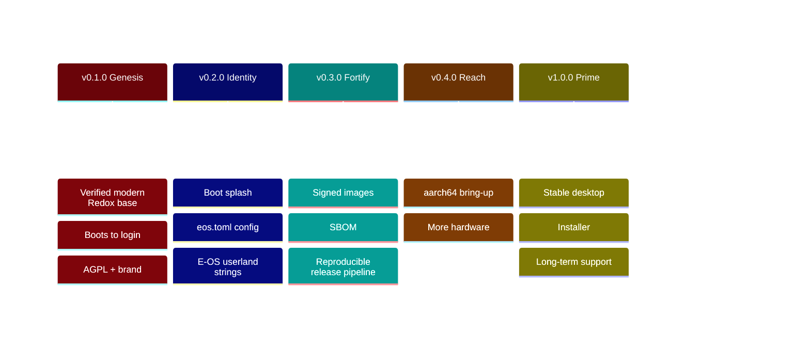

# 🗺️ E-OS Roadmap

> Living document — updated every release. Status keys: ✅ done · 🚧 in progress ·
> ⏳ planned · 💡 idea. Versions follow [SemVer](https://semver.org); each
> milestone maps to a numbered set of deliverables tracked in
> [CHANGELOG.md](CHANGELOG.md).

---

## ✅ v0.1.0 — "Genesis" (2026-06-06)

**Theme: a base that actually builds and boots.**

- ✅ `R-101` Re-base onto modern upstream Redox (`84d78137`, COSMIC desktop).
- ✅ `R-102` Reproducible WSL2 + Podman + QEMU/KVM build environment.
- ✅ `R-103` Diagnose & fix the headless `repo cook` TUI panic (`CI=1`).
- ✅ `R-104` Build + **verify boot** to login (`harddrive.img`).
- ✅ `R-105` Adopt **AGPL-3.0**; preserve Redox MIT attribution.
- ✅ `R-106` Brand & document the repository (this roadmap included).

---

## 🚧 v0.2.0 — "Identity" (target: 2026-07)

**Theme: E-OS looks and feels like E-OS.**

- 🚧 `R-201` Repository: full docs site, CI green, security hardening live.
- ✅ `R-202` Custom build config `config/x86_64/eos.toml` (E-OS desktop variant).
- ✅ `R-203` E-OS bootloader theming (red/black) — `"E-OS Bootloader"` banner +
  red-on-black, built from source (`patches/bootloader-eos-red-black.patch`).
- ✅ `R-204` Rebrand user-visible OS strings — `/etc/os-release`, `/etc/issue`,
  MOTD, and the **`eos login:`** console prompt (it was a hardcoded literal in
  `userutils`, **not** the kernel hostname — patched and built from source).
- ✅ `R-205` E-OS red/black login greeter + desktop wallpaper + launcher icon,
  built from source via the `orbdata` fork.
- ✅ `R-206` `eos` meta-package + first-boot welcome — recipe `recipes/other/eos`
  ships `/usr/bin/eos-welcome` (quick-start command) + `/usr/share/eos/eos-release`;
  `config/*/eos.toml` registers the package, adds `/home/user/Welcome.txt` and
  points the MOTD at `eos-welcome`. **Boot-verified** (2026-07-10, aarch64 QEMU,
  serial session): login → `eos-welcome` prints the full quick start; `uname -a`
  reports the fork kernel; `whoami` runs with 0 aborts.
- 🚧 `R-207` **Usable out-of-the-box toolbox** — a fresh E-OS install now ships a
  practical CLI toolbox (`nano`, `vim`, `git`, `curl`, `wget`, `ripgrep`, `nushell`,
  `openssh`) in `config/*/eos.toml` (filesystem grown to 1400 MiB). The extra COSMIC
  GUI apps (store/settings/reader) are a follow-up — a cookbook host-tool build quirk.
- ✅ `R-208` **Vendor the core Redox OS into E-OS repos** — all 22 Redox-authored
  packages in the image build from `Gh0s777tt/eos-*` (6 modified forks + 16 pinned
  mirrors), independent of `gitlab.redox-os.org`. **Verified** (2026-07-11): every
  `recipes/core/*` + vendored recipe resolves to a `Gh0s777tt/eos-*` fork (22 distinct);
  only the third-party ports point at their own upstreams (by policy). See
  [docs/forks.md](docs/forks.md); keep current with `scripts/sync-forks.sh`.
- ✅ `R-209` **`eos` system command** — `recipes/other/eos` ships `/usr/bin/eos`
  (`eos info` / `eos doctor` / `eos welcome` / `eos help`) alongside `eos-welcome`.
  **Runtime-verified** (aarch64 boot self-test): all four subcommands print correct
  output; `eos info` reports the fork kernel `cf54bc11`.
- ✅ `R-210` **Quieter kernel** — the aarch64/riscv64 `debug!` flood (a `DEBUG` per
  `call_fdread`, printed unconditionally upstream) is now gated behind `KERNEL_DEBUG`
  (default off) in `eos-kernel@cf54bc11`. Zero `DEBUG` lines on the serial console;
  faster TCG boots.

---

## ⏳ v0.3.0 — "Fortify" (target: 2026-08)

**Theme: supply-chain & release integrity.**

- ✅ `R-301` **Signed** release checksums — `release/SHA256SUMS` + a **minisign**
  signature (`release/SHA256SUMS.minisig`), public key `keys/eos-release.pub`;
  `.github/workflows/release.yml` attaches them (+ the SBOM) and re-signs on tag
  when `MINISIGN_SECRET_KEY` is configured.
- ✅ `R-302` **SBOM** (CycloneDX 1.5) generated per build — `scripts/gen-sbom.py`
  → `sbom/eos-<ver>-<arch>.cdx.json` (59 components, each with its source git ref
  + BLAKE3 hash; provenance includes the E-OS source forks).
- 🚧 `R-303` Reproducible, automated release pipeline (tag → image → release).
  **Source builds are reproducible** (recipes pinned to the `Gh0s777tt/eos-*` forks);
  the **release-artifact pipeline is live** (`release.yml`: tag → signed `SHA256SUMS`
  + SBOM + assets, [v0.1.0](https://github.com/Gh0s777tt/E-OS/releases/tag/v0.1.0)).
  The **CI image build works** — `build.yml` built a branded x86_64 image in GitHub
  Actions in **~12 min** (verified `eos login:`=1, `E-OS Bootloader`=4, `redox login:`=0;
  artifact uploaded). Remaining: wiring build → release on tag with byte-reproducible
  checksums (image timestamps differ run-to-run).
- ✅ `R-304` Security policy v2 — **threat model** (`docs/threat-model.md`) +
  **hardening guide** (`docs/hardening.md`), linked from `SECURITY.md`.
- ✅ `R-305` Optional full-disk encryption (RedoxFS **AES-XTS-128**) — documented
  (`docs/encryption.md`) and **verified end-to-end** (2026-07-11): an image installed with
  `[general] encrypt_disk` boots the encrypted root all the way to `eos login:` — the
  bootloader prompts `RedoxFS password`, unlocks the AES-XTS root, loads the kernel from it,
  0 exceptions (`U-049`). This surfaced and fixed a real boot bug: the UEFI bootloader
  **panicked** on an encrypted root instead of prompting; the `eos-bootloader` fork was
  pinned to a rev predating mainline's fix, so it was **rebased onto current mainline**
  (`U-050`), which carries the fix natively. Default-on for a public image is an anti-pattern
  (baked password) — the installer's one-prompt encryption is the right first-class path.
- ✅ `R-306` **Fala B — memory-safety hardening the E-OS kernel owns** (upstream Redox has
  none of these; all boot-verified on **aarch64 + x86_64**, 0 exceptions):
  **`overflow-checks`** across `eos-kernel` + `eos-base` + `eos-relibc` so an unintended
  integer overflow aborts instead of wrapping (`U-044`); user-space **mmap ASLR**
  (`find_free_near` randomizes non-fixed mappings; randomization empirically proven across
  two boots) (`U-045`); user-space **W⊕X** (no simultaneously writable+executable pages,
  enforced at the mmap/mprotect/mremap syscall boundary) (`U-046`); plus an audit closing
  the W+X / RUSTFLAGS / least-privilege-scheme items (`U-047`). See
  [docs/hardening.md](docs/hardening.md).

---

## ⏳ v0.4.0 — "Reach" (target: 2026-10)

**Theme: beyond x86_64.**

- ✅ `R-401` **aarch64** bring-up — a full E-OS aarch64 desktop image builds with
  complete branding (`config/aarch64/eos.toml`) and the red/black E-OS bootloader
  boots under QEMU `virt` on `aarch64/UEFI`
  (`assets/screenshots/eos-aarch64-bootloader.png`).
- ✅ `R-401b` **Full aarch64 boot-to-login — achieved** (2026-06-08). aarch64 boots
  to the graphical E-OS COSMIC desktop under QEMU `virt` — now under **both** ACPI and
  device tree (`acpi=off` is **no longer required**, see `R-401f`).
  The original `redoxfs` Data-Abort report was the *last symptom*, not the cause —
  the real bug was a 4-layer cascade starting with `randd` executing `RNDRRS`
  (FEAT_RNG / ARMv8.5) on a non-FEAT_RNG CPU. Fixed in the
  [`eos-kernel`](https://github.com/Gh0s777tt/eos-kernel) + [`eos-base`](https://github.com/Gh0s777tt/eos-base)
  forks: kernel RNDR/RNDRRS emulation (`R-401b`) + shared INTx IRQ (`R-401d`) + the
  `sched_yield`/signal `x0`-clobber fix (`R-401e`, the kernel root cause behind the relibc
  `verify()` abort); base nvmed INTx mode (`R-401c`) + ACPI `_PRT` INTx routing so `acpi=off`
  is no longer required (`R-401f`). Recipes are pinned to the forks; clean upstream patches
  in [`upstream/`](upstream/README.md). Details: [docs/known-issues.md](docs/known-issues.md),
  issue [#2](https://github.com/Gh0s777tt/E-OS/issues/2) (closed).
- ⏳ `R-402` Expanded hardware/driver coverage. *(Note: `R-402a` — a relibc static-TLS
  bug that crashed every thread on exit on both arches — is **resolved**; see
  [docs/known-issues.md](docs/known-issues.md).)*
- 💡 `R-403` Real-hardware test matrix. Starting map of what carries over from QEMU and
  what does not: [docs/hardware-bringup.md](docs/hardware-bringup.md) (forward-looking;
  nothing hardware-tested yet).

---

## 🧱 Hardware capabilities (`R-50x`)

**Theme: storage resilience + crypto performance + future-proof signing.**
Recommended order, realistic per-item scope and QEMU verification plans live in
[docs/hardware-capabilities-roadmap.md](docs/hardware-capabilities-roadmap.md).

- ✅ `R-501` **RAID-1 mirror daemon (`raid1d`)** — userspace block-scheme mirror
  over two disks, degraded-mode reads, `create`/`status` tooling.
- ✅ `R-502` **aarch64 crypto-extension acceleration** for the RedoxFS FDE path
  (ARMv8 CE via the `aes` crate hardware backend; benchmarked).
- ✅ `R-503` **Post-quantum (hybrid) package signing** — ed25519 + ML-DSA on the
  pkgar repo tooling, with a written migration plan.

---

---

## 💡 v1.0.0 — "Prime" (horizon)

**Theme: a daily-drivable desktop.**

- ✅ `R-1001` **Graphical installer + bootable live medium** — E-OS ships
  `redox_installer_gui` (+ a TUI installer and the `redox_installer` engine); launch
  **Installer** from the desktop to install to a disk, with an optional encrypted root.
  A **bootable live/installer ISO** (`make CONFIG_NAME=eos build/<arch>/eos/redox-live.iso`)
  boots the full system read-only (greeter + installer) like a Linux live USB — verified to
  `eos login:` on **both aarch64 and x86_64** (`U-048`; screenshot
  `assets/screenshots/eos-aarch64-live-iso-greeter.png`). See [docs/install.md](docs/install.md).
- 🚧 `R-1002` **LTS branch + stability policy** — the `lts/0.1` branch (pushed to
  both remotes) tracks the 0.1 “Genesis” line with security backports; documented
  in [SECURITY.md](SECURITY.md) + a [stability/ABI policy](docs/stability.md). The
  binding *stable ABI surface* lands at 1.0 (upstream-dependent).
- 🚧 `R-1003` **Package repository** — every build produces a signed (ed25519)
  `.pkgar` repo (`repo/<target>/` + `repo.toml`, ~58 pkgs/arch); documented
  ([docs/packages.md](docs/packages.md)). **Hosting infrastructure is live**:
  per-arch GitHub Pages repos ([`eos-pkg-x86_64`](https://github.com/Gh0s777tt/eos-pkg-x86_64),
  [`eos-pkg-aarch64`](https://github.com/Gh0s777tt/eos-pkg-aarch64)) + the
  `scripts/publish-repo-pages.sh` publisher (orphan-commit force-push, so the
  hosting repos never grow). Remaining: first publish from a build rig, wire
  `/etc/pkg.d/50_eos` into the images, an E-OS-owned signing key, and the app
  ecosystem.
- ✅ `R-1004` **Documentation site** — mdBook built + deployed to **GitHub Pages**,
  **live at <https://gh0s777tt.github.io/E-OS/>** (`.github/workflows/pages.yml`).
  A *custom domain* is a one-step add (Settings → Pages) once a domain is owned.

## 🧭 Execution roadmap — from QEMU to an installable daily-driver

> Added 2026-07-13 from a 23-agent grounded audit (recon → adversarial verify → flagship design → completeness critic). **Living document** — every shipped item moves to [CHANGELOG.md](CHANGELOG.md) with its `[U-NNN]`. Status `✅ done · 🚧 partial · ⏳ planned · 💡 idea`; priority `P0–P3`; effort `S–XL`; **where** it can be done (`Mac/QEMU` on the Apple-Silicon dev host · `x86-rig` needs the Windows/WSL box · `metal` needs real hardware · `any` · `CI`).

### Two critical paths

- **Foundation A — signed delivery that survives dead GitHub Actions:** `R-002` local `make release` → `R-701` E-OS key + first non-Actions publish → `R-702` pin the pubkey (kill TOFU) → `R-703` client-verified signed manifest. *Both* the update system and the driver manager pull from this backend; the R-503 post-quantum signatures are inert until `R-703` connects them.

- **Foundation B — the Settings shell:** `R-D01` a native orbital/orbclient control-panel (no libcosmic/fontconfig/gperf, so it builds on the aarch64 host and dodges the host-toolchain 404 + dead CI) is the *only* place `Settings → Update` (`R-708`) and `Settings → Drivers` (`R-806`) can live.

"Critical path runs through two shared foundations that must land before any flagship subsystem can honestly claim to work. FOUNDATION A — signed delivery backend that survives dead Actions: R-002 (make release + real checksums) → R-701 (generate E-OS key, first non-Actions publish, wire+repoint /etc/pkg.d) → R-702 (pin the pubkey, kill TOFU) → R-703 (wire eos-repo-sign so the manifest is client-verified). Both the update system AND the driver manager pull from this backend, and R-503's PQ signing is security-theater until R-703 connects it. FOUNDATION B — the Settings shell: R-D01 (native orbital control-panel, deliberately avoiding libcosmic/fontconfig/gperf so it builds on the aarch64 host and dodges the 404 + dead CI) is the ONLY place Settings→Update (R-708) and Settings→Drivers (R-806) can live; cosmic-settings is a dead end on the primary dev arch. In parallel and independent: R-601 (install-to-disk harness) → R-602 (OOBE) closes the daily-driver install claim and retires the CRITICAL live default-credentials exposure, and R-801 (eos-devd read-side) can start immediately on aarch64. Cheap trust-gating fixes go first regardless (R-F01 plaintext password, R-F03 read_at panic, R-002/R-003 phantom checksums) because they are outright violations sitting in the exact code the flagships reuse. Update daemon R-705 ⇐ R-703; the hardest safety work — staged/rollback R-706 then apply-on-reboot R-707 — gates real-disk resilience and precedes A/B (R-710). Driver write-side (R-802 catalog ⇐ R-703; R-804 per-driver packages; R-805 spawn-on-demand; R-806 GUI ⇐ R-D01+R-802+R-705) all sits behind both foundations. Connectivity GUI/firewall (R-902/R-904) and the T2 driver work (R-910/R-911/R-912/R-913) are parallelizable once the foundations exist. Everything Wi-Fi/BT/GPU/HDR/USB4/NPU/cellular/biometric (R-920+, R-930+) is real-hardware, cannot be emulated on the Mac/QEMU dev loop, and is OFF the critical path — tier as research and never version-promise. The hard gating truth: x86_64 parity and 100% of real-hardware validation are blocked on the Windows/x86 rig and cannot be closed from the Apple-Silicon host, so the roadmap has two physically separate critical paths and the metal one is the longer pole."

### `R-0xx` — CI / Release-integrity recovery (Actions dead) — cross-cut

*GitHub Actions is disabled account-wide (HTTP 422, 0 runs complete), so every advertised pipeline — CI image build (R-303), release signing (R-301), pkgar Pages publish (R-1003), docs-site (R-1004), CodeQL/gitleaks/cargo-audit — is inert. This cross-cut moves integrity off Actions and reconciles doc-vs-reality before anything downstream can claim to be trustworthy.*

- ⏳ `R-001` **Reality-ledger / verification matrix doc** — Add a single source-of-truth doc tagging every ROADMAP item with {arch-verified: aarch64/x86_64/both, QEMU-vs-metal, CI-dependent y/n, artifact-retained y/n} so 'done' cannot drift from what is actually runnable. `[P0·S·any]`
- ✅ `R-002` **Local `make release` (non-Actions) with real checksums** — DONE (`U-069`: `scripts/make-release.sh`; `release/SHA256SUMS` regenerated over the real images). — Build eos-<ver>-<arch>.img, regenerate SHA256SUMS over the ACTUAL retained artifact (current release/SHA256SUMS is dated Jul-5 and lists phantom eos-0.1.0-<arch>.img while builds are build/<arch>/eos/harddrive.img at 1400 MiB), and minisign locally so install.md's verify/dd steps work. `[P0·M·any]`
- ✅ `R-003` **Correct doc↔reality claims now blocked by Actions** — DONE (`U-069`: install.md + README no longer advertise a phantom download / inactive scanning). — Downgrade R-303 CI-build prose and R-1004 'live Pages site' claims, mark CodeQL/gitleaks/cargo-audit/release-signing as Actions-blocked in SECURITY.md/README, and remove the phantom-artifact instructions. `[P0·S·any]` · needs `R-002`
- 🚧 `R-004` **Non-Actions CI: self-hosted runner or GitLab CI** — GitLab CI light gates LIVE (`U-070`: secret-scan + integrity on every mirrored push); heavy image build on a self-hosted runner remains. — Stand up a build+boot-smoke gate on the x86 rig (self-hosted runner) or GitLab CI that reproduces the image build and login-smoke without GitHub Actions. `[P1·L·x86-rig]` · needs `R-002`
- ✅ `R-005` **Local scheduled security scans + git hooks** — DONE (`U-070`: `.gitlab-ci.yml` gitleaks+integrity, `scripts/local-scan.sh`, `scripts/hooks/pre-push`; launchd timer optional). — Replace dead Actions scanning with launchd-timed gitleaks + cargo-audit + cargo-deny plus a pre-commit/pre-push hook; add a grep gate failing on `println!.*password` / `TODO: Remove this debug`. `[P1·S·Mac/QEMU]`
- ⏳ `R-006` **Configure and verify the GitLab mirror** — README/CHANGELOG U-015 and ROADMAP R-1002 claim a synced GitLab mirror, but `git remote -v` shows only origin=GitHub; add the gitlab remote and a push so the mirror claim becomes true. `[P2·S·any]`
- ⏳ `R-007` **Push unpushed main; prune moot Dependabot branches** — Push the unpushed README-sync commit (ee0f15cd) and close the github_actions/* Dependabot branches (configure-pages/upload-artifact/codeql) that maintain a dead pipeline; keep the useful cargo/* ones. `[P2·S·any]`
- ⏳ `R-008` **First non-Actions signed pkgar repo publish** — Run scripts/publish-repo-pages.sh (orphan-commit git push to eos-pkg-<arch> Pages, already Actions-independent) for the first time to produce a live signed repo/Pages host that the update system and driver manager can pull from. `[P0·M·any]` · needs `R-002`, `R-701`

### `R-Fxx` — Immediate correctness / security fixes surfaced by audit

*Cheap, high-leverage fixes that gate trustworthiness of the install/update path. Several are outright CLAUDE.md security violations or crash regressions in the exact code the flagship subsystems will reuse.*

- ✅ `R-F01` **Verified — no plaintext-password leak on the shipping installer** (pinned rev `05bf2eb`: only `Password: set/unset` state is printed). The leak was a **stale-clone artifact**; the real work is `R-F02` (resync/delete the stale vendored source). — Remove the two println! lines leaking entered passwords (lib.rs:79 and :182, with a literal 'TODO: Remove this debug msg') — a direct CLAUDE.md security violation — and keep the grep gate from R-005. `[P0·S·any]`
- ⏳ `R-F02` **Resync/delete stale vendored src/eos-installer; provenance gate** — The exported src/eos-installer is a stale v0.1 dead branch (68616dc) that misrepresents the shipping installer (recipe pins 05bf2eb, cargo checkout 1c2534e, source_info 35734c6 — three hashes); resync or delete it and add a gate asserting vendored source == recipe rev. `[P1·M·any]`
- ✅ `R-F07` **Graphical session no longer blocked by audio** — greeter `20_orbital` dropped its `requires_weak 20_audiod.service`; `audiod` exits without readiness on no-audio HW and hung the whole desktop (U-072). Verified: `orbital` now starts (`/scheme/orbital` present). `[P0·S·mac-aarch64-qemu]`
- ✅ `R-F08` **greeter auto-activated on boot (no more `Super+F3`)** — DONE `U-078`, verified: booting the aarch64 image lands directly on the crimson E-OS greeter (`assets/screenshots/eos-greeter.png`), zero key presses. Real root cause (via an `inputd` serial trace): the installer **concatenates** `[[files]]` entries (no dedup), and because `desktop.toml` includes BOTH `desktop-minimal.toml` and `server.toml` — each pulling `minimal.toml` — `minimal.toml`'s `30_console` (which runs `inputd -A 2`) lands LAST on disk via the `server.toml` path and re-steals the foreground to the text console (VT2) *after* `20_orbital` activates the greeter's VT3. Fix: `eos.toml` (merged dead-last, so it wins) pins `30_console` **without** `inputd -A 2` on both arches; the VT2 getty stays available via `Super+F2`. This corrects the earlier hypothesis (VT2 activation was `inputd -A 2` in an init service, not a display-handoff artifact). `[P1·S·mac-aarch64-qemu]`
- ✅ `R-F09` **vesad: env parse bez paniki** — `split_once('=').unwrap()` → `filter_map` (nie panikuje na linii `/scheme/sys/env` bez `=`; znalezione przy R-F08). DONE `U-075`. `[P2·S·either]`
- ✅ `R-F03` **Fix pkgar-core read_at panic on truncated segment** — DONE (`U-067`, eos-pkgar `cb8ae7b`, regression test). — read_at uses copy_from_slice after clamping end to src.len() so a short data segment panics (reachable via a truncated .pkgar whose signed header does not cover data length); restore buf[..end-start], add checked_add to offset+header_len, and add a truncated-package unit test. `[P0·S·any]`
- 🚧 `R-F04` **Harden raid1d arithmetic and split-brain** — safety fixes landed (`U-068`, eos-base `d4f193c9`: `checked_add` in `byte_off` + N-way read fallback). Follow-ups: `raid1d resolve` subcommand + repo-wide `clippy::arithmetic_side_effects`. — byte_off uses an unchecked add that can wrap and silently degrade a healthy mirror; the [primary,1-primary] fallback underflow-panics if member_count>2. Add checked_add, generalize the read-fallback, add a 'raid1d resolve' subcommand, and turn on clippy::arithmetic_side_effects to catch this class repo-wide. `[P1·M·Mac/QEMU]`
- ⏳ `R-F05` **Fix numbering + copy-paste doc drift** — Close the missing U-038 and the duplicate U-039 (assigned to both the upstream-patch refresh and the netsurf issue) per CLAUDE.md 'bez luk', fix the copy-pasted aarch64-only comment in eos.x86_64.toml, the lived null-namespace expect() message, and the no-op Transaction::remove io::sink hash. `[P2·S·any]`
- ⏳ `R-F06` **Typed errors for missing-pubkey unwraps** — repo.pubkey.unwrap() panics at install/upgrade time if a remote's key is missing — a DoS foot-gun; replace with a typed error and graceful degrade. `[P2·S·any]`

### `R-Dxx` — Desktop shell / Settings host (flagship blocker)

*The shipping DE is orbital + eos-orbutils with COSMIC apps as clients — cosmic-comp never runs, and there is NO Settings app on either arch (cosmic-settings is unbuildable on the aarch64 host via fontconfig→host:gperf 404, and CI is dead). Settings→Update and Settings→Drivers have literally nowhere to live until a native control-panel exists.*

- 🚧 `R-D01` **E-OS Settings native control-panel (orbital/orbclient)** — BUILT + RUNS (`U-071`, eos-orbutils `061dfd3`: `eos-settings` bin, no libcosmic; compiles aarch64-redox, installs, integrated via `apps/15_eos-settings`+icon, launches against live orbital PID-verified). **RENDER ZWERYFIKOWANY** end-to-end w QEMU (desktop przez Super+F3): sidebar + 9 paneli + realne dane System (aarch64/Genesis) + stopka; `assets/screenshots/eos-settings-panel.png`. — Build a red/black Settings app on orbital/orbclient with NO libcosmic/fontconfig/gperf dependency (so it compiles on the aarch64 host and dodges both the 404 and dead CI), structured as a panel host (Update, Drivers, Display, Network, Audio, Users, Date&Time) that ships a .desktop entry to appear in the launcher. `[P0·XL·Mac/QEMU]`
- ⏳ `R-D02` **Make the system tray functional** — The net/vol/settings tray icons are decorative PNGs; wire the net indicator from netstack state, a volume popup via audiod, and make the gear launch E-OS Settings (the gear has no launch target until R-D01 ships). `[P1·M·Mac/QEMU]` · needs `R-D01`
- ⏳ `R-D03` **Notifications daemon + UI** — Add a minimal notifications daemon and UI — required so the update daemon can surface 'updates available' and driver events. `[P1·M·any]`
- ⏳ `R-D04` **Screenshot utility** — Ship a small screenshot tool (currently none), a high-visibility daily-driver primitive. `[P2·S·Mac/QEMU]`
- ⏳ `R-D05` **Launcher search + local-time clock** — Add type-to-search filtering to the Start menu and fix the clock (currently UTC HH:MM only) to show local date + timezone. `[P2·S·Mac/QEMU]`
- ⏳ `R-D06` **Fix netsurf ET_EXEC crash on aarch64** — The only bundled browser dies at startup (ESR 0x92000047 L3 fault, the sole ET_EXEC/non-PIE binary) and leaves an orphaned SDL window every boot; force -pie on its link rule or adopt a lighter PIE-friendly engine (open known-issue U-039). `[P2·L·Mac/QEMU]`
- ⏳ `R-D07` **Volume mixer UI; verify cosmic-edit boot** — Add an audio-mixer/volume UI and explicitly boot-verify cosmic-edit (only cosmic-files/term were verified after the R-402b loader fix). `[P2·M·Mac/QEMU]` · needs `R-D01`
- ⏳ `R-D08` **Verify launcher .desktop membership** — The greeter→installer path is untested: confirm installer-gui, cosmic-edit and CLI tools actually appear via freedesktop .desktop entries present in the image (not in the exported source tree). `[P1·S·Mac/QEMU]`

### `R-6xx` — Installer → daily-driver + OOBE / first-boot

*A capable install engine ships (redox_installer 0.2.42: GPT+EFI/BIOS, RedoxFS, AES-XTS FDE, ed25519 pkgar verify, fast-clone), but interactive install-to-disk is unverified end-to-end, the GUI collects only disk+password, and there is NO first-boot wizard — every install lands as passwordless `user` + `root/password`, which docs tell users to fix by hand. This series closes the 'installs to a real disk and lands on a secured working desktop' goal.*

- 🚧 `R-601` **QEMU install-to-second-disk boot-verify harness** — Attach a blank virtio-blk/NVMe disk, script-drive installer_tui (then the GUI), boot the INSTALLED disk to the greeter and assert 0 exceptions on both arches — the missing end-to-end partition→install→reboot→desktop proof. **Blocker cleared (`U-080`):** the live-ISO text console (VT2 `getty 2`) was black because the `notify`-typed `25_raid1d.service` head-of-line-blocked `init`'s single-threaded drain on live disk I/O; flipping it to `oneshot_async` restores the getty (`assets/screenshots/eos-live-vt2-getty.png`), so the installer can now be driven from a text login. Remaining: script the target-disk partition→`installer_tui`→reboot→desktop run (watch for raid1d holding the target disk open R+W during the probe). `[P0·M·Mac/QEMU]`
- 🚧 `R-602` **First-boot OOBE wizard (retires default-creds)** — password enforcement DONE + verified on EVERY login path; only per-machine identity remains. **Text/getty + serial** (`U-076`+`U-077`, eos-userutils `799088a`): a shared `force_first_boot_passwd` helper forces `passwd` before the shell for the passwordless `user` (`assets/screenshots/eos-oobe-firstboot.png`) AND any account still on the shipped default `password`, order-independent so it catches `root/password` (`assets/screenshots/eos-oobe-root.png`). **Graphical greeter** (`U-079`, eos-orbutils `3ac6436`): `orblogin` — the DEFAULT path since `R-F08` — no longer lets a default-credential account (`verify_passwd` accepts a blank password) reach the desktop; on such a login it switches in-window to **New password → Confirm password**, `set_passwd`+`save` (`Config::writeable(true)`, else EBADF), then starts the session (`assets/screenshots/eos-greeter-setpw.png`, `eos-desktop-after-oobe.png`). The live P0 shipped-default-credentials exposure is now closed on text/getty **and** the graphical greeter. Remaining follow-up: per-machine identity (hostname/locale/keymap/machine-id/SSH keys) at install (→ `R-606`) — set hostname, timezone/locale/keyboard, regenerate machine-id + SSH host keys on first boot of a fresh install. `[P0·L·Mac/QEMU]` · needs `R-601`
- ⏳ `R-603` **Enrich installer front-ends: account/hostname/locale** — Both GUI and TUI clone base.toml defaults and create no accounts (installer_tui TODO#3 unimplemented); collect username+password, hostname, timezone, locale, keyboard and feed config.users/hostname instead of the baked defaults. `[P1·L·any]` · needs `R-601`
- ⏳ `R-604` **Destructive-action guardrails** — Whole-disk-erase hides behind a bare numeric menu / single 'Confirm' button with no disk identification; show disk model/size, detect existing partitions/other OS, and require typing the disk name to confirm the wipe. `[P1·M·any]` · needs `R-601`
- ⏳ `R-605` **Point installer at the E-OS signed repo; arch-aware** — The network path fetches from upstream https://static.redox-os.org/pkg with a hardcoded aarch64 target and unwrap-on-fetch; repoint the online/repair path at the E-OS signed repo with ed25519+ML-DSA verification, add runtime arch detection, and keep offline live-clone as default. `[P1·M·any]` · needs `R-008`, `R-703`
- ⏳ `R-606` **Per-machine identity at install** — Generate a unique hostname (currently baked 'eos' for every install), machine-id, and managed SSH host keys during install (openssh ships but keys are unmanaged). `[P1·S·any]` · needs `R-602`
- ⏳ `R-607` **Real block-size (4Kn) + real-firmware install matrix** — DiskWrapper::open always reports 512 so the with_whole_disk 512-guard is dead code that misreads 4Kn disks; query the real block size and add a real-HW install matrix (UEFI+BIOS, NVMe/AHCI, ESP interop). `[P2·M·metal]` · needs `R-601`
- ⏳ `R-608` **Correct shipping install docs to match the GUI** — docs/install.md §2 claims the Installer walks through creating users/passwords and choosing the package set, and §presents encryption as an interactive walk-through — the built binary does none of that (drive+password only); fix the live docs (CLAUDE.md 'docs zgodne z kodem'). `[P1·S·any]` · needs `R-603`
- ⏳ `R-610` **Repoint installer build-deps to E-OS sources** — redox_installer pins git crates to gitlab.redox-os.org (arg_parser, liblibc, pkgutils, redoxfs 0.3); repoint to E-OS-controlled forks so 'build from OUR signed source' holds at the build-dependency layer, not just the runtime remote. `[P1·M·any]` · needs `R-F02`
- 💡 `R-609` **Manual partitioning / install-alongside (dual-boot)** — Add manual partitioning, install-alongside, and free-space/resize modes; today it is whole-disk-erase only. `[P3·XL·any]` · needs `R-604`

### `R-7xx` — In-OS update system (Settings → Update)

*A real hardened CLI substrate exists (pkg with an update subcommand; pkgar enforces per-package ed25519 + blake3 before commit), but everything above it is missing AND the trust chain is weak: the per-package manifest tomls are unauthenticated client-side, the signing pubkey is TOFU over an unpinned transport, the default source points at upstream Redox, and R-503 hybrid PQ signing is a disconnected build-host prototype no client verifies. No daemon, no GUI, no atomic/rollback.*

- 🚧 `R-701` **Wire a working, E-OS-owned update source** — Generate an off-repo E-OS ed25519 (later hybrid) signing key, run the first publish, wire /etc/pkg.d/50_eos into eos.{aarch64,x86_64}.toml with graceful degrade, and REPOINT/remove the default 50_redox source that today makes fresh installs trust and pull from upstream static.redox-os.org (a supply-chain hazard, not merely inert). `[P0·S·any]` · needs `R-002`
- ⏳ `R-702` **Pin the repo pubkey; kill TOFU** — No E-OS pubkey is baked into any config (grep=0 hits) so remote update keys are fetched TOFU from the same host that serves packages, defeating the per-package signature on first contact; pin the pubkey into the image, enforce https:// in add_remote, verify the pubkey-cache provenance, and stop fetching the key over the package channel. `[P0·M·any]` · needs `R-701`
- 🚧 `R-703` **Client-side signed-manifest verification (wire R-503)** — Make the publisher emit repo.toml.sig via eos-repo-sign and have pkg-lib fetch+verify it before trusting any per-package toml (ed25519 enforced now, ML-DSA-65 advisory→required per R-503), closing the rollback/freeze MITM window that the genuine per-package check cannot catch. `[P0·M·any]` · needs `R-702`, `R-503`
- ⏳ `R-704` **Anti-rollback / freshness + hash pinning** — A validly-signed OLDER pkgar still installs; add a monotonic index+timestamp in the signed manifest, reject downgrades, and pin each downloaded package hash to the manifest hash. `[P1·M·any]` · needs `R-703`
- ⏳ `R-705` **eos-update daemon + thin CLI** — A check→resolve→verify→download→stage→apply state machine over pkg-lib with a scheduling timer, desktop 'updates available' notifications, a persisted journal, and privilege re-exec (fixing the manual-sudo/terminal-hang rough edges). `[P1·L·any]` · needs `R-703`, `R-D03`
- ⏳ `R-706` **Staged transactional apply + one-step rollback** — transaction.commit() mutates the live FS via an in-memory rename loop with no persisted journal, so a crash mid-loop half-applies with no recovery; download+verify all packages into staging, snapshot replaced files + package.toml, commit under a journal, and expose `eos-update rollback`. `[P1·XL·any]` · needs `R-705`
- ⏳ `R-707` **Base/kernel apply-on-reboot with boot fallback** — kernel/base/relibc are upgraded by live in-place file replacement (a bad kernel or power loss can brick a real disk); stage them into a pending slot, flag the bootloader, verify on next boot, and auto-revert after N failed boots. `[P2·XL·any]` · needs `R-706`
- ⏳ `R-708` **'Settings → Update' GUI pane** — A red/black pane in the E-OS Settings shell: check/download/verify/apply with progress, changelog, and update history/rollback, refusing to apply unless manifest-signature + per-package ed25519 + anti-rollback all pass, and writing an audit log. `[P1·L·Mac/QEMU]` · needs `R-705`, `R-D01`
- ⏳ `R-709` **Update-decision integration tests** — No e2e coverage exists for the update decision; add tests exercising update() against a repo.toml with mismatched hashes and asserting end-to-end signature-failure rejection. `[P2·S·any]` · needs `R-703`
- ⏳ `R-711` **On-device key rotation / revocation** — pkgar binds each package to exactly one embedded pubkey with no keyring or revocation list; add an on-device rotation/revocation mechanism, required for the R-503 PQ migration to be enforceable. `[P2·M·any]` · needs `R-702`
- ⏳ `R-712` **Update flow user + admin docs** — Document the check/verify/apply/rollback flow and the trust model for users and admins. `[P2·S·any]` · needs `R-705`
- 💡 `R-710` **A/B root + delta/differential updates** — A/B root slots or RedoxFS snapshot-backed updates plus delta package fetch for bandwidth and safety. `[P3·XL·any]` · needs `R-707`

### `R-8xx` — Secure driver manager (Driver-Booster-class, trustworthy)

*A real PCI+USB bind pipeline exists (hwd→pcid→pcid-spawner matches static /usr/lib/pcid.d/*.toml; xhcid matches drivers.toml) but nothing resembling a manager: matching is a compiled-in catalog across THREE owners (initfs.toml + usr/lib/pcid.d/* + xhcid/drivers.toml), all drivers ship inside monolithic base.pkgar, binding is one-shot at boot, and platform/ACPI/DT devices are enumerated but never bound. The catalog is already internally inconsistent (ac97d/vboxd/ahcid/ided tomls point at binaries absent from the image). The security thesis is sound but only covers hardware a driver EXISTS for.*

- ⏳ `R-801` **eos-devd device-inventory daemon (/scheme/devices)** — Unify pcid (/scheme/pci), xhcid (USB ports) and hwd platform enumeration into one readable lspci/lsusb-style inventory (vendor/device/class + bound-driver + bound? flag) — the read-side foundation, buildable in userspace on aarch64/QEMU today. Note hwd only spawns acpid on the ACPI backend, not the aarch64 DT path. `[P0·M·Mac/QEMU]`
- ⏳ `R-802` **Signed driver catalog (device-ID → driver-pkg map)** — A versioned device-ID→driver-package+version+arch map packaged as its own pkgar signed with the R-503 hybrid key, fetched+verified+cached; seed it from the existing three catalogs (initfs.toml + pcid.d/*.toml + xhcid/drivers.toml) so day-one coverage equals shipped coverage. `[P0·M·any]` · needs `R-703`
- ⏳ `R-803` **Harden the matcher for untrusted catalog input** — match_function parses vendor keys with i64::from_str_radix(...).unwrap() — a hostile/malformed downloaded catalog entry panics pcid-spawner and breaks ALL boot binding; replace with skip-on-error, reject unsigned/oversized/duplicate entries, and validate binary presence (ac97d/vboxd and initfs ahcid/ided currently point at absent binaries). `[P0·S·any]` · needs `R-801`
- ⏳ `R-804` **Split drivers into per-driver pkgar packages** — Every driver binary + its match toml currently ships inside base.pkgar (make install-base), so updating one driver replaces the core OS; split into drv-<name> packages (each carrying binary + supported-IDs/arch/version/sha manifest) spanning the three catalog owners and two roots (initfs vs rootfs), leaving base with only boot-critical initfs drivers. `[P1·L·any]` · needs `R-802`
- ⏳ `R-805` **pcid spawn-on-demand (bind without reboot)** — pcid-spawner is one-shot at boot; add a control op (or `pcid-spawner --bind <addr> --driver <cmd>`) reusing the existing PCID_CLIENT_CHANNEL fd-passing so a just-installed driver binds live. `[P1·M·Mac/QEMU]` · needs `R-801`
- ⏳ `R-806` **Driver Manager GUI (Settings → Drivers)** — A red/black pane listing Missing/Outdated/OK, one-click installing ONLY from the signed repo and reusing the update download/verify/apply pipeline; document the anti-scam win (sole source is the signed repo, every driver blake3+ed25519(+ML-DSA) verified and run under W^X/ASLR) and honestly scope that detection works even where no driver exists. `[P1·M·Mac/QEMU]` · needs `R-801`, `R-802`, `R-D01`, `R-705`
- ⏳ `R-807` **Persisted 'device present, no driver' inventory** — Store an inventory recording devices with no bound driver so the manager can tell the user a Wi-Fi/touchpad exists but is unsupported — itself an anti-scam UX win (hwd already names PNP0C0A battery and PNP0C50 I2C-HID even with no driver). `[P2·S·any]` · needs `R-801`
- ⏳ `R-808` **hwd platform-device binding (ACPI/DT)** — Implement the standing TODO: map ACPI _HID/_CID and DT 'compatible' strings to driver commands (same match-table pattern as pcid.d), extending coverage beyond PCI+USB to SoC/laptop peripherals (I2C-HID, EC, SD/eMMC). `[P2·L·metal]` · needs `R-801`
- ⏳ `R-809` **Multi-segment ECAM/MCFG PCI enumeration** — pcid only scans bus 0, 0x80 and bridge-discovered buses (FIXME 'Use full ACPI for enumerating the host bridges'); handle multiple host bridges / PCIe segments for real hardware. `[P2·M·metal]`
- ⏳ `R-811` **Fix hwd acpid-spawn assumption on aarch64** — acpid is spawned inside AcpiBackend::new so it never starts on the aarch64 DeviceTree backend (the primary dev target); the unified enumerator must not assume acpid is running. `[P2·S·Mac/QEMU]` · needs `R-801`
- 💡 `R-810` **Driver A/B + boot-fail rollback watchdog** — Keep the previous driver pkgar and auto-revert on a post-update boot-fail watchdog (especially storage/GPU). `[P3·M·any]` · needs `R-706`, `R-804`

### `R-9xx` — Connectivity + honest hardware tiers

*Wired IPv4 is the strongest subsystem (smoltcp netstack over real e1000/rtl/virtio/ixgbe drivers, DHCP, DNS, auto boot bring-up). Everything else is tiered honestly: T2 = bounded driver work buildable/verifiable soon; T3 = real-hardware multi-month efforts that QEMU cannot emulate (Wi-Fi, Bluetooth, S3); T4 = aspirational for a Redox downstream, gated on absent substrates (no I2C bus, no 3D/GEM accel layer). Two structural blockers cascade across the wishlist: no I2C bus (kills sensors/I2C-HID/Type-C PD) and no GPU-accel substrate (kills HDR/VRR/DirectStorage/NPU/local-AI).*

- ⏳ `R-901` **Fix usbnetd RX=0 and reconcile the docs** — usbnetd TX works but RX delivers zero frames (no DHCP OFFER/ARP ever received); fix the receive path and reconcile the three contradictory statuses (source main.rs:17-19 falsely claims a full bidirectional handshake, roadmap-connectivity.md marks it done, CHANGELOG U-055 admits RX=0) to one honest status. `[P1·M·Mac/QEMU]`
- ⏳ `R-902` **Graphical Network Settings pane** — A thin GUI over the existing /scheme/netcfg backend (DHCP/static toggle, IP/DNS/gateway, link status) in the Settings app and installer; today config is only scheme files + ifconfig CLI. `[P1·M·Mac/QEMU]` · needs `R-D01`
- ⏳ `R-904` **Host firewall / packet-filter layer** — The netstack exposes ip/udp/tcp/raw schemes (raw enabled) with zero ingress/egress filtering — a notable gap for a security-first daily-driver; add a host firewall/packet-filter and review the raw-socket scheme's exposure under the multi-tenant isolation goals. `[P1·L·any]`
- ⏳ `R-903` **Enable IPv6 end-to-end** — netstack is compiled proto-ipv4 only; enable smoltcp proto-ipv6, wire netcfg addr/route + SLAAC and DHCPv6, and add AAAA lookups in relibc (DNS is A-record-only today — a second independent IPv6 blocker beyond the netstack flag). `[P2·M·any]`
- ⏳ `R-905` **netstack multi-adapter / multi-homing** — netstack detects all network.* adapters but binds only the first (explicit FIXME); support concurrent adapters so Wi-Fi+Ethernet can coexist (prerequisite for any future Wi-Fi). `[P2·L·any]`
- ⏳ `R-906` **dhcpd lease renewal (T1/T2 timers)** — dhcpd is a one-shot with no renewal loop, so a long-running box silently loses its lease; add T1/T2 renewal. `[P2·S·any]`
- ⏳ `R-907` **e1000e (82574L) in base e1000d catalog** — e1000e (8086:10d3), the default q35 NIC, is only in the x86_64 overlay; add it to the base e1000d config.toml so a real Intel box outside that overlay binds a driver. `[P2·S·any]`
- ⏳ `R-910` **[T2] Multi-gig wired NIC drivers** — Write RTL8125 (2.5GbE), Intel I225/I226, then Aquantia drivers; writable in-tree but no QEMU model exists, so verification needs real silicon. `[P2·M·metal]`
- ⏳ `R-911` **[T2] USB Audio Class driver (usbaudiod)** — UAC1 output → input → UAC2; QEMU-verifiable via -device usb-audio. Hi-Res is a later T3 stretch; DSD/MQA/spatial-object audio are T4. `[P2·M·any]`
- ⏳ `R-912` **[T2] Software RAID 0/5/10** — Extend the raid1d family: RAID-0 is trivial, RAID-5/6 parity moderate, plus the already-scoped R-501b resync/rebuild and R-501c root-on-RAID; two-disk QEMU-verifiable. `[P2·M·any]` · needs `R-F04`
- ⏳ `R-913` **[T2/T3] TPM 2.0 driver + measured boot** — A TIS/CRB MMIO TPM driver (QEMU-testable via swtpm) plus measured-boot PCR extend feeding a Secure Boot chain on the from-source E-OS bootloader; VBS/HVCI-class guarantees are T4 (a microkernel lacks the VBS substrate). `[P2·L·any]`
- ⏳ `R-914` **[T2] SHA hardware acceleration (R-502b)** — Hardware SHA acceleration for pkgar signature verification, extending the existing ARMv8 crypto-ext FDE accel (R-502). `[P3·M·any]`
- ⏳ `R-923` **[T2] Verify present-but-unverified drivers on silicon** — ihdgd (Intel display/KMS-modeset), bcm2835-sdhcid (RPi SD), rtl8168d and ixgbed are shipped but never bound on real hardware; hardware-matrix.md marks them 'Present' — validate on silicon (ihdgd risks implying real Intel-GPU display works when only modeset code exists). `[P2·M·metal]`
- ⏳ `R-916` **[T3-blocker] I2C bus subsystem + I2C-HID** — Redox has no I2C bus driver (HARDWARE.md:40); this single gap blocks the entire sensor category, most laptop precision touchpads (I2C-HID), and Type-C PD controllers. Foundational bus driver first, then I2C-HID. `[P3·L·metal]`
- ⏳ `R-917` **[T2/T3] Color management + multi-monitor** — A shared driver-graphics/kms modeset abstraction already exists (connectors/properties/objects/DPMS); add software ICC v4 profile apply + correct sRGB pipeline and multi-monitor on top of it. HDR/VRR/3D genuinely need the absent accel layer (see R-930). `[P3·L·metal]`
- 💡 `R-918` **[T3] LED-control API atop the existing EC driver** — acpid ships a real ACPI-AML embedded-controller driver (ec.rs, EC_DATA 0x62 / EC_SC 0x66); add a privacy-indicator LED-control API on top (webcam/mic-mute), which the EC transport does not yet expose. `[P3·M·metal]`
- 💡 `R-920` **[T3] Bluetooth LE stack** — No HCI/L2CAP/SDP/GATT today; build BLE via Rust-native trouble + bt-hci over a USB-HCI transport shim (roadmap-connectivity B0-B5 ≈ 6-12 months), then Classic BR/EDR for A2DP. Cannot be developed or tested in QEMU. BT6 Auracast/LE-Audio are T4. `[P3·XL·metal]`
- 💡 `R-921` **[T3] First Wi-Fi chipset (research spike)** — No 802.11 MAC/supplicant/firmware loader exists; pick FullMAC brcmfmac on RPi (offloads MAC) OR ath9k SoftMAC via ported FreeBSD net80211 + wpa_supplicant. Multi-month real-hardware spike, QEMU emulates zero Wi-Fi — never version-promise. Wi-Fi 7 MLO / Wi-Fi 8 are T4. `[P3·XL·metal]`
- 💡 `R-922` **[T3] ACPI S3 suspend + battery/thermal surfacing** — acpid only does ACPI poweroff (no cpufreq/DVFS, no suspend, no battery/thermal); add S3 suspend and basic battery/AC/thermal surfacing (a laptop that can't sleep or report battery isn't a credible portable daily-driver). S0ix Modern Standby is T4. `[P3·L·metal]`
- 💡 `R-924` **[T3] Broaden CPU-arch reach** — Verify a RISC-V desktop (Redox has the target, E-OS never validated it) and prove an HVF/KVM aarch64 path (today Apple-Silicon dev is TCG-only); Snapdragon X Elite / real ARM64 laptops unverified. `[P3·L·any]`
- 💡 `R-930` **[T4] GPU 3D/compute acceleration substrate** — driver-graphics ships KMS-style modeset but no GEM/command-submission/dma-fence/accel layer (grep vulkan|opengl|GEM|shader = 0); building this is the prerequisite gating HDR, high-refresh VRR, DirectStorage, NPU and all local-AI — no shortcut exists. Not feasible for a downstream alone in the near term. `[P3·XL·metal]`
- 💡 `R-931` **[T4] Display quality: HDR / VRR / high-refresh** — DisplayHDR/Dolby-Vision/HDR10+, FreeSync/G-Sync/Adaptive-Sync VRR, 120-540Hz, 8K/10K — all require the missing 3D-accel substrate. `[P3·XL·metal]` · needs `R-930`
- 💡 `R-932` **[T4] USB4 v2 / Thunderbolt 5 / USB-C PD 240W** — No USB4/TB host-router driver, PCIe tunneling, hotplug, or Type-C PD stack; eGPU additionally needs 3D accel and I2C-PD. `[P3·XL·metal]` · needs `R-930`, `R-916`
- 💡 `R-933` **[T4] NPU / local-AI stack** — No NPU driver of any kind; local LLM/image-gen/voice/translation are impossible until the GPU/compute substrate (R-930) exists. `[P3·XL·metal]` · needs `R-930`
- 💡 `R-934` **[T4] Cellular 5G/eSIM, NFC, UWB** — No QMI/MBIM modem stack, no CDC-ACM/usbserial, no SIM/eSIM, no NFC/UWB at any layer. `[P3·XL·metal]`
- 💡 `R-935` **[T4] Hardware biometrics** — Fingerprint (ultrasonic/under-display), IR face, iris — no sensor drivers and no enrollment/matcher stack; most depend on the absent I2C/sensor substrate. `[P3·XL·metal]` · needs `R-916`
- 💡 `R-936` **[T4] Future/experimental 2026-2028** — Wi-Fi 8, Bluetooth 7, USB4 v3, PCIe 7, CXL 3.x, optical interconnects, neuromorphic, AR/VR/MR (OpenXR 1.1) — research-tier, not addressable by a Redox downstream alone. Post-quantum crypto is the sole wishlist item already partially delivered (R-503). `[P3·XL·metal]`

### What I can start now (Mac / aarch64 / QEMU)

- R-001: write the reality-ledger/verification-matrix doc so 'done' stops drifting from what boots
- R-002 + R-003: add a local `make release` that regenerates SHA256SUMS over the real harddrive.img and minisigns it, then downgrade the false CI-build/live-Pages/scan-active prose
- R-F01 + R-005: delete the two plaintext-password println! lines in eos-installer and add the launchd gitleaks/cargo-audit/cargo-deny scans + grep gate (replacing dead Actions)
- R-F03: fix the pkgar-core read_at truncated-segment panic (restore buf[..end-start], checked_add) with a unit test — it sits in the install/update path
- R-F04: harden raid1d arithmetic (checked_add, generalized fallback, resolve subcommand) and turn on clippy::arithmetic_side_effects
- R-601: build the QEMU install-to-second-disk boot-verify harness and prove partition→install→reboot→greeter on aarch64 (live-console blocker cleared in `U-080`; target-disk install drive still to script)
- R-602: build the first-boot OOBE wizard that forces a password change and kills the shipped passwordless-user + root/password default
- R-701 + R-702 + R-703: generate the E-OS signing key, run the first non-Actions publish, wire and PIN /etc/pkg.d/50_eos (repointing the upstream 50_redox default), and wire eos-repo-sign into publisher+client so the manifest is actually verified
- R-D01: start the native orbital/orbclient E-OS Settings shell (no libcosmic/gperf) — the host every Update/Driver pane needs
- R-801 + R-803: build eos-devd (/scheme/devices inventory) and harden the pcid matcher against untrusted catalog input (fix the unwrap panic + dead ac97d/vboxd/ahcid/ided entries)
- R-901: fix usbnetd RX=0 under QEMU usb-net and reconcile the three contradictory status docs
- R-D08: verify the launcher .desktop entries actually list installer-gui so the greeter→installer path works

### What needs the x86 rig or real hardware

- R-004: stand up the non-Actions CI (self-hosted runner or GitLab CI) on the x86 rig for a reproducible build+boot-smoke gate
- x86_64 image boot verification and arch parity — the Mac cannot run the x86_64 image natively, so every x86_64 boot claim must be confirmed on the rig
- R-607: real-firmware / 4Kn / UEFI+BIOS / NVMe+AHCI install matrix on physical hardware
- R-808 + R-809: hwd ACPI/DT platform-device binding and multi-segment ECAM/MCFG enumeration validated on a real laptop/board
- R-910 + R-923: multi-gig NIC drivers (RTL8125, I225/I226, Aquantia) and the present-but-unverified drivers (ihdgd, bcm2835-sdhcid, rtl8168d, ixgbed) verified on real silicon
- R-913: TPM 2.0 + measured boot against a real TPM (swtpm can pre-validate on the Mac, real PCR sealing needs hardware)
- R-920 + R-921: Bluetooth LE and the first Wi-Fi chipset bring-up — QEMU emulates neither, so both are real-hardware-only multi-month spikes
- R-922: ACPI S3 suspend and battery/thermal surfacing on a real laptop
- R-916: I2C bus + I2C-HID bring-up (needs real touchpad/sensor hardware to exercise)
- All T4 items (R-930..R-936): aspirational, real-hardware, and mostly gated on absent substrates — do not schedule against a version

---

### How to propose a change

Open an issue using the **Roadmap / Feature** template, or a discussion. Roadmap
items are reviewed each release. Anything shipped moves to [CHANGELOG.md](CHANGELOG.md).
