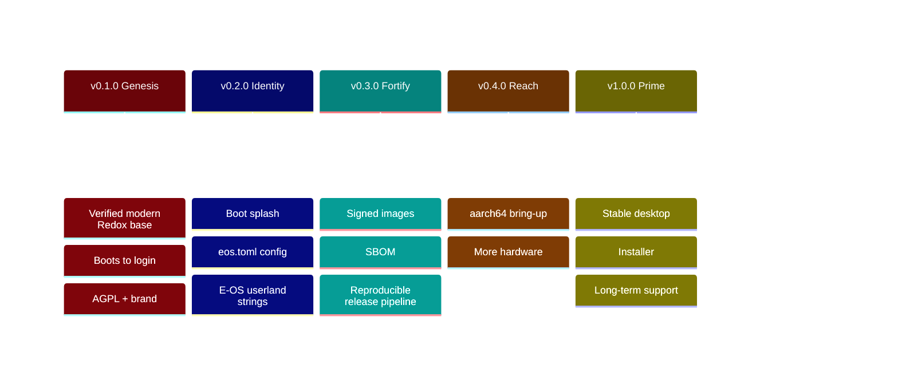

# 🗺️ E-OS Roadmap

> Living document — updated every release. Status keys: ✅ done · 🚧 in progress ·
> ⏳ planned · 💡 idea. Versions follow [SemVer](https://semver.org); each
> milestone maps to a numbered set of deliverables tracked in
> [CHANGELOG.md](CHANGELOG.md).

---

## ✅ v0.1.0 — "Genesis" (2026-06-06)

**Theme: a base that actually builds and boots.**

- ✅ `R-101` Re-base onto modern upstream Redox (`84d78137`, COSMIC desktop).
- ✅ `R-102` Reproducible WSL2 + Podman + QEMU/KVM build environment.
- ✅ `R-103` Diagnose & fix the headless `repo cook` TUI panic (`CI=1`).
- ✅ `R-104` Build + **verify boot** to login (`harddrive.img`).
- ✅ `R-105` Adopt **AGPL-3.0**; preserve Redox MIT attribution.
- ✅ `R-106` Brand & document the repository (this roadmap included).

---

## 🚧 v0.2.0 — "Identity" (target: 2026-07)

**Theme: E-OS looks and feels like E-OS.**

- 🚧 `R-201` Repository: full docs site, CI green, security hardening live.
- ✅ `R-202` Custom build config `config/x86_64/eos.toml` (E-OS desktop variant).
- ✅ `R-203` E-OS bootloader theming (red/black) — `"E-OS Bootloader"` banner +
  red-on-black, built from source (`patches/bootloader-eos-red-black.patch`).
- ✅ `R-204` Rebrand user-visible OS strings — `/etc/os-release`, `/etc/issue`,
  MOTD, and the **`eos login:`** console prompt (it was a hardcoded literal in
  `userutils`, **not** the kernel hostname — patched and built from source).
- ✅ `R-205` E-OS red/black login greeter + desktop wallpaper + launcher icon,
  built from source via the `orbdata` fork.
- 💡 `R-206` `eos` meta-package + first-boot welcome.

---

## ⏳ v0.3.0 — "Fortify" (target: 2026-08)

**Theme: supply-chain & release integrity.**

- ✅ `R-301` **Signed** release checksums — `release/SHA256SUMS` + a **minisign**
  signature (`release/SHA256SUMS.minisig`), public key `keys/eos-release.pub`;
  `.github/workflows/release.yml` attaches them (+ the SBOM) and re-signs on tag
  when `MINISIGN_SECRET_KEY` is configured.
- ✅ `R-302` **SBOM** (CycloneDX 1.5) generated per build — `scripts/gen-sbom.py`
  → `sbom/eos-<ver>-<arch>.cdx.json` (59 components, each with its source git ref
  + BLAKE3 hash; provenance includes the E-OS source forks).
- 🚧 `R-303` Reproducible, automated release pipeline (tag → image → release).
  **Source builds are reproducible** (recipes pinned to the `Gh0s777tt/eos-*` forks);
  the **release-artifact pipeline is live** (`release.yml`: tag → signed `SHA256SUMS`
  + SBOM + assets, [v0.1.0](https://github.com/Gh0s777tt/E-OS/releases/tag/v0.1.0)).
  The **CI image build works** — `build.yml` built a branded x86_64 image in GitHub
  Actions in **~12 min** (verified `eos login:`=1, `E-OS Bootloader`=4, `redox login:`=0;
  artifact uploaded). Remaining: wiring build → release on tag with byte-reproducible
  checksums (image timestamps differ run-to-run).
- ✅ `R-304` Security policy v2 — **threat model** (`docs/threat-model.md`) +
  **hardening guide** (`docs/hardening.md`), linked from `SECURITY.md`.
- 🚧 `R-305` Optional full-disk encryption (RedoxFS **AES-XTS-128**) — documented
  (`docs/encryption.md`) and tooling-verified (`redoxfs-mkfs --encrypt` succeeds,
  encrypted header confirmed); installer + bootloader support it and it is
  **recommended at install** ([docs/install.md](docs/install.md)). Default-on for a
  public image is an anti-pattern (baked password) — the installer's one-prompt
  encryption is the right first-class path.

---

## ⏳ v0.4.0 — "Reach" (target: 2026-10)

**Theme: beyond x86_64.**

- ✅ `R-401` **aarch64** bring-up — a full E-OS aarch64 desktop image builds with
  complete branding (`config/aarch64/eos.toml`) and the red/black E-OS bootloader
  boots under QEMU `virt` on `aarch64/UEFI`
  (`assets/screenshots/eos-aarch64-bootloader.png`).
- 🚧 `R-401b` Full aarch64 boot-to-login — the kernel boots but upstream `redoxfs`
  faults mounting the root (`synchronous_exception_at_el0` → `UnexpectedEof`).
  **Not disk-specific** — reproduced identically with NVMe *and* virtio-blk — so
  it's an upstream aarch64 `redoxfs`/`relibc` userspace bug, unrelated to E-OS
  branding (E-OS only changes images/strings). Root-caused (Data Abort, ESR `0x92000007`,
  translation fault L3 — unmapped page) + tracked: [docs/known-issues.md](docs/known-issues.md),
  issue [#2](https://github.com/Gh0s777tt/E-OS/issues/2).
- ⏳ `R-402` Expanded hardware/driver coverage.
- 💡 `R-403` Real-hardware test matrix.

---

## 💡 v1.0.0 — "Prime" (horizon)

**Theme: a daily-drivable desktop.**

- ✅ `R-1001` **Graphical installer** — E-OS ships `redox_installer_gui` (+ a TUI
  installer and the `redox_installer` engine); launch **Installer** from the desktop
  to install to a disk, with an optional encrypted root. See [docs/install.md](docs/install.md).
- 🚧 `R-1002` **LTS branch + stability policy** — the `lts/0.1` branch (pushed to
  both remotes) tracks the 0.1 “Genesis” line with security backports; documented
  in [SECURITY.md](SECURITY.md) + a [stability/ABI policy](docs/stability.md). The
  binding *stable ABI surface* lands at 1.0 (upstream-dependent).
- 🚧 `R-1003` **Package repository** — every build produces a signed (ed25519)
  `.pkgar` repo (`repo/<target>/` + `repo.toml`, ~58 pkgs/arch); documented
  ([docs/packages.md](docs/packages.md)) with a publish helper
  (`scripts/publish-repo.sh`). Public hosting + an app ecosystem are the remaining infra.
- ✅ `R-1004` **Documentation site** — mdBook built + deployed to **GitHub Pages**,
  **live at <https://gh0s777tt.github.io/E-OS/>** (`.github/workflows/pages.yml`).
  A *custom domain* is a one-step add (Settings → Pages) once a domain is owned.

---

### How to propose a change

Open an issue using the **Roadmap / Feature** template, or a discussion. Roadmap
items are reviewed each release. Anything shipped moves to [CHANGELOG.md](CHANGELOG.md).
