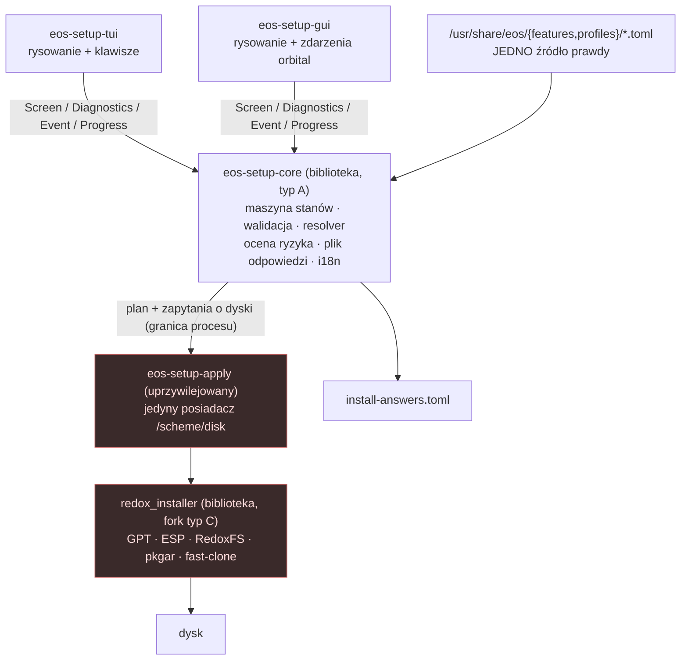

# ADR-0011 — Architektura kreatora instalacji: jeden silnik, jeden rdzeń, dwa frontendy

- **Status:** Propozycja — do zatwierdzenia. Nic z tego nie jest zaimplementowane.
  (`Proponowany` w rozumieniu [`README`](README.md).)
- **Data:** 2026-08-30
- **Dowód:** `recipes/core/installer/recipe.toml:5-6` · `recipes/gui/installer-gui/recipe.toml`
  (`same_as`, `COOKBOOK_CARGO_PATH="gui"`) · `recipes/gui/installer-gui/manifest:3` ·
  `repos.toml:106-116` (`type = "C"`), `:112` (`upstream`) · `mk/config.mk:53,172,176,185` ·
  `mk/fstools.mk:24` · `Cargo.toml:41-45,47` · `Cargo.lock:896-898` ·
  `src/bin/repo.rs:25,97,464` · `config/x86_64/eos.toml:7,800-841` ·
  `config/desktop.toml:3,20` · `config/desktop-minimal.toml:3` · `config/server.toml:3,14` ·
  `config/minimal.toml:3` · `config/base.toml:246-254` ·
  `recipes/groups/desktop/recipe.toml:13` · `docs/known-issues.md:388` · `docs/install.md:28` ·
  `scripts/install-smoke-drive.py:8,169-180,199-200` · `scripts/ci-install-smoke.sh:23,32` ·
  `scripts/ci-integrity.sh:113` · `scripts/eos-rebase-check.sh:22-29` ·
  `.gitlab-ci.yml:66-76` · `ROADMAP-v2.md:72,481,894-904,914-921,951-952,970-981` ·
  `CLAUDE.md` §11 typ C, §13 · pozycje `R-601`/`R-601d`/`R-601e`, `R-603a`–`R-603e`,
  `R-604a`–`R-604d`, `R-605`, `R-606`, `R-607a`/`R-607b`, `R-608a`, `R-609a`–`R-609d`,
  `R-610`, `R-612a`/`R-612c`, `R-615`, `R-711`, `R-815`, `R-902`, `R-904`, `R-1010`,
  `R-D08`, `R-D13`

**Skąd pochodzą cytaty z wnętrza instalatora.** W tym drzewie roboczym
`recipes/core/installer/` zawiera **wyłącznie `recipe.toml`** — katalogu `source/` nie ma.
Każdy cytat z `installer_tui.rs`, `installer.rs`, `disk_wrapper.rs` czy `gui/` pochodzi
z briefu autorytatywnego, który czytał rozwinięte drzewo budowania, i jest oznaczony
**[z briefu]**. Sprawdzenie na miejscu: `make fstools_fetch`, potem lektura
`recipes/core/installer/source`. Wszystko bez tego znacznika jest odczytane z tego drzewa.

**Legenda znaczników** (ta sama, co w dokumentach siostrzanych): **JEST** — działa dzisiaj,
z dowodem · **DO ZBUDOWANIA** — wykonalne bez nowego podsystemu · **NOWY PODSYSTEM** — wymaga
zbudowania czegoś, czego Redox nie ma · **NIEREALNE DZIŚ** — zależy od ekosystemu, którego nie
ma · **[NIEZWERYFIKOWANE]** — nie potwierdzone, z podaniem, co sprawdzić.

---

## Kontekst

### 1. Pytanie „nowy silnik czy rozszerzenie" jest już rozstrzygnięte przez drzewo

Podział na silnik i frontendy **istnieje i jest zbudowany**. Nie projektujemy go — mierzymy go.

| Fakt | Dowód |
|---|---|
| `redox_installer` jest **biblioteką** (`src/lib.rs`, `src/installer.rs`, `src/disk_wrapper.rs`) | **[z briefu]**. **Poprawka wobec pierwszej wersji tego wiersza**, która podawała „0.2.42" z `Cargo.lock:896-898` jako wersję silnika: to jest wersja **upstreamu** przypiętego przez `Cargo.toml:47` na rev `1c2534e44c68` — czyli **innego drzewa** niż to, z którego build robi binarkę (`mk/fstools.mk:24` → fork, rev `c8d32ad39e5c`, `recipes/core/installer/recipe.toml:5`). Wersja **forka** jest w tym drzewie **[NIEZWERYFIKOWANE]**. To jest dokładnie rozjazd opisany w Kontekst §5, więc nie wolno go zacierać własnym cytatem |
| Frontend budowania: `src/bin/installer.rs` — `redox_installer <diskpath.img> [--config=file.toml] [--write-bootloader[=PATH]] [--live]` | **[z briefu]** |
| Frontend tekstowy: `src/bin/installer_tui.rs`, binarka `redox_installer_tui` | **[z briefu]**; nazwa: `scripts/ci-install-smoke.sh:23`, `scripts/install-smoke-drive.py:200` |
| Frontend graficzny: **osobna skrzynka w podkatalogu `gui/`**, `redox_installer_gui`, z `redox_installer = { path = ".." }` | **[z briefu]**; potwierdzone w tym drzewie: `recipes/gui/installer-gui/recipe.toml` ma `same_as = "../../core/installer"` i `COOKBOOK_CARGO_PATH="gui" cookbook_cargo` — GUI jest budowane **z tego samego źródła**, z podkatalogu |
| GUI nie używa Slinta, iced ani egui — rysuje na prymitywach Redoksa | **[z briefu]**; zależności: `pkgar`, `pkgar-core`, `pkgar-keys`, `redox_syscall`, `libredox`, `toml` |
| Skrzynka ma **feature'y** rozdzielające warianty budowania **narzędzi hosta**: `INSTALLER_FEATURES=--no-default-features --features installer` | `mk/config.mk:185`, użyte w `mk/fstools.mk:24` — ale **wyłącznie wewnątrz `ifeq ($(FSTOOLS_NO_MOUNT),1)`**, a domyślnie `FSTOOLS_NO_MOUNT?=0` (`mk/config.mk:53`), więc w zwykłym budowaniu `INSTALLER_FEATURES` jest **puste** (`mk/config.mk:176`). **Co ten feature naprawdę gatuje — [NIEZWERYFIKOWANE]:** `Cargo.toml` skrzynki nie ma w tym drzewie, a nazwa nie jest dowodem. Wiersz nie niesie tezy o rozdziale silnik/frontend |
| Instalacja end-to-end **udowodniona 3× z rzędu** tym silnikiem — **pod QEMU/TCG, na aarch64, ścieżką TUI** | `R-601` (`U-176`). Zakres, bo bez niego to twierdzenie jest szersze niż pomiar (`CLAUDE.md` §2 reguła 2): `ROADMAP-v2.md:72` — *„udowodnione wyłącznie pod QEMU/TCG"*, na fizycznym firmware nie; `scripts/ci-install-smoke.sh:32` — *„only aarch64 is wired up"*; `ROADMAP-v2.md:481` — `R-601` udowodnił **ścieżkę TUI, nie GUI** |

Trzy frontendy nad jedną biblioteką. **Budowanie nowego silnika oznaczałoby wyrzucenie jedynego
dowodu instalacji, jaki projekt ma.**

### 2. Granica przecieka — i to jest konkretny dług, nie estetyka

- `installer_tui.rs` ma **własne** `disk_paths()` i `choose_disk()` **[z briefu]**. Logika wyboru
  celu — czyli operacji nieodwracalnej — żyje we frontendzie, nie w silniku.
- `disk_paths()` iteruje po schematach `disk*`, **pomija partycje** i zwraca **wyłącznie ścieżkę
  i rozmiar** **[z briefu]**. Nie ma modelu, numeru seryjnego, wykrycia obcych systemów.
- Na Linuksie `disk_paths` jest **pustą funkcją** — `fn disk_paths(_paths: &mut Vec<…>) {}`
  **[z briefu]**. TUI uruchomione na hoście nie wylistuje niczego.
- `choose_disk()` daje numerowane menu. To jest dosłownie `R-604`: *„whole-disk-erase hides
  behind a bare numeric menu … with no disk identification"*.
- Komentarz upstreamu w `installer_tui.rs:15-17` **[z briefu]** nazywa całą brakującą pracę:
  ```
  // 1. Linux: Implement disk listing, use "dd" to write into whole disk
  // 2. Allow partitioning to allow dual boot, possibly an integration with systemd-boot/grub
  // 3. Prompt everything (disk password, users, preconfigured packages, import from existing img)
  ```

**Konsekwencja:** GUI i TUI **mogą się rozjechać**, bo każde ma własną kopię reguł. Dziś oba mają
te same braki (`R-603`: oba klonują domyślne z `base.toml` i nie tworzą kont), więc rozjazd jeszcze
nie boli. Zaboli przy pierwszej poprawce zrobionej po jednej stronie.

### 3. Frontend graficzny prawdopodobnie **nie ma dziś prawa zobaczyć dysku**

To jest ustalenie z tego drzewa, nie z briefu, i zmienia rozkład decyzji.

| Element | Odczyt |
|---|---|
| Domyślne logowanie na pulpicie to `user`, bez hasła, w grupie `sudo` | hasło: `config/base.toml:246-249` (`[users.user]`, `password = ""`); grupa: `config/base.toml:252-254` (`[groups.sudo]`, `members = ["user"]`) — czyli **`240-254`**, nie `240-249`, jak podawał ten wiersz wcześniej: zakres urwany na 249 nie obejmuje wpisu o grupie, którym ten wiersz argumentuje. Potwierdzenie od strony użytkownika: `docs/install.md:28` |
| `installer-gui` uruchamia się z launchera jako `/usr/bin/redox_installer_gui`, **bez żadnego podniesienia uprawnień** | `recipes/gui/installer-gui/manifest:3` — brak `sudo`, brak shima |
| Przestrzeń schematów użytkownika `user` **nie zawiera `disk`** | `config/x86_64/eos.toml:800-841` (`[[files]]` → `/etc/login_schemes.toml`, `user_schemes.user`) — lista to `debug, event, memory, pipe, serio, irq, time, sys, rand, null, zero, log, icmp, tcp, udp, shm, chan, uds_stream, uds_dgram, file, display.vesa, display*, proc, pty, sudo, audio, orbital`. Dla porównania `user_schemes.root` = `["*"]` (`:803-804`) |
| Ścieżka TUI, ta udowodniona, jedzie **jako `root`** — nie przez `sudo` | **Poprawka faktu, bo poprzednia wersja tego wiersza cytowała nieaktualny docstring.** `scripts/install-smoke-drive.py:8` istotnie mówi *„`sudo redox_installer_tui`"*, ale **kod tego skryptu robi co innego**: `login()` (`:169-180`) loguje się jako **`root`** (`con.send("root")`, `:180`) z własnym uzasadnieniem — *„Root and `sudo` behave IDENTICALLY here … Root is used anyway because it removes one variable"* (`:170-176`) — a `run_install()` wysyła **gołe** `redox_installer_tui` bez `sudo` (`:199-200`). Docstring pliku jest zwietrzały wobec jego własnego kodu; drzewo wygrywa (`CLAUDE.md` §4.5). **Skutek dla argumentu:** kontrast wobec GUI jest **mocniejszy**, nie słabszy — udowodniona ścieżka jedzie z pełnymi uprawnieniami (`user_schemes.root` = `["*"]`), a GUI z launchera nie ma nawet `disk` |

**Przewidywanie, które da się obalić:** `redox_installer_gui` uruchomiony z launchera w sesji
`user` **nie wylistuje żadnego dysku**, bo `/scheme/disk` jest poza jego przestrzenią. To jest
kandydat na powód, dla którego `R-D08` — pełny przepływ *live → greeter → installer-gui →
instalacja* — **nigdy nie przeszedł od końca do końca**, mimo że `R-601` przeszedł trzy razy.
**Jak to sprawdzić (tanie):** rozruch live, uruchomienie ikony „Installer" i porównanie listy
dysków z listą po `sudo redox_installer_gui` z terminala. Jeżeli obie są puste — przyczyna leży
gdzie indziej; jeżeli różne — to jest ta przyczyna. **[NIEZWERYFIKOWANE]** do czasu tego przebiegu.

Ta niepewność nie blokuje decyzji: w obu wynikach granica uprawnień musi być zaprojektowana,
a nie odziedziczona po tym, kto akurat uruchomił binarkę.

### 4. Fork jest typu C, a kreator jest większy od silnika

`eos-installer` ma w `repos.toml:109` **`type = "C"`** — fork z łatkami. Reguła projektu jest
twarda (`CLAUDE.md` §11, zasada nadrzędna 3): *łatki muszą pozostać rebaseowalne*, małe,
tematyczne, każda z uzasadnieniem i statusem wobec upstreamu. Fork już niesie realny kod E-OS —
panel sieciowy w instalatorze (`R-902`, `U-132`, `eos-installer ed6eb7c`).

**Ta reguła jest dziś mierzona, nie egzekwowana — i to trzeba powiedzieć tu, a nie w przypisie.**
`scripts/eos-rebase-check.sh` **obejmuje `eos-installer`**: wybiera każdy wpis `[[repo]]`, który
ma pole `upstream` (`eos-rebase-check.sh:22-29`), bez filtrowania po `type`, a `eos-installer`
to pole ma (`repos.toml:112`). Ale zadanie CI, które go uruchamia, ma
**`allow_failure: true`** i rusza wyłącznie na `schedule`/`web` (`.gitlab-ci.yml:66-76`), więc
**nie potrafi przewrócić pipeline'u** — `CLAUDE.md` §13 wpisuje je jako ⚠️ doradcze. Wobec zasady
projektu (*kontrola, która nie może zawieść, nie jest kontrolą*) argument z rebaseowalności jest
tu **argumentem z dyscypliny, nie z bramki**. Decyzja D2 nie może się na tę bramkę powoływać jako
na egzekutora; powołuje się na nią jako na wykrywacz.

Zakres kreatora z [`installer-wizard.md`](../architecture/installer-wizard.md): jedenaście stanów
(S0–S10), walidacja z regułami odmowy, resolver profili i funkcji, ocena ryzyka, ekran różnicy,
warstwa i18n, plik odpowiedzi. Z [`installer-profiles.md`](../architecture/installer-profiles.md):
katalog funkcji, dziedziczenie z blokadami, walidator V-01…V-21, migracje schematu, model zaufania
dla importu. **To jest wielokrotność silnika.** Wsadzone do forka typu C zamienia go w typ A pod
cudzym adresem — dokładnie ten błąd, który `U-169` zmierzył i który kosztował projekt kliencką
weryfikację podpisu w `U-164`: *„leżała w repo, którego nikt nie traktował jak kodu"*.

### 5. Producent i konsument schematu konfiguracji to dziś dwa drzewa

- `Cargo.toml:47` ciąga `redox_installer` **z upstreamu i bez `rev`**; `Cargo.lock:896-898`
  przypina to na `1c2534e44c68`.
- `mk/fstools.mk:24` buduje binarkę z **forka**: `--path recipes/core/installer/source`,
  rev `c8d32ad39e5c` (`recipes/core/installer/recipe.toml:5-6`).
- `src/bin/repo.rs:25,97,464` **parsuje** konfigurację filesystemu upstreamowym
  `redox_installer::Config`, a fork ją **zapisuje**.
- Kontrola 6 w `scripts/ci-integrity.sh` sprawdza **receptury**, nie główny `Cargo.toml`
  (`ci-integrity.sh:113`; w pliku nie ma żadnego odwołania do `Cargo.toml`).

Komentarz w `Cargo.toml:44-45` opisuje tę samą klasę usterki dla `redox-pkg`: *„a field added on
one side simply did not exist on the other"*. Kreator **doda pola do tego schematu**, więc rozjazd
przestanie być teoretyczny. To sąsiaduje z `R-610`, ale nie jest tą samą pracą: `R-610` mówi
o zależnościach *wewnątrz* instalatora, tu chodzi o zależność *cookbooka od* instalatora.

### 6. Profile jako dane i plik odpowiedzi istnieją w połowie

| Klocek | Stan |
|---|---|
| Format profilu: TOML z `[general]`, `[packages]`, `[[files]]`, `[users.*]`, `[groups.*]` | **JEST** — `config/base.toml`, `config/x86_64/eos.toml` |
| Dziedziczenie i nadpisywanie: `include = [...]`, **cztery skoki `include`, pięć plików** (wcześniej stało tu „trzy poziomy" — łańcuch obok ma cztery strzałki, więc liczba przeczyła własnemu dowodowi) | **JEST** — `config/x86_64/eos.toml:7` → `config/desktop.toml:3` → `desktop-minimal.toml:3` **i** `server.toml:3` → `minimal.toml:3` → `base.toml` (jedyny bez `include`). Zmierzone: `grep -n '^include'` na każdym z tych plików |
| Instalacja nienadzorowana sterowana plikiem | **JEST** — `redox_installer <diskpath> --config=file.toml` **[z briefu]**, `docs/install.md` §3 |
| Pominięcie zapisu GPT | **JEST** — `--skip-partition` / `general.skip_partitions` **[z briefu]** |
| Warstwa metadanych: opis w języku naturalnym, skutki, zależności, konflikty, znaczenie dla modelu zagrożeń, i18n, ocena bezpieczeństwa | **BRAK** |
| Semantyka profili Gamer / Business / Ghost | **BRAK** — w `config/` nie ma takich plików |

Jedna pułapka jest zmierzona i musi być w tej decyzji: **`include` scala pliki, nie decyzje.**
`docs/known-issues.md:388` opisuje `U-078`: `Config::merge` robi `self.files.extend(other_files)`
bez deduplikacji, więc `desktop.toml`, włączając równocześnie `desktop-minimal.toml` **i**
`server.toml`, wpuścił z powrotem `inputd -A 2` z `minimal.toml` i **ukradł ekran greeterowi**.
Naprawiono nie zmianą mechanizmu, tylko przypięciem wpisu w konfiguracji korzenia, bo ta jest
scalana ostatnia. Mechanizm dziedziczenia, na którym zbudujemy profile, ma udokumentowany tryb
porażki: **wygrywa ostatni wpis, a kolejność wynika z kolejności `include`, nie z intencji.**

---

## Decyzja

### D0 — Nie budujemy nowego silnika instalacji

**Rozszerzamy `redox_installer`.** Silnik przeszedł łańcuch pięciu usterek, z których każda
ukrywała następną (`R-F19` → `R-F21` → `R-F22` → `R-F24`), i dopiero po nim `R-601` daje
*partycja → instalacja → reboot → login* trzy razy z rzędu. Wyjściem kreatora jest ten sam
`config.toml`, który silnik już przyjmuje.
**Znacznik: JEST** (silnik), **DO ZBUDOWANIA** (rozszerzenia poniżej).

### D1 — Trzy warstwy i reguła graniczna



**Reguła graniczna, po której da się sprawdzić, czy kod leży dobrze:**

> Jeżeli usunięcie frontendu zmienia **wynik instalacji**, reguła jest w złym miejscu.
> Frontend wolno usunąć w całości i zastąpić plikiem odpowiedzi — wynik ma być identyczny.

Rozdział obowiązków:

| Warstwa | Co należy | Znacznik |
|---|---|---|
| **T1 — silnik** (`redox_installer`, fork typ C) | wyliczanie dysków; odczyt geometrii i **rzeczywistego** rozmiaru bloku; odczyt istniejącej GPT/MBR i sygnatur; zapis GPT/ESP/RedoxFS; pkgar; fast-clone; transakcja i dziennik na ESP; przyjęcie `--config` / `--answers` | częściowo **JEST**, reszta **DO ZBUDOWANIA** |
| **T2 — rdzeń** (`eos-setup-core`, nowy komponent typ A) | maszyna stanów i kolejność ekranów; walidacja i reguły odmowy; resolver profili i funkcji z blokadami; ocena ryzyka i różnica z S8; budowa pliku odpowiedzi i wygenerowanego fragmentu `config.toml`; katalog tekstów | **DO ZBUDOWANIA** (`L`) |
| **T3 — frontend** (`eos-setup-tui`, `eos-setup-gui`) | rysowanie, wejście, fokus, układ. **Zero reguł.** | **DO ZBUDOWANIA** (`L`), obie binarki istnieją dziś w innej postaci |

**Pierwszy dług do spłacenia w T1:** `disk_paths()` i `choose_disk()` wracają z binarki TUI do
biblioteki. Łatka jest mała, tematyczna i **upstreamowalna**, więc mieści się w regule typu C —
a przy okazji ułatwia upstreamowi jego własne TODO 1 (*„Linux: Implement disk listing"*,
`installer_tui.rs:15` **[z briefu]**), bo dziś ta funkcja jest na Linuksie pusta i siedzi
w binarce, a nie w bibliotece.

> **To ma już numer i nie wolno mu nadać drugiego: `R-603a`** (`ROADMAP-v2.md:894`, słowo w słowo:
> *„Przeniesienie logiki wyboru dysku z frontendu do biblioteki. Dziś `installer_tui` ma własne
> `disk_paths()` i `choose_disk()`…"*), mapowane tak samo przez
> [`installer-wizard.md`](../architecture/installer-wizard.md) §15 poz. 1c. Odczyt **rzeczywistego
> rozmiaru bloku** to `R-607a` (`ROADMAP-v2.md:973`), a **identyfikacja dysku** na ekranie —
> `R-604a` (`:970`). Pełne przypięcie: sekcja *Przypięcie do roadmapy* niżej.

### D2 — Rdzeń i frontendy nie mieszkają w forku

**`eos-setup` jest nowym komponentem typu A** w repozytorium E-OS (jak `eos-control`,
`eos-guard`), z trzema skrzynkami: `eos-setup-core` (biblioteka), `eos-setup-tui`,
`eos-setup-gui`. Zależy od `redox_installer` **przypiętego po `rev`**, jak każdy fork.

Uzasadnienie jest regulaminowe i mierzalne, nie estetyczne: kod kreatora podlega pełnym
standardom (`CLAUDE.md` §12 typ A — kompilacja → integracja → runtime z kontrolą negatywną →
dokumentacja → `CHANGELOG` → pin), a kod w forku typu C **nie podlega** (ADR-0003: bramki
obejmują wyłącznie kod należący do E-OS). Wsadzenie 20× większego od silnika kreatora do forka
oznaczałoby, że największy nowy komponent projektu nie przechodzi przez żadną bramkę jakości.

**Do forka trafiają wyłącznie łatki, które da się rebaseować i które mają sens dla upstreamu:**
wyniesienie wyliczania dysków do biblioteki (`R-603a`), odczyt realnego rozmiaru bloku
(`R-607a`), odwrócenie kolejności zapisu ESP/root
([`installer.md`](../architecture/installer.md) §6.2 — `R-612a`), `--answers` (`R-609b`),
dziennik instalacji na ESP (`R-612c`). Każda z uzasadnieniem i statusem wobec upstreamu.
**Znacznik: DO ZBUDOWANIA** (`L`) — sam komponent `eos-setup` nie istnieje; wzorzec komponentu
typu A **JEST** (`eos-control`, `eos-guard`, `CLAUDE.md` §11 typ A). Egzekutor rebaseowalności
łatek jest **doradczy**, nie blokujący — patrz Kontekst §4.

### D3 — Frontendy to **dwie binarki**, nie jedna z przełącznikiem

[`installer-wizard.md`](../architecture/installer-wizard.md) §2.3 przewiduje jedną binarkę
`eos-setup` z `--frontend=tui|gui-headless`. **Rozstrzygam inaczej, i to jest zmiana wobec
tamtego tekstu.**

1. **Kontrola musi móc zawieść.** Bramka parytetu porównująca dwa tryby jednej binarki może
   przechodzić dlatego, że oba tryby wchodzą w ten sam kod, podczas gdy realne frontendy się
   rozjeżdżają. Bramka porównująca **dwie osobne binarki, te same, które trafiają do obrazu**,
   nie ma tego trybu fałszywego zaliczenia.
2. **Ścieżka tekstowa nie może zależeć od stosu graficznego.** Jedna binarka linkująca orbclient
   wciąga display do instalacji headless na konsoli szeregowej — dokładnie tej, którą prowadzi
   `R-601`. Dzisiejszy podział (`gui/` jako osobna skrzynka) jest pod tym względem poprawny
   i zostaje.

**Znacznik: dwie osobne skrzynki frontendowe — JEST** (`recipes/gui/installer-gui/recipe.toml`
buduje `gui/` jako oddzielny cel przez `COOKBOOK_CARGO_PATH="gui"`; `U-132` odnotowuje, że GUI
*„is a separate package, not a workspace member, so it needs its own check"*).
**Przebudowa obu na rdzeń: DO ZBUDOWANIA** (`L`).

### D4 — Protokół jest kontraktem danych; proces rozdzielamy tam, gdzie to coś kupuje

Wiadomości z [`installer-wizard.md`](../architecture/installer-wizard.md) §2.2 — `Screen`,
`Diagnostics`, `Event`, `Progress` — są **typami w `eos-setup-core`** z serializacją. Frontend
linkuje rdzeń w tym samym procesie.

**Granica procesu leży gdzie indziej, niż zakłada tamten dokument:** nie między frontendem
a rdzeniem, tylko między parą (frontend + rdzeń) a **uprzywilejowanym `eos-setup-apply`**.
Argument o mniejszych uprawnieniach GUI wobec rdzenia dziś **nie jest prawdziwy** — nie ma
piaskownicy (znalezisko `C-5`), a `contain` jest w obrazie wyłączony
(`config/server.toml:14`: `#contain = {} # needs to update dependencies`). Rozdzielenie procesów
bez izolacji kupuje serializację, nie ochronę. Deklarowanie inaczej byłoby ozdobą.

**Co protokół kupuje na pewno:** zapis i odtworzenie przebiegu (`--record` / `--replay`), czyli
materiał, na którym stoi bramka parytetu (D5) i test trybu nienadzorowanego.
**Znacznik: DO ZBUDOWANIA** (`M`). Prawdziwa piaskownica dla frontendu: **NOWY PODSYSTEM**,
ta sama praca co `R-1010` / krok 10 `docs/plan.md` (za [`installer-profiles.md`](../architecture/installer-profiles.md) §8 poz. 8).

### D5 — Parytet jest bramką, nie deklaracją

**Ta bramka ma już pozycję w rejestrze: `R-601d`** (`ROADMAP-v2.md:902` — *„Bramka parytetu
GUI ↔ TUI: oba frontendy muszą pokrywać ten sam zbiór stanów"*, `[P2·S·🖥️]`), tak samo nazwana
przez [`installer-wizard.md`](../architecture/installer-wizard.md) §2.3 i §15 poz. 1b.
Pierwsza wersja tej decyzji opisywała bramkę bez numeru i przypinała ją wyłącznie do `R-D08` —
czyli do jej **warunku wstępnego**, a nie do niej samej. To jest dokładnie sposób, w jaki jedna
praca dostaje dwie nazwy; poprawione tutaj i w tabeli przypięcia.

**Definicja operacyjna:** ten sam plik odpowiedzi przepuszczony przez `eos-setup-tui` i przez
`eos-setup-gui` produkuje **bajtowo identyczny** wygenerowany `config.toml` **oraz identyczną
listę `Diagnostics`**.

**Jak ta kontrola zawodzi — trzy tryby, każdy z odpowiedzią:**

| Tryb porażki | Odpowiedź w projekcie |
|---|---|
| GUI dokłada własną walidację po swojej stronie (kuszące, bo szybsze) — `config.toml` zgodny, ostrzeżenia różne | bramka porównuje **także `Diagnostics`**, nie tylko wyjściowy TOML |
| Frontend milcząco pomija kontrolkę, której nie umie narysować | rdzeń odrzuca ekran, w którym frontend nie potwierdził wyrenderowania wszystkich kontrolek o poziomie *obowiązkowa* |
| Bramka zielona, bo ścieżka GUI nigdy nie została uruchomiona na żywo | **`R-D08` jest warunkiem wstępnym.** Dopóki przepływ *live → greeter → installer-gui → instalacja* nie przeszedł ani razu, parytet dokumentuje zgodność z czymś, czego nikt nie uruchomił |

**Znacznik: DO ZBUDOWANIA** (`S`) — pozycja `R-601d`; warunek wstępny `R-D08` osobno.

### D6 — Granica uprawnień: `eos-setup-apply`, wzorowany na `eos-netcfg`

Projekt ma już zweryfikowany na urządzeniu wzorzec: GUI nigdy nie działa jako root, a pracę
uprzywilejowaną robi wąski shim — `eos-netcfg` (i wcześniej `eos-power`), `R-902`, `U-112`/`U-113`.
Kreator idzie tą samą drogą.

`eos-setup-apply` jest **jedynym** posiadaczem `/scheme/disk` i wystawia **wyliczone** operacje:
`list_disks`, `probe_disk`, `apply(plan)`, `journal_read`. Rozpoznanie dysków leży po tej samej
stronie co zapis, bo `disk` nie jest w przestrzeni użytkownika (`config/x86_64/eos.toml:800-841`)
— frontend nie mógłby wylistować dysków, nawet gdyby chciał.

**Czego ten podział NIE daje, i trzeba to napisać:** `sudo` jest w przestrzeni użytkownika,
a domyślny `user` jest w grupie `sudo` (`config/base.toml:252-254`), więc lokalny użytkownik
i tak może zostać rootem. Wartość shima polega na tym, że **kod interfejsu i reguł nie działa
jako root domyślnie**, a nie na tym, że użytkownik nie może uzyskać roota.
**Znacznik: DO ZBUDOWANIA** (`M`); wzorzec **JEST**.

### D7 — Profile są danymi i rozszerzają istniejący format, nie zakładają drugiego

Format profilu, dziedziczenie i plik odpowiedzi **już są** (Kontekst §6). Budujemy **brakującą
warstwę metadanych** — opis, skutki, zależności, konflikty, `stage`, `threat`, `cost`, i18n —
w plikach TOML w tej samej gramatyce, wg schematu z
[`installer-profiles.md`](../architecture/installer-profiles.md).

**Dwa źródła prawdy tolerujemy w dokładnie jednym miejscu i z jawnym powodem:** katalog funkcji
i profile użytkownika (`/usr/share/eos/{features,profiles}/`) są **osobnymi plikami** od
`config/*.toml`, bo `config/*.toml` opisuje **obraz do zbudowania**, a profile opisują **wybór
przy instalacji**. Rozjazd między nimi jest zamykany strukturalnie: wyjściem resolvera jest
**wygenerowany fragment** `config.toml`, sklejany z konfiguracją obrazu — jedno miejsce, w którym
gramatyka funkcji tłumaczy się na `[general]`/`[packages]`/`[[files]]`/`[users.*]`
([`installer-profiles.md`](../architecture/installer-profiles.md) §7.4).

**Ostrzeżenie wynikające z `U-078`, wiążące dla resolvera:** dziedziczenie w `include` scala
**pliki**, a wygrywa **ostatni** wpis (`docs/known-issues.md:388`). Resolver profili scala
**decyzje** i musi mieć blokady (`lock`) oraz deterministyczną, **udokumentowaną w wyjściu**
kolejność. Reguła kontrolna: dla każdej rozstrzygniętej pozycji plik odpowiedzi zapisuje
**pochodzenie** (`source`), więc „skąd się wzięła ta wartość" jest odpowiedzią z danych,
a nie ze śledztwa.
**Znacznik: format JEST · dziedziczenie JEST · warstwa metadanych i resolver DO ZBUDOWANIA (`L`).**

### D8 — Plik odpowiedzi rozszerza `--config`, nie zastępuje go, i nie wykonuje kodu

- Nowa sekcja **`[setup]`** obok istniejących, tak żeby stary plik dalej działał: `schema_version`,
  `profile`, `features`, `target`, `destructive_consent`, `identity`, `encryption`.
- **Sekrety nie trafiają do pliku.** `encryption.password_source` = `prompt` (domyślnie) |
  `file:<ścieżka>` | `stdin`. Dzisiejsze `encrypt_disk = "hasło"` **[z briefu]** zostaje dla
  zgodności i jest w kreatorze oznaczone jako niebezpieczne przy zapisie.
- **Zgoda na destrukcję musi nazwać cel** — `erase` + `size_bytes` jako kontrola. `--assume-yes`
  bez tej sekcji jest odrzucane; niezgodność `size_bytes` jest odmową. Flaga zgody, która nie
  nazywa celu, jest flagą „skasuj cokolwiek znajdziesz".
- **Bez `%pre`/`%post`.** Skrypt w pliku odpowiedzi zamienia dane w kod z uprawnieniami
  instalatora i unieważnia sens podpisywania profili: podpisany profil z dowolnym skryptem to
  podpisane zdalne wykonanie kodu.
- **Każdy stan maszyny musi dać się wyrazić w pliku odpowiedzi.** Stan, którego nie da się
  wyrazić, nie może istnieć — inaczej tryb nienadzorowany jest kłamstwem.

**Znacznik: JEST** (`--config` jako instalacja nienadzorowana) **· DO ZBUDOWANIA** (`M`) dla
sekcji `[setup]`, zgody i zapisu pliku z przebiegu.

### D9 — Migracja przez nazwę binarki, żeby nie stracić jedynego dowodu

`scripts/install-smoke-drive.py:200` wysyła literał `redox_installer_tui`, a
`scripts/ci-install-smoke.sh:23` ma nad tym komentarz o **dokładnej** nazwie. To jest jedyny
dowód instalacji, jaki projekt ma, i jest dowodem **jednej architektury** (`ci-install-smoke.sh:32`:
*„only aarch64 is wired up"*).

Kolejność wdrożenia jest więc wymuszona:

1. `eos-setup-tui` wchodzi do obrazu, a `/usr/bin/redox_installer_tui` zostaje **dowiązaniem**
   do niego przez jedno wydanie. Harness nie zmienia się i **musi dalej przechodzić 3×**.
2. Dopiero po tym harness jest przepinany na nową nazwę i przebieg powtarzany 3×.
3. Dwie równoległe ścieżki instalacji (stara i nowa) **nie jadą jednocześnie w obrazie**.
   Sens dowiązania polega na tym, że rozjazd objawia się jako czerwony harness, a nie jako dwie
   żywe implementacje.

**Znacznik: DO ZBUDOWANIA** (`S`).

### D10 — Rozbieżności między dokumentami siostrzanymi, rozstrzygnięte tutaj

Trzy miejsca, w których specyfikacje mówią różne rzeczy. Zostawienie tego czytelnikowi byłoby
założeniem drugiego źródła prawdy w dokumentacji o jednym źródle prawdy.

| Co | `installer-wizard.md` | `installer-profiles.md` | Rozstrzygnięcie |
|---|---|---|---|
| Ścieżka danych | `/usr/share/eos/setup/features/*.toml`, `/profiles/*.toml` (§2.4) | `/usr/share/eos/features/<id>.toml`, `/usr/share/eos/profiles/<id>.toml` (§2) | **`/usr/share/eos/{features,profiles}/`** — model danych jest autorytetem dla ścieżek danych. Poprawić `installer-wizard.md` §2.4 |
| Plik odpowiedzi | `/var/log/eos-setup/answers.toml` (§2.4) | `/var/lib/eos/install-answers.toml`, kopia w `/etc/eos/install-answers.toml` (§2) | **`/var/lib/eos/install-answers.toml`** w przebiegu, **`/etc/eos/install-answers.toml`** w systemie zainstalowanym. `/var/log/eos-setup/run-<ts>.log` zostaje dziennikiem przebiegu, nie plikiem odpowiedzi. Poprawić `installer-wizard.md` §2.4 |
| Frontendy | jedna binarka `eos-setup` z `--frontend=` (§2.3–2.4) | „kreator TUI / GUI", bez rozstrzygnięcia | **Dwie binarki** — D3. Poprawić `installer-wizard.md` §2.3–2.4 |

**D10 nie jest zdolnością, więc nie nosi znacznika — jest poleceniem naprawy dokumentu.**
Trzy rozbieżności są **nadal otwarte w tym drzewie**, zmierzone przy przeglądzie:
`installer-wizard.md:226` wciąż podaje `/usr/share/eos/setup/features/*.toml`, `:228` —
`/var/log/eos-setup/answers.toml`, a `:204-205` wciąż opisuje **jedną** binarkę z
`--frontend=tui` / `--frontend=gui-headless`. Dopóki tamten plik nie zostanie poprawiony,
to rozstrzygnięcie jest **zapisane, a nie wykonane**, i czytelnik `installer-wizard.md`
dostanie starą odpowiedź.

---

## Odrzucone warianty

**1. Nowy silnik instalacji, pisany od zera.**
Odrzucony pomiarem, nie preferencją: `R-601` jest jedynym dowodem *partycja → instalacja → reboot
→ login* w historii projektu i został osiągnięty **po** przejściu łańcucha `R-F19` → `R-F21` →
`R-F22` → `R-F24`, w którym każda usterka ukrywała następną. Nowy silnik zaczyna ten łańcuch od
początku, na kodzie, którego nikt nie uruchomił. Zysk — „czysta architektura" — jest właśnie tym,
co daje D1 bez wyrzucania dowodu.

**2. Osobne implementacje logiki w GUI i w TUI.**
To jest **stan dzisiejszy**, nie wariant hipotetyczny: `installer_tui.rs` ma własne `disk_paths()`
i `choose_disk()` **[z briefu]**, a GUI ma swoje. Odrzucony, bo `R-603` opisuje jedną usterkę
w dwóch miejscach (*„both GUI and TUI clone base.toml defaults and create no accounts"*), więc
naprawa jest podwójna, a rozjazd — kwestią czasu. Precedens kosztu jest w drzewie: `R-608`
istnieje wyłącznie dlatego, że `docs/install.md` §2 opisuje tworzenie kont i wybór pakietów,
których binarka nie robi. Dwa źródła prawdy zawsze się rozjadą; pytanie brzmi tylko, kiedy ktoś
to zauważy.

**3. Konfiguracja i opisy zaszyte w kodzie kreatora.**
Odrzucone przez ten sam precedens `R-608` i przez `U-126`, gdzie twierdzenie o istnieniu bramki
i18n okazało się zmyślone, bo nie miało nośnika w danych. Kod jako źródło opisów oznacza, że
dokumentacja, TUI, GUI i tryb nienadzorowany mają **cztery** kopie tej samej treści.
**Wybrane zamiast:** dane w TOML-u + generowanie dokumentacji z tego samego pliku, co zmienia
kryterium ukończenia `R-608` z *„dokument poprawiony"* na *„dokument nie może się rozjechać"*.
Koszt policzony jawnie: TOML nie ma języka schematu, więc **cała walidacja to ręcznie napisany
kod w Ruście** ([`installer-profiles.md`](../architecture/installer-profiles.md) §1.4, §4.4).

**4. Jeden frontend zamiast dwóch — wariant „tylko GUI".**
Odrzucony na twardych faktach: ścieżka GUI **nigdy nie przeszła od końca do końca** (`R-D08`),
`R-601` prowadzi TUI, a `docs/install.md` §2 mimo to nazywa GUI *„recommended"*. Do tego GUI nie
działa bez myszy na laptopie — nie ma magistrali I2C, więc nie ma I2C-HID (`R-916`, `V2-N01`) —
i prawdopodobnie nie widzi dziś dysków w sesji użytkownika (Kontekst §3). Instalacja headless
i serwerowa znika razem z TUI.

**5. Jeden frontend zamiast dwóch — wariant „tylko TUI".**
Odrzucony, choć jest kuszący: to ścieżka udowodniona i tania w utrzymaniu. Ale `installer-gui`
jest już w obrazie (`config/desktop.toml:20`, `recipes/groups/desktop/recipe.toml:13`), jest
pozycją w launcherze i jedyną ścieżką, którą użytkownik pulpitu znajdzie sam. Usunięcie go nie
jest oszczędnością, tylko **regresją produktu** — i wyrzuceniem panelu sieciowego dostarczonego
w `R-902`/`U-132`. Cena utrzymania dwóch: bramka parytetu (D5), i to jest tańsze niż jeden
frontend, którego nikt nie użyje.

**6. Wspólna abstrakcja rysowania — jeden kod interfejsu renderujący i do terminala, i do
orbitala.**
Kusi, bo znosi parytet z definicji. Odrzucony: TUI i GUI mają nieprzystawalne modele wejścia
(kolejność Tab i fokus w GUI to **[NIEZWERYFIKOWANE]**, N10 w `installer-wizard.md`), a
abstrakcja, która obsłuży oba, jest własnym toolkitem — **NOWY PODSYSTEM** w miejscu, w którym
projekt potrzebuje ekranu wyboru dysku. Parytet uzyskujemy tam, gdzie jest tani: na poziomie
**danych** (ten sam `config.toml`, te same `Diagnostics`), nie pikseli.

**7. Rdzeń kreatora wewnątrz forka `eos-installer`.**
Najprostszy wariant „technicznie" i najgorszy regulaminowo. `repos.toml:109` mówi `type = "C"`,
a `CLAUDE.md` §11 wymaga rebaseowalnych łatek; kreator jest wielokrotnością silnika, więc fork
przestałby być forkiem. `U-169` zmierzył, co się dzieje, gdy realny kod leży w repo opisanym jako
lustro: *„dokładnie tak zginęła kliencka weryfikacja podpisu w `U-164`"*. Dodatkowo ADR-0003
mówi wprost, że bramki jakości nie obejmują kodu vendorowanego — największy nowy komponent
projektu przechodziłby wtedy przez zero bramek.

**8. Frontendy zostają w forku, a tylko rdzeń wychodzi do typu A.**
Odrzucony po policzeniu, gdzie leży zmienność: cały ruch (11 ekranów, i18n, dostępność, ocena
ryzyka) jest **we frontendach**, więc to one generowałyby dywergencję w forku. Zostawienie ich
tam daje najgorszy podział: koszt typu C tam, gdzie zmian jest najwięcej.
**Cena tej decyzji, powiedziana wprost:** panel sieciowy z `R-902` (`eos-installer ed6eb7c`,
`U-132`) mieszka w GUI forka i przy przeniesieniu frontendu **trzeba go przenieść razem
z nim albo stracić**. To jest realna, policzalna praca, nie przypis.

**9. Rdzeń jako demon systemowy z rozdzieleniem uprawnień od pierwszego dnia.**
Odrzucony jako obietnica bez pokrycia: nie ma piaskownicy (`C-5`), `contain` w obrazie jest
wyłączony (`config/server.toml:14`), a `sudo` i tak jest w przestrzeni użytkownika. Rozdzielenie
procesów bez izolacji daje **serializację nazwaną bezpieczeństwem**. Wybrane: jedna granica
procesu tam, gdzie realnie coś zmienia (`eos-setup-apply`, D6), a demon — po `R-1010`.

**10. Drugi format danych obok `config/*.toml` (YAML/JSON) albo konfiguracja wykonywalna.**
YAML odrzucony na powierzchni ataku i utrzymaniu zależności, nie na estetyce (profil bywa
pobrany z sieci; `serde_yaml` jest zarchiwizowany, co koliduje z `cargo-deny check advisories`
w CI). JSON — brak komentarzy w projekcie, w którym uzasadnienie mieszka w komentarzu
(`config/x86_64/eos.toml` ma nad dwuliniowym wpisem 12 linii uzasadnienia). Rust/Dhall/Starlark
odrzucone jako rozwiązanie odwrotne do problemu: profil ma być danymi właśnie po to, żeby nie mógł
nic wykonać.

**11. Skrypty `%pre`/`%post` w pliku odpowiedzi (pełny kickstart).**
Odrzucone — D8. Podpisany profil z dowolnym skryptem to podpisane zdalne wykonanie kodu na cudzej
maszynie, przy instalacji, z uprawnieniami instalatora.

---

## Czego ta architektura NIE robi i przed czym NIE chroni

Sekcja dopisana przy przeglądzie adwersaryjnym: dokumenty siostrzane mają ją wszystkie
([`ADR-0007`](0007-bootloader-i-nosnik-instalacyjny.md) §*Czego to NIE robi*,
[`ADR-0008`](0008-system-plikow-i-uklad-partycji.md), [`ADR-0009`](0009-mechanizm-aktualizacji-systemu.md),
[`installer-wizard.md`](../architecture/installer-wizard.md) §0.1), a ten ADR miał ją rozsypaną
po pięciu miejscach — czyli w praktyce nie miał jej wcale. Podział na warstwy jest **decyzją
o tym, gdzie mieszka kod**. Nie jest mechanizmem bezpieczeństwa i nie wolno go tak czytać.

**Nie chroni przed lokalnym użytkownikiem.** `sudo` jest w przestrzeni schematów użytkownika
`user`, a domyślny `user` jest w grupie `sudo` (`config/x86_64/eos.toml:838`,
`config/base.toml:252-254`), więc każdy zalogowany może zostać rootem — a `U-161` zmierzył, że
root i `sudo` na tym systemie **padają identycznie**. `eos-setup-apply` (D6) przesuwa domyślne
uprawnienia **kodu interfejsu**, nie granicę władzy użytkownika.

**Nie daje izolacji między frontendem a rdzeniem.** Piaskownicy nie ma (`C-5`, cytowane
**za briefem**), a `contain` jest w obrazie zakomentowany (`config/server.toml:14`). Granica
procesu z D4 kupuje **serializację i możliwość nagrania przebiegu**, nie ochronę; deklarowanie
inaczej byłoby ozdobą (D4, wariant odrzucony 9).

**Nie chroni przed złośliwym profilem.** Import profilu z sieci nie ma izolacji do czasu
`R-1010`, weryfikacja podpisu profilu **na urządzeniu** to `R-603e`, a bez keyringu z
unieważnianiem (`R-711`) każdy raz zaufany podpis jest **nieodwoływalny**. Do tego czasu ochroną
jest wyłącznie to, że profil jest **danymi** — nie może nic wykonać (D8, wariant 11).

**Nie chroni przed zapisem na niewłaściwy dysk w dwóch konkretnych przypadkach.** Po pierwsze
**4Kn**: `block_size` jest stałą `512` (`disk_wrapper.rs:28` **[z briefu]**), więc gałąź
`_ => bail!` w `installer.rs:604` **[z briefu]** jest **martwym kodem** — instalator nie odmówi,
tylko policzy geometrię GPT na złym rozmiarze sektora. Ten ADR tego **nie naprawia**; przypina
do `R-607a`.
Po drugie **dwa identyczne dyski**: bez `R-815` identyfikatorem celu jest ścieżka schematu
i rozmiar, więc dwa egzemplarze tego samego modelu są **nierozróżnialne** — czyli bariera
z `R-604` może być przejęta świadomie i mimo to skasować niewłaściwy dysk. To musi stać na
ekranie, a nie w tym dokumencie.

**Nie chroni przed przerwaniem instalacji.** Transakcja z dziennikiem na ESP i wznawialność to
`R-612a`–`R-612d`, poza zakresem tej decyzji. Dziś przerwanie w połowie zostawia dysk w stanie
nieokreślonym, a `fsck` dla RedoxFS **nie istnieje** (`R-615`, **NOWY PODSYSTEM**), więc
odpowiedzią na uszkodzenie jest reinstalacja.

**Nie zostawia śladu, któremu można ufać po fakcie.** Trwałego dziennika audytu nie ma (`C-9`,
za briefem). `/etc/eos/install-answers.toml` jest zapisem *co i dlaczego wybrano*, ale
przeciwnik z fizycznym dostępem podmieni go w zainstalowanym systemie
([`installer-profiles.md`](../architecture/installer-profiles.md), linia 665) — to jest zapis
dla właściciela maszyny, nie dowód wobec osoby trzeciej.

**Nie łapie reguły dodanej po obu stronach jednakowo.** Bramka parytetu (D5) wykrywa **rozjazd**
frontendów, nie **błąd wspólny**. Frontend, który dostanie tę samą złą walidację w GUI i w TUI,
przechodzi bramkę na zielono. To jest znany, nieszczelny brzeg — wypisany też w *Jak ta
architektura zawodzi* poz. 2.

**Nie zamyka rozjazdu producenta i konsumenta schematu.** `Cargo.toml:47` ciągnie
`redox_installer` z upstreamu **bez `rev`**, a kontrola 6 w `scripts/ci-integrity.sh:113`
sprawdza **receptury**, nie główny `Cargo.toml` (w pliku nie ma do niego żadnego odwołania).
Pierwsze pole dodane przez kreator do `Config` może istnieć po jednej stronie i nie istnieć po
drugiej — dokładnie jak opisuje komentarz `Cargo.toml:41-45` dla `redox-pkg`.

**Nie dotyczy x86_64.** Cały dowód instalacji jest aarch64 i wyłącznie pod QEMU/TCG
(`scripts/ci-install-smoke.sh:32`, `ROADMAP-v2.md:72`). Twierdzenia tego ADR-a o zachowaniu
silnika na metalu nie mają pokrycia w żadnym przebiegu.

**Nie wprowadza — i nie udaje, że wprowadza — ani jednego klocka z linuksowego słownika
zamówienia.** LUKS2, dm-crypt, LVM, RAID z LVM, btrfs, ZFS, XFS, ext4, ostree, systemd-sysupdate,
systemd-boot, GRUB2, shim+MOK, TPM2, FIDO2, kernel live-patching: **żadnego z nich na Redoksie
nie ma**, ten ADR żadnego nie dodaje i żaden nie jest tu podmieniony po cichu na coś innego.
Jedyne wystąpienie `systemd-boot`/`grub` w tym dokumencie to **dosłowny cytat TODO upstreamu**
z `installer_tui.rs:15-17`, a nie plan. Gdzie te rzeczy są rozliczone: układ partycji i systemy
plików — [`ADR-0008`](0008-system-plikow-i-uklad-partycji.md); szyfrowanie, Argon2id, TPM2/FIDO2 —
[`ADR-0010`](0010-stos-szyfrowania.md); bootloader i Secure Boot —
[`ADR-0005`](0005-secure-boot-bez-microsoftu.md), [`ADR-0007`](0007-bootloader-i-nosnik-instalacyjny.md).

**Czego ten ADR w ogóle nie rozstrzyga**, żeby nikt nie szukał tu odpowiedzi: treści ekranów
i przepływu UX ([`installer-wizard.md`](../architecture/installer-wizard.md)), schematu danych
funkcji i profili ([`installer-profiles.md`](../architecture/installer-profiles.md)), układu
partycji ([`ADR-0008`](0008-system-plikow-i-uklad-partycji.md)), stosu szyfrowania
([`ADR-0010`](0010-stos-szyfrowania.md)), nośnika i potoku wydania
([`ADR-0007`](0007-bootloader-i-nosnik-instalacyjny.md),
[`installer.md`](../architecture/installer.md)) oraz mechanizmu aktualizacji
([`ADR-0009`](0009-mechanizm-aktualizacji-systemu.md)).

---

## Konsekwencje

### Co staje się łatwiejsze

- **Jedna naprawa zamiast dwóch.** `R-603a`/`R-603d` i `R-604a` przestają być pracą do wykonania
  osobno w GUI i w TUI.
- **Rozjazd staje się czerwony, a nie cichy — ale tylko rozjazd.** Bramka parytetu `R-601d` (D5)
  i generowanie dokumentacji z danych `R-608a` (D7) zamieniają klasę usterek `R-608` w awarię CI.
  **Błąd wspólny obu frontendom przechodzi na zielono** — patrz *Czego ta architektura NIE robi*.
- **Tryb nienadzorowany jest testem, nie funkcją poboczną.** Skoro każdy stan musi dać się
  wyrazić w pliku odpowiedzi (D8), plik odpowiedzi jest kompletnym opisem przebiegu — i tym
  samym materiałem dla bramki.
- **`R-609` / `R-609d` da się dodać bez zmiany formatu.** Stan S4 ma od początku pole `mode`, więc
  tryby partycjonowania dochodzą jako dane, nie jako zmiana schematu.

### Co staje się trudniejsze

- **Trzy repozytoria zamiast jednego** na jedną zmianę przechodzącą przez wszystkie warstwy:
  fork (T1), `eos-setup` (T2+T3), E-OS (receptury, konfiguracje, harness). Każde z własnym pinem.
- **Bramka parytetu wymaga działającego GUI.** `R-D08` przestaje być pozycją „do zrobienia
  kiedyś" i staje się warunkiem wstępnym.
- **Migracja nazwy binarki dotyka jedynego dowodu instalacji** (D9). Błąd tutaj kosztuje
  `R-601`.

### Dług, który ta decyzja tworzy, i kiedy go spłacić

| Dług | Kiedy |
|---|---|
| Panel sieciowy `R-902` zostaje w GUI forka i wymaga przeniesienia | razem z pierwszym wydaniem `eos-setup-gui` — inaczej funkcja znika po cichu |
| `Cargo.toml:47` ciągnie upstreamowy `redox_installer` bez `rev`, a kreator doda pola do tego schematu | **przed** pierwszym polem dodanym do `Config`; sąsiaduje z `R-610`. Kontrola 6 w `scripts/ci-integrity.sh:113` tego **nie łapie** — sprawdza receptury, a w całym pliku nie ma ani jednego odwołania do `Cargo.toml` (zmierzone: `grep -n 'Cargo.toml' scripts/ci-integrity.sh` → 0 trafień) |
| Reguła typu C dla forka jest wykrywana, nie egzekwowana — `rebase-check` ma `allow_failure: true` i chodzi tylko z harmonogramu | przy pierwszej łatce D2 wysłanej do forka: albo bramka przestaje być doradcza, albo ADR przestaje się na nią powoływać. Dziś obowiązuje to drugie (Kontekst §4) |
| Dwie ścieżki instalacji przez jedno wydanie (dowiązanie z D9) | usunąć po przepięciu harnessu i 3× PASS |
| `eos-setup-apply` jest granicą uprawnień bez piaskownicy pod spodem | po `R-1010` (włączenie `contain`) |
| Brak katalogu i18n — **żadnej infrastruktury**, `eos-control` ma napisy w kodzie (`U-126`) | **`R-D13`** — pozycja **już założona** w rejestrze (`ROADMAP-v2.md:917`, `:952`). Pierwsza wersja tego wiersza mówiła *„pozycji w roadmapie nie ma; do założenia przy zatwierdzaniu"* — **to było nieprawdą wobec drzewa** i groziło drugą nazwą dla jednej pracy; `installer-profiles.md:776` mówi wprost: *„Cytuj `R-D13`, nie zakładaj drugiej pozycji"* |

### Przypięcie do roadmapy — bez nowych identyfikatorów

**Poprawka wobec pierwszej wersji tej sekcji, i jest to najcięższa usterka, jaką ten dokument
miał.** Tabela poniżej przypinała decyzje do pozycji **nadrzędnych** (`R-603`, `R-604`, `R-607`,
`R-608`), podczas gdy `ROADMAP-v2.md` §12.5–12.7 rozpisał je już na **sub-identyfikatory**, a
[`installer-wizard.md`](../architecture/installer-wizard.md) §15 zrobił dokładnie to mapowanie
sekcja → pozycja *„żeby nikt nie nadał tej samej pracy drugiej nazwy"*. Przypięcie do numeru
nadrzędnego nie jest niewinnym uproszczeniem: pozostawia otwartą furtkę, żeby ta sama praca
weszła do rejestru po raz drugi pod opisem z tego ADR-a. Kolumna „Pozycja" jest teraz zgodna
z rejestrem, co do numeru.

| Decyzja | Pozycja | Relacja |
|---|---|---|
| D1 — wyniesienie `disk_paths()`/`choose_disk()` do biblioteki | **`R-603a`** (`ROADMAP-v2.md:894`) | **ta sama praca**, nie „rozszerzenie `R-604`" jak stało tu wcześniej |
| D1 — identyfikacja dysku na ekranie (model, seria, wymienność) | **`R-604a`** (`:970`), degradacja bez `R-815` opisana w `ROADMAP-v2.md:906-908` | **ta sama praca** |
| D1 — odczyt rzeczywistego rozmiaru bloku | **`R-607a`** (`:973`; `R-607b` = macierz na metalu) | **ta sama praca**, warunek wstępny reguł odmowy `R-604c` |
| D1 — reguła graniczna dla maszyny stanów S0–S10 | **`R-603b`** (`:895`) | **ta sama praca** |
| D3 + D5 — warunek wstępny: przepływ GUI od końca do końca | `R-D08` (`:901`) | **warunek wstępny**, nie sama bramka |
| D5 — **bramka parytetu GUI ↔ TUI** | **`R-601d`** (`:902`) | **ta sama praca.** Wcześniej ta decyzja nie wskazywała żadnej pozycji — patrz D5 |
| D5 — brakujące przypadki harnessu (FDE, przerwanie, 4Kn, dwa dyski, BIOS) | `R-601e` (`:903`) | **sąsiedztwo** — ten ADR ich nie projektuje |
| D7 — model danych profili i funkcji, resolver | **`R-603c`** (`:896`); dziedziczenie z blokadami `R-603c+` (`:914`) | **ta sama praca** |
| D7 — konta, hostname, strefa, układ klawiatury jako dane | **`R-603d`** (`:897`) | **ta sama praca**, sformalizowana |
| D7 — tożsamość per-maszyna | `R-606` (`:899`) | **ta sama praca** |
| D7 — generowanie dokumentacji z tych samych danych | **`R-608a`** (`:916`) | **ta sama praca**. `R-608` (nadrzędne) zostaje przy *„popraw `docs/install.md`"* |
| D7 — walidator z rozróżnieniem `bad` / `cannot` | `R-609a` (`:915`) | **ta sama praca** |
| D7 — semantyka profili Gamer / Business / Ghost | `R-609c` (`:920`) | **ta sama praca** |
| D8 — sekcja `[setup]`, zgoda na destrukcję, zapis pliku z przebiegu | **`R-609b`** (`:918`) | **ta sama praca** |
| D8 — ścieżka online z podpisanego repo | `R-605` (`:900`) | **ta sama praca** (`C-4` na x86_64) |
| D8 — weryfikacja podpisu profilu na urządzeniu | `R-603e` (`:898`), wymaga `R-711` | **ta sama praca** |
| D2, dług `Cargo.toml:47` | `R-610` | **sąsiedztwo, nie tożsamość** — `R-610` mówi o zależnościach wewnątrz instalatora |
| D1 — pole `mode` w S4 (tryby partycjonowania) | `R-609` 💡 / `R-609d` (`:921`) | **nie objęte**, format ma zostawić miejsce |
| D9 — migracja nazwy binarki | `R-601` (✅ co do dowodu `U-176`) | **rozszerzenie** — harness musi objąć nową nazwę i przejść 3× |
| D6 — wzorzec shima | `R-902` | **precedens**, zweryfikowany na urządzeniu (`U-112`/`U-113`) |
| D6 — piaskownica pod shimem | `R-1010` (`:981`) | **zależność**, poza zakresem |
| Zapora jako funkcja profilu | `R-904` (`:979`) | **poza zakresem**, reprezentowana w danych jako brak |
| Katalog łańcuchów i18n | **`R-D13`** (`:917`, `:952`) | **ta sama praca** — pozycja **już istnieje** |
| Kanał komend administracyjnych do dysków (SMART, IDENTIFY, rozmiar bloku, secure erase) | **`R-815`** (`:904`, `:951`) | **ta sama praca** — pozycja **już istnieje** |

**Ten ADR nie tworzy nowych identyfikatorów `R-*` i nie ma już czego zakładać.**
Pierwsza wersja tego akapitu twierdziła, że *„dwa braki nie mają dziś pozycji"* — katalog i18n
i kanał komend administracyjnych do dysków — i odkładała je *„do rozstrzygnięcia przy
zatwierdzaniu"*. **To twierdzenie było nieprawdziwe wobec drzewa** i jest tu skorygowane jawnie,
bo czytelnik, który się na nim oparł, założyłby dwie zbędne pozycje:

- **i18n → `R-D13`**, rodzina `R-Dxx`, bo brak dotyczy całej powłoki, nie instalatora
  (`ROADMAP-v2.md:917`, `:952`).
- **kanał komend do dysków → `R-815`**, rodzina `R-8xx`, bo dotyka `nvmed`/`ahcid`; numer
  wybrany dlatego, że `R-812`–`R-814` rezerwuje `docs/driver-manager-design.md`
  (`ROADMAP-v2.md:904`, `:951`).

`installer-wizard.md` §15 zamyka to zdaniem, które obowiązuje też tutaj: **„Żadnej z tych dwóch
nie wolno zakładać ponownie."**

### Zbiorcza tabela znaczników

| Zdolność | Znacznik | Dowód / zakres |
|---|---|---|
| Silnik instalacji jako biblioteka | **JEST** | `redox_installer`, `src/lib.rs` **[z briefu]**; `R-601` PASS 3× — **aarch64, QEMU/TCG, ścieżka TUI** (`ci-install-smoke.sh:32`, `ROADMAP-v2.md:72,481`). Numeru wersji forka **nie da się w tym drzewie potwierdzić** — patrz Kontekst §1 |
| Dwa frontendy nad tą biblioteką | **JEST** | `installer_tui` **[z briefu]**; `gui/` jako osobna skrzynka — `recipes/gui/installer-gui/recipe.toml` (`same_as` + `COOKBOOK_CARGO_PATH="gui"`), potwierdzone też przez `U-132` (*„a separate package, not a workspace member"*) |
| Rozdział silnik/frontend **po feature'ach skrzynki** | **[NIEZWERYFIKOWANE]** | wiersz wcześniej miał tu **JEST** na podstawie `mk/config.mk:185`. To nie wystarcza: `INSTALLER_FEATURES` jest ustawiane tylko pod `FSTOOLS_NO_MOUNT=1`, a domyślnie `?=0` (`mk/config.mk:53,176`), i nic w tym drzewie nie mówi, co feature `installer` gatuje. Sprawdzić: `Cargo.toml` w `recipes/core/installer/source` |
| Wyliczanie dysków w **silniku**, nie we frontendzie | **DO ZBUDOWANIA** (`L`) | dziś `disk_paths()`/`choose_disk()` w binarce TUI **[z briefu]**; pozycja **`R-603a`** (`ROADMAP-v2.md:894`, `[P1·L·🖥️]`), identyfikacja dysku na ekranie — `R-604a` |
| Rdzeń kreatora `eos-setup-core` (maszyna stanów, walidacja, resolver) | **DO ZBUDOWANIA** (`L`) | nowy komponent typu A; pozycje `R-603b` (maszyna stanów) + `R-603c` (model danych i resolver) |
| Przebudowa frontendów na dwie binarki nad rdzeniem | **DO ZBUDOWANIA** (`L`) | obie binarki istnieją dziś w innej postaci; podział `gui/` jako osobna skrzynka **JEST** |
| Protokół `Screen`/`Diagnostics`/`Event`/`Progress` + `--record`/`--replay` | **DO ZBUDOWANIA** (`M`) | warunek bramki parytetu `R-601d` |
| Bramka parytetu GUI ↔ TUI w CI | **DO ZBUDOWANIA** (`S`) | pozycja **`R-601d`** (`ROADMAP-v2.md:902`); wymaga `R-D08` jako warunku wstępnego |
| Uprzywilejowany pomocnik `eos-setup-apply` | **DO ZBUDOWANIA** (`M`) | wzorzec `eos-netcfg`/`eos-power` — **JEST** (`R-902`, `U-112`/`U-113`) |
| Realna piaskownica dla frontendu i importu profili | **NOWY PODSYSTEM** | `contain` zakomentowany (`config/server.toml:14`), znalezisko `C-5` **[za briefem]**, `R-1010` / krok 10 `docs/plan.md:139` |
| Format profilu w TOML-u | **JEST** | `config/base.toml`, `config/x86_64/eos.toml` |
| Dziedziczenie i nadpisywanie profili | **JEST** | `include` — cztery skoki: `config/x86_64/eos.toml:7` → `desktop.toml:3` → `desktop-minimal.toml:3` / `server.toml:3` → `minimal.toml:3` → `base.toml` |
| Scalanie **decyzji** z blokadami i zapisem pochodzenia | **DO ZBUDOWANIA** (`M`) | dziś scala **pliki**, wygrywa ostatni (`docs/known-issues.md:388`, `U-078`); pozycja `R-603c+` (`ROADMAP-v2.md:914`) |
| Warstwa metadanych funkcji (opis, skutki, `stage`, zagrożenie, koszt) | **DO ZBUDOWANIA** (`L`) | nie istnieje; pozycja `R-603c`, walidator `R-609a` |
| Semantyka profili Gamer / Business / Ghost | **DO ZBUDOWANIA** (`M`) | brak takich plików w `config/`; pozycja `R-609c` (`ROADMAP-v2.md:920`) — z ostrzeżeniem stamtąd, że część treści tych profili to **NOWY PODSYSTEM** (Tor, VPN, zapora, dziennik audytu) albo **NIEREALNE DZIŚ** (tryb amnezyjny, domena/LDAP/MDM) |
| Generowanie dokumentacji z tych samych danych | **DO ZBUDOWANIA** (`S`) | pozycja **`R-608a`** (`ROADMAP-v2.md:916`); `R-608` nadrzędne zostaje przy *„popraw `docs/install.md`"* |
| Katalog łańcuchów i18n | **NOWY PODSYSTEM** (`M`) | brak jakiejkolwiek infrastruktury; `eos-control` ma napisy w kodzie, a wcześniejsze twierdzenie o bramce i18n było zmyślone (`U-126`). Pozycja **istnieje**: `R-D13` (`ROADMAP-v2.md:917`, `:952`) |
| Instalacja nienadzorowana z pliku | **JEST** | `--config=file.toml`, `general.skip_partitions` **[z briefu]**; potwierdzenie od strony użytkownika: `docs/install.md` §3 |
| Sekcja `[setup]`, zgoda na destrukcję, zapis pliku z przebiegu | **DO ZBUDOWANIA** (`M`) | D8; pozycja **`R-609b`** (`ROADMAP-v2.md:918`) |
| Model i numer seryjny dysku w identyfikatorze celu | **NOWY PODSYSTEM** (`L`) | brak kanału komend administracyjnych — pozycja **istnieje**: `R-815` (`ROADMAP-v2.md:904`, `:951`, `[P2·L·⚙️]`). Do czasu jego powstania identyfikatorem jest ścieżka schematu + rozmiar, i to **musi być napisane na ekranie**, a nie odkryte przy zgłoszeniu (`ROADMAP-v2.md:906-908`). Czy sterowniki wystawiają dziś jakikolwiek taki kanał — **[NIEZWERYFIKOWANE]** (A5) |
| Skrypty `%pre`/`%post` w pliku odpowiedzi | **odrzucone** | D8, wariant 11 |
| Podpisany profil weryfikowany **na urządzeniu** | **DO ZBUDOWANIA** (`M`) | podpis hostowy **JEST** (`tools/eos-repo-sign`, ADR-0004); klient weryfikuje manifest, nie profile. Pozycja `R-603e` (`ROADMAP-v2.md:898`), wymaga `R-711` |
| Keyring i unieważnianie kluczy profili | **NOWY PODSYSTEM** | ta sama praca co `R-711`; bez niej podpis profilu jest **nieodwoływalny** |
| Trwały dziennik audytu instalacji | **NOWY PODSYSTEM** | znalezisko `C-9` **[za briefem]**; `/etc/eos/install-answers.toml` go **nie zastępuje** — patrz *Czego ta architektura NIE robi* |
| Wiązanie profilu z TPM2 / measured boot | **NIEREALNE DZIŚ** | `R-913` / `V2-N02`; brak TPM w obrazie, non-goal w ADR-0005, rozliczone w ADR-0010 §3.4 |
| Odblokowanie woluminu przez FIDO2 jako opcja profilu | **NIEREALNE DZIŚ** | ADR-0010:168 podaje powód strukturalny, nie „brak sterownika": *„klucza używa się w bootloaderze, **przed** startem sterowników"*. Rozliczone w ADR-0010 §3.4, nie tutaj |
| LUKS2 / dm-crypt / LVM / btrfs / ZFS / ostree / systemd-\* jako podkład dla profili | **NIEREALNE DZIŚ** | żaden z tych podsystemów nie istnieje na Redoksie i ten ADR żadnego nie wprowadza. Gdzie rozliczone: układ i systemy plików — ADR-0008 (warianty odrzucone 1–4, 10); szyfrowanie i Argon2id — ADR-0010 (§3.1, §3.2); rozruch — ADR-0005 / ADR-0007 (warianty A, B, D) |

### Jak ta architektura zawodzi

Zasada projektu obowiązuje wobec samej decyzji: **kontrola, która nie może zawieść, nie jest
kontrolą.** Cztery tryby porażki tej architektury i to, co je wywołuje:

1. **Bramka parytetu jest zielona, bo GUI nigdy nie zostało uruchomione.** Wywołanie: zamknięcie
   `R-D08` „na papierze". Odpowiedź: bramka jest ważna wyłącznie z przebiegiem *live → greeter →
   installer-gui → instalacja*; bez niego wynik jest do odrzucenia, nie do zaraportowania.
2. **Reguła wpełza z powrotem do frontendu.** Wywołanie: pilna poprawka „na już" po stronie GUI.
   Odpowiedź: bramka porównuje `Diagnostics`, więc reguła dodana po jednej stronie **rozjeżdża
   listę ostrzeżeń** i przewraca CI. Reguła dodana po obu stronach jednakowo — nie zostanie
   złapana; to jest znany, nieszczelny brzeg.
3. **`eos-setup-apply` rośnie i staje się drugim kreatorem.** Wywołanie: wygoda — łatwiej dołożyć
   operację po stronie uprzywilejowanej niż przenieść dane. Odpowiedź: jego API jest **wyliczone**
   (`list_disks`, `probe_disk`, `apply`, `journal_read`), a każda nowa operacja wymaga wpisu
   w tym ADR albo jego następcy.
4. **Dowiązanie z D9 przeżywa wydanie i mamy dwie ścieżki instalacji.** Wywołanie: brak terminu.
   Odpowiedź: termin jest w tabeli długu, a kontrola to `grep` w recepturach obrazu — jeśli
   `redox_installer_tui` i `eos-setup-tui` są dwiema **binarkami**, a nie dowiązaniem, budowanie
   ma się przewrócić.

### Czego nie udało się zweryfikować

| Nr | Niewiadoma | Gdzie sprawdzić |
|---|---|---|
| A1 | Cały wewnętrzny układ `redox_installer` — podział `lib.rs`/`installer.rs`, sygnatury `disk_paths()`/`choose_disk()`, zależności skrzynki `gui/`. Wszystko oznaczone **[z briefu]** | `make fstools_fetch`, potem `recipes/core/installer/source` (rev `c8d32ad39e5c`) |
| A2 | Czy `redox_installer_gui` uruchomiony w sesji `user` faktycznie nie widzi dysków (Kontekst §3) — rozstrzyga, czy `R-D08` ma tu swoją przyczynę | rozruch live: ikona „Installer" z launchera vs `sudo redox_installer_gui` z terminala |
| A3 | Czy `serde` w instalatorze ma `deny_unknown_fields` — od tego zależy, ile walidacji dostajemy za darmo i czy stary plik odpowiedzi przetrwa dodanie `[setup]` | `recipes/core/installer/source`, definicja `Config` |
| A4 | Czy `orbclient`/`orbital` dają kolejność Tab i widoczny fokus — warunek, żeby GUI dało się obsłużyć bez myszy | `eos-orbutils`/`orbclient`, obsługa zdarzeń klawiatury (N10 w `installer-wizard.md`) |
| A5 | Czy `/scheme/disk` wystawia cokolwiek poza `Read`/`Write`/`Fstat` — przesądza o identyfikatorze celu w `destructive_consent` | `eos-base`: `drivers/storage/nvmed`, `drivers/storage/ahcid` |
| A6 | Treść znalezisk `C-5` i `C-9` — jedyne dwa cytowane w tym ADR-ze, oba **za briefem**, nie odczytane ze źródła. W tym drzewie roboczym `docs/audit/` zawiera **wyłącznie** `AUDIT-2026-07-13.md` i `AUDIT-2026-08-14.md`; pliku z tymi znaleziskami **nie ma tutaj wcale**, więc żadnego `C-*` nie da się sprawdzić na miejscu. (Wcześniejsza wersja tego wiersza wymieniała też `C-11`, którego ten dokument nigdzie nie cytuje — pozycja w rejestrze niewiadomych na coś, czego nie twierdzę, to szum.) | `docs/audit/03-security-audit-2026-08-30.md` na gałęzi `fix/p0-audit-findings` |

**Pozycja wykreślona, bo dała się rozstrzygnąć w tym drzewie:** *„A7 — czy
`scripts/eos-rebase-check.sh` obejmuje `eos-installer`"*. Odpowiedź: **obejmuje**, ale bramka jest
**doradcza**, więc reguła typu C z D2 jest wykrywana, nie egzekwowana. Dowód i konsekwencja stoją
w Kontekst §4. Trzymanie w rejestrze niewiadomych czegoś, co odpowiada `grep` w dwóch plikach
tego repozytorium, zawyża rozmiar niepewności i tym samym ją ukrywa.

---

## Powiązania

- Nośnik i potok budowania: [`installer.md`](../architecture/installer.md)
- UX i maszyna stanów kreatora: [`installer-wizard.md`](../architecture/installer-wizard.md)
- Model danych profili i funkcji: [`installer-profiles.md`](../architecture/installer-profiles.md)
- Aktualizacje (wspólna semantyka dziennika i wznawiania):
  [`system-updates.md`](../architecture/system-updates.md)
- Rozruch i zaufanie: [`ADR-0005`](0005-secure-boot-bez-microsoftu.md),
  [`ADR-0006`](0006-sciezka-do-weryfikacji-microsoftu.md)
- Podpis manifestu: [`ADR-0004`](0004-hybrydowy-podpis-manifestu.md)
- Zakres bramek jakości wobec kodu vendorowanego:
  [`ADR-0003`](0003-vendorowany-kod-zostaje-na-formie-upstreamu.md)
- Typy repozytoriów i definicja ukończenia: `CLAUDE.md` §11, §12
