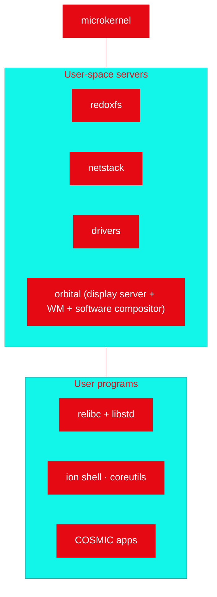

# 🧱 E-OS Architecture

> This page covers the **internals** (boot flow, schemes, the trusted computing
> base). For the top-level repo/component map, the layer diagram, and how the
> project is assembled + hosted, start at [`ARCHITECTURE.md`](../ARCHITECTURE.md)
> at the repo root.

E-OS inherits Redox's **microkernel** design: keep the kernel tiny, push
everything else (drivers, filesystems, networking, display) into **user space**
as isolated processes that communicate via **schemes**.

## Boot flow

## The kernel (trusted computing base)

The microkernel does only what *must* be privileged:

- **Scheduling** and process/thread management
- **Memory** management (virtual memory, page tables)
- **IPC** and the **scheme** mechanism
- Minimal architecture glue (interrupts, syscalls)

Everything else is a normal process. A crashing driver cannot panic the kernel.

## Schemes — "everything is a URL"

Resources are named like URLs and provided by **scheme handlers**:

| Scheme | Provided by | Example |
|--------|-------------|---------|
| `file:` | RedoxFS server | `file:/home/user/notes.txt` |
| `disk:` / `nvme:` | `nvmed` | block storage |
| `network:` / `tcp:` | net stack | sockets |
| `display:` / `orbital:` | display server | the screen |
| `pty:`, `pipe:`, `rand:` | kernel/servers | terminals, pipes, entropy |

A process opens a scheme path; the kernel routes the request to the handler.
This gives a uniform, **capability-style** model: hand a process only the scheme
handles it needs.

## Component map

| Component | Description |
|-----------|-------------|
| **kernel** | The microkernel — scheduling, memory, IPC, schemes. |
| **relibc** | C standard library, written in Rust (Redox + Linux targets). |
| **RedoxFS** | Copy-on-write, optionally-encrypted filesystem. |
| **drivers** | `nvmed`, `ahcid`, `xhcid`, `e1000d`, `ihdad`, … — user space. |
| **orbital** | The display server, window manager and software compositor — one process. The desktop *chrome* (greeter, launcher, wallpaper, desktop icons) is `eos-orbutils` on top of it; COSMIC apps run as clients. `cosmic-comp` is **not** used. |
| **cookbook** | Recipe/package build system producing `pkgar` packages. |

## How E-OS differs from upstream Redox

Today E-OS is the **Genesis** base — architecturally identical to upstream Redox.
Divergence is **additive** and tracked on the [roadmap](../ROADMAP.md): branding,
a curated `eos.toml` config, hardening (signed images, SBOM), and licensing
(AGPL-3.0). We deliberately **do not** fork the kernel; we re-base on upstream to
stay current. See [`REDOX-README.md`](REDOX-README.md) for the upstream overview.
