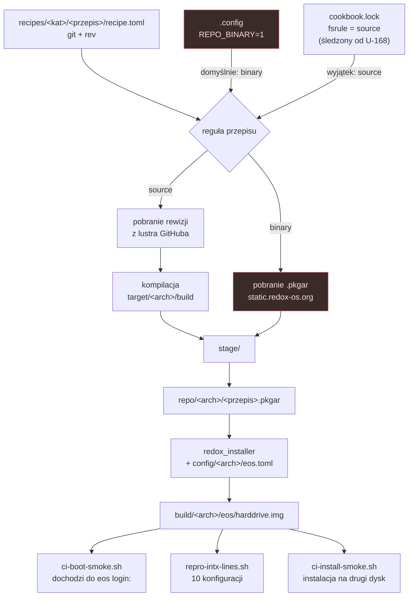

# Ścieżka budowania — od przepisu do obrazu

Najważniejsze na tym diagramie jest **rozwidlenie**: cookbook może przepis skompilować albo
pobrać gotowy pakiet. Wyborem steruje `REPO_BINARY` z pliku `.config`, a wyjątki per przepis
trzyma `cookbook.lock`. Ten mechanizm sprawił, że kliencka weryfikacja podpisu manifestu
nie trafiała do obrazu przez wiele wydań (`R-F20`, ADR-0002).



## Jak rozpoznać, którą drogą poszedł przepis

Przepis **skompilowany** ma katalog `target/<arch>/build`. Przepis **pobrany** ma wyłącznie
`stage`. To jest test, którym zaudytowano całe drzewo (`U-163`):

```sh
for d in recipes/core/*/; do
  t="$d/target/aarch64-unknown-redox"
  [ -d "$t/build" ] && echo "ZBUDOWANY  $d" || { [ -d "$t/stage" ] && echo "POBRANY    $d"; }
done
```

Bramka, która pilnuje, żeby żaden fork E-OS nie wpadł do prawej gałęzi:

```sh
bash scripts/eos-source-rules.sh          # raport; kod != 0 gdy jest luka
bash scripts/eos-source-rules.sh --apply  # ustawia regułę (w drzewie build)
```

## Pułapka: binarka w initfs

Przepis `base` **kopiuje** `redoxfs` i inne do `initfs/bin/`. Przebudowa samego
`r.<przepis>` zostawia w initfs **starą** binarkę, więc instrumentacja wygląda na
nieskuteczną. Przebuduj `r.<przepis>` **i** `r.base`, a wynik negatywny sprawdź:

```sh
strings recipes/core/base/target/<arch>/build/initfs/bin/<binarka> | grep <marker>
```

Rozstrzyga bezwarunkowa `panic!` na górze `main()`: jeśli boot dalej przechodzi, nie
uruchamiasz tego, co zbudowałeś (`U-151`, `U-153`).
