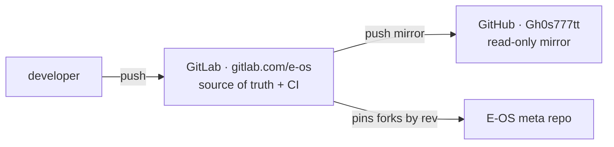

# Ecosystem components

E-OS is a Redox OS downstream: a **meta repo** (the cookbook + E-OS config, tools and docs) that **pins component forks** by exact commit. Every fork lives under [`gitlab.com/e-os`](https://gitlab.com/e-os) (source of truth) and is mirrored to [`github.com/Gh0s777tt`](https://github.com/Gh0s777tt) (read-only).

> **Where the exact pins live:** [`repos.toml`](https://gitlab.com/e-os/e-os/-/blob/main/repos.toml)
> is the single source of truth for the repo list *and* the pinned revisions —
> this page deliberately does **not** repeat the commit hashes (a hand-copied
> hash table drifts the moment a pin is bumped; that is exactly what happened to
> an earlier revision of this page). This page is maintained by hand and covers
> the *roles*; when in doubt, trust `repos.toml`. Run
> `scripts/eos-repos.sh pins` to verify every recipe pin against its fork tip,
> and `scripts/eos-repos.sh status` for a live overview.

## Meta

| Repo | Branch | Role / E-OS changes vs upstream |
|------|--------|---------------------------------|
| [E-OS](https://gitlab.com/e-os/e-os) | `main` | the cookbook, E-OS config, tools, docs |

## Core — critical (kernel / libc / fs / boot)

| Repo | Branch | E-OS changes vs upstream |
|------|--------|--------------------------|
| [eos-base](https://gitlab.com/e-os/eos-base) | `eos-july` | RAID-1 daemon `raid1d`, `usbnetd`, aarch64 INTx routing, hardening |
| [eos-bootloader](https://gitlab.com/e-os/eos-bootloader) | `eos-rebased` | Crimson red/black theme + banner |
| [eos-kernel](https://gitlab.com/e-os/eos-kernel) | `eos-july` | mmap ASLR + W^X + overflow-checks; aarch64 INTx/RNG/timer/serial/crypto |
| [eos-redoxfs](https://gitlab.com/e-os/eos-redoxfs) | `master` | hardware AES-XTS (ARMv8 crypto) for FDE |
| [eos-relibc](https://gitlab.com/e-os/eos-relibc) | `eos-july` | `ld.so` fixes (weak PLT, ET_EXEC overflow, TLS), ASLR link base |

## Core

| Repo | Branch | E-OS changes vs upstream |
|------|--------|--------------------------|
| [eos-coreutils](https://gitlab.com/e-os/eos-coreutils) | `master` | — |
| [eos-extrautils](https://gitlab.com/e-os/eos-extrautils) | `master` | — |
| [eos-installer](https://gitlab.com/e-os/eos-installer) | `master` | GUI 0-byte-EFI fix (U-082), `get_target()` (U-085), pre-install network pane |
| [eos-ion](https://gitlab.com/e-os/eos-ion) | `master` | — |
| [eos-netdb](https://gitlab.com/e-os/eos-netdb) | `master` | — |
| [eos-netutils](https://gitlab.com/e-os/eos-netutils) | `master` | — |
| [eos-pkgar](https://gitlab.com/e-os/eos-pkgar) | `master` | `read_at` no longer panics on hostile `.pkgar` (R-F03) |
| [eos-pkgutils](https://gitlab.com/e-os/eos-pkgutils) | `eos` | client verifies `repo.toml` manifest signature (R-703) |
| [eos-userutils](https://gitlab.com/e-os/eos-userutils) | `eos-july` | first-boot OOBE — forces password change (R-602); `eos login:` prompt |

## Native apps (E-OS originals)

These are not forks — they are E-OS-authored applications, all built on the
shared [eos-ui](https://gitlab.com/e-os/eos-ui) Slint-on-Orbital backend.

| Repo | Branch | What it is |
|------|--------|------------|
| [eos-control](https://gitlab.com/e-os/eos-control) | `main` | unified Crimson control center — system, processes+capabilities, security, storage, power, sound, network |
| [eos-notes](https://gitlab.com/e-os/eos-notes) | `main` | notes app (Slint + SQLite/WAL) |
| [eos-guard](https://gitlab.com/e-os/eos-guard) | `main` | filesystem-integrity monitor |
| [eos-sysmon](https://gitlab.com/e-os/eos-sysmon) | `main` | system monitor |

## GUI / desktop

| Repo | Branch | E-OS changes vs upstream |
|------|--------|--------------------------|
| [eos-orbclient](https://gitlab.com/e-os/eos-orbclient) | `master` | — |
| [eos-orbdata](https://gitlab.com/e-os/eos-orbdata) | `master` | E-OS branding assets (Crimson login, wallpaper, launcher icon) |
| [eos-orbital](https://gitlab.com/e-os/eos-orbital) | `master` | — |
| [eos-orbterm](https://gitlab.com/e-os/eos-orbterm) | `master` | — |
| [eos-orbutils](https://gitlab.com/e-os/eos-orbutils) | `master` | Crimson desktop (launcher/bg), `eos-settings`, `orblogin` greeter |

## Libraries

| Repo | Branch | E-OS changes vs upstream |
|------|--------|--------------------------|
| [eos-ui](https://gitlab.com/e-os/eos-ui) | `main` | **E-OS original** — shared Slint-on-Orbital backend crate for all E-OS GUI apps (consumed as a git dependency, not a recipe pin) |
| [eos-liborbital](https://gitlab.com/e-os/eos-liborbital) | `master` | — |
| [eos-redox-fatfs](https://gitlab.com/e-os/eos-redox-fatfs) | `master` | — |

## Dev tooling

| Repo | Branch | E-OS changes vs upstream |
|------|--------|--------------------------|
| [eos-redoxer](https://gitlab.com/e-os/eos-redoxer) | `master` | — |

## Package repositories (artifacts)

| Repo | Branch | Role |
|------|--------|------|
| [eos-pkg-aarch64](https://gitlab.com/e-os/eos-pkg-aarch64) | `main` | built package repo (aarch64) — artifact, GitHub Pages |
| [eos-pkg-x86_64](https://gitlab.com/e-os/eos-pkg-x86_64) | `main` | built package repo (x86_64) — artifact, GitHub Pages |

## Hosting model

GitHub Actions is disabled account-wide, so **all CI runs on GitLab**; GitHub is a visibility mirror only. For the meta repo the GitLab→GitHub push-mirror replicates automatically — **never dual-push it** (a manual GitHub push races the mirror; see [MAINTENANCE.md](../operations/maintenance.md)). Fork repos without a configured mirror still need the manual GitHub push described in [forks.md](forks.md). See the [main README](https://gitlab.com/e-os/e-os#readme).
