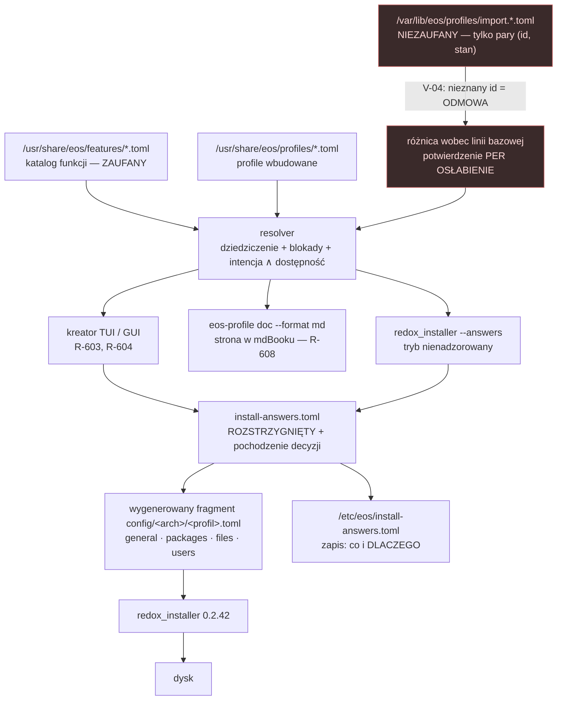

# Model danych profili i funkcji instalatora

- **Status:** Propozycja — do zatwierdzenia. Nic z tego nie jest zaimplementowane.
- **Co to jest:** format i schemat **danych**, z których kreator instalatora, dokumentacja
  i tryb nienadzorowany czytają ten sam zestaw decyzji. Nie kod, nie GUI, nie skrypt.
- **Po co istnieje:** dzisiaj instalator E-OS nie zadaje żadnego z tych pytań. Instalator
  **uruchomieniowy** (`redox_installer_tui`, `redox_installer_gui`, silnik 0.2.42) pyta o dysk
  i o hasło do RedoxFS — i na tym koniec; instalator **budowania** (`redox_installer`) nie pyta
  o nic, bo działa na pliku obrazu sterowany plikiem TOML (§1.2). Kont żaden z nich nie zakłada,
  pakietów nie daje wybrać, hostname wpisuje na sztywno jako `eos`, a kasowanie całego dysku
  chowa się za gołym menu numerycznym bez identyfikacji dysku. Każde pytanie, które kreator ma
  kiedyś zadać, musi mieć jedno źródło — inaczej GUI, TUI, dokumentacja i tryb nienadzorowany
  rozjadą się natychmiast, tak jak `docs/getting-started/install.md` rozjechało się z GUI (`R-608`) i — jak
  pokazuje §1.2 — nawet z wierszem poleceń.
- **Pozycje roadmapy:** `R-603` (konta/hostname/locale we front-endach), `R-604` (bariery przy
  destrukcyjnych operacjach), `R-605` (instalator wskazany na podpisane repo E-OS), `R-606`
  (tożsamość per-maszyna), `R-608` (dokumentacja zgodna z GUI), `R-609` (partycjonowanie ręczne),
  `R-610` (zależności builda instalatora na źródła E-OS), **`R-D13`** (katalog łańcuchów i18n —
  założona w rejestrze na wniosek §9 tego dokumentu). Rejestr rozpisał ten dokument na
  `R-603c`, `R-604d`, `R-608a`, `R-609a`, `R-609b` — `ROADMAP.md` §6.2 i §6.4 („M4").
- **Powiązane:** [`docs/archive/plan.md`](../archive/plan.md) §2 (trzy edycje, jedna baza) · [`docs/getting-started/install.md`](../getting-started/install.md) ·
  [`docs/guides/encryption.md`](../guides/encryption.md) · [`docs/security/hardening.md`](../security/hardening.md) ·
  [`docs/security/threat-model.md`](../security/threat-model.md) · [`ADR-0004`](../adr/0004-hybrid-manifest-signature.md) ·
  [`ADR-0005`](../adr/0005-secure-boot-without-microsoft.md) ·
  [`ADR-0010`](../adr/0010-encryption-stack.md) (stos szyfrowania — źródło faktów z §8 poz. 13–13c) ·
  [`ADR-0011`](../adr/0011-installer-wizard-architecture.md) (granica silnik/frontend, która
  decyduje, gdzie ten resolver mieszka) · [`installer-wizard.md`](installer-wizard.md) §14
  (znaczniki — **kolizja zakresów opisana pod tabelą §8**)
- **Przykłady:** [`examples/profiles/`](examples/profiles/) — cztery kompletne profile i
  jedenaście definicji funkcji. Wszystkie parsują się `tomllib`; przykłady mają być uruchamialne,
  nie ilustracyjne.

---

## 0. Ostrzeżenie o słowniku

Zamówienie na taki kreator pisze się słownikiem Linuksa: LUKS2, dm-crypt, LVM, RAID programowy,
btrfs, ZFS, ext4, XFS, ostree, systemd-sysupdate, systemd-boot, GRUB2, TPM2, FIDO2, kernel
live-patching. **Prawie nic z tego nie istnieje na Redoksie i nie da się tego cicho podmienić
na coś innego.** Schemat poniżej jest zbudowany
tak, żeby ta różnica była **danymi**, a nie przypisem: każda funkcja niesie obowiązkowe pole
`stage` z czterech wartości (`JEST` / `DO ZBUDOWANIA` / `NOWY PODSYSTEM` / `NIEREALNE DZIŚ`),
a walidator odmawia przyjęcia profilu, który włącza to, czego nie ma (§4, reguła V-12).

**Jeden wyjątek idzie w drugą stronę i trzeba go nazwać, bo pierwsza wersja tego dokumentu
pomyliła się tutaj.** „Argon2id na woluminie" **JEST**. RedoxFS wyprowadza klucz woluminu
Argon2id-em: `src/key.rs` → `argon2::Algorithm::Argon2id`, `argon2::Version::V0x13`, wyjście
16 bajtów, zależność `argon2 = "0.4"`. `docs/guides/encryption.md` mówi to samo od strony użytkownika —
*„the key derived from your password (**argon2**)"*. Więcej: nagłówek RedoxFS ma **64 sloty
kluczy** (`src/header.rs:31` → `pub key_slots: [KeySlot; 64]`), więc format **na dysku** już dziś
dopuszcza drugie hasło, plik klucza i klucz odzyskiwania — brakuje wyłącznie narzędzi do
zarządzania nimi. To przesuwa te pozycje z „NOWY PODSYSTEM" na **DO ZBUDOWANIA** (§8, poz.
13a–13c). Źródło RedoxFS jest w drzewie **budowania** (`recipes/core/redoxfs/source/`); w tym
repozytorium `recipes/core/redoxfs/` niesie sam `recipe.toml` — patrz §11.

Klasyfikacja samego materiału tego dokumentu jest w §8.

---

## 1. Format — TOML

### 1.1 Decyzja

**Profile i funkcje są plikami TOML 1.0.** Bez wyjątków, bez trybu „albo YAML".

### 1.2 Dlaczego w tym konkretnym projekcie

| Argument | Dowód w drzewie |
|---|---|
| **Parser już jest w instalatorze.** `redox_installer` czyta TOML dziś: `-c <plik.toml>` (równoważnie `--config=`), `config/<arch>/eos.toml`, `[general] encrypt_disk`. Dodanie profili w TOML-u nie dodaje ani jednej zależności do binarki, która działa na Redoksie. | `mk/disk.mk` (`$(INSTALLER) $(INSTALLER_OPTS) -c $(FILESYSTEM_CONFIG) $@.partial`) · `mk/config.mk:172` (ścieżka binarki: `INSTALLER=$(FSTOOLS)/bin/redox_installer`) · `docs/guides/encryption.md` §1 (`encrypt_disk`) |
| **Cały projekt mówi w TOML-u.** `recipe.toml`, `repos.toml`, `cookbook.lock`, `config/*.toml`, `deny.toml`, `clippy.toml`, `rustfmt.toml`, `.gitleaks.toml`, a w samym obrazie `/etc/login_schemes.toml`, `/etc/contain.toml`, `/usr/lib/pcid.d/*.toml`, `/etc/pkg/eos-repo-sign.pub.toml`. Wprowadzenie drugiego formatu konfiguracji to drugi zestaw pułapek składniowych dla każdego, kto edytuje ten system. | `repos.toml`, `config/x86_64/eos.toml` |
| **Komentarze są nośnikiem uzasadnienia.** Cała kultura tego drzewa polega na tym, że plik konfiguracyjny tłumaczy *dlaczego* — sekcja R-701a w `config/x86_64/eos.toml` ma 12 linii komentarza nad dwuliniowym plikiem. Format bez komentarzy (JSON) wyrzuca połowę wartości pliku. | `config/x86_64/eos.toml` |
| **Powierzchnia ataku parsera.** Profil bywa pobrany z sieci (§6). TOML 1.0 nie ma kotwic ani aliasów (brak bomby aliasowej), nie ma tagów typu (`!!python/object`), nie ma kluczy scalających i ma małą gramatykę. YAML ma wszystkie trzy. | ADR-0003 (forma upstreamu), §6.2 |
| **Utrzymanie zależności.** `serde_yaml` jest zarchiwizowany przez autora; wciąganie nieutrzymywanego parsera do ścieżki, która czyta wejście niezaufane, jest wprost sprzeczne z `cargo-deny check advisories` w CI. | `.gitlab-ci.yml`, `deny.toml` |
| **Tablice tablic pasują do kształtu danych.** `[[select]]`, `[[notice]]`, `[[effects.on.files_write]]` — dokładnie to samo, czym są `[[files]]`, `[[repo]]` i `[[drivers]]` w istniejących plikach. Czytelnik nie uczy się nowej figury. | `config/base.toml`, `repos.toml` |

> **Sygnatura, którą ten dokument przepisał błędnie za cudzym plikiem — poprawiona.**
> `docs/getting-started/install.md` §3 podawało `redox_installer <config.toml> <disk>`
> — **naprawione 2026-08-31 w `R-608`**, wraz z ostrzeżeniem, dlaczego stara forma nie była
> nieszkodliwa. To było **odwrócone**:
> ścieżka obrazu jest argumentem **pozycyjnym**, a konfiguracja **flagą**:
> `redox_installer <diskpath.img> [--config=plik.toml] [--write-bootloader[=ŚCIEŻKA]] [--live]`
> (dodatkowo `--skip-partition`, odpowiednik `general.skip_partitions`, pomija zapis tablic GPT).
> Dowód jest w drzewie i nie wymaga źródeł instalatora: `mk/disk.mk` woła
> `$(INSTALLER) $(INSTALLER_OPTS) -c $(FILESYSTEM_CONFIG) $@.partial`, a cel `redox-live.iso`
> dokłada `--write-bootloader="$(BUILD)/bootloader-live.efi" --live`. `ROADMAP.md` (`R-609b`)
> używa już formy poprawnej. Pierwsza wersja tego dokumentu powieliła błąd z `install.md`
> w trzech miejscach — czyli **ten sam rozjazd, który `R-608` ma zamknąć** (§7.2), tyle że
> dokumentacja pomyliła się tu nie o funkcję, lecz o wiersz poleceń.

**Rozróżnienie, które obowiązuje w całym dokumencie.** `redox_installer` to instalator
**budowania**: działa na **pliku obrazu**, sterowany plikiem TOML, uruchamiany na hoście.
Instalacja na goły sprzęt z nośnika to `redox_installer_tui` / `redox_installer_gui`
uruchomione **na maszynie docelowej**. Ten schemat obsługuje obie ścieżki, ale to są dwa
różne programy i dwa różne momenty.

### 1.3 Odrzucone warianty

- **YAML.** Odrzucony na powierzchni ataku i na zależności, nie na estetyce. Dodatkowo:
  wcięcia znaczące w pliku, który ludzie będą wklejać z komunikatorów i for, to klasa błędów,
  której TOML nie ma. Kontrargument („YAML jest czytelniejszy dla list zagnieżdżonych") jest
  prawdziwy i nieistotny: schemat celowo nie schodzi głębiej niż dwa poziomy (§3).
- **JSON.** Brak komentarzy przekreśla go w projekcie, w którym uzasadnienie mieszka w
  komentarzu. Zaleta JSON-a — JSON Schema, czyli **istniejący język walidacji** — jest realna
  i tracimy ją świadomie; koszt tej straty jest wyceniony w §4.4.
- **JSON + JSON Schema jako format wewnętrzny, TOML jako fasada.** Dwa formaty, dwie
  reprezentacje, dwa miejsca na rozjazd. Odrzucone z tego samego powodu, dla którego
  `docs/getting-started/install.md` rozjechało się z GUI: jedna prawda albo żadna.
- **Rust / Dhall / Starlark (konfiguracja wykonywalna).** To jest **rozwiązanie odwrotne do
  problemu**. Profil z sieci ma być danymi właśnie po to, żeby nie mógł nic wykonać (§6.2).
  Konfiguracja, która się wykonuje, zamienia „import profilu" w „uruchom cudzy program jako
  root przy instalacji".
- **KDL / RON.** Ładniejsze dla drzew, ale nieobecne w drzewie i w instalatorze. Nowa
  zależność bez odpowiadającej korzyści.

### 1.4 Czego TOML **nie** robi dobrze i jak to znosimy

1. **Nie ma języka schematu.** Nie ma odpowiednika JSON Schema, więc **cała walidacja jest
   ręcznie napisanym kodem w Ruście**. To jest realny koszt, nie formalność: reguły z §4 trzeba
   napisać, przetestować i — zgodnie z `CLAUDE.md` §4.1 — **zobaczyć padające**. Rekompensata:
   `serde` z `deny_unknown_fields` daje za darmo połowę reguły V-05, a przykłady w
   `examples/profiles/` są zestawem danych testowych, na których ta walidacja musi się
   wywalać i przechodzić.
2. **Jest gadatliwy przy tablicach obiektów.** `[[select]]` z czterema polami to pięć linii.
   Akceptujemy — plik jest czytany przez człowieka częściej niż pisany.
3. **Nie ma kanonicznej serializacji.** Podpis (§6.3) liczy się **nad bajtami pliku**, nigdy
   nad drzewem po sparsowaniu. To upraszcza sprawę i jest zgodne z tym, jak `tools/eos-repo-sign`
   podpisuje `repo.toml`.

---

## 2. Gdzie te pliki mieszkają

| Ścieżka | Zawartość | Zaufanie |
|---|---|---|
| `/usr/share/eos/features/<id>.toml` | **Katalog funkcji.** Definicje efektów. | Zaufany — pochodzi z podpisanego obrazu, przeszedł przegląd w repozytorium |
| `/usr/share/eos/profiles/<id>.toml` | Profile wbudowane (`eos.base`, `eos.gamer`, `eos.business`, `eos.ghost`) | Zaufany — jak wyżej |
| `/var/lib/eos/profiles/import.<hash>.<id>.toml` | Profile zaimportowane przez użytkownika | **Niezaufany** — §6 |
| `/var/lib/eos/install-answers.toml` | Plik odpowiedzi wygenerowany przez kreator | Lokalny, nie do dystrybucji |
| `/etc/eos/install-answers.toml` | Kopia zapisana do systemu **zainstalowanego** | Zapis historyczny: co i dlaczego wybrano |
| `docs/architecture/examples/profiles/` | Przykłady w repozytorium; **są jednocześnie zestawem testowym walidatora** (§4.4) | — |

**Przestrzeń identyfikatorów.** `[a-z0-9]+(\.[a-z0-9-]+)*`, maksymalnie 64 znaki, bez wielkich
liter i bez znaków spoza ASCII. Nazwa pliku musi być równa identyfikatorowi z `.toml` na końcu
(V-02) — dzięki temu „nieznany identyfikator" jest błędem otwarcia pliku, a nie cichym
pominięciem wpisu. Prefiks `eos.` jest **zarezerwowany dla profili wbudowanych**; prefiks
`import.` nadaje **parser**, a nie autor pliku (§6.5).

---

## 3. Schemat

### 3.1 Plik profilu

```toml
schema = 1                       # wersja SCHEMATU (całkowita, wymagana, pierwsza linia treści)

[profile]
id            = "eos.business"   # wymagane, unikalne, składnia z §2
version        = "1.0.0"         # wymagane, semver — wersja PROFILU, nie schematu
class          = "desktop"       # wymagane: desktop | gaming | server | amnesic
inherits       = ["eos.base"]    # kolejność znacząca, DAG, głębokość ≤ 8
author         = "E-OS"          # wymagane
homepage       = "…"             # opcjonalne
min_installer  = "0.2.42"        # wymagane — minimalna wersja redox_installer
arch           = ["x86_64", "aarch64"]   # wymagane, niepuste

[profile.text.<lang>]            # `en` wymagane, `pl` zalecane — §3.4
name    = "…"
summary = "…"

[[notice]]                       # opcjonalne, 0..n; dziedziczone i NIEUSUWALNE (V-20)
severity = "info"                # info | warning | blocking
[notice.text.<lang>]
body = "…"

[[select]]                       # 0..n; jeden wpis na funkcję (V-14)
feature = "disk.encrypt"         # musi istnieć w katalogu funkcji (V-04)
state   = "on"                   # on | off | ask   — to jest INTENCJA, nie stan skuteczny
locked  = true                   # opcjonalne; blokada jest nieodwracalna w dół drzewa (§3.6)
reason  = "…"                    # wymagane gdy `locked` albo gdy odchylenie od zalecenia (V-10)
does_not_protect = "…"           # wymagane w profilu klasy `amnesic` (V-19)
[select.params]                  # opcjonalne, parametry funkcji o wartościach nieboolowskich
policy = "random-suffix"

[unverified]                     # opcjonalne, wolny słownik: co autor profilu wie, że jest
"klucz" = "[NIEZWERYFIKOWANE] …" # niesprawdzone. Kreator pokazuje to jako ostrzeżenie.
```

### 3.2 Plik funkcji

```toml
schema = 1

[feature]
id            = "disk.encrypt"
version       = "1.0.0"
category      = "storage"        # storage|network|hardening|accounts|updates|system|privacy
arch          = ["x86_64", "aarch64"]
stage         = "JEST"           # JEST | DO ZBUDOWANIA | NOWY PODSYSTEM | NIEREALNE DZIŚ
stage_by_arch = { aarch64 = "JEST", x86_64 = "DO ZBUDOWANIA" }   # opcjonalne nadpisanie
evidence      = "…"              # WYMAGANE gdy stage = JEST (V-12); plik:linia, nazwa binarki, U-NNN
roadmap       = ["R-701"]        # istniejące identyfikatory; nowych nazw nie wymyślamy

[text.<lang>]                    # name, summary
[effects.on]                     # irreversible, requires_reboot, unavailable, weakening
[[effects.on.<rodzaj>]]          # ZAMKNIĘTA gramatyka efektów — §3.5
[effects.on.text.<lang>]         # description
[effects.off]
[effects.off.text.<lang>]        # description, residual_risk   ← oba wymagane
[requires]                       # features = [], any_of = [[…]], capabilities = []
[requires.text.<lang>]           # reason
[conflicts]                      # features = []
[conflicts.text.<lang>]          # reason  ← wymagane gdy lista niepusta
[threat]                         # model = […], severity_if_off = niskie|średnie|wysokie|krytyczne
[threat.text.<lang>]             # protects, does_not_protect   ← oba wymagane (V-11)
[cost]                           # disk_mib, ram_mib, boot_ms, install_s, reversible
[cost.text.<lang>]               # runtime — koszt LUDZKI, nie tylko maszynowy
[recommend.class]                # desktop/gaming/server/amnesic → on|off|ask
[recommend.profile]              # "eos.business" → on|off|ask   (klucz drugorzędny)
```

**Słowniki zamknięte.** `stage`, `class`, `severity`, `severity_if_off`, `category` i
`threat.model` są enumami — wartość spoza listy jest błędem, nie ostrzeżeniem.
`threat.model` używa **nazw przeciwników z `docs/security/threat-model.md` §3**
(`remote-network`, `local-unprivileged-process`, `malicious-driver`, `physical-lost-device`,
`supply-chain`), a nie własnej taksonomii. Powód jest praktyczny: gdy ktoś zmieni model
zagrożeń, walidator pokaże, które funkcje trzeba przejrzeć.

**Dlaczego `recommend` jest keyowany przede wszystkim KLASĄ, a nie identyfikatorem profilu.**
Zamówienie mówi „zalecenie per profil" i jest ono zrealizowane — `[recommend.profile]` przyjmuje
dokładne identyfikatory. Ale klucz **podstawowy** to klasa, bo:
(a) funkcja od osoby trzeciej nie może znać naszych identyfikatorów profili, a klasa jest
zamkniętym enumem; (b) tabela keyowana identyfikatorem jest **wektorem podszycia** — profil,
który nazwie się `eos.business`, przechwyci zalecenia pisane dla wbudowanego (dlatego §6.5
wymusza prefiks `import.`). `[recommend.profile]` jest honorowane wyłącznie dla profili
o tym samym pochodzeniu zaufania co funkcja.
`examples/profiles/ghost.toml` pokazuje mechanizm od drugiej strony: `disk.encrypt` zaleca
`amnesic = "on"`, a profil ustawia `off` — i **musi** wtedy podać `reason` (V-10).

### 3.3 Zdolności (`capabilities`)

Zamknięty słownik warunków środowiskowych, których funkcja wymaga, a instalator umie sprawdzić:
`uefi`, `bios`, `net.interface`, `scheme.rand`, `disk.count>=N`, `disk.size_mib>=N`,
`ram_mib>=N`, `installer.interactive_or_prompt`. Nowa zdolność wymaga zmiany walidatora —
to jest celowe: zdolność, której nikt nie umie zmierzyć, byłaby warunkiem zawsze prawdziwym.

> **Pułapka udokumentowana w drzewie:** `disk.size_mib` i wszystko, co liczy sektory, jest dziś
> **niewiarygodne** — `DiskWrapper::open` zawsze raportuje bloki 512-bajtowe, więc strażnik 512
> jest martwym kodem, a dyski 4Kn nie są obsłużone. To jest otwarta pozycja `R-607` i warunek
> wstępny dla każdej reguły `capabilities`, która dotyka geometrii dysku.

### 3.4 i18n

**Stan faktyczny, bez upiększeń:** infrastruktury i18n w projekcie **nie ma**. `docs/archive/plan.md` §2.1
wymienia „katalog łańcuchów i18n" wśród braków, które w chwili pisania planu nie miały pozycji
roadmapy; rejestr założył ją **później** jako `R-D13` (`ROADMAP.md`, **NOWY PODSYSTEM**).
`eos-control` ma polskie napisy **zaszyte w kodzie** (`settings.rs`), a dokumentacja jest po
angielsku. Wcześniejsze
twierdzenie, jakoby `CLAUDE.md` narzucał bramkę parzystości kluczy i18n, było **zmyślone** i
zostało wycofane (`U-126`). Ten schemat nie może więc opierać się na katalogu, którego nie ma.

**Decyzja: łańcuchy mieszkają w tym samym pliku, w tabelach `[…text.<lang>]`.**

| Reguła | Zachowanie |
|---|---|
| `en` jest **obowiązkowy** dla każdego klucza widocznego dla użytkownika | brak → błąd walidacji (V-16) |
| inne języki są opcjonalne | brak → ostrzeżenie, nie błąd |
| łańcuch pusty albo złożony z białych znaków | traktowany jak brak |
| **awaria wyszukania** | żądany język → `en` → **dosłowny identyfikator z prefiksem `⚠`** |

Ostatni wiersz jest sednem, nie ozdobą: **pusta etykieta przy przełączniku bezpieczeństwa jest
awarią kontroli.** Kreator, który wyrenderuje pole wyboru bez nazwy, pozwoli użytkownikowi
zaznaczyć nie wiadomo co. Dlatego brak tłumaczenia degraduje do widocznego, brzydkiego
identyfikatora, a nie do pustki.

Zewnętrzny katalog (`/usr/share/eos/i18n/<lang>/<id>.toml`) jest przewidziany jako **nadpisanie**
i jest niepusty dopiero wtedy, gdy powstanie `R-D13` — do tego czasu ta ścieżka jest pustym
miejscem w schemacie, nie obietnicą. Do tego czasu pole `text`
w pliku jest jedynym źródłem. **Nie używamy gettexta.** `gettext` jest wprawdzie w zestawie
pakietów obrazu (`config/server.toml:18`, wciągane przez `desktop.toml` do `eos.toml`), ale
**[NIEZWERYFIKOWANE]**, czy `relibc` wystawia użyteczne `libintl`/`setlocale` dla rustowego
stosu GUI. Zbudowanie i18n na nieprzetestowanym założeniu byłoby dokładnie tym błędem, przed
którym ostrzega `CLAUDE.md` §4.2.

### 3.5 Gramatyka efektów — zamknięta

Funkcja **nie może** opisać dowolnej zmiany systemu. Może wybrać z listy rodzajów efektów,
z których każdy tłumaczy się na sprawdzoną składnię konfiguracji `redox_installer`:

| Rodzaj | Tłumaczy się na | Zweryfikowane w |
|---|---|---|
| `general_set` | `[general]` (`filesystem_size`, `target`, `prompt`, `efi_partition_size`, `encrypt_disk`) | `config/base.toml`, `config/aarch64/raspi3bp/minimal.toml:10`, `docs/guides/encryption.md` |
| `packages_add` / `packages_remove` | `[packages]` | `config/*.toml` |
| `files_write` | `[[files]]` (`path`, `data`, `mode`, `uid`, `gid`, `postinstall`, `directory`, `recursive_chown`) | `config/x86_64/eos.toml` |
| `users_set` | `[users.<nazwa>]` (`password`, `uid`, `gid`, `shell`) | `config/base.toml:240` |
| `groups_set` | `[groups.<nazwa>]` (`gid`, `members`) | `config/base.toml` |
| `service_enable` / `service_disable` | `[[files]]` pod `/usr/lib/init.d/` | `config/x86_64/eos.toml` (`25_raid1d.service`) |
| `schemes_deny` | strukturalna edycja `/etc/login_schemes.toml` | `config/x86_64/eos.toml` (R-904a) |
| `pkgsource_enable` | strukturalna edycja `/etc/pkg.d/<nazwa>` | `config/x86_64/eos.toml` (R-701, R-701a) |

**Dlaczego trzy z tych rodzajów są „strukturalne", a nie surowym `files_write`.** Bo ostatni
zapis wygrywa, a to już raz zepsuło ten obraz: `desktop.toml` ciągnie zarówno
`desktop-minimal.toml`, jak i `server.toml`, oba przez `minimal.toml`, więc kopia
`inputd -A 2` z gałęzi server→minimal lądowała **na końcu**, wygrywała na dysku i kradła
fokus z pulpitu. Naprawiono, dopisując zwycięską definicję w `eos.toml`. Dwie funkcje
zawężające `/etc/login_schemes.toml` surowym zapisem odtworzyłyby ten sam błąd — z tą różnicą,
że tu jego skutkiem byłoby **ciche przywrócenie schematu, który poprzednia funkcja usunęła**.
Stąd reguła V-18: `files_write` na ścieżce należącej do rodzaju strukturalnego jest błędem.

**Wartości specjalne.** `@prompt:<nazwa>` (kreator zapyta), `@random:<rodzaj>` (instalator
wylosuje), `@locked` (hasło zablokowane, nie puste). **Sekret nigdy nie jest wartością
dosłowną w pliku profilu** — patrz V-17.

### 3.6 Dziedziczenie i scalanie

Definicja jest celowo prosta; **nie używamy C3 ani MRO**, bo drzewo profili jest płytkie,
a algorytm, którego autor profilu nie umie odtworzyć w głowie, jest gorszy niż ograniczenie.

```
resolve(P) = concat( resolve(rodzic) dla każdego rodzica w kolejności `inherits` ) ++ own_selects(P)
```

Powstała lista jest zwijana **od lewej do prawej**; późniejszy wpis nadpisuje wcześniejszy dla
tej samej funkcji. Rodzic wymieniony dwa razy wnosi się dwa razy — zwijanie jest idempotentne
per wpis, więc to nieszkodliwe. **Ostatnim krokiem zwijania jest wybór użytkownika w kreatorze.**

**Blokada (`locked = true`) zamraża wartość dla wszystkich późniejszych wpisów.** Późniejszy
`[[select]]` na zablokowanej funkcji jest **błędem walidacji (V-09)**, nie cichym pominięciem.
Powód: „cicho pominięte" znaczy, że autor profilu potomnego jest przekonany, iż coś wyłączył,
a wysyła profil robiący dokładnie odwrotnie. **Odblokowania nie ma z założenia.** Jeśli
potrzebujesz innej wartości — nie dziedzicz po tym profilu.

Wybór użytkownika na zablokowanej funkcji jest odrzucany z pokazaniem pola `reason`. To jest
jedyne miejsce, w którym profil ma władzę nad człowiekiem przy klawiaturze, więc `reason` jest
obowiązkowy i renderowany dosłownie.

**Intencja a stan skuteczny.** `state` w profilu to intencja. Stan skuteczny =
intencja ∧ dostępność (arch, `stage`, `capabilities`). **Obniżenie nigdy nie jest ciche:**
trafia na ekran, do pliku odpowiedzi jako `source = "unavailable"` z zachowanym `intent`, a w
trybie nienadzorowanym **przerywa instalację**, chyba że podano `--allow-unavailable` w wierszu
poleceń. Ciche obniżenie to najgroźniejsza awaria całego projektu — profil mówi „szyfruj",
instalator instaluje bez szyfrowania, nikt się nie dowiaduje.

---

## 4. Walidacja

### 4.1 Reguły

| ID | Wyzwalacz | Reakcja |
|---|---|---|
| **V-01** | `schema` nieznana albo nowsza niż walidator | **odmowa** (fail-closed). Nigdy „na ile się da" |
| **V-02** | identyfikator poza składnią z §2 albo nazwa pliku ≠ `id` + `.toml` | odmowa |
| **V-03** | cykl w `inherits`, głębokość > 8 albo > 64 profile w łańcuchu | odmowa, z wypisaniem cyklu |
| **V-04** | `[[select]]` wskazuje funkcję nieobecną w katalogu | **odmowa** — nigdy pominięcie |
| **V-05** | nieznany klucz w dowolnej tabeli (`deny_unknown_fields`) | odmowa |
| **V-06** | dwie funkcje w konflikcie rozstrzygnięte obie na `on` | odmowa, z podaniem `conflicts.reason` obu stron |
| **V-07** | funkcja `on`, a jej `requires` niespełnione | odmowa; kreator proponuje domknięcie, **nigdy nie domyka sam** |
| **V-08** | `capabilities` niespełnione na tej maszynie | funkcja niedostępna; jeśli `locked = on` → przerwanie |
| **V-09** | późniejszy `[[select]]` na funkcji zablokowanej wcześniej | odmowa, z nazwami obu plików |
| **V-10** | `locked = true` **lub** odchylenie od `recommend` dla tej klasy/profilu bez `reason` | odmowa |
| **V-11** | `threat.text.*.does_not_protect` puste, gdy `severity_if_off ≥ średnie`; albo puste `effects.off.residual_risk` | odmowa |
| **V-12** | `state = "on"` przy `stage` = `NOWY PODSYSTEM` / `NIEREALNE DZIŚ`; albo `stage = JEST` z pustym `evidence`; albo `effects.on.unavailable = true` przy `state = "on"` | odmowa |
| **V-13** | przecięcie `profile.arch` z `feature.arch` puste dla instalowanej architektury | odmowa z nazwaniem architektury |
| **V-14** | dwa `[[select]]` na tę samą funkcję w jednym pliku | odmowa (nie „ostatni wygrywa") |
| **V-15** | plik > 256 KiB, > 512 wpisów `select`, łańcuch > 4 KiB, zagnieżdżenie > 4 | odmowa |
| **V-16** | brak łańcucha `en` dla klucza widocznego dla użytkownika | odmowa (inne języki: ostrzeżenie) |
| **V-17** | `general_set.encrypt_disk` (lub inne pole sekretu) z wartością **dosłowną** zamiast `@prompt:` | **odmowa** — patrz niżej |
| **V-18** | `files_write` na ścieżce zarezerwowanej dla rodzaju strukturalnego (`/etc/login_schemes.toml`, `/etc/pkg.d/*`, `/usr/lib/init.d/*`) | odmowa |
| **V-19** | profil klasy `amnesic` z `[[select]]` bez `does_not_protect` | odmowa |
| **V-20** | profil potomny usuwa `[[notice]]` odziedziczone od rodzica | odmowa |
| **V-21** | `min_installer` nowsza niż działający `redox_installer` | odmowa z podaniem obu wersji |

**V-17 zasługuje na osobne zdanie.** `docs/guides/encryption.md` pokazuje działającą, udokumentowaną
formę `[general] encrypt_disk = "twoje-mocne-hasło"` — hasło **w postaci jawnej w pliku
konfiguracyjnym**. Profil pobrany z sieci, który zawiera tę linię z wartością dosłowną,
produkuje zaszyfrowany dysk, **którego hasło zna autor profilu**. To nie jest hipoteza,
to najprostszy możliwy atak na ten format. Dlatego jedyną dopuszczalną wartością pola sekretu
w profilu jest `@prompt:`, a walidator odrzuca resztę **zanim** cokolwiek zostanie zapisane.

### 4.2 Jak każda z tych kontroli może zawieść

`CLAUDE.md` §13 i §4.1 są w tej sprawie jednoznaczne: kontrola, która nie może się zapalić na
czerwono, nie istnieje, a czerwone musi mówić, **co** jest złamane — drzewo czy przyrząd.
Walidator profili przejmuje wprost konwencję z `scripts/ci-integrity.sh`:

- `bad` — niezmiennik złamany: plik jest zły. Reakcja: popraw plik.
- `cannot` — **kontroli nie dało się wykonać**: brakuje katalogu funkcji, plik jest nieczytelny,
  brak architektury docelowej. Reakcja: napraw środowisko. **To nie jest zielone i nie jest
  „bad".** Bez tego rozróżnienia pusty katalog `/usr/share/eos/features/` dałby „0 nieznanych
  identyfikatorów" i przeszedł — dokładnie ta awaria, którą `U-177` złapało w kontrolach 6 i 7,
  i ta, którą `U-140` przegapiło przez `|| true`.
- **Sonda instrumentu przed pierwszą kontrolą.** Walidator najpierw dowodzi, że umie wczytać
  co najmniej jedną znaną funkcję i jeden znany profil, i dopiero potem orzeka cokolwiek.

Konkretne tryby awarii samego walidatora, które trzeba pokryć testem negatywnym:

| Awaria | Objaw, jeśli jej nie obsłużyć | Test negatywny |
|---|---|---|
| pusty katalog funkcji | wszystko przechodzi, nic nie jest sprawdzone | uruchom na pustym katalogu → musi dać `cannot` |
| V-04 zdegradowane do ostrzeżenia | profil deklaruje FDE, instalacja jest bez FDE | profil z literówką w `feature` → musi dać `bad` |
| cykl bez limitu głębokości | kreator wisi na konsoli instalacyjnej | profil `a→b→a` → `bad`, nie zawieszenie |
| `stage` niesprawdzany | profil włącza zaporę, której nie ma | `net.firewall` z `state = "on"` → `bad` |
| tłumaczenie brakujące, degradacja do pustki | pole wyboru bez nazwy | usuń `text.en` → `bad` (V-16) |
| V-17 zdegradowane do ostrzeżenia | profil z sieci ustawia hasło dysku, które zna jego autor | profil z `encrypt_disk = "hasło"` dosłownym → `bad` **zanim** cokolwiek trafi na dysk |
| walidacja uruchomiona raz, przed importem | profil zaimportowany po walidacji omija ją w całości | uruchom import między dwoma przebiegami → drugi musi orzec (§4.3 poz. 3) |

### 4.3 Gdzie to biegnie

1. **W CI** — nowa kontrola w `scripts/ci-integrity.sh` nad `docs/architecture/examples/profiles/**`
   oraz nad profilami wysyłanymi w obrazie. Plik ma dziś **czternaście** ponumerowanych kontroli (zmierzone 2026-09-01 — bramka wypisuje 14 linii `ok:`):
   `# 1)`…`# 6)` oraz `# ── 7.` … `# ── 11.`, poprzedzonych sondą przyrządów opisaną jako
   *„0. Instruments before results"*. Nowa pozycja to więc **kontrola 12** — numer 11 jest zajęty
   przez *„no fork source vendored back into this repo"*. (`CLAUDE.md:39` mówi o **ośmiu
   kontrolach**; nieaktualny jest tam opis, nie skrypt — do poprawienia osobno.)
2. **W haku `pre-push`** — tą samą drogą co reszta bramek.
3. **Na urządzeniu** — w instalatorze, przed pierwszym pytaniem kreatora i **ponownie** przed
   zapisem czegokolwiek na dysk. Dwa razy, bo między jednym a drugim jest import (§6).

### 4.4 Koszt wyboru TOML-a, wyceniony

Rezygnacja z JSON Schema kosztuje: 21 reguł napisanych ręcznie w Ruście, każda z testem
negatywnym. Szacunek — **S/M** dla `V-01`…`V-15` (czysta walidacja struktury, `serde` robi
połowę), **M** dla `V-16`…`V-21` (wymagają katalogu funkcji i znajomości architektury docelowej).
Rekompensata jest realna: przykłady z `examples/profiles/` są jednocześnie zestawem testowym,
a walidator napisany ręcznie może wypowiadać reguły, których JSON Schema nie wyraża —
V-10, V-11, V-12 i V-19 są warunkowe wobec **treści innego pliku**.

---

## 5. Wersjonowanie i migracja

### 5.1 Trzy niezależne wersje

| Co | Pole | Kto zmienia |
|---|---|---|
| **schemat** | `schema` (całkowita) | zmiana kształtu danych; wymaga migracji |
| **profil** | `profile.version` (semver) | autor profilu |
| **funkcja** | `feature.version` (semver) | autor funkcji |

Mieszanie ich to klasyczny sposób na to, żeby nie dało się powiedzieć, co się właściwie zmieniło.

### 5.2 Plik odpowiedzi

Kreator produkuje **rozstrzygnięty** artefakt, nie odsyłacz do profilu:

```toml
schema = 1

[answers]
generated       = "2026-08-30T12:00:00Z"
installer       = "0.2.42"
arch            = "x86_64"
profile         = "eos.business"
profile_version = "1.0.0"
resolved_digest = "blake3:…"      # skrót ROZSTRZYGNIĘTEGO zestawu, nie pliku profilu

[[answers.feature]]
id     = "disk.encrypt"
state  = "on"
intent = "on"
source = "profile-locked"     # default | profile | profile-locked | user | requires | unavailable

[[answers.feature]]
id     = "sys.identity"
state  = "off"
intent = "on"
source = "unavailable"
note   = "stage = DO ZBUDOWANIA; R-603/R-606 otwarte"
```

Dwie własności są tu istotne i obie służą `R-604`:

1. **Rozstrzygnięty, nie referencyjny.** Instalacja nie zależy od tego, czy zdalny profil
   nadal istnieje i czy się nie zmienił.
2. **Zapisane pochodzenie każdej decyzji.** Bariera przed destrukcyjną operacją musi umieć
   powiedzieć człowiekowi *„skasuję `/dev/nvme0n1`; szyfrowanie jest włączone, bo zażądał tego
   profil i zablokował tę pozycję"* — a nie tylko „szyfrowanie: tak". Dzisiejszy ekran to
   gołe menu numeryczne bez identyfikacji dysku (`R-604`); pole `source` jest połową materiału,
   którego ten ekran potrzebuje.

Kopia trafia do `/etc/eos/install-answers.toml` w systemie zainstalowanym. Nie zastępuje
dziennika audytu — takiego **nie ma** (znalezisko C-9) — ale jest jedynym trwałym zapisem
tego, co i dlaczego wybrano.

### 5.3 Reguły migracji

| Przypadek | Zachowanie |
|---|---|
| `schema` == wersja walidatora | zwykły odczyt |
| `schema` **starsza** | migracje `M_{k→k+1}` uruchamiane po kolei; każda **totalna** (dla każdego wejścia daje wyjście albo odmawia) |
| `schema` **nowsza** | **odmowa.** Nigdy „best effort" — nowszy plik może nieść funkcję, której ten instalator nie zna, a zainstalowanie z cichym pominięciem to awaria z §3.6 |
| migracja nie umie odwzorować wartości | **odmawia**; nie kasuje klucza. Skasowany klucz to skasowana decyzja o bezpieczeństwie |
| zapis wyniku | obok oryginału, jako `<nazwa>.toml.migrated`; **nadpisanie w miejscu wymaga potwierdzenia** |
| `eos-profile migrate --dry-run` | drukuje różnicę przed i po |

**Identyfikator wycofany.** Rejestr `[deprecated]` w katalogu funkcji odwzorowuje stary
identyfikator na nowy albo na `removed`, z polem `since` (numer schematu). Plik odpowiedzi,
który wymienia usunięty identyfikator, **nie jest czyszczony po cichu**: wpis zostaje jako
`state = "unavailable"`, `intent` = to, co było, plus `note`. Użytkownik ma zobaczyć, że coś,
co miał włączone, przestało istnieć.

**Test, bez którego migracje są życzeniem.** Przykłady w `examples/profiles/` są **fixtures**:
CI ma je przepuścić przez wszystkie migracje od najstarszego wspieranego schematu i porównać
z zapisanym oczekiwanym wynikiem. Migracja, która nie ma pliku wejściowego w repozytorium,
nie jest przetestowana — a `CLAUDE.md` §4.1 mówi, co to znaczy.

### 5.4 Co się dzieje z **istniejącym** plikiem odpowiedzi

| Sytuacja | Reakcja |
|---|---|
| ponowna instalacja tą samą wersją | odczyt bez zmian; kreator pokazuje poprzednie wybory jako domyślne |
| nowszy instalator, starszy plik | migracja (§5.3), różnica pokazana, potwierdzenie wymagane |
| starszy instalator, nowszy plik | **odmowa** (V-01) |
| plik z innej architektury | wpisy niedostępne na tej architekturze → `source = "unavailable"`, reszta zachowana |
| funkcja w pliku nie istnieje już w katalogu | wpis oznaczony `removed`, zachowany, pokazany |
| tryb nienadzorowany, cokolwiek z powyższych wymaga decyzji | **przerwanie z kodem ≠ 0** i powodem czytelnym maszynowo na stdout |

---

## 6. Zaufanie: profil pobrany z internetu wykonuje reguły hartowania na cudzej maszynie

To jest najważniejsza sekcja tego dokumentu i jedyna, w której format konfiguracji staje się
zagadnieniem bezpieczeństwa.

### 6.1 Co złośliwy profil może zrobić, jeśli mu się pozwoli

Bez ani jednej linii kodu, samą treścią danych:

1. **Wyłączyć ochronę.** `disk.encrypt = off`, `pkg.source.eos = off`,
   `user.schemes.minimal = off`. Najprostszy atak i najskuteczniejszy, bo nie wygląda na atak.
   Ofiara myśli, że stosuje „profil hartowany".
2. **Włączyć ekspozycję.** `net.sshd = on`, `pkg.source.redox-upstream = on` — a przez
   `pkgsource_enable` także **własny** adres repozytorium z **własnym** kluczem.
3. **Wykonać kod jako root przy starcie.** Gdyby profil mógł nieść `files_write`, wystarczy
   plik pod `/usr/lib/init.d/` — instalator zapisuje go z `postinstall`, a `init` uruchamia go
   przy każdym rozruchu.
4. **Poznać hasło do dysku ofiary** — `encrypt_disk` z wartością dosłowną (§4.1, V-17).
5. **Zawiesić kreator albo instalator** — cykl w `inherits`, plik na 400 MB, głębokie
   zagnieżdżenie.
6. **Skłamać w tekście.** `name = "Szyfrowanie WŁĄCZONE"` przy `state = "off"`; identyfikator
   w homoglifach udający `eos.business`.

### 6.2 Decyzja: nie ufamy, więc import robi to i tylko to

> **Import przyjmuje wyłącznie PROFIL, a profil jest wyłącznie listą par
> (identyfikator funkcji, stan). Definicji funkcji NIE DA SIĘ zaimportować.**

Konsekwencje, po kolei:

- **Efekty pochodzą z katalogu lokalnego**, który przyjechał w podpisanym obrazie i przeszedł
  przegląd w repozytorium. Zaimportowany profil nie może wprowadzić nowego efektu — może tylko
  wybrać spośród tych, które już są na maszynie. To zamyka punkty 2 (częściowo), 3 i 4 z §6.1
  **konstrukcyjnie**, nie polityką.
- **Odrzucenie jest parserowe, nie regulaminowe.** Profil importowany parsuje się do
  **osobnego, węższego typu** (`ImportedProfile`), który **nie ma pól** na `effects`, `files`,
  `packages`, `users` ani `schemes`. Klucz nieznany → twardy błąd (V-05). Różnica jest istotna:
  „pole zignorowane" bywa jednym `if`-em od bycia „polem uwzględnionym"; pole, którego w typie
  nie ma, nie da się przywrócić przez pomyłkę.
- **Nieznana funkcja to odmowa (V-04), nie pobranie.** Import nigdy nie ciągnie brakującej
  definicji. Profil odnoszący się do funkcji, której na tej maszynie nie ma, jest odrzucany
  z nazwą tej funkcji.
- **Bez sieci przy parsowaniu.** Format nie ma `include`, nie ma URL-i, nie ma szablonów.
  Wczytanie profilu to odczyt jednego pliku.

To jest odpowiedź na pytanie „albo jawne «nie ufamy i dlatego import robi X»". **Nie ufamy.
X = redukcja do listy par plus obowiązkowy przegląd różnicy.**

### 6.3 Podpis — co daje dzisiaj i czego nie daje

Narzędzie **istnieje i jest wdrożone**: `tools/eos-repo-sign` podpisuje **hybrydowo**
ed25519 **oraz** ML-DSA-65 (FIPS 204), plik `.sig` jest płaskim hexem, a klucz publiczny jest
przypięty w obu obrazach jako `/etc/pkg/eos-repo-sign.pub.toml` (ADR-0004, `R-702` ✅, `U-224`).
Ten sam mechanizm nadaje się do profili bez zmian formatu.

**Czego nie daje, i to trzeba napisać wprost:**

- **Weryfikatora na urządzeniu nie ma.** ADR-0004 mówi o `eos-repo-sign` „host, nie trafia
  na Redoksa". Klient weryfikuje **manifest pakietów** przez `pkg-lib`; weryfikacja **profilu**
  na Redoksie jest **DO ZBUDOWANIA**.
- **Nie ma keyringu ani listy unieważnień.** `R-711` jest otwarte: pkgar wiąże artefakt
  z **dokładnie jednym** kluczem. Skompromitowanego klucza nie da się odwołać na maszynie,
  która już stoi u kogoś na biurku.
- **Podpis mówi „ktoś, kogo klucz mamy", nie „to jest bezpieczne".** Poprawnie podpisany
  profil może wyłączyć szyfrowanie. Podpis jest kontrolą **pochodzenia**, nie treści — i
  dlatego §6.4 nie jest opcjonalna nawet dla profili podpisanych.

**Tryb awaryjny, zdefiniowany:** brak albo zły `.sig` przy profilu deklarującym pochodzenie
`vendor` → **twardy błąd**, nigdy ostrzeżenie. Ten sam wzorzec, który `pkg-lib` stosuje po
przypięciu klucza: `RepoManifestUnsigned` / `RepoManifestSigInvalid` są krytyczne, nie
doradcze. Profil bez podpisu **nie jest odrzucany** — trafia do klasy **niezaufanej**, gdzie
i tak może tylko wybierać z lokalnego katalogu, ale przechodzi przez pełny przegląd z §6.4
i nie może być użyty w trybie nienadzorowanym bez jawnej flagi w wierszu poleceń.

### 6.4 Przegląd — obowiązkowa różnica, potwierdzana pozycja po pozycji

**Import niczego nie stosuje. Import produkuje różnicę.**

Różnica liczona jest wobec **lokalnej linii bazowej** (domyślnie `eos.base` dla tej klasy), a nie
wobec pustki, bo „35 zmian" nic nie znaczy, a „3 osłabienia" znaczy wszystko. Zmiana jest
**osłabieniem**, gdy:

- przełącza funkcję z `severity_if_off ≥ średnie` z `on` na `off`, **albo**
- włącza funkcję z `effects.on.weakening = true` (np. `pkg.source.redox-upstream`), **albo**
- zdejmuje blokadę, której lokalna linia bazowa nie zdejmowała.

Reguły ekranu — i tu jest miejsce, w którym ta kontrola najłatwiej **zawiedzie**:

1. Osłabienia są **wyniesione na górę** i **policzone**, a liczba powtórzona w ostatnim
   potwierdzeniu. Lista 40 zmian z jednym osłabieniem w środku, przewijana na gołym menu
   numerycznym, to dokładnie ta awaria, którą `R-604` opisuje w dzisiejszym instalatorze.
   Powtórzenie jej tutaj byłoby regresją nazwaną z góry.
2. Potwierdzenie jest **per osłabienie**, nie jedno „OK" na całość.
3. Pole `reason` z profilu jest pokazywane **dosłownie i z oznaczeniem, że pochodzi z importu** —
   nie jest cytowane jako głos systemu.
4. Tryb nienadzorowany **odmawia** osłabienia z profilu niepodpisanego, chyba że podano
   `--accept-weakening` w **wierszu poleceń**. Flaga nie jest ustawialna z wnętrza pliku —
   inaczej profil sam by się autoryzował.

Zakres pracy pokrywa się z `R-604` („bariery przy destrukcyjnych operacjach") i jest jego
**rozszerzeniem**, nie duplikatem: `R-604` mówi o kasowaniu dysku, tutaj chodzi o osłabienie
polityki. Ten sam ekran, ta sama zasada.

### 6.5 Przestrzeń nazw i podszycie

Parser **nadaje** zaimportowanemu profilowi identyfikator
`import.<blake3-8>.<oczyszczony-id>`, ignorując to, co plik podaje. Skutki:

- nic zaimportowanego nie przesłoni `eos.*`;
- nic zaimportowanego nie przechwyci wpisów `[recommend.profile]` pisanych dla wbudowanego;
- dwa profile o tej samej nazwie własnej mogą współistnieć i są rozróżnialne.

`name` i `summary` z importu renderują się w stałej ramce „**źródło: import (niezweryfikowane)**"
i są ograniczone do zakresu znaków bez sterujących i bez znaczników kierunku pisma.
**[NIEZWERYFIKOWANE]:** nie sprawdzono, czy stos tekstowy orbital w ogóle obsługuje bidi —
jeśli nie, atak homoglifowo-kierunkowy jest bezprzedmiotowy, ale kontrola i tak jest tania.

### 6.6 Piaskownica — nie ma jej, i to jest odpowiedź

Naturalne pytanie brzmi: „sparsuj cudzy profil w piaskownicy". **Nie ma w czym.**

Znalezisko C-5 (brak piaskownicy aplikacji) jest w mocy, a stan jest bardziej irytujący niż
sam brak: `recipes/core/contain` **istnieje**, `config/desktop-contain.toml` jest **kompletną**
sesją piaskownicową (`contain_orblogin`, `getty --contain`, `/etc/contain.toml` z wąskim
zestawem schematów i **pośredniczonym** schematem plików), a mimo to pakiet jest **wyłączony**:
`config/server.toml:14` to `#contain = {} # needs to update dependencies`, receptura nie ma
`rev`, a `contain.pkgar` nie ma w zbudowanym repozytorium. `docs/archive/plan.md` §3.1 nazywa to
„największym niewykorzystanym zasobem, jaki znalazł audyt". Włączenie i polityka per aplikacja
to `R-1010` / krok 10 planu.

**Zamiast piaskownicy: parser, który jej nie potrzebuje.** To nie jest wykręt, tylko wymierny
argument — o ile zostanie dotrzymany:

- zamknięta gramatyka, brak wykonywania czegokolwiek (§6.2),
- brak wejścia/wyjścia i sieci podczas parsowania,
- twarde limity rozmiaru i głębokości (V-15),
- parser jest w Ruście, a E-OS buduje własny kod z `overflow-checks` i `panic = "abort"`,
  więc przepełnienie całkowite jest kontrolowanym przerwaniem, nie cichym zawinięciem.

Gdy `contain` zostanie włączony (`R-1010`), import należy przenieść pod niego — do tego czasu
powyższe jest jedyną obroną i tak trzeba to opisywać.

### 6.7 Czego ten model **nie** zamyka

- **Brak measured boot / TPM** (`R-913`, non-goal w ADR-0005 i w `docs/security/threat-model.md` §6):
  przeciwnik z fizycznym dostępem podmieni `/etc/eos/install-answers.toml` w zainstalowanym
  systemie, a bootloader jest nieszyfrowany.
- **Brak trwałego dziennika audytu** (C-9): „kto, kiedy i jaki profil zaimportował" nie jest
  odtwarzalne po fakcie.
- **Brak unieważniania kluczy** (`R-711`): podpis raz zaufany zostaje zaufany.
- **Sam katalog funkcji jest z definicji zaufany.** Jeśli ktoś dostarczy zmodyfikowany obraz,
  cały ten model upada — i wtedy właściwą kontrolą jest Secure Boot na własnym kluczu
  (ADR-0005), który na obcym x86_64 wymaga **jednego świadomego kroku właściciela**.

---

## 7. Jeden plik, trzej czytelnicy



### 7.1 Kreator (TUI i GUI)

Renderuje `text.name`, `text.summary`, `[threat]`, `[cost]` i — dla pozycji zablokowanych —
pole `reason`. **Nie zawiera na sztywno ani jednej funkcji.** Reguła wymuszająca: funkcja bez
`text.en.name` nie przechodzi walidacji (V-16), więc **nie da się wysłać bezimiennego pola
wyboru**. `eos-profile render --as-wizard` wypisuje spis ekranów, do którego test GUI się
porównuje.

Dwa front-endy istnieją dziś (`redox_installer_tui` oraz `installer-gui` z manifestem
`redox-installer-gui`) i **oba mają te same braki** — brak kont, brak wyboru pakietów. Wspólne
źródło danych jest warunkiem, żeby nie naprawiać tego dwa razy i nie rozjechać się przy trzeciej
zmianie. Pełny przepływ live → greeter → `installer-gui` → instalacja **nigdy nie był
przejechany od końca do końca** (`R-D08`; `R-601` udowodnił ścieżkę TUI), więc kreator profili
musi być projektowany z założeniem, że ścieżka GUI dopiero powstanie.

### 7.2 Dokumentacja

`eos-profile doc --format md` generuje: stronę na profil (co blokuje, co pyta, co ogłasza)
oraz tabelę funkcji (identyfikator, `stage`, `evidence`, zagrożenie, koszt, zalecenie per klasa).
Wynik wchodzi do mdBooka.

**To jest ta sama praca co `R-608`, rozszerzona.** `R-608` mówi „popraw dokumentację instalacji,
żeby zgadzała się z GUI" — czyli jednorazowa korekta. Generowanie z tego samego pliku, z którego
czyta kreator, sprawia, że **rozjazd przestaje być możliwy**, zamiast być naprawiony raz.
Trzeba to zapisać osobno, bo to zmienia kryterium ukończenia `R-608`: nie „dokument poprawiony",
tylko „dokument nie może się rozjechać".

### 7.3 Tryb nienadzorowany

`redox_installer <diskpath.img> --answers=/ścieżka/install-answers.toml` — rozszerzenie
istniejącej ścieżki `redox_installer <diskpath.img> --config=plik.toml`, która **już dziś jest
instalacją nienadzorowaną** i przyjmuje `[general] encrypt_disk` bezinteraktywnie (§1.2).
Nowa flaga trzyma kształt istniejących (`--config=`, `--write-bootloader=`), zamiast wprowadzać
drugą konwencję wiersza poleceń. **Ten sam resolver, ta sama walidacja.** Jedyna różnica: każda reguła, która
w kreatorze otworzyłaby pytanie, tutaj **przerywa** z kodem ≠ 0 i powodem czytelnym maszynowo.

`docs/archive/plan.md` §2.3 dodaje warunek, którego nie wolno przeoczyć: **edycja serwerowa nie
istnieje**, a OOBE (`R-602`) wymusza `passwd` przed powłoką na *każdej* ścieżce — co jest
poprawne dla pulpitu i **zabójcze dla serwera**, który ma wstać bez człowieka przy konsoli.
Reguła do dopisania: **konto zasilone kluczem publicznym z zablokowanym hasłem spełnia `R-602`**.
Funkcja `user.authorized-key` w przykładach istnieje właśnie po to, żeby ta reguła miała nośnik
w danych, a nie tylko w zdaniu w dokumencie.

### 7.4 Granica: gdzie funkcje stają się składnią instalatora

Wyjście resolvera to **wygenerowany fragment konfiguracji instalatora**, doklejany do
konfiguracji obrazu. To jedyne miejsce, w którym gramatyka efektów tłumaczy się na `[general]`,
`[packages]`, `[[files]]`, `[users.*]`, `[groups.*]`. Jedno miejsce — więc walidacja wobec
rzeczywistego schematu `redox_installer` jest napisana raz i raz testowana.

---

## 8. Klasyfikacja zdolności

Każda zdolność potrzebna do tego, żeby ten dokument stał się działającym systemem:

| # | Zdolność | Znacznik | Uzasadnienie / zakres |
|---|---|---|---|
| 1 | Profile i funkcje w TOML-u, parsowane przez instalator | **DO ZBUDOWANIA** | `redox_installer` już parsuje TOML (`mk/disk.mk`, `config/*/eos.toml`). Nowe: typy `serde` + resolver. **S/M** |
| 2 | Dziedziczenie profili z blokadami | **DO ZBUDOWANIA** | Mechanizm `include = [...]` w `config/*.toml` już istnieje, ale **nie ma blokad** i scala pliki, nie decyzje. **M** |
| 3 | Walidator V-01…V-21 z rozróżnieniem `bad` / `cannot` | **DO ZBUDOWANIA** | Wzorzec sprawdzony w `scripts/ci-integrity.sh`. **M** |
| 4 | Migracje schematu + `--dry-run` | **DO ZBUDOWANIA** | Nic w drzewie tego nie ma; czysty kod. **S** |
| 5 | Podpis pliku profilu (host) | **JEST** | `tools/eos-repo-sign` (ed25519 + ML-DSA-65), ADR-0004, klucz przypięty `U-224` |
| 6 | **Weryfikacja podpisu profilu na urządzeniu** | **DO ZBUDOWANIA** | ADR-0004: narzędzie jest hostowe. Klient weryfikuje manifest przez `pkg-lib`, nie profile. **M** |
| 7 | Keyring + unieważnianie kluczy na urządzeniu | **NOWY PODSYSTEM** | `R-711` otwarte. pkgar wiąże artefakt z **jednym** kluczem; nie ma keyringu ani CRL. Ta sama praca co `R-711` |
| 8 | Import w piaskownicy | **DO ZBUDOWANIA** *(zablokowane)* | `contain` istnieje i jest **wyłączony** (`config/server.toml:14`, brak `rev`, brak pakietu). Ta sama praca co `R-1010` / krok 10 `docs/archive/plan.md`. Do tego czasu — §6.6 |
| 9 | Ekran różnicy z potwierdzeniem per osłabienie | **DO ZBUDOWANIA** | Rozszerzenie `R-604` (dziś: gołe menu numeryczne bez identyfikacji dysku). **M** |
| 10 | Generowanie dokumentacji z tego samego źródła | **DO ZBUDOWANIA** | mdBook + `docs/SUMMARY.md` są; brakuje generatora. Rozszerzenie `R-608`. **S** |
| 11 | Tryb nienadzorowany z pliku odpowiedzi | **DO ZBUDOWANIA** | Połowa **JEST**: `redox_installer <diskpath.img> --config=plik.toml` to już instalacja nienadzorowana sterowana plikiem. Brakuje resolvera, **zapisania pliku odpowiedzi przez kreator**, wczytania go przez TUI/GUI i reguły OOBE z `docs/archive/plan.md` §2.3 (`R-602`, `R-603`). Ta sama praca co `R-609b` |
| 12a | Łańcuchy w samym pliku profilu/funkcji (`[…text.<lang>]`, §3.4) | **DO ZBUDOWANIA** | Schemat działa bez katalogu zewnętrznego: `en` obowiązkowy (V-16), reszta opcjonalna, awaria wyszukania degraduje do widocznego identyfikatora z `⚠`. **S** |
| 12b | Katalog łańcuchów i18n (zewnętrzny) + bramka parytetu kluczy | **NOWY PODSYSTEM** — poz. **`R-D13`** | **Nie istnieje żadna infrastruktura i18n.** `eos-control` ma napisy zaszyte w kodzie (`settings.rs`); wcześniejsze twierdzenie o bramce i18n w `CLAUDE.md` było zmyślone (`U-126`). Rejestr **założył już na to pozycję**: `ROADMAP.md` → `R-D13`, rodzina `R-Dxx`, bo brak dotyczy całej powłoki. **Cytuj `R-D13`, nie zakładaj drugiej pozycji** |
| 13 | Funkcja: szyfrowanie dysku (`disk.encrypt`) | **JEST** | RedoxFS AES-XTS-128, `[general] encrypt_disk`, zweryfikowane end-to-end 2026-07-11 na obu architekturach |
| 13a | KDF woluminu: **Argon2id** | **JEST** | `src/key.rs` → `argon2::Algorithm::Argon2id`, `argon2::Version::V0x13`, wyjście 16 B, zależność `argon2 = "0.4"`; `docs/guides/encryption.md` mówi to samo od strony użytkownika. **Jedyna pozycja ze słownika z §0, która istnieje.** Źródło w drzewie budowania (§11) |
| 13b | Konfigurowalne parametry Argon2 (`m`, `t`, `p`) jako `[select.params]` | **DO ZBUDOWANIA** | `ParamsBuilder::new()` ustawia dziś **wyłącznie** `output_len`, więc parametry są domyślne i niekonfigurowalne. Zakres: zmiana w `key.rs` **plus** zapisanie parametrów w slocie, żeby odblokowanie wiedziało, czym wyprowadzać. Bez tej drugiej połowy podniesienie parametrów zamyka użytkownikowi dysk. **M** |
| 13c | Drugie hasło / plik klucza / klucz odzyskiwania | **DO ZBUDOWANIA** | Nagłówek RedoxFS ma **64 sloty**: `src/header.rs:31` → `pub key_slots: [KeySlot; 64]`; `KeySlot` = `salt` + para `EncryptedKey` (dwa klucze, bo AES-XTS-128). **Format na dysku już to dopuszcza** — brakuje wyłącznie narzędzi zarządzania slotami. To **nie** jest nowy podsystem i nie jest LUKS-em (poz. 28) |
| 14 | Funkcja: wąska przestrzeń schematów (`user.schemes.minimal`) | **JEST** | `/etc/login_schemes.toml` + `apply_login_schemes()`; obraz już nadpisuje ten plik (R-904a) |
| 15 | Funkcja: lustro RAID-1 (`storage.raid1`) | **JEST** | `raid1d` w obrazie jako `25_raid1d.service` |
| 16 | Funkcja: źródło pakietów E-OS (`pkg.source.eos`) | **JEST** na aarch64 · **DO ZBUDOWANIA** na x86_64 | `R-701` ✅ publikacja `U-209`, `50_eos` aktywne na aarch64 `U-210`; x86_64 to znalezisko **C-4** |
| 17 | Funkcja: tożsamość per-maszyna (`sys.identity`) | **DO ZBUDOWANIA** | `R-606` + `R-603`. Dziś każda instalacja to hostname `eos`, brak machine-id |
| 18 | Funkcja: serwer SSH (`net.sshd`) | **DO ZBUDOWANIA** | `openssh` jest w obrazie; brakuje usługi, kluczy hosta i twardej konfiguracji |
| 19 | Funkcja: klucz publiczny konta (`user.authorized-key`) | **DO ZBUDOWANIA** | Instalator umie `[[files]]` z `uid`/`gid`/`mode` i `[users.<nazwa>]`, ale front-endy **nie zbierają danych kont** — `R-603`. Nośnik dla reguły OOBE z `docs/archive/plan.md` §2.3 |
| 20 | Funkcja: upstreamowe repo Redoksa (`pkg.source.redox-upstream`) | **JEST** | `/etc/pkg.d/50_redox` w obrazie, świadomie zakomentowany (`R-701a`); check 9 w `scripts/ci-integrity.sh` pilnuje, żeby żaden obraz nie wysyłał aktywnego, nieuwierzytelnionego źródła |
| 21 | Funkcja: tryb amnezyjny (`sys.amnesia`) | **DO ZBUDOWANIA** | Rozruch z RAM **udowodniony** (`U-133`); brakuje wariantu, który nie montuje dysków hosta i mówi o tym na greeterze. `docs/archive/plan.md` §3.2: „high value, low cost" |
| 22 | Funkcja: zapora (`net.firewall`) | **NOWY PODSYSTEM** | `R-904`, znalezisko **C-10**. Netstack wystawia `ip`/`udp`/`tcp`/`raw` z zerowym filtrowaniem. Na Redoksie nie ma netfiltera |
| 23 | Funkcja: cały ruch przez Tor (`net.tor`) | **NIEREALNE DZIŚ** | Brak portu, brak zapory zdolnej wymusić proxy, brak Wi-Fi/VPN. `docs/archive/plan.md` §3.2: „Do NOT promise this" |
| 24 | Wiązanie profilu z TPM / measured boot | **NIEREALNE DZIŚ** | `R-913`. Brak TPM w obrazie; non-goal w ADR-0005 i `docs/security/threat-model.md` §6 |
| 25 | Dziennik audytu importów i instalacji | **NOWY PODSYSTEM** | Znalezisko **C-9**: brak trwałego dziennika audytu w ogóle |
| 26 | Ręczne partycjonowanie / instalacja obok | **DO ZBUDOWANIA** | `R-609` 💡. Nie jest przedmiotem tego dokumentu, ale profil będzie musiał umieć to wyrazić — patrz §10 |
| 27 | Sloty A/B roota, na których profil mógłby się cofnąć | **DO ZBUDOWANIA** | `R-710` 💡, zależne od `R-706`/`R-707`. Dziś `transaction.commit()` mutuje żywy system pętlą rename bez dziennika |
| 28 | LUKS2 / dm-crypt / LVM / btrfs / ZFS / ext4 / XFS / ostree / systemd-sysupdate / systemd-boot / GRUB2 / FIDO2 / kernel live-patching | **NIEREALNE DZIŚ** | Żaden z tych podsystemów nie istnieje na Redoksie i nie ma ścieżki do jego powstania w tym projekcie. Odpowiednikiem FDE jest RedoxFS AES-XTS-128 + Argon2id (poz. 13, 13a), odpowiednikiem lustra `raid1d` (poz. 15), a odpowiednikiem aktualizacji `pkg`/`pkgar` (poz. 16). To **nie są** te same rzeczy i schemat ich tak nie nazywa. Współistnienie z cudzym bootloaderem należy do `R-609d`, nie tutaj |
| 29 | Swap / partycja lub plik wymiany jako pozycja profilu | **NOWY PODSYSTEM** | Przeszukanie `config/**` nie daje **ani jednego** trafienia na swap, a konfiguracja instalatora nie ma pola, w które dałoby się to zapisać — to jest zmierzone. Że brak leży po stronie **jądra** (wymiana stron na urządzenie blokowe), a nie instalatora, jest **[NIEZWERYFIKOWANE]**: kodu jądra na tę okoliczność nie czytano. Wiersz istnieje po to, żeby nikt nie napisał funkcji `storage.swap` i nie oznaczył jej DO ZBUDOWANIA bez sprawdzenia tej jednej rzeczy |

> **Dwa fakty o odblokowaniu, które mają trafić do `[cost]` funkcji `disk.encrypt` zamiast
> przymiotnika.** Odblokowanie iteruje po **wszystkich 64 slotach** (`src/header.rs:121`), więc
> **błędne** hasło kosztuje 64 wyprowadzenia Argon2id, a **poprawne** w slocie 0 — jedno. To jest
> mierzalna asymetria czasowa (kanałem czasu wycieka „czy trafiono w slot") i realny koszt każdej
> pomyłki przy monicie rozruchowym. W tej samej pętli stoi `slot.cipher(password).unwrap()`
> z komentarzem `//TODO: handle errors` — **ścieżka paniki przy odblokowaniu**. Oba to fakty
> o stanie obecnym, nie propozycje, i oba pochodzą ze źródła RedoxFS w drzewie budowania (§11).

> **Kolizja znaczników z sąsiednimi dokumentami — nazwana, nie zamieciona.**
> `installer-wizard.md` §14 i `ROADMAP.md` (`R-609c`) niosą dla profilu Ghost inne wartości
> niż poz. 21 i 23 wyżej: *„Ghost — Tor: **NOWY PODSYSTEM**"* oraz *„Ghost — tryb amnezyjny /
> anonimowość systemowa: **NIEREALNE DZIŚ**"*. Różnica jest w **zakresie**, nie w faktach, i póki
> trzy dokumenty nie użyją jednej nazwy dla jednej zdolności, każde zdanie o Ghoście jest
> dwuznaczne — ten sam rodzaj wady co kolizja `R-70x` opisana w `ROADMAP.md` Annex B.
>
> - `net.tor` **w tym schemacie** znaczy *cały ruch przez Tor* — gwarancja, która wymaga zapory,
>   a zapory nie ma (`R-904`, `C-10`); stąd **NIEREALNE DZIŚ** i `docs/archive/plan.md` §3.2:
>   *„**Do not promise this**"*. Sam **port** Tora to inna, węższa praca i tam **NOWY PODSYSTEM**
>   jest właściwym znacznikiem.
> - `sys.amnesia` **w tym schemacie** znaczy *nie zostawiaj śladu na dysku*. `docs/archive/plan.md` §3.2
>   podaje dla tego wiersza blokadę: *„**none — high value, low cost**"* (rozruch z RAM
>   zweryfikowany, `U-133`); stąd **DO ZBUDOWANIA**. „Anonimowość systemowa" z wiersza kreatora to
>   **inna zdolność** i ta rzeczywiście jest **NIEREALNE DZIŚ** — `examples/profiles/ghost.toml`
>   mówi to w swoim `summary` wprost: *„Nie daje anonimowości w SIECI"*.
>
> **Rozstrzygnięcie nazewnictwa należy do rejestru, nie do tego pliku.** Tutaj jest zapisany
> zakres każdej z dwóch nazw, żeby dało się je rozstrzygnąć bez zgadywania, co kto miał na myśli.

---

## 9. Przypięcie do roadmapy — co jest tą samą pracą, a co rozszerzeniem

| Pozycja | Relacja | Co dokładnie |
|---|---|---|
| `R-603` | **ta sama praca**, sformalizowana | „konta/hostname/locale we front-endach" — tutaj są to funkcje `user.authorized-key` i `sys.identity` plus parametry. Ten dokument dostarcza `R-603` model danych, nie zastępuje go |
| `R-604` | **rozszerzenie** | `R-604` mówi o barierze przed kasowaniem dysku; §6.4 dokłada barierę przed **osłabieniem polityki**, na tym samym ekranie i wg tej samej zasady. Pole `answers.feature.source` (§5.2) jest materiałem, którego ten ekran potrzebuje |
| `R-605` | **ta sama praca** | „skierować instalator na podpisane repo E-OS, świadome architektury" = funkcja `pkg.source.eos` z `stage_by_arch` |
| `R-606` | **ta sama praca** | funkcja `sys.identity` |
| `R-607` | **warunek wstępny** | dopóki `DiskWrapper::open` raportuje 512 bajtów, `capabilities` dotyczące geometrii dysku są niewiarygodne (§3.3) |
| `R-608` | **rozszerzenie** | z „popraw dokumentację" na „dokument generowany z tego samego pliku, więc rozjazd jest niemożliwy" (§7.2) |
| `R-609` 💡 | **nie objęte**, ale schemat musi zostawić miejsce | partycjonowanie ręczne to nie jest przełącznik boolowski; §10 |
| `R-602` | **styk** | reguła „konto z kluczem + zablokowane hasło spełnia OOBE" (`docs/archive/plan.md` §2.3) jest warunkiem trybu nienadzorowanego (§7.3) |
| `R-711` | **ta sama praca** | keyring i unieważnianie kluczy — bez tego podpis profilu jest nieodwoływalny (§6.3) |
| `R-1010` / krok 10 `docs/archive/plan.md` | **zależność** | włączenie `contain`; do tego czasu import nie ma piaskownicy (§6.6) |
| `R-904` | **reprezentowane jako brak** | funkcja `net.firewall` ze `stage = NOWY PODSYSTEM` istnieje po to, żeby brak był w spisie widoczny |
| `R-913` | **granica** | wiązanie z TPM poza zasięgiem; §6.7 |
| `R-D08` | **ryzyko** | pełny przepływ live → greeter → `installer-gui` → instalacja nigdy nie był przejechany od końca do końca |
| `R-D13` | **ta sama praca** | katalog łańcuchów i18n + bramka parytetu kluczy. §3.4 opisuje, co robimy **do czasu**, gdy powstanie: łańcuchy w pliku i degradacja do widocznego identyfikatora, nigdy do pustki |
| `R-603c`, `R-608a`, `R-609a`, `R-609b`, `R-604d` | **rozpisanie w rejestrze** | `ROADMAP.md` §6.2 i §6.4 („M4") rozpisały ten dokument na pozycje: dziedziczenie z blokadami, dokumentacja generowana, walidator, plik odpowiedzi, potwierdzenie per osłabienie. To jest **treść** tych pozycji, nie nowa praca — nie zakładaj równoległych numerów |

Nowych identyfikatorów **nie proponujemy**. Jedyny brak, który pierwsza wersja tego dokumentu
zgłosiła jako niemający pozycji — **katalog łańcuchów i18n** — został w międzyczasie założony
w rejestrze jako **`R-D13`** (`ROADMAP.md`; rodzina `R-Dxx`, bo brak dotyczy całej
powłoki, nie samego instalatora, i pozycja cytuje ten dokument z nazwiska). Zdanie *„roadmapa go
nie ma"* było prawdziwe w chwili pisania i **jest już nieaktualne**; zostało zastąpione
odsyłaczem, dokładnie po to, żeby nikt nie założył drugiej pozycji na tę samą pracę.
`docs/archive/plan.md` §2.1 nadal wymienia ten brak po stronie produktu.

Rejestr prowadzi swoją stronę tego przypięcia w `ROADMAP.md` §6.2. Gdy te dwie tabele się
rozjadą, **wiążąca jest roadmapa** — ona jest rejestrem projektu, ten plik jest specyfikacją.

---

## 10. Znane ograniczenia schematu

1. **Funkcja jest przełącznikiem, a nie edytorem.** `R-609` (ręczne partycjonowanie, instalacja
   obok) **nie da się wyrazić** jako `on`/`off`/`ask`. To jest świadome ograniczenie tej wersji
   schematu: układ partycji to struktura, nie decyzja binarna. Miejsce na to jest zostawione —
   `[select.params]` i przyszła sekcja `[layout]` w pliku odpowiedzi — ale **nie projektujemy
   tego tutaj**, bo nie ma dziś ani jednego elementu, na którym można by to oprzeć
   (`R-607` niezamknięte, brak menedżera woluminów).
2. **`recommend` jest w pliku funkcji, więc funkcja wie coś o profilach.** Zminimalizowane
   przez klucz klasowy (§3.2), ale kierunek zależności jest odwrócony i to zostaje jako dług.
3. **Koszty w `[cost]` są w większości nieudokumentowane liczbami.** W przykładach większość
   pól `ram_mib` / `boot_ms` ma zero albo komentarz `[NIEZWERYFIKOWANE]`. Zero znaczy tu
   „niezmierzone", nie „darmowe" — i to jest wada, którą trzeba usunąć pomiarem, nie
   przymiotnikiem.
4. **Model zaufania zakłada zaufany obraz.** Jeśli katalog funkcji przyszedł ze zmodyfikowanego
   obrazu, cała §6 nie ma zastosowania (§6.7).

---

## 11. Czego **nie** zweryfikowano przy pisaniu tego dokumentu

Zgodnie z `CLAUDE.md` §2 regułą 3 — wymienione w tym samym oddechu co reszta:

- **Kodu źródłowego `redox_installer` nie przeczytano.** `recipes/core/installer/` zawiera
  wyłącznie `recipe.toml` (rev `c8d32ad3`); katalogu `source/` nie ma w tym drzewie, bo nie
  jest śledzony. Schemat konfiguracji instalatora (`[general]`, `[packages]`, `[[files]]`,
  `[users.*]`, `[groups.*]` i nazwy pól) odtworzono **z plików konfiguracyjnych w `config/`**,
  które ten instalator realnie konsumuje. **Nie potwierdzono**: czy `serde` w instalatorze ma
  `deny_unknown_fields` (od tego zależy, ile z V-05 dostajemy za darmo), ani czy `[general]`
  przyjmuje pole `live` (użyte w `sys.amnesia`) — flagę `--live` widać tylko w `mk/disk.mk`
  jako argument wiersza poleceń.
  **Poprawione po przeglądzie:** wiersz poleceń. Pierwsza wersja przepisała za `docs/getting-started/install.md` §3
  formę `redox_installer <config.toml> <disk>`; prawdziwa jest odwrotna i widać ją w `mk/disk.mk`
  bez sięgania po źródła (§1.2). Ten sam plik `install.md` jest powodem istnienia `R-608`.
- **Kodu źródłowego RedoxFS też nie ma w tym repozytorium.** `recipes/core/redoxfs/` niesie sam
  `recipe.toml`. Fakty o `key.rs` (Argon2id, `V0x13`, 16 B, `ParamsBuilder` z samym `output_len`)
  i o `header.rs` (64 sloty, pętla po wszystkich slotach, `unwrap()` z `//TODO: handle errors`)
  pochodzą z odczytu `recipes/core/redoxfs/source/` w **drzewie budowania** — poza tym drzewem.
  **Nie zmierzono** kosztu czasowego 64 wyprowadzeń Argon2id przy błędnym haśle; podana jest
  liczba wyprowadzeń, nie sekundy.
- **Znalezisk C-4, C-5, C-9, C-10, C-11, C-12, C-18 nie odczytano ze źródła.** Leżą na gałęzi
  `fix/p0-audit-findings`, a instrukcja zabraniała uruchamiania `git`. Przyjęto je z briefu;
  ich objawy sprawdzono niezależnie w drzewie (brak `contain` w zestawie pakietów, brak zapory,
  zakomentowany `50_eos`).
- **Nie zweryfikowano, czy `raid1d` działa nad zaszyfrowanym RedoxFS.** Odnotowane w
  `features/storage.raid1.toml` i w `business.toml` jako `[unverified]`.
- **Nie zweryfikowano, czy tryb live powstrzymuje się od montowania dysków hosta** ani czy RAM
  jest w jakikolwiek sposób czyszczony przy wyłączaniu. Oba są warunkiem uczciwości profilu
  `eos.ghost` i są w nim odnotowane jako `[unverified]`.
- **Nie zweryfikowano użyteczności `gettext`/`libintl` z rustowego stosu GUI** (§3.4).
- **Nie zweryfikowano, czy stos tekstowy orbital obsługuje bidi** (§6.5).
- **Liczba kontroli w `scripts/ci-integrity.sh`** policzona z nagłówków w pliku: **1–14** (kontrole 12–14 doszły 2026-08-31 i 2026-09-01: piny tarballi, puste tablice pod `set -u`, martwe ścieżki `docs/`)
  (pierwsza wersja podała 1–10 i proponowała numer już zajęty). `CLAUDE.md:39` mówi o ośmiu —
  nieaktualny jest opis, nie skrypt. Rozjazd nie jest przedmiotem tego dokumentu, ale wpływa
  na numer nowej kontroli (§4.3).
- **Znaczników z `installer-wizard.md` §14 i `ROADMAP.md` `R-609c` nie uzgodniono** — kolizja
  zakresów dla `net.tor` i `sys.amnesia` jest opisana pod tabelą §8, ale nierozstrzygnięta.
- **Nic z tego nie zostało uruchomione.** Przykłady w `examples/profiles/` sprawdzono wyłącznie
  parserem `tomllib` — parsują się. To dowodzi składni, **nie** zgodności ze schematem, bo
  walidator, który miałby to sprawdzić, nie istnieje. Zgodnie z `CLAUDE.md` §4.1: kontrola,
  której nikt nie widział padającej, nie jest kontrolą — a tej nikt jeszcze nawet nie napisał.
