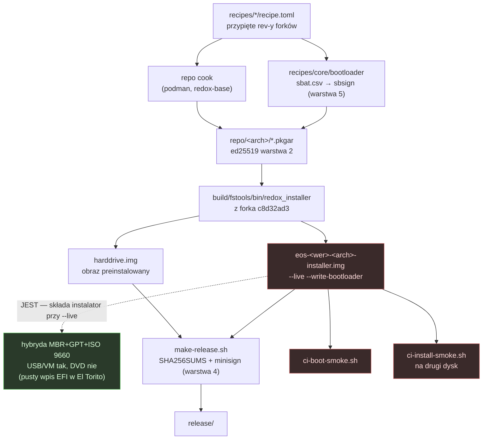
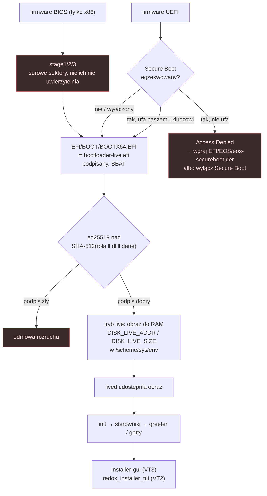
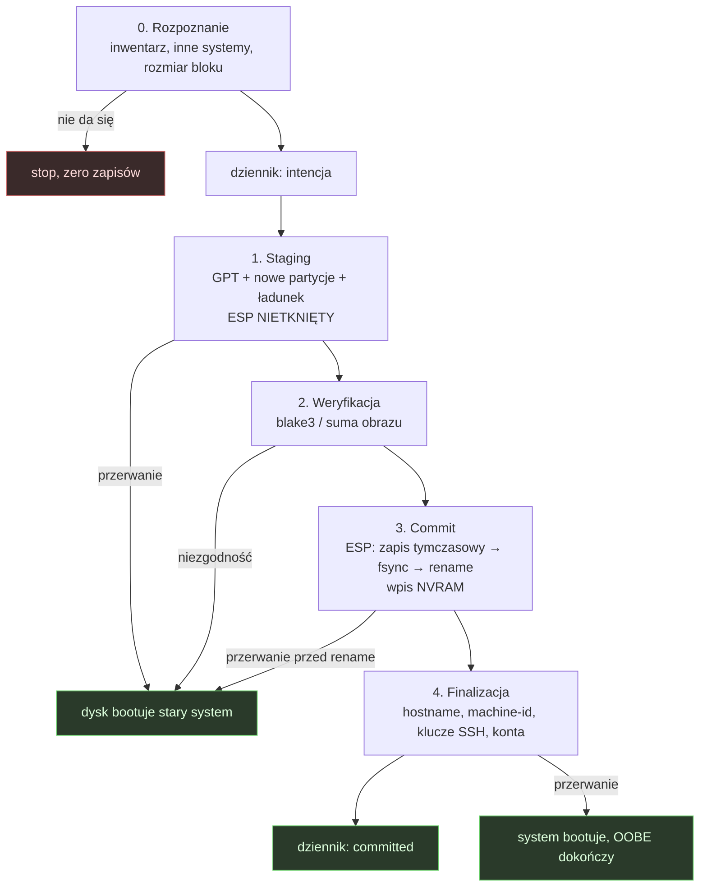

# Instalator E-OS na nośniku USB — specyfikacja

- **Status:** Propozycja — do zatwierdzenia. Nic z tego nie jest zaimplementowane.
- **Zakres:** nośnik USB, który instaluje **trwały system na dysk wewnętrzny**. Nie obraz do
  QEMU, nie sesja live jako cel sam w sobie.
- **Czego ten dokument NIE rozstrzyga:** strategii Secure Boot (rozstrzygnięta w
  [`ADR-0005`](../adr/0005-secure-boot-without-microsoft.md) i
  [`ADR-0006`](../adr/0006-path-to-microsoft-verification.md)) ani mechaniki aktualizacji
  (`docs/architecture/update-system.md`, epik `R-7xx`). Odwołuję się do nich; nie podejmuję ich od nowa.
- **Czego ten instalator nie robi i przed czym nie chroni: §13.** Przeczytaj tę sekcję, zanim
  zacytujesz którąkolwiek inną — reszta dokumentu opisuje, co ma powstać, a §13 mówi, czego
  nie będzie i po czym poznasz, że ktoś obiecał za dużo.

## Legenda znaczników

Każda zamówiona zdolność ma dokładnie jeden znacznik. Dokument bez znaczników byłby szkodliwy:
obiecywałby instalator linuksowy na systemie, który nie ma ani jednego z linuksowych klocków.

| Znacznik | Znaczenie |
|---|---|
| **JEST** | działa dzisiaj — z dowodem: plik:linia, nazwa binarki, pozycja `R-*` |
| **DO ZBUDOWANIA** | wykonalne na Redoksie bez nowego podsystemu |
| **NOWY PODSYSTEM** | wymaga zbudowania czegoś, czego Redox nie ma w ogóle |
| **NIEREALNE DZIŚ** | zależy od ekosystemu, którego nie ma i nie będzie szybko |

`[NIEZWERYFIKOWANE]` oznacza twierdzenie, którego **nie potwierdziłem**. Przy każdym takim
znaczniku piszę, co trzeba sprawdzić i gdzie.

**Poprawka do pierwszej wersji tego akapitu, zostawiona widoczna (`CLAUDE.md` §2 reguła 4).**
Stało tu, że każde twierdzenie o wnętrzu instalatora pochodzi z rejestru, „nigdy z odczytu kodu
na miejscu". Pierwsza połowa jest prawdziwa i zostaje: w **tym** klonie `recipes/core/installer/`
i `recipes/core/redoxfs/` zawierają wyłącznie `recipe.toml` (sprawdzone — po jednym pliku).
Druga połowa była błędna i miała koszt: kazała oznaczać jako niesprawdzalne rzeczy, które są
sprawdzone. `make` buduje z **osobnego klonu w `/work/redox`** (`CLAUDE.md` §20.1), gdzie
`recipes/*/source` jest rozwinięte — i stamtąd pochodzą cytaty ze źródła w tym dokumencie oraz
w `ADR-0007`…`ADR-0011`. Oznaczam je **[ze źródła]**. Cytat z rejestru (`ROADMAP.md`,
`ROADMAP.md`, `CHANGELOG.md`, harness) zostaje bez znacznika — to domyślne źródło.
**[zmierzone]** oznacza pomiar wykonany na zbudowanym artefakcie z `~/eos-artifacts/`; komenda
jest podana przy każdym takim twierdzeniu, żeby dało się je obalić.

---

## 1. Stan obecny — gdzie dokładnie jest luka

To jest najważniejsza sekcja dokumentu. Reszta jest projektem; ta część jest pomiarem.

### 1.1 Co realnie istnieje

| element | dowód |
|---|---|
| silnik instalacji `redox_installer` 0.2.42 | `Cargo.lock:896-898`; fork `eos-installer` rev `2aae3ace0bbf` (`recipes/core/installer/recipe.toml`, `repos.toml:107-117`) |
| GPT + ochronny MBR + ESP + RedoxFS | `R-F19`/`U-162`: na dysku docelowym zmierzono **2 tablice GPT**, `BOOTAA64.EFI` na ESP i **11 sygnatur RedoxFS** |
| FDE **przy instalacji** (AES-XTS-128) | `docs/guides/encryption.md`; `[general] encrypt_disk` albo monit `redoxfs password` |
| weryfikacja pakietów ed25519 + blake3 | `pkgar`; `V2-MS13`/`V2-MS14` domknięte (`U-223`) |
| ścieżka szybka (kopia blokowa z RAM) | `try_fast_install()`, `installer.rs:765`; naprawiona w `U-176` (`eos-installer c8d32ad`) |
| front-end tekstowy | **binarka** `redox_installer_tui` — **ta nazwa**, nie `installer_tui` (`scripts/ci-install-smoke.sh:23`); **plik źródłowy** to `src/bin/installer_tui.rs` [ze źródła]. Mylenie binarki z plikiem źródłowym kosztowało już jeden przebieg harnessu — dlatego oba są wypisane |
| front-end graficzny | `recipes/gui/installer-gui`, manifest `redox-installer-gui`, `binary=/usr/bin/redox_installer_gui`, `author=Jeremy Soller` (upstream) |
| silnik jest biblioteką, frontendy są trzy | `src/lib.rs` + `src/bin/installer.rs` (CLI budowania) + `src/bin/installer_tui.rs` (TUI); GUI to osobny crate w `gui/` z `redox_installer = { path = ".." }`, rysujący na natywnych prymitywach Redoksa — **bez Slinta/iced/egui** [ze źródła]. Granica silnik/frontend dziś **przecieka**: `installer_tui` ma własne `disk_paths()` i `choose_disk()` → `ROADMAP.md` §6.4 `R-603a` |
| artefakty budowania | `mk/disk.mk`: `harddrive.img` (cel w `:3`), `redox-live.iso` (`:20`), `filesystem.img` (`:37`) |
| **oba obrazy są hybrydami MBR + GPT + ISO 9660** | **[zmierzone]** na `~/eos-artifacts/eos-x86_64-live.iso` i `…-harddrive.img`: kod x86 pod offsetem 0, `EFI PART` pod 512, `CD001` pod 0x8001, deskryptor El Torito pod 0x8800; `file` → `ISO 9660 CD-ROM filesystem data (DOS/MBR boot sector) 'Redox OS' (bootable)`. Szczegóły i to, czego z tego **nie** wynika — §1.2 pkt 13 |
| układ partycji, jaki instalator tworzy dziś | **[zmierzone]** (`python3`, odczyt nagłówka GPT z LBA 1 i tablicy z LBA 2): **dokładnie trzy** partycje — `BIOS` 1 MiB (LBA 34–2047, typ `21686148-6449-6E6F-744E-656564454649`), `EFI` **1 MiB** (LBA 2048–4095), `REDOX` 1397 MiB (typ `0fc63daf-8483-4772-8e79-3d69d8477de4`, czyli *Linux filesystem data*). Zgadza się z odczytem `installer.rs:565-660` cytowanym w `system-updates.md` §1.4 |
| cele Make | `Makefile:10-24`: `live`, `image`, `popsicle`, `rebuild` |
| dowód end-to-end pod QEMU | `R-601` **UDOWODNIONE** (`U-176`): partycja → instalacja → reboot → login, **3× z rzędu** |
| podpisany bootloader na obu nośnikach | `ADR-0005`, `U-207`/`U-208`/`U-210`; kontrola negatywna: obcy klucz → `Access Denied` |
| bootloader weryfikuje jądro i initfs | `V2-MS02` (`U-212`), ed25519 nad `SHA-512(rola ‖ długość_le ‖ dane)`; dowód `scripts/eos-boot-verify-proof.sh` |
| `sbat.csv` w obu bootloaderach UEFI | `recipes/core/bootloader/sbat.csv`, wstrzykiwany **przed** podpisem (`V2-MS01`, `U-218`) |
| podpisane sumy wydania | `scripts/make-release.sh` + minisign (`R-301`) |

### 1.2 Czego brakuje do instalacji na goły sprzęt — bez łagodzenia

**1. Nośnik instalacyjny jest budowany, boot-smoke'owany, sumowany, podpisywany i publikowany
jako artefakt — `R-601a` domknięte (#4).**
Aktualizowane dwukrotnie 2026-09-01: rano ten punkt mówił „nie jest" o wszystkich czterech,
wieczorem — że brakuje jeszcze publikacji. Publikacja doszła tego samego wieczora.
Zmierzone: `.gitlab-ci.yml:430` i `:534` pytają `make -s print-installer-medium` i budują nośnik
na obu architekturach; `ci-boot-smoke.sh` przechodzi na nim (`boot-smoke: PASS` w przebiegu
nocnym 2026-09-01); `make-release.sh:67` pobiera jego nazwę tą samą komendą, `:94-96` kopiuje go
do `release/` i dokłada `sha256` do **tego samego** `SHA256SUMS`, który `:115` podpisuje
`minisign`. Podpis pokrywa więc artefakt, który użytkownik wypala.

Dawny pomiar `grep -c "redox-live" .gitlab-ci.yml` → **0** jest **nadal prawdziwy i już
bezprzedmiotowy**: nośnik nie nazywa się `redox-live`, tylko `eos-<wersja>-<arch>-installer.img`
(`R-611a`). Sonda mierzyła nazwę, która przestała istnieć — a zero wyglądało jak dowód braku.

**Co zostaje otwarte:** `R-601a` (#4) — publikacja nośnika jako **artefaktu do pobrania**.
Dziś zadanie publikuje `sha256sums-<arch>.txt` i SBOM, bo dwa obrazy po 1,4 GB nie mieszczą się
w limicie 1 GB na zadanie, a nieudana wysyłka zamieniała w pełni zieloną weryfikację w czerwień.
Jak to publikować — skompresowane, tylko na tagach, czy jako zasób wydania — jest decyzją, nie
brakiem implementacji.

**2. `ci-install-smoke.sh` jest wpięty w CI i obsługuje obie architektury; domknięty przebieg
ma na razie tylko aarch64.**
Zaktualizowane 2026-09-01. `grep -c "install-smoke" .gitlab-ci.yml` → **10**; harness jest
wołany w `build-image` (`:459`) i `build-image-x86_64` (`:569`), a dawna bariera
`only aarch64 is wired up` **nie występuje już w skrypcie** — jest jawna gałąź `x86_64)`
(`ci-install-smoke.sh:46`), a `exit 2` zostało tylko dla nieznanej architektury.

Dowód instalacji nie zależy już od ręcznego uruchomienia: nocny `build-image` przeszedł
2026-09-01 z `install-smoke: PASS — installed to a second disk and booted it to a login prompt`.

**Domknięte 2026-09-02 (#6).** Przebieg x86_64 przechodzi od nośnika po samodzielny rozruch
zainstalowanego dysku: *„PASS — installed to a second disk and booted it to a login prompt"*,
kod wyjścia 0, ze stage 2 włącznie. Przyczyną wcześniejszych odrzuconych logowań i pustej linii
zamiast numeru dysku **nie było** zgubienie znaków przez łącze szeregowe: sonda rozmiaru
terminala w `getty` czytała TTY i **połykała to, co użytkownik wpisał**. Poprawka to `266c4f4`
w `eos-userutils` (!49); kontrola negatywna — cofnięcie tego jednego commitu wyłącznie w drzewie
budowania przywraca awarię (*„saw a rejected login"*, FAIL).

**3. Ścieżka graficzna nie była testowana od końca do końca ani razu.**
`R-D08` mówi to wprost: *„zostaje pełny przepływ live → greeter → installer-gui → instalacja,
nigdy nietestowany od końca do końca (`R-601` udowodnił ścieżkę TUI, nie tę)"*. Front-end,
który polecamy w `docs/getting-started/install.md` §2 jako *„recommended"*, jest tym nieprzetestowanym.

**4. Kolejność zapisu na dysk docelowy jest odwrotna do bezpiecznej.**
Zmierzone i zapisane w harnessie: *„the ESP — and therefore `BOOTAA64.EFI` — is written
**BEFORE** the RedoxFS partition"* (`scripts/install-smoke-drive.py`, `run_install()`).
Konsekwencja na prawdziwym dysku: przerwana instalacja (zanik zasilania, wyjęty pendrive)
zostawia komputer, który **próbuje bootować** i nie ma czego załadować — zamiast maszyny, która
po prostu wraca do poprzedniego systemu. Ten sam harness opisuje, jak to wygląda: zabicie VM
w połowie zapisu i *„stage 2 then found an unbootable disk"*.

**5. Nie ma transakcji.** Brak stagingu, brak trwałego dziennika, brak wznawialności, brak
rollbacku. To nie jest przypuszczenie z instalatora — to udokumentowany kształt warstwy niżej:
`R-706` mówi, że `transaction.commit()` mutuje żywy system plików pętlą `rename` **bez
persystowanego dziennika**, a stan wznawiania jest wyłącznie w pamięci.

**6. Instalator kasuje cały dysk. Zawsze.** `R-609` (💡, `[P3·XL·any]`): *„dziś tylko
kasowanie całego dysku"*. Brak partycjonowania ręcznego, brak instalacji obok, brak zmiany
rozmiaru. `scripts/dual-boot.sh` **nie jest tego obejściem**: to skrypt upstreamowy, uruchamiany
na **hoście linuksowym**, wymagający `bootctl --print-esp-path` (czyli systemd-boot) i
`popsicle`, i — jak mówi `ROADMAP.md` §18.3 — **nigdy nie testowany przez E-OS**.

**7. Wybór dysku to gołe menu numeryczne.** `R-604`: *„Whole-disk-erase hides behind a bare
numeric menu / single 'Confirm' button with no disk identification"*. Harness potwierdza kształt:
oczekuje literału `Select a drive from 1 to`. Na maszynie z dwoma dyskami użytkownik wybiera
numer, nie urządzenie. To jest operacja nieodwracalna za jednym naciśnięciem klawisza.

**8. Rozmiar bloku jest zmyślony.** `R-607`: `DiskWrapper::open` **zawsze** raportuje 512, więc
strażnik 512 w `with_whole_disk` to martwy kod, a dyski 4Kn są odczytywane błędnie. Dysków 4Kn
nie ma w QEMU domyślnie — ta usterka ujawni się dopiero na metalu.

**9. Instalacja nie tworzy tożsamości maszyny.** `/etc/hostname` = `eos` dla **każdej**
instalacji (`config/aarch64/eos.toml:58-61`, `config/x86_64/eos.toml:59-63`), bo to plik
`postinstall` z konfiguracji obrazu. `R-606` nazywa to wprost i dokłada `machine-id` oraz klucze
hosta SSH (openssh jest w obrazie, klucze są niezarządzane). `R-603`: żaden front-end nie zbiera
konta, hostname'u ani lokalizacji — oba klonują domyślne z `base.toml`.

**10. Konta domyślne przechodzą przez instalację.** `config/base.toml:240-249`: `root` z hasłem
`password`, `user` bez hasła. `R-602` (wymuszenie zmiany hasła) jest **zrobione i zweryfikowane
na każdej ścieżce logowania**, więc ekspozycja jest zamknięta — ale tożsamość instalacji nadal
powstaje z obrazu, nie od użytkownika.

**11. Wydajność ścieżki wolnej jest nie do przyjęcia poza QEMU.** Zmierzone w `U-176`:
plik-po-pliku **31 plików/min, 0,101 MiB/s, ~6,8 h** dla 13 679 plików; ścieżka blokowa
**1,3 MB/s, 460 MB, ~6 min**. Ścieżka blokowa działa **tylko** przy rozruchu live, gdy bootloader
ustawił `DISK_LIVE_ADDR`/`DISK_LIVE_SIZE` w środowisku **jądra** (`/scheme/sys/env`, nie
`env::var()` — to była właśnie usterka `R-F24`). Instalacja z systemu zainstalowanego albo
z nośnika bez trybu live spada na ścieżkę 6,8-godzinną.

**12. Dwa różne instalatory w jednym drzewie budowania.**
`Cargo.toml` (pakiet `redox_cookbook`) ciągnie `redox_installer` **z upstreamu i bez `rev`**;
`Cargo.lock:896-898` przypina to na `1c2534e44c68`. Równocześnie `mk/fstools.mk` buduje binarkę
`build/fstools/bin/redox_installer` z **forka** (`recipes/core/installer/source`, rev
`c8d32ad3`). `src/bin/repo.rs:25,97,464` używa upstreamowego `redox_installer::Config` do
**parsowania konfiguracji filesystemu**, a fork **zapisuje** obraz. Producent i konsument
schematu to dwa różne drzewa kodu — dokładnie ta klasa usterki, którą komentarz w `Cargo.toml`
opisuje dla `redox-pkg` przy `V2-MS15`: *„a field added on one side simply did not exist on the
other"*. **Kontrola 6 w `scripts/ci-integrity.sh` tego nie łapie** — sprawdza receptury, nie
główny `Cargo.toml`. To jest sąsiad `R-610` (przepięcie zależności builda instalatora), ale nie
ta sama praca: `R-610` mówi o zależnościach *wewnątrz* instalatora, tu chodzi o zależność
*cookbooka od* instalatora.

**13. `.iso` JEST ISO — i to jest korekta pierwszej wersji tego punktu, nie doprecyzowanie.**

Stało tu: *„`.iso` nie jest ISO […] w drzewie nie ma śladu ISO9660 ani El Torito
(`grep -ril iso9660 recipes/ config/ docs/` → brak trafień)"*, z powołaniem na
`docs/getting-started/install.md` §4. **Oba twierdzenia są fałszywe**, a jedno z nich było fałszywe także jako
cytat: ten `grep` **daje trafienia** (`docs/adr/0007-…md` i ten plik). Pomiar na zbudowanym
artefakcie **[zmierzone]**:

| offset | wartość | znaczenie | `harddrive.img` | `redox-live.iso` |
|---|---|---|---|---|
| 0 | `31c0 8ed8 8ec0 8ed0…` | kod x86, sektor rozruchowy MBR | ✓ | ✓ |
| 512 | `EFI PART` | nagłówek **GPT** | ✓ | ✓ |
| 0x8001 | `CD001`, etykieta `Redox OS` | **ISO 9660**, deskryptor główny | ✓ | ✓ |
| 0x8801 | `CD001` + `EL TORITO SPECIFICATION` | deskryptor rozruchowy **El Torito** | ✓ | ✓ |
| 0x8000+80 | `21` | rozmiar woluminu ISO 9660 = **21 sektorów po 2048 B = 42 KiB** | ✓ | ✓ |

`file` na obu: `ISO 9660 CD-ROM filesystem data (DOS/MBR boot sector) 'Redox OS' (bootable)`.
Pliki mają identyczny rozmiar (1 468 006 400 B) i **różne** sumy SHA-256, więc to dwa różne
obrazy, a nie kopia.

**Co z tego naprawdę wynika — trzy rzeczy, i tylko trzy.**

1. **Zamówione „hybrydowe ISO dla USB i DVD" jest po stronie formatu spełnione: znacznik JEST.**
   Nie ma czego budować i nie wolno tego wpisywać jako pracy (§2.2, §11).
2. **System plików ISO 9660 to atrapa 42 KiB.** Ładunek — RedoxFS — leży w **trzeciej partycji
   GPT**, nie w ISO 9660. Bootloader i `lived` czytają surowe bloki, nie katalog ISO. Dlatego
   argument „bez sterownika ISO9660 płyta nie znajdzie roota" był postawiony na złej przesłance:
   roota **nie ma** w ISO 9660 na żadnym nośniku, także na pendrivie, i to nie przeszkadza.
3. **Katalog El Torito ma wpis EFI, który nigdzie nie prowadzi — i to jest usterka, nie
   ograniczenie.** **[zmierzone]** w katalogu pod LBA 19: wpis domyślny `88 04 00 00 ee 00 01 00`
   (platforma 0x00 = x86, emulacja dysku twardego, Load RBA 0 — poprawny trik isohybrid) oraz
   nagłówek sekcji `91 ef 01 00` (platforma **0xEF = EFI**) ze wpisem `88 00 … 02 00 … 02 00 00 00`,
   czyli **Load RBA 2 (bajt 4096), 2 sektory**. Pod bajtem 4096 są **same zera** (odczytane) —
   ESP zaczyna się dopiero pod bajtem 1 048 576. Firmware uruchamiające nośnik **jako napęd
   optyczny w trybie UEFI** pójdzie za tym wpisem i nie znajdzie obrazu PE.

**Znacznik dla rozruchu z DVD: NIEREALNE DZIŚ**, i to z dwóch niezależnych powodów, z których
**żaden nie jest brakiem sterownika ISO 9660**: (a) pusty wpis EFI w El Torito, (b) w drzewie
nie ma **uruchomionego** sterownika napędu optycznego — **korekta 2026-09-04:** pierwotny pomiar `grep -ril 'atapi\|cdrom\|optical' recipes/ config/` szukał w plikach `recipe.toml`, więc nie mógł znaleźć źródeł sterownika; w `eos-base` `ahcid/src/ahci/disk_atapi.rs` ścieżka odczytu istnieje i czeka na pierwszy przebieg (`R-815`). Dla rozruchu z DVD to bez znaczenia, bo bootloader nie korzysta z `ahcid`
daje `recipes/libs/mesa` i `recipes/wip/security/breakmancer`, nic sterownikowego.
**`[NIEZWERYFIKOWANE]`, czy pusty wpis EFI jest usterką narzędzia z upstreamu, czy skutkiem
naszej konfiguracji** — sprawdzić w `eos-installer` kod składający El Torito i porównać z
nietkniętym obrazem upstreamu.

**Czego ten punkt nie zdejmuje z listy usterek.** `docs/getting-started/install.md` §4 twierdzi
*„Despite the `.iso` name it is a **raw GPT image with a protective MBR**, so `dd` is the right
tool (not an ISO burner)"*. Zdanie o `dd` jest dobrą radą; zdanie o formacie jest **nieprawdziwe**
i to jest wada dokumentacji do naprawienia w `R-608` — dokument opisujący nieistniejący stan
jest wadą, nie kosmetyką (`CLAUDE.md` §2). Ventoy i Rufus w trybie ISO **mogą** zadziałać,
skoro obraz jest hybrydowy; **nikt tego nie sprawdził**, więc do czasu przebiegu z macierzy
`R-607b` obiecujemy wyłącznie `dd`.

**14. `scripts/ventoy.sh` nie zna konfiguracji `eos`.** Ma zaszyte `CONFIGS=(demo desktop)`
i `ARCHS=(i686 x86_64)` — `R-F28`. Zbuduje i skopiuje cudze obrazy.

**15. Zero pomiarów ze sprzętu.** `ROADMAP.md` §18: *„Nic w tym repozytorium nigdy nie
działało na fizycznym sprzęcie — każda weryfikacja to QEMU"*. `ROADMAP.md` §14.1 powtarza:
*„`R-601` udowodnione wyłącznie pod QEMU/TCG"*.

**16. Braki systemowe, które ograniczają nośnik instalacyjny.** Brak Wi-Fi, brak zapory (`C-10`),
brak trwałego dziennika audytu (`C-9`), brak konta awaryjnego (`C-18`), brak piaskownicy (`C-5`).
*(Pozycje `C-*` pochodzą z `docs/audit/03-security-audit-2026-08-30.md` na gałęzi
`fix/p0-audit-findings`. **Nie otwierałem tego pliku** — polecenia `git` są w tym zadaniu
zabronione, a na gałęzi roboczej pliku nie ma. `[NIEZWERYFIKOWANE]` co do dokładnego brzmienia;
sprawdzić: `git show fix/p0-audit-findings:docs/audit/03-security-audit-2026-08-30.md`.)*

### 1.3 Jedno zdanie podsumowania

**Projekt ma udowodniony silnik instalacji i nie ma nośnika instalacyjnego jako produktu.**
Silnik przechodzi partycja → instalacja → reboot → login trzy razy z rzędu pod emulacją. Wokół
niego nie ma: budowania w CI, sum kontrolnych, podpisu, testu ścieżki graficznej, transakcji,
wznawialności, identyfikacji dysku, tożsamości maszyny ani jednego uruchomienia na metalu.

---

## 2. Potok budowania obrazu

### 2.1 Decyzja B1 — artefakt kanoniczny i jego nazwa

**Jeden artefakt nośnika na architekturę:** `eos-<wersja>-<arch>-installer.img` — obraz hybrydowy
(MBR + GPT + atrapa ISO 9660), zapisywany przez `dd`. To jest pozycja **`R-611a`**
(`ROADMAP.md` §6.3) — nie zakładam dla niej nowej nazwy.

**Uzasadnienie poprawione po pomiarze z §1.2 pkt 13.** Pierwsza wersja uzasadniała zmianę nazwy
tym, że „plik nie jest ISO". To było fałszywe. Powód, który zostaje i wystarcza: rozszerzenie
`.iso` **obiecuje płytę**, a rozruch z płyty nie działa (pusty wpis EFI w El Torito, brak
sterownika napędu optycznego), natomiast nazwa `redox-live.iso` nie mówi ani czyj to system,
ani jaka wersja, ani że to **instalator**. Nazwa artefaktu jest częścią umowy z użytkownikiem.

**Znacznik: DO ZBUDOWANIA.** Zmiana celu w `mk/disk.mk:20` (dziś zna wyłącznie `redox-live.iso`,
tak samo `Makefile:10`) plus poprawka `docs/getting-started/install.md` (`R-608`). Zawartość bajtowa jest ta sama.

### 2.2 Decyzja B2 — hybrydowe ISO już jest zbudowane; do zrobienia został wpis EFI

**Cała ta sekcja jest przepisana po pomiarze (§1.2 pkt 13).** Pierwsza wersja mówiła, że hybrydę
trzeba **zbudować** przez `xorriso -as mkisofs` i dodać `xorriso` do
`podman/redox-base-containerfile`. To było podwójnie błędne: hybryda **jest** budowana już dziś,
a `xorriso` w drzewie **jest** — jako receptura `recipes/wip/tools/xorriso/recipe.toml`
(z nagłówkiem `#TODO can't recognize the redox target`) obok `recipes/wip/tools/mkisofs-rs`
(`#TODO compiled but not tested`). Obie to receptury **dla Redoksa**, nie dla hosta budowania,
i żadna nie jest w ścieżce `mk/disk.mk`.

Stan po pomiarze, rozbity na to, co działa i co nie:

| element | znacznik | dowód |
|---|---|---|
| MBR + GPT + ISO 9660 + El Torito w jednym pliku | **JEST** | §1.2 pkt 13, tabela offsetów |
| wpis El Torito dla platformy x86 (emulacja dysku, RBA 0) | **JEST** | katalog pod LBA 19 |
| rozruch z USB przez GPT/ESP | **JEST** | `U-208`, `U-210`, `R-601` |
| wpis El Torito dla platformy **EFI** wskazuje **puste bajty** | **DO ZBUDOWANIA** | Load RBA 2 → bajt 4096 = same zera; ESP jest pod 1 048 576 |
| sterownik napędu optycznego (ATAPI / SCSI MMC) | **DO ZBUDOWANIA** (odczyt danych), `[NIEZWERYFIKOWANE]` | **korekta 2026-09-04:** „brak w `recipes/`" było błędem pomiaru — `recipes/` trzyma `recipe.toml`, nie źródła sterowników. W `eos-base` (`eos-july` @ `816546df`) `ahcid/src/ahci/disk_atapi.rs` ma ścieżkę odczytu ATAPI (IDENTIFY PACKET, READ CAPACITY, READ(10)) na SATA x86_64, nigdy nie uruchomioną; brak eject, zmiany nośnika, audio, IDE (`ided/src/main.rs:126` `//TODO: probe ATAPI`), aarch64 i zapisu. Rozruchu z DVD to nie zmienia: bootloader czyta bloki sam (`R-815`, ROADMAP §14.4) |
| rozruch z DVD end-to-end | **NIEREALNE DZIŚ** | wymaga obu powyższych |

**Decyzja:** utrzymujemy hybrydę, bo jej mamy za darmo, i **nie obiecujemy DVD**. Naprawa wpisu
EFI w El Torito jest tania i warta zrobienia — nie dla płyt, tylko dlatego, że **wpis, który
wskazuje zera, to kontrola udająca zdolność**, a takich w tym projekcie nie zostawiamy. Wpinam
ją jako rozszerzenie zakresu `R-611d` (hybrydowe ISO, wygoda dla Ventoya i VM), a nie jako nową
pozycję. Napisanie tego wprost w `docs/getting-started/install.md` jest tańsze niż jedno zgłoszenie
*„płyta się nie uruchamia"*.

### 2.3 Wymagania hosta budowania

| wymaganie | stan |
|---|---|
| rootless Podman + `podman/redox-base-containerfile` | **JEST** (`mk/podman.mk`, `docs/getting-started/building.md`) |
| `rustup`, `cbindgen`, `nasm`, `just` przy `PODMAN_BUILD=0` | **JEST** (`mk/depends.mk`) |
| `sbsigntool` w obrazie bazowym, nie z `apt-get` w czasie `cook` | **JEST** — `V2-MS05` domknięte (`U-218`) |
| `CI=1` przy budowaniu nieinteraktywnym | **JEST** (`docs/getting-started/building.md`, panika `repo.rs:1693`) |
| narzędzie do złożenia hybrydy ISO | **JEST** — składa ją sam instalator przy `--live`; `xorriso` **nie jest** do tego potrzebny na hoście. (`recipes/wip/tools/xorriso` i `recipes/wip/tools/mkisofs-rs` to receptury **dla Redoksa**, obie z `#TODO` w pierwszej linii, poza ścieżką budowania obrazu) |
| reprodukowalność bajtowa obrazu i binarki EFI | **DO ZBUDOWANIA** — `R-303` / `V2-MS07`, otwarte |
| architektura budowania: `.config` ustawia `ARCH?=aarch64` | **JEST** — `make CI=1 all` buduje aarch64, mimo że `docs/getting-started/building.md` twierdzi `x86_64`; ARCH trzeba podać jawnie (`ROADMAP.md` §18 §0.1) |

### 2.4 Decyzja B3 — sumy kontrolne i podpisy: wepnij się, nie wymyślaj

Projekt ma **pięć warstw kluczy** (`docs/reference/keys-and-tokens.md` §6a). Nośnik instalacyjny dotyka czterech:

| warstwa | co podpisuje | dla nośnika znaczy |
|---|---|---|
| 2 — ed25519 pkgar | pojedyncze `.pkgar` | ładunek instalowany na dysk |
| 3 — ed25519 + ML-DSA-65 | `repo.toml` (indeks) | tylko ścieżka sieciowa (`R-605`) |
| 4 — minisign | `SHA256SUMS` wydania | **plik, który użytkownik pobiera** |
| 5 — Secure Boot | `bootloader{,-live}.efi` | to, co uruchamia firmware |

**Decyzja:** nośnik instalacyjny wchodzi do **warstwy 4**, czyli do istniejącego
`scripts/make-release.sh`, przez rozszerzenie jego pętli o drugi artefakt na architekturę.
**Nie tworzymy drugiego mechanizmu podpisu.** To jest pozycja **`R-611b`** (`ROADMAP.md` §6.3).
Konkretna zmiana:

```
for arch in $ARCHES; do
  package  build/$arch/eos/harddrive.img              -> eos-<ver>-<arch>.img
  package  build/$arch/eos/eos-<ver>-<arch>-installer.img   # NOWE
  sha256sum oba >> SHA256SUMS
done
minisign -Sm SHA256SUMS
```

Zachowujemy istniejący opór: `make-release.sh` **odmawia** złożenia niepodpisanego wydania,
chyba że operator poda `EOS_ALLOW_UNSIGNED=1` (`U-120`). Ten opór jest wart więcej niż nowy
mechanizm.

**Jak ta kontrola wygląda, gdy zawodzi.** Dziś nie ma jak — bo nośnika nie ma w pętli, więc
brak jego sumy **nie jest błędem**, tylko ciszą. Po zmianie: brak `eos-<ver>-<arch>-installer.img`
kończy skrypt kodem ≠ 0 z nazwą brakującego pliku, tak samo jak dziś dla `harddrive.img`
(`make-release.sh:22-25`). To jest różnica między kontrolą a dekoracją.

### 2.5 Decyzja B4 — CI buduje nośnik i go boot-smoke'uje

**Znacznik: DO ZBUDOWANIA**, rozszerzenie `R-601` i zadania `build-image`. W rejestrze rozpisane
jako **`R-601a`** (budowanie i eksport nośnika), **`R-601b`** (harness startuje **z nośnika** i
jest wpięty w CI) i **`R-601c`** (ten sam harness na x86_64) — `ROADMAP.md` §6.3. Nie zakładam
dla tego nowej pozycji.

Do `.gitlab-ci.yml`, zadanie `build-image` (runner `eos-heavy`), po `make CI=1 all`:

**Zaktualizowane 2026-09-01: pierwsze trzy pozycje są zrobione, została czwarta.**

1. ~~budowa nośnika~~ — **jest**: `.gitlab-ci.yml:430` i `:534` pytają
   `make -s print-installer-medium` i budują go na obu architekturach. Nośnik nie nazywa się
   już `live` ani `redox-live`, tylko `eos-<wersja>-<arch>-installer.img` (`R-611a`);
2. ~~`ci-boot-smoke.sh` na nośniku~~ — **jest**: `:441` i `:551`, obok przebiegu na
   `harddrive.img`. Oba przeszły w nocnym `build-image` 2026-09-01;
3. ~~`ci-install-smoke.sh` z nośnika~~ — **jest**: `:459` i `:569`. aarch64 przeszedł
   end-to-end; x86_64 również, od 2026-09-02 (#6);
4. ~~eksport nośnika jako artefaktu~~ — **jest** (`R-601a`, #4, domknięte 2026-09-01). Oba
   obrazy są kompresowane `zstd -3 -T0` i publikowane obok `sha256sums-<arch>.txt` i SBOM-u.
   Zmierzone w przebiegu nocnym: `harddrive-aarch64.img` → **173 MB**,
   `eos-0.2.0-aarch64-installer.img` → **173 MB**, artefakt **345 MB** przy limicie 1 GB,
   `Uploading artifacts … 201 Created`. Sumy kontrolne zostają nad obrazami **surowymi** —
   weryfikuje się plik, który się zapisuje na dysk, nie opakowanie transportowe.

Krok 3 jest ciężki: `EOS_SMOKE_MEM=4096`, emulacja TCG, ścieżka blokowa ~6 min plus rozruchy.
Mieści się w `timeout: 6h` zadania. Uruchamiany na harmonogramie, nie na każdym commicie.

**Jak ta bramka zawodzi — bo bez tego jest dekoracją (`CLAUDE.md` §13, `U-177`).** Trzy tryby
porażki, każdy z innym komunikatem, bo wymagają przeciwnych reakcji:

| tryb | co się dzieje | jak ma wyglądać | kontrola negatywna |
|---|---|---|---|
| **cisza** | nośnik nie powstał, krok 2 dostaje nieistniejący plik i „nic nie znalazł" | `FAIL: brak build/$ARCH/eos/eos-*-installer.img` i kod ≠ 0 **przed** uruchomieniem QEMU | usuń plik przed krokiem 2 → job czerwony |
| **fałszywe zielone** | harness startuje **ze starego** `harddrive.img`, bo ścieżka się nie zmieniła, i przechodzi | krok 2 wypisuje sumę SHA-256 pliku, który realnie uruchamia | podstaw obraz bez instalatora → **FAIL**, nie PASS |
| **awaria przyrządu** | brak `qemu-system-*`, brak firmware'u edk2, padnięty runner | `FAIL (instrument):` — **inny** komunikat niż wykryta usterka | zdejmij QEMU z runnera → komunikat instrumentu, nie „nośnik nie bootuje" |

Trzeci wiersz nie jest ostrożnością na wyrost, ale jego przykład jest już nieaktualny.
Bariery `only aarch64 is wired up` **nie ma w skrypcie** (0 trafień): jest jawna gałąź
`x86_64)` (`ci-install-smoke.sh:46`), a `exit 2` został dla **nieznanej** architektury.
Od 2026-09-02 x86_64 nie tylko nie pomija się cicho — **przechodzi** (#6). Wygasanie na
wyborze dysku brało się z sondy rozmiaru terminala w `getty`, która połykała wpisane znaki;
po `266c4f4` harness domyka obie architektury.

### 2.6 Klucze na maszynie budującej — ryzyko nazwane

Klucz podpisujący pakiety (warstwa 2) **generuje się sam**: `src/cook/package.rs` tworzy nową
parę, gdy `build/id_ed25519.toml` nie istnieje, a `build/` jest kasowany rutynowo
(`docs/reference/keys-and-tokens.md`, `U-213`). Podpisał już 78 opublikowanych pakietów. Sekret jest zapisany
**jawnym tekstem** (`skey` = 128 znaków hex = 64 bajty surowego klucza), chroniony trybem `600`
i `.gitignore`. Kopia zapasowa istnieje i jest zweryfikowana (`V2-MS12`, `U-216`), ale obie
kopie leżą na **jednym komputerze**.

Dla nośnika instalacyjnego znaczy to jedno: **łańcuch zaufania kończy się na maszynie
budującej**, i tego dokument ma nie zamazywać. To odpowiada znalezisku `C-11`.

### 2.7 Potok — diagram



Czerwone bloki **nie istnieją dziś** w tej postaci: nośnik nie wchodzi do wydania i nie jest
testowany w CI. Zielona hybryda **jest** budowana już dziś — pierwsza wersja tego diagramu
malowała ją na czerwono i to było błędne (§1.2 pkt 13).

---

## 3. Rozruch

### 3.1 Secure Boot — decyzja jest podjęta, tu są jej skutki

`ADR-0005` rozstrzyga: **własny klucz, zaufanie wnosi właściciel maszyny; świadomie nie idziemy
przez shim podpisany przez Microsoft.** `ADR-0006` to potwierdza i dokłada „tor B" — osiem
przygotowań, które mają wartość niezależnie od Microsoftu. Nie otwieram tego ponownie. Poniżej
tylko to, co z tych decyzji **wynika dla nośnika instalacyjnego**.

**Co już z tego działa (JEST):**

- Podpis następuje **w recepturze bootloadera**, podczas `cook`, gdy operator poda klucz
  w `build/sb-signing/{mok.key,mok.crt}` (`recipes/core/bootloader/recipe.toml`). Bez klucza —
  niepodpisane, jawnie, bez cichej degradacji do fałszywego „podpisano".
- Instalator składa ESP nośnika **z paczki `bootloader.pkgar`** (`fetch_bootloaders` czyta
  `usr/lib/boot/bootloader-live.efi`), więc podpisanie kopii z `--write-bootloader` niczego nie
  dawało — to była realna pomyłka, naprawiona u źródła (`U-207`).
- **Oba nośniki są pokryte** (`U-208`, `U-210`): live ISO i `harddrive.img` bootują pod firmware
  z Secure Bootem, gdy firmware ufa naszemu kluczowi; z obcym → `Access Denied`.
- `sbat.csv` jest wstrzykiwany **przed** podpisem, bo Authenticode pokrywa całą binarkę
  i sekcja dodana po `sbsign` niszczy podpis (`V2-MS01`).
- BIOS-owy `bootloader.bios` **celowo nie dostaje SBAT** — to płaski obraz NASM bez tablicy
  sekcji PE, a żadne firmware nie czyta SBAT w rozruchu legacy. Twardy budżet 384 KiB pozostaje
  nienaruszony.

**Co nośnik musi dołożyć (DO ZBUDOWANIA):**

1. **Certyfikat na nośniku.** Nośnik ma wieźć `EFI/EOS/eos-secureboot.der` (postać DER, bo tego
   oczekują menedżery kluczy w firmware) plus krótką instrukcję w `EFI/EOS/README.txt`. Dziś
   użytkownik dostaje instrukcję w dokumentacji, a certyfikat musi zdobyć osobno.
2. **Ekran „Secure Boot" w instalatorze.** Jedno pytanie i trzy odpowiedzi: *wgrałem certyfikat*
   / *wyłączyłem Secure Boot* / *nie wiem*. Trzecia odpowiedź prowadzi do ekranu, który mówi,
   co dokładnie zrobić w firmware tej maszyny na tyle, na ile da się to wykryć.
3. **Zapis do dziennika instalacji, w jakim trybie poszła instalacja.** Bo „nie bootuje po
   instalacji" i „firmware odrzuca nasz bootloader" to dwa różne zgłoszenia i mają różne naprawy.

**Czego nośnik NIE dostaje:**

- **shim + MOK — NIEREALNE DZIŚ.** `ADR-0006` mierzy przeszkody: rejestr osoby prawnej,
  certyfikat EV, dwa kontakty bezpieczeństwa z PGP, klucz w module **FIPS 140-2 Level 2**, oraz
  — najgorsze — **okno podwójnego podpisu zamknęło się 27 czerwca 2026**. Shim wydany dziś jest
  podpisany **wyłącznie** przez `Microsoft UEFI CA 2023`; maszyna mająca w `db` tylko
  `Microsoft Corporation UEFI CA 2011` takiego shima nie uruchomi. Ścieżka shim daje dziś
  pokrycie sprzętu **węższe** niż dwa lata temu. `V2-MS11` (chainload przez shim) jest w
  roadmapie jako 💡 i jest bezcelowy przed `V2-MS10`, które **nie jest decyzją techniczną**.
- **`sbat.csv` per-nośnik.** Mamy jeden wpis generacji dla bootloadera
  (`eos-bootloader,1,E-OS,eos-bootloader,0.1.0,…`) i to wystarczy. Osobna linia SBAT dla nośnika
  byłaby dekoracją: firmware unieważnia binarkę, nie płytę.

### 3.2 Decyzja R1 — bootloader nośnika pozostaje nasz

Rozważam GRUB2, systemd-boot i rEFInd uczciwie, bo są to standardowe odpowiedzi na „nośnik
instalacyjny". Wszystkie trzy odrzucam, i to nie z przywiązania.

**Co byśmy stracili.** `V2-MS02` (`U-212`) dał bootloaderowi weryfikację **jądra i initfs**
podpisem ed25519 nad `SHA-512(rola ‖ długość_le ‖ dane)`, z separacją domen (`e-os.boot.kernel`
vs `e-os.boot.initfs`), tak że poprawnie podpisany initfs **nie może** zostać przyjęty jako
jądro. Klucz publiczny jest **wkompilowany w binarkę bootloadera**, i to jest cała pointa: ta
binarka jest jedynym artefaktem, który uwierzytelnia firmware (`V2-N03`). Klucz leżący obok
jądra na dysku zostałby po prostu podmieniony razem z nim. Dowód nie jest deklaracją —
`scripts/eos-boot-verify-proof.sh` uruchamia **dwa** przypadki, bo jeden nie jest dowodem:
nietknięty obraz bootuje, obraz z jednym przestawionym bajtem w `usr/lib/boot/kernel` jest
**odrzucony**.

| wariant | co wnosi | co niszczy | werdykt |
|---|---|---|---|
| **GRUB2** | znajomość, menu, `os-prober` | nie umie RedoxFS ani formatu jądra Redoksa, więc musiałby **chainloadować nasz bootloader** — czyli dokładamy warstwę, która **nic nie weryfikuje**, i to ona jest tym, co podpisuje firmware. Łańcuch `V2-MS02` przestaje zaczynać się od korzenia zaufania. Dodatkowo: GRUB2 to setki tysięcy linii C w ścieżce rozruchu systemu, którego cała teza brzmi „mikrojądro w Ruście" | **odrzucony** |
| **systemd-boot** | prosty, mały, czyta ESP | ten sam problem chainloadu; wymaga wpisów `loader/entries` na ESP i konwencji `systemd`, których nie mamy; podpisany jest kluczem dystrybucji, nie naszym — więc i tak trzeba by go podpisać samemu, a wtedy jedyne, co zyskujemy, to cudze menu | **odrzucony** |
| **rEFInd** | najlepszy z trzech: to menu, a nie loader; ładny wybór systemów | dalej chainload; dalej drugi łańcuch zaufania; a funkcję, której realnie chcemy — **wykrycie, że na dysku jest inny system** — potrzebujemy w **instalatorze** (`R-604`, `R-609`), nie w bootloaderze | **odrzucony** |

**Decyzja:** nośnik uruchamia wyłącznie `bootloader-live.efi` z paczki `bootloader.pkgar`,
podpisany naszym kluczem, weryfikujący jądro i initfs. Menu wyboru systemów przy dual-boocie
rozwiązujemy **wpisem w NVRAM firmware** (`efibootmgr`-owy odpowiednik, patrz §7.5), a nie
przez wprowadzanie cudzego bootloadera. **Znacznik: JEST** dla samego bootowania nośnika,
**DO ZBUDOWANIA** dla wpisu NVRAM.

### 3.3 Legacy BIOS

| element | stan |
|---|---|
| `bootloader.bios`, `bootloader-live.bios` | **JEST**, ale tylko dla `i586`/`i686`/`x86_64` (`recipes/core/bootloader/recipe.toml`) |
| budżet rozmiaru | twarde 384 KiB, nienaruszalne |
| SBAT | **celowo brak** — patrz §3.1 |
| weryfikacja jądra na BIOS-ie | jest, ale **nie jest kotwicą zaufania**: `docs/security/threat-model.md` — *„stage1/2/3 to surowe sektory, których nic nie uwierzytelnia, więc kto może zapisać jądro, może podmienić weryfikator"* |
| aarch64 | **wyłącznie UEFI** — bootloader BIOS nie jest budowany |

**Decyzja:** BIOS jest wspierany jako **tor B, bez obietnicy integralności rozruchu**.
Instalator na maszynie BIOS-owej ma to napisać na ekranie — nie w dokumentacji, na ekranie.

**Rozstrzygnięte, było `[NIEZWERYFIKOWANE]`.** Pytanie brzmiało, czy rozruch z GPT na BIOS-ie
idzie przez partycję BIOS boot, czy przez lukę za ochronnym MBR-em. **Przez partycję BIOS boot**:
**[zmierzone]** na zbudowanym obrazie to **partycja nr 1**, typ GPT
`21686148-6449-6E6F-744E-656564454649`, LBA 34–2047, czyli 1 MiB (§1.1). Zgadza się z odczytem
`installer.rs:565-660` cytowanym w `system-updates.md` §1.4 i w `ADR-0007`. Konsekwencja
praktyczna: partycja BIOS boot jest tworzona **zawsze**, także na maszynach czysto UEFI, gdzie
jest martwym megabajtem — koszt do zaakceptowania, ale nie do przemilczenia w projekcie układu
partycji (§5.2).

### 3.4 Ścieżka rozruchu nośnika — diagram



---

## 4. Środowisko uruchomieniowe instalatora

### 4.1 Live root

**JEST.** Bootloader w trybie live wczytuje **cały** obraz systemu plików do RAM i eksportuje
`DISK_LIVE_ADDR`/`DISK_LIVE_SIZE` **do środowiska jądra** (`/scheme/sys/env`), skąd czyta je
`lived` (`eos-base`, `drivers/storage/lived/src/main.rs:124`) oraz — od `U-176` — instalator.
Menu bootloadera podaje **dostępną akcję**, nie stan: na nośniku live pisze *„Press l to
**disable** live mode"*, na `harddrive.img` *„enable"*. Ta pułapka kosztowała jeden nieudany
przebieg harnessu i jest udokumentowana w `install-smoke-drive.py`.

**Konsekwencja wymagająca powiedzenia wprost:** `filesystem_size = 1400` (MiB) dla obu
architektur (`config/{aarch64,x86_64}/eos.toml`). Harness pracuje z `EOS_SMOKE_MEM=4096`.
**Wymóg minimalny nośnika: 4 GiB RAM.** Nie 2, nie „zależy". Ten fakt należy do ekranu
powitalnego instalatora i do strony pobierania.

W trybie live *„cały obraz jest wczytywany do RAM **nieweryfikowany**, zanim jądro zostanie
z niego wzięte"* (`docs/security/threat-model.md`). To ograniczenie `V2-MS02`, a nie jego obejście —
i jest w modelu zagrożeń zapisane. Zamknięcie tej luki (weryfikacja obrazu live przed pivotem)
to **NOWY PODSYSTEM** w bootloaderze i nie jest tu obiecywane.

### 4.2 Wykrywanie sprzętu

**JEST, w kształcie jednorazowym i statycznym:**
`hwd` → `pcid` → `pcid-spawner` dopasowuje po **skompilowanym katalogu rozrzuconym na trzech
właścicieli**: `initfs.toml` + `usr/lib/pcid.d/*.toml` + `xhcid/drivers.toml`
(`ROADMAP.md` §`R-8xx`). Wiązanie jest **jednorazowe przy starcie** (`R-805`).

Ograniczenia, które nośnik odziedziczy i o których musi mówić prawdę:

| ograniczenie | pozycja |
|---|---|
| `pcid` skanuje tylko bus 0, 0x80 i mostki — brak wielosegmentowego ECAM/MCFG | `R-809` |
| urządzenia platformowe ACPI/DT są **enumerowane, ale nigdy nie wiązane** | `R-808` |
| `hwd` uruchamia `acpid` tylko na backendzie ACPI — na aarch64/DT nie startuje | `R-811` |
| katalog jest wewnętrznie niespójny: `ac97d`, `vboxd`, initfs `ahcid`/`ided` wskazują na binaria **nieobecne** na aarch64 | `R-803`, `ROADMAP.md` §8.2 |
| brak trwałej listy „urządzenie jest, sterownika brak" | `R-807` |

**Decyzja S1 — instalator wypisuje inwentarz przed instalacją.** Ekran „Ten komputer" z listą:
co wykryto, co związano, czego nie da się obsłużyć. Bez tego pierwsze uruchomienia na metalu
dadzą zgłoszenia typu *„nie działa"* zamiast danych. **Znacznik: DO ZBUDOWANIA** na dziś
(odczyt `/scheme/pci` + portów `xhcid`), a docelowo to jest po prostu klient `R-801`
(`eos-devd`, `/scheme/devices`) — **to ta sama praca, nie nowa pozycja**.

### 4.3 Firmware i sterowniki zamknięte — polityka

**Decyzja P1: nośnik instalacyjny nie wiezie żadnego zamkniętego bloba firmware.**

Uzasadnienie nie jest ideologiczne, tylko rachunkowe: (a) mechanizmu ładowania firmware
w E-OS **nie ma** — `firmware-loader` istnieje u Red Bear OS i jest wymieniony jako materiał do
zapożyczenia (`ROADMAP.md` §18), nie jako nasz komponent; (b) licencyjnie blob
w AGPL-owym obrazie wymagałby osobnej ścieżki dystrybucji; (c) sprzęt, który realnie by na tym
zyskał (NVIDIA GSP, Wi-Fi) jest i tak poza zasięgiem z innych powodów.

| przypadek | znacznik |
|---|---|
| mechanizm ładowania firmware w przestrzeni użytkownika | **NOWY PODSYSTEM** |
| firmware GPU NVIDIA (GSP) | **NIEREALNE DZIŚ** — `ROADMAP.md` §18 §5: *„czego nie robić na start"* |
| firmware Wi-Fi | **NIEREALNE DZIŚ** — nie ma stosu Wi-Fi w ogóle |
| mikrokod CPU | **NIEREALNE DZIŚ** — aktualizacja mikrokodu wymaga wsparcia jądra, którego nie ma `[NIEZWERYFIKOWANE]`; sprawdzić w `eos-kernel`, `src/arch/x86_64` |

Gdyby polityka miała się kiedyś zmienić, właściwym miejscem jest osobny ADR, nie ten dokument.

### 4.4 Sieć na nośniku

| zdolność | stan |
|---|---|
| Ethernet IPv4 + DHCP + DNS, automatyczne podniesienie | **JEST** — netstack `smoltcp`, `e1000d`/`rtl8139d`/`rtl8168d`/`ixgbed`/`virtio-netd`/`usbnetd` |
| panel sieciowy **w instalatorze** (przed instalacją) | **JEST** — `R-902`, `eos-installer ed6eb7c` (`U-132`) |
| Wi-Fi | **NIEREALNE DZIŚ** — brak stosu; tier T3 w `R-9xx` |
| IPv6 | **DO ZBUDOWANIA** — `R-903`, netstack kompilowany `proto-ipv4` only, DNS tylko A |
| wiele kart naraz | **DO ZBUDOWANIA** — `R-905`, netstack wiąże tylko pierwszą |
| zapora | **NIEREALNE DZIŚ** na czas nośnika — `R-904`, `C-10` |

**Decyzja N1: instalacja jest w pełni offline i to jest tryb domyślny.** Cały ładunek jest na
nośniku; sieć służy wyłącznie do rzeczy opcjonalnych (pobranie nowszego zestawu pakietów,
zgłoszenie raportu sprzętowego). Nie jest to ustępstwo — to zgodne z `R-605`, które mówi wprost:
*„keep offline live-clone as default"*. Laptop bez portu Ethernet zainstaluje system, tylko bez
sieci po instalacji, i instalator ma to powiedzieć **przed** instalacją, nie po.

### 4.5 Dostępność

Stan faktyczny jest ubogi i lepiej to napisać, niż udawać:

- Nie ma czytnika ekranu, syntezy mowy ani interfejsu Braille'a. **NOWY PODSYSTEM** (wymaga
  najpierw działającego wyjścia audio — `ihdad` ma timeout RIRB w QEMU, `ROADMAP.md` §8.1).
- Nie ma trybu wysokiego kontrastu ani skalowania interfejsu jako opcji instalatora.
  **DO ZBUDOWANIA** — Orbital renderuje programowo, więc to praca w warstwie interfejsu.
- Pełna obsługa klawiaturą w `installer-gui`: **`[NIEZWERYFIKOWANE]`** — sprawdzić w
  `eos-installer/gui` obsługę Tab/Enter/strzałek bez myszy.
- Na laptopach **touchpad nie zadziała**: nie ma magistrali I2C, więc nie ma I2C-HID (`R-916`,
  `V2-N01`). Klawiatura i mysz USB działają przez `xhcid` + `usbhidd`.

**Decyzja A1: `redox_installer_tui` jest front-endem równorzędnym, nie awaryjnym.**
Konsekwencje wiążące: to on jest testowany w CI (`ci-install-smoke.sh` już go prowadzi), i to on
jest jedyną ścieżką, która na dziś działa bez myszy. GUI jest ładniejsze i **nieprzetestowane od
końca do końca** (`R-D08`). Dopóki to się nie zmieni, dokumentacja nie ma prawa nazywać GUI
*„recommended"* — dziś nazywa (`docs/getting-started/install.md` §2), i to jest sąsiadem `R-608`.

### 4.6 Lokalizacja

| element | stan |
|---|---|
| strefa czasowa | **DO ZBUDOWANIA** — dziś `/etc/tz-offset` to **stała liczba sekund** (`7200`), bez bazy stref i bez DST (`config/aarch64/eos.toml:66-71`, komentarz wskazuje `R-606`) |
| baza stref (tzdata) | **NOWY PODSYSTEM** — brak w drzewie |
| układ klawiatury | **`[NIEZWERYFIKOWANE]`** — brak trafień na `keymap`/`keyboard` w konfiguracjach; sprawdzić `eos-orbital` i `eos-orbdata` pod kątem tablic układów |
| język interfejsu | **DO ZBUDOWANIA** — brak warstwy tłumaczeń; interfejs jest anglojęzyczny poza panelami `eos-control` |
| zbieranie tego przy instalacji | **DO ZBUDOWANIA** — `R-603` (front-endy) + `R-606` (zapis per-maszyna) |

---

## 5. Silnik partycjonowania

### 5.1 Tablica partycji

**GPT zawsze, MBR wyłącznie ochronny.** To już jest stan faktyczny (dowód: `U-162` — dwie
tablice GPT na dysku docelowym po instalacji). MBR jako główna tablica: **odrzucone**, patrz §10.

Wyrównanie: 1 MiB dla każdej partycji. **Rozmiar bloku:** `R-607` — dziś zawsze raportowane 512,
więc na dysku 4Kn wyrównanie i arytmetyka LBA są błędne. To jest usterka do naprawienia
**przed** pierwszą instalacją na nowoczesnym NVMe, a nie po.

### 5.2 Układ automatyczny

**Stan dziś — zmierzony, nie założony.** **[zmierzone]** na `~/eos-artifacts/eos-x86_64-live.iso`
(odczyt nagłówka GPT z LBA 1 i tablicy wpisów z LBA 2):

| # | nazwa | typ GPT | LBA | rozmiar |
|---|---|---|---|---|
| 1 | `BIOS` | `21686148-6449-6E6F-744E-656564454649` | 34–2047 | 1 MiB |
| 2 | `EFI` | `C12A7328-F81F-11D2-BA4B-00A0C93EC93B` | 2048–4095 | **1 MiB** |
| 3 | `REDOX` | `0FC63DAF-8483-4772-8E79-3D69D8477DE4` | 4096–2865151 | 1397 MiB |

Trzy fakty z tego pomiaru, każdy z konsekwencją, i żaden nie był w pierwszej wersji tej sekcji:

1. **ESP ma dziś 1 MiB**, nie „nieznaną wielkość" — to rozstrzyga punkt 10 z §12.
2. **ESP jest sformatowany jako FAT12.** **[zmierzone]** — BPB pod LBA 2048: OEM `MSWIN4.1`,
   512 B/sektor, 1 sektor/klaster, 2048 sektorów łącznie, etykieta typu **`FAT12`**.
   To ma zęby: specyfikacja UEFI dopuszcza FAT12/16 na nośnikach **wymiennych**, a na dysku
   **stałym** wymaga FAT32. edk2 w QEMU to przyjęło (`U-162`), **firmware producenta nie musi** —
   i jest to dokładnie ta klasa awarii, której QEMU nie pokaże (§9.3 pkt 1). To rozstrzyga
   `[NIEZWERYFIKOWANE]` postawione w `ADR-0007` D6 i `ADR-0008` D5.
3. **Root ma typ GPT „Linux filesystem data"**, nie własny. Każde obce narzędzie — `lsblk`,
   menedżer dysków Windows, instalator Linuksa — zobaczy tam partycję linuksową. Dla
   §5.6 pkt 5 („wykrywanie innych systemów") znaczy to, że **my sami jesteśmy nierozróżnialni**
   od Linuksa dla cudzego instalatora, i odwrotnie: nasze wykrywanie nie może opierać się na
   typie GPT, tylko na sygnaturze RedoxFS w pierwszych sektorach.

**Układ proponowany:**

| # | partycja | typ | rozmiar | uzasadnienie |
|---|---|---|---|---|
| 1 | `EOS-BIOSBOOT` | `21686148-…` | 1 MiB | tworzona dziś **zawsze**, także na maszynach czysto UEFI (§3.3) |
| 2 | `EOS-ESP` | EFI System, **FAT32** | patrz niżej | FAT32 zamiast dzisiejszego FAT12 — to jest osobna zmiana od samego rozmiaru i ważniejsza od niego |
| 3 | `EOS-ROOT` | RedoxFS | reszta minus (4) | — |
| 4 | `EOS-HOME` | RedoxFS | **opcjonalna** | wybór użytkownika; **warunek konieczny** reinstalacji z zachowaniem danych (§8.2) |

**Rozmiar ESP — spór nierozstrzygnięty, i nie udaję, że jest.** Ten dokument proponował
**512 MiB**, uzasadniając to stagingiem jądra i initfs na ESP dla `R-707`.

- `ADR-0008` D5 przyjmuje **512 MiB** i dokłada argument, którego tu nie było, a który jest
  mocniejszy od pierwotnego: **ESP-u nie da się powiększyć po fakcie**, bo za nim leży root,
  a RedoxFS-a nie umiemy przesunąć ani zmniejszyć — błąd jest jednokierunkowy.
- `ADR-0007` D6 przyjmuje **100 MiB** i **obala pierwotne uzasadnienie tej sekcji**: jądro
  i initfs mieszkają w RedoxFS-ie, a `system-updates.md` §4.3 stawia `pending/`
  w `/var/lib/eos-update/`, nie na ESP. Ta krytyka jest trafna i przyjmuję ją — 512 MiB
  **nie da się** uzasadnić stagingiem.

Zostaje więc jeden argument za 512 MiB (nieodwracalność) i jeden za 100 MiB (mieści wszystko,
co realnie tam trafia, i równa się progowi z §5.6 pkt 2). **Rozstrzygnięcie należy do przyjęcia
`ADR-0007` albo `ADR-0008`, nie do tego dokumentu** — do tego czasu obie liczby są propozycją,
a jedyną liczbą zmierzoną jest **1 MiB**. Czego nie wolno zrobić: wpisać trzeciej liczby.

**Bez swapu.** Uzasadnienie: `swap` nie występuje w konfiguracjach ani w dokumentacji systemu;
zamiast tworzyć partycję, której nic nie używa, instalator **podaje wymóg RAM** (§4.1) i zostawia
ogon dysku nieprzydzielony, żeby przyszły swap albo drugi slot A/B miał gdzie powstać.
**`[NIEZWERYFIKOWANE]`, czy jądro Redoksa ma jakąkolwiek wymianę stron** — sprawdzić
w `eos-kernel`, w podsystemie pamięci; jeśli ma, ta decyzja wymaga rewizji.
Znacznik dla swapu: **NOWY PODSYSTEM**.

### 5.3 System plików korzenia — tu jest największa pułapka

**Root to RedoxFS. Kropka.** `ext4`, `btrfs`, `ZFS`, `XFS` — **NIEREALNE DZIŚ**, i to nie
w sensie „nie zaimplementowano", tylko: nie ma ich ani jako roota, ani jako celu montowania,
ani nawet do odczytu. W drzewie jest jeden sterownik obcego systemu plików — `redox-fatfs`
(FAT, dla ESP). Nic więcej.

**Porównanie z btrfs/ZFS pod kątem migawek i A/B — bo to determinuje dokument o aktualizacjach:**

| cecha | btrfs / ZFS | RedoxFS | znacznik dla nas |
|---|---|---|---|
| copy-on-write | tak | **tak** (`docs/architecture/overview.md`) | **JEST** |
| migawki / subwoluminy | tak, tanie i atomowe | **NIE** — *„no mature snapshot/subvolume primitive to rely on for CoW rollback today"* (`docs/architecture/update-system.md`) | **NOWY PODSYSTEM** |
| sumy kontrolne danych | kryptograficzne / silne | **seahash** — *„neither cryptographic nor keyed"*, więc atakujący z dostępem do dysku dostaje przeliczenie sumy **za darmo** (`scripts/eos-boot-verify-proof.sh`) | **NOWY PODSYSTEM** |
| send/receive | tak | brak `[NIEZWERYFIKOWANE]` — sprawdzić `eos-redoxfs` | — |
| kompresja | tak | brak `[NIEZWERYFIKOWANE]` — j.w. | — |
| zmiana rozmiaru online | tak | brak `[NIEZWERYFIKOWANE]` — j.w. | — |
| szyfrowanie | LUKS pod spodem / natywne | **natywne AES-XTS-128**, klucz woluminu wyprowadzany **Argon2id** z hasła, nagłówek z **64 slotami klucza** (§5.4) | **JEST** |

**Wniosek wiążący dla dokumentu o aktualizacjach:** *rollback przez migawkę systemu plików nie
jest dostępny i nie będzie w tym roku.* `docs/architecture/update-system.md` §4.1 już wyciąga ten sam
wniosek i wybiera **generacyjny staging plikowy z dziennikiem**. To jest jedyna spójna droga,
a A/B (`R-710`, 💡, `[P3·XL]`, zależne od `R-707`) oznacza **dwa woluminy RedoxFS i przełącznik
slotu w bootloaderze** — czyli pracę w bootloaderze, nie w systemie plików. **Znacznik dla A/B:
NOWY PODSYSTEM.**

**Konsekwencja dla partycjonowania**, i to jest jedyne miejsce, gdzie instalator może dziś
pomóc przyszłym aktualizacjom: jeśli A/B ma kiedykolwiek powstać, **układ dysku musi zostawić
miejsce na drugi root**. Stąd rekomendacja: przy dyskach ≥ 256 GiB instalator domyślnie
zostawia nieprzydzielony ogon równy rozmiarowi roota. Kosztuje nic dziś, oszczędza pełną
reinstalację potem.

### 5.4 Szyfrowanie

**JEST**, dokładnie w tym kształcie i z tymi zastrzeżeniami — cytuję je, bo dokument instalatora
nie ma prawa ich pominąć (`docs/guides/encryption.md`, „Caveats"):

- AES-XTS-128 w Ruście, **bez audytu kryptograficznego osoby trzeciej**; *„don't rely on it for
  high-assurance use yet"*.
- **Brak powiązania z TPM / Secure Boot** — *„hasło jest jedynym sekretem, a atakujący, który
  może naruszyć (nieszyfrowany) bootloader, może zaatakować sam monit o hasło"*.
- Hasło wpisywane przy **każdym** rozruchu; brak escrow i brak auto-odblokowania — **z założenia**.
- Obraz dystrybuowany jest **nieszyfrowany celowo**: publiczny obraz z wpisanym hasłem nie chroni
  niczego, bo hasło ma każdy.

**Korekta, zostawiona widoczna (`CLAUDE.md` §2 reguła 4; koryguje ją też `ADR-0010` §0).**
Pierwsza wersja tej sekcji kończyła się zdaniem: *„Zamówione linuksowe odpowiedniki: LUKS2,
dm-crypt, **Argon2id na woluminie**, TPM2, FIDO2 — NIEREALNE DZIŚ. `argon2id` w projekcie jest,
ale to hasła kont, nie klucz woluminu."* **Zdanie o Argon2id jest fałszywe i było sprawdzalne
na miejscu**: `docs/guides/encryption.md` mówi w tym samym drzewie *„with the key derived from your
password (**argon2**)"*. To nie jest hasło konta — to klucz woluminu. Odczyt źródła potwierdza
i doprecyzowuje [ze źródła, `recipes/core/redoxfs/source`]:

| fakt | znacznik |
|---|---|
| KDF woluminu to **Argon2id**, `Version::V0x13`, wyjście 16 B, zależność `argon2 = "0.4"` (`src/key.rs`) | **JEST** |
| parametry Argon2 są **domyślne i niekonfigurowalne** — `ParamsBuilder::new()` ustawia wyłącznie `output_len`; zamówienie prosi o konfigurowalne | **DO ZBUDOWANIA** (zmiana w `key.rs` + zapis parametrów w slocie) |
| nagłówek ma **64 sloty klucza**: `pub key_slots: [KeySlot; 64]` (`src/header.rs:31`); `KeySlot` = `salt` + para `EncryptedKey` (dwa klucze, bo AES-XTS) | **JEST** — format na dysku już dziś dopuszcza wiele haseł, plik klucza i klucz odzyskiwania |
| narzędzia do zarządzania slotami (dodaj/usuń hasło, klucz odzyskiwania, plik klucza) | **DO ZBUDOWANIA**, nie NOWY PODSYSTEM — brakuje wyłącznie narzędzi |
| odblokowanie iteruje po **wszystkich 64 slotach** (`src/header.rs:121`) | **JEST**, z ceną: **błędne** hasło kosztuje do 64 wyprowadzeń Argon2id, **poprawne w slocie 0** — jedno |
| w tej pętli stoi `slot.cipher(password).unwrap()` z komentarzem `//TODO: handle errors` | **usterka stanu obecnego** — uszkodzony nagłówek daje panikę przy odblokowaniu, nie komunikat |

Dwie konsekwencje, które trzeba wypowiedzieć, bo nie są miłe. Po pierwsze, asymetria 64:1 jest
**realnym kosztem przy złym haśle** i jednocześnie **realnym kanałem czasowym** — czas
odpowiedzi mówi, ile slotów jest zajętych. Po drugie, `unwrap()` w ścieżce odblokowania oznacza,
że tryb ratunkowy (§8.1) natrafi na panikę dokładnie tam, gdzie miał pomóc. Projekt kluczy
i slotów prowadzi **`ADR-0010`**; ten dokument nie podejmuje go od nowa.

Co z zamówienia **rzeczywiście** zostaje nieosiągalne: **LUKS2, dm-crypt, TPM2, FIDO2 —
NIEREALNE DZIŚ.** Nie ma warstwy device-mapper, nie ma TPM, nie ma stosu FIDO2. Warstwa 5
zaufania (measured boot / TPM) jest w `docs/reference/keys-and-tokens.md` opisana jako pusta i przypisana
do `R-913` / `V2-N02`. Format nagłówka RedoxFS jest **bliżej LUKS-a**, niż wyglądało — ale
„bliżej" nie znaczy „zgodny": narzędzia LUKS-a go nie otworzą i nie ma powodu, żeby otwierały.

### 5.5 LVM i RAID

| zamówione | stan |
|---|---|
| **LVM** | **NIEREALNE DZIŚ** — nie ma warstwy device-mapper ani niczego, co by nią było |
| **RAID programowy** | `raid1d` **JEST** w obrazie — autorski komponent E-OS, nie upstream, z trybem zdegradowanym i resyncem (`ROADMAP.md` §8.1). **Ale instalator nie umie na niego instalować** → **DO ZBUDOWANIA** |
| RAID 0/5/10 z parzystością | **DO ZBUDOWANIA** — `V2-D04` / `R-912`, dwa dyski w QEMU wystarczą do testu |

Uwaga historyczna, bo oszczędza czyjś tydzień: teoria, że `raid1d` „trzyma" dysk docelowy
i dlatego instalacja się nie udaje, była w `R-601` **miesiącami** i została **obalona pomiarem**
(`U-153`). Prawdziwą przyczyną był read-modify-write na `GICD_ICENABLER` w jądrze.

### 5.6 Tryb ręczny i instalacja obok — to jest `R-609`

**Nie wymyślam nowej nazwy dla tej pracy.** `R-609` (💡, `[P3·XL·any]`, wymaga `R-604`) mówi
dokładnie o tym: *„Add manual partitioning, install-alongside, and free-space/resize modes;
today it is whole-disk-erase only."* Poniżej **rozszerzenie zakresu**, nie nowa pozycja:

1. **Tryb ręczny (DO ZBUDOWANIA).** Edytor tablicy GPT: dodaj/usuń/zmień typ, wskaż ESP do
   ponownego użycia, wskaż root i opcjonalny `/home`. Wykonalne bez nowego podsystemu — GPT
   instalator już pisze.
2. **Ponowne użycie istniejącego ESP (DO ZBUDOWANIA).** Warunek: ≥ 100 MiB wolnego. Zapis
   wyłącznie do `EFI/EOS/`, **nigdy** nadpisanie `EFI/BOOT/BOOTX64.EFI` cudzej instalacji, bo to
   jest ścieżka, którą Windows uważa za swoją. Wpis rozruchowy przez NVRAM (§7.5).
3. **Instalacja w wolnym miejscu (DO ZBUDOWANIA).** Bez zmiany rozmiaru czegokolwiek: jeśli jest
   nieprzydzielony obszar ≥ wymagany, użyj go.
4. **Zmiana rozmiaru istniejących partycji (NIEREALNE DZIŚ).** Zmniejszenie NTFS-a albo ext4
   wymaga **zrozumienia tych systemów plików** — a nie mamy nawet ich odczytu. Jedyna uczciwa
   ścieżka: instalator **wykrywa** sygnatury i mówi *„zwolnij miejsce w tamtym systemie, wróć
   tutaj"*. To jest różnica między niewygodą a utratą danych.
5. **Wykrywanie innych systemów (DO ZBUDOWANIA, `R-609d`).** Odczyt GPT + sygnatur w pierwszych
   sektorach partycji wystarcza, żeby rozpoznać ESP z `EFI/Microsoft`, `EFI/ubuntu` itd. Nie
   potrzeba do tego sterowników tych systemów plików — potrzeba odczytu FAT-a na ESP, który mamy.
   **Zastrzeżenie z pomiaru (§5.2):** rozpoznanie **nie może** opierać się na typie GPT, bo nasz
   własny root nosi typ `0FC63DAF-…`, czyli *Linux filesystem data*. Wykrywanie po typie
   uznałoby E-OS za Linuksa — i odwrotnie, cudzy instalator uznaje tak nas.

### 5.7 Bariery przed operacją nieodwracalną — to jest `R-604`

Rozszerzenie, nie duplikat. `R-604` żąda: model i rozmiar dysku, wykrycie istniejących
partycji/innych systemów, oraz **wpisanie nazwy urządzenia** jako potwierdzenia. Dokładam trzy
rzeczy, których tam nie ma — w rejestrze rozpisane jako `R-604a` (identyfikacja dysku
i potwierdzenie przez przepisanie ścieżki), `R-604b` (ekran różnicowy) i `R-604c` (odmowa
niebezpiecznych celów), `ROADMAP.md` §6.3, §6.4:

**Zastrzeżenie do „modelu i numeru seryjnego", którego `R-604` nie stawia, a które trzeba
postawić:** dziś nie ma czym ich odczytać. `disk_paths()` zwraca **wyłącznie ścieżkę
i rozmiar** [ze źródła] — bez modelu, numeru seryjnego, SMART-u i bez wykrycia istniejących
partycji. Kanał komend administracyjnych do dysków jest osobną pracą w rodzinie `R-8xx`
(**`R-815`**, **NOWY PODSYSTEM**, dotyka `nvmed`/`ahcid`, nie instalatora). Dopóki go nie ma,
identyfikacja degraduje się do ścieżki, rozmiaru i typu interfejsu — **i to ma być napisane
na ekranie**, a nie odkryte przy zgłoszeniu.

- **Ekran różnicowy przed zapisem.** Dokładna lista operacji: *skasuję GPT na `disk/nvme0`,
  utworzę 4 partycje, sformatuję 3*. Zapis rusza dopiero po tym ekranie.
- **Nazwa urządzenia jest identyfikatorem, nie numerem.** Dziś jest `Select a drive from 1 to N`.
  Numer w menu **zmienia się** między uruchomieniami, jeśli zmieni się kolejność wyliczania PCI.
- **Odmowa przy jednym dysku, na którym jest inny system, bez jawnego przełącznika.** Domyślnie
  bezpieczny wybór; użytkownik może go świadomie zdjąć.

---

## 6. Transakcja instalacji

### 6.1 Stan dziś

Instalacja nie jest transakcją. Jest sekwencją zapisów, w której **żaden krok nie jest
odwracalny i żaden nie jest zapisany trwale**. Dowody: `R-706` (brak dziennika w warstwie
`pkg-lib`), kolejność ESP-przed-rootem (`install-smoke-drive.py`), i zachowanie harnessu, gdy
przerwie się przebieg (*„stage 2 then found an unbootable disk"*).

### 6.2 Projekt — pięć faz, każda z opisaną porażką

Zasada projektu obowiązuje tu dosłownie: **kontrola, która nie może zawieść, nie jest kontrolą.**
Dla każdej fazy piszę, jak wygląda jej porażka i co ją wywołuje.

| faza | co robi | jak wygląda porażka | co ją wywołuje |
|---|---|---|---|
| **0. Rozpoznanie** | inwentarz dysków, wykrycie innych systemów, sprawdzenie miejsca, sprawdzenie rozmiaru bloku | ekran „nie mogę zainstalować i dlaczego", zero zapisów | dysk mniejszy niż wymagany, 4Kn przy dzisiejszym `DiskWrapper` (`R-607`), brak ESP i brak miejsca na ESP |
| **1. Staging** | zapis ładunku do **nowych** partycji; ESP **nie jest** ruszany | przerwanie zostawia dysk, który nadal bootuje stary system: nowe partycje są zapisane, ale nic ich nie wskazuje | zanik zasilania, wyjęcie nośnika, błąd I/O |
| **2. Weryfikacja** | ponowne odczytanie i sprawdzenie ładunku: blake3 per pakiet dla ścieżki plikowej, suma całego obrazu dla ścieżki blokowej | odmowa przejścia do fazy 3, dysk nadal bootuje stary system | uszkodzony nośnik, zły sektor na dysku docelowym |
| **3. Commit** | **dopiero teraz** ESP: zapis bootloadera pod nazwą tymczasową, `fsync`, przemianowanie na docelową, wpis NVRAM | przerwanie **przed** przemianowaniem = brak zmian; **po** = nowy system jest kompletny, więc bootuje | j.w. |
| **4. Finalizacja** | tożsamość maszyny, konta, dziennik zamknięty jako `committed` | brak — jeśli tu padnie, system jest bootowalny, a OOBE dokończy resztę przy pierwszym starcie | j.w. |

**To jest odwrócenie dzisiejszej kolejności** i jest to zmiana o najlepszym stosunku wartości do
kosztu w całym dokumencie: przenosi ryzyko z *„komputer nie startuje"* do *„instalacja się nie
udała, spróbuj jeszcze raz"*. W rejestrze: **`R-612a`** (odwrócenie kolejności, `[P0·S·🖥️]`),
**`R-612b`** (faza weryfikacji), **`R-613`** (suma na ścieżce blokowej) — `ROADMAP.md` §6.3, §6.4.

### 6.3 Dziennik instalacji

**Znacznik: DO ZBUDOWANIA** — pozycja **`R-612c`** (`ROADMAP.md` §6.4).

- Lokalizacja: `EFI/EOS/install-journal.toml` na ESP dysku docelowego. Wybór ESP jest celowy —
  to jedyna partycja, którą **da się odczytać z zewnątrz** (FAT czyta każdy system), zanim
  RedoxFS w ogóle powstanie. Diagnostyka nieudanej instalacji nie może wymagać działającego E-OS.
- Zapis: rekord intencji **przed** każdą fazą, `fsync`, znacznik ukończenia po. Ten sam kształt,
  co `journal.toml` z `docs/architecture/update-system.md` §4.2 — **celowo ten sam**, żeby instalacja
  i aktualizacja miały jedną semantykę wznawiania, a nie dwie.
- Zawartość: wersja, architektura, cel, wybrany tryb (całość/ręcznie/obok), tryb Secure Boot,
  ścieżka (blokowa/plikowa), lista faz, wynik, wykryte inne systemy.
- **Bez sekretów.** Hasło FDE i hasła kont nie trafiają do dziennika. To jest kontrola, którą
  trzeba przetestować negatywnie: przebieg z FDE, po czym `grep` hasła w dzienniku ma **nie**
  znaleźć nic.

### 6.4 Wznawialność

**Znacznik: DO ZBUDOWANIA** — pozycja **`R-612d`**, wymaga `R-612c`. Przy starcie instalator
czyta `install-journal.toml` z ESP każdego
widocznego dysku. Nieukończona instalacja daje wybór: *wznów* (od pierwszej niedokończonej fazy)
albo *odrzuć* (skasuj partycje z tego przebiegu i zacznij od nowa). Bez dziennika (§6.3) to jest
niewykonalne — dlatego dziennik jest przed wznawialnością, nie obok.

### 6.5 Weryfikacja ładunku — luka na ścieżce szybkiej

Na ścieżce **plikowej** ładunek to pakiety `pkgar`, każdy z ed25519 + blake3 sprawdzanym przed
rozpakowaniem (`V2-MS13`, `U-223`). Na ścieżce **blokowej** (`try_fast_install`) kopiujemy
**bloki obrazu z RAM**, nie pakiety — więc per-pakietowa weryfikacja **nie zachodzi**, bo nie ma
pakietów, tylko bajty.

**`[NIEZWERYFIKOWANE]`, co dokładnie `try_fast_install()` weryfikuje** — sprawdzić w
`eos-installer` `installer.rs` w okolicy linii 765 (`ROADMAP.md` `R-F24` cytuje stamtąd bramkę
`DISK_LIVE_ADDR`/`DISK_LIVE_SIZE`, ale nie mówi o weryfikacji ładunku). Jeżeli nie weryfikuje nic
(co sugeruje nazwa i opis „block copy out of the live disk in RAM"), to **konieczna** jest suma
całego skopiowanego obszaru, porównana z sumą obrazu wyliczoną przy budowaniu i podpisaną
w warstwie 4. Bez tego szybka ścieżka jest szybka **i nieweryfikowana**, a wybieramy ją
domyślnie, bo różnica to 6 minut wobec 6,8 godziny.

To jest pozycja **`R-613`** (`ROADMAP.md` §6.4, `[P0·M·🖥️]`) — nie zakładam dla niej nowej nazwy.

**Jak ta weryfikacja zawodzi.** Suma liczona **z tego samego bufora w RAM**, z którego szedł
zapis, nie wykrywa niczego — potwierdzi tylko, że pamięć jest sama sobie równa. Kontrola ma
sens wyłącznie jako **ponowny odczyt z dysku docelowego** i porównanie z sumą podpisaną
w warstwie 4. Kontrola negatywna, bez której to nie jest bramka: przestaw jeden bajt w zapisanym
obszarze między fazą 1 a 2 i zobacz, że faza 2 **odmawia** przejścia do commitu.

### 6.6 Diagram transakcji



Zielone stany to stany **akceptowalne**. Kształt tego diagramu jest całym projektem transakcji:
z każdego przerwania wychodzi się do maszyny, która startuje.

---

## 7. Po instalacji

### 7.1 Pierwsze uruchomienie — co już jest

`R-602` jest **zrobione i zweryfikowane na każdej ścieżce logowania**: wymuszenie zmiany hasła
działa na getty/serialu (`eos-userutils 799088a`, wspólny `force_first_boot_passwd`) i w greeterze
graficznym (`eos-orbutils 3ac6436`, `orblogin` przechodzi w oknie na *New password → Confirm*).
Ekspozycja domyślnych poświadczeń jest zamknięta. Baner `/etc/issue` też jest już poprawiony —
nie wypisuje literalnych domyślnych haseł, tylko *„the first login makes you set a password"*
(`config/aarch64/eos.toml:108-125`).

### 7.2 Czego brakuje — `R-603` i `R-606`

| element | pozycja | znacznik |
|---|---|---|
| konto użytkownika zbierane **przy instalacji** | `R-603` | **DO ZBUDOWANIA** |
| hostname od użytkownika (dziś `eos` dla każdej instalacji) | `R-606` | **DO ZBUDOWANIA** |
| `machine-id` unikalny | `R-606` | **DO ZBUDOWANIA** |
| klucze hosta SSH generowane per-maszyna (openssh jest, klucze niezarządzane) | `R-606` | **DO ZBUDOWANIA** |
| strefa czasowa / locale / układ klawiatury | `R-603` + `R-606` | **DO ZBUDOWANIA** (baza stref: **NOWY PODSYSTEM**) |
| wybór zestawu pakietów | `R-603` (TODO#3 w `installer_tui` niezaimplementowane) | **DO ZBUDOWANIA** |

**Decyzja O1 — podział pracy między instalator a OOBE.** Instalator zbiera to, co wpływa na
**kształt dysku i tożsamość**: konto, hostname, strefę, układ klawiatury, hasło FDE. OOBE przy
pierwszym starcie robi to, co wymaga **działającego sprzętu**: sieć, ekran, dźwięk, aktualizacje.
Uzasadnienie: instalator pracuje w środowisku live, gdzie połowa sprzętu może nie być związana
(`R-805`, `R-808`); pytanie tam o rzeczy sprzętowe daje odpowiedzi, których nie da się spełnić.

### 7.3 Instalacja bootloadera na dysk docelowy

**JEST**, w kształcie opisanym w `ADR-0005` §Integracja: instalator bierze bootloader
**z paczki `bootloader.pkgar`** (`fetch_bootloaders` czyta `usr/lib/boot/bootloader-live.efi`),
a nie z pliku podanego przez `--write-bootloader`. Cała droga blake3 → `repo.toml` →
`repo.toml.sig` → ESP liczy się **nad plikiem podpisanym w stage podczas `cook`**.

Pułapka wdrożeniowa do powtórzenia tutaj, bo kosztowała już jeden fałszywy dowód (`U-208`):
**podpis następuje wyłącznie przy świeżym `cook`**. Zbuforowana paczka bootloadera zbudowana
bez klucza **nie zostanie przepodpisana** przez `make all`. Dlatego `scripts/eos-sb-setup-key.sh`
przy kładzeniu klucza **unieważnia paczkę bootloadera**.

### 7.4 Regeneracja initfs — i dlaczego jej nie będzie

Zamówienie wymienia „regenerację initfs" jako krok poinstalacyjny. Na E-OS to jest sprzeczne
z tym, co właśnie zbudowano.

`V2-MS02` sprawił, że **bootloader weryfikuje initfs** podpisem ed25519, a klucz publiczny jest
**wkompilowany w bootloader**. Klucz prywatny jest kluczem operatora, poza repozytorium
(`scripts/eos-sign-boot-payload.sh`: *„Generating and holding it is the operator's action,
off-repo"*). Instalator na maszynie użytkownika **nie ma i nie może mieć** tego klucza.
Zregenerowany initfs byłby więc **niepodpisany** i bootloader odmówiłby startu — co jest
poprawnym zachowaniem, nie usterką.

**Decyzja I1: initfs jest niezmienny i pochodzi z podpisanej paczki.** Strojenie pod sprzęt idzie
przez konfigurację w **rootcie** — usługi `init.d`, tablice `pcid.d` — których bootloader nie
weryfikuje i nie musi.

Uczciwe zastrzeżenie: to znaczy, że **maszyna wymagająca sterownika dysku spoza initfs nie
wystartuje**, a naprawa wymaga nowego obrazu od nas, nie zabiegu u użytkownika. Tak samo działa
każdy system z podpisanym initrd-em i zablokowanym łańcuchem. Alternatywa — klucz per-maszyna
generowany przy instalacji i wpisywany do bootloadera — to **NOWY PODSYSTEM** (bootloader
musiałby wtedy czytać kotwicę z ESP, co otwiera dokładnie tę drogę, przed którą chroni
wkompilowany klucz). Nie proponuję jej.

### 7.5 Wpis rozruchowy w NVRAM

**Znacznik: DO ZBUDOWANIA.** Dziś (`[NIEZWERYFIKOWANE]`) instalator prawdopodobnie polega na
ścieżce awaryjnej `EFI/BOOT/BOOTX64.EFI`, którą firmware uruchamia bez wpisu — sprawdzić
w `eos-installer`, w kodzie piszącym ESP. To działa na czystym dysku i **jest złe przy
dual-boocie**, bo tę ścieżkę uważa za swoją także Windows.

Docelowo: zmienna `Boot####` + `BootOrder` przez UEFI Runtime Services, wskazująca
`EFI/EOS/bootloader.efi`. Wymaga dostępu do zmiennych UEFI z przestrzeni użytkownika —
**`[NIEZWERYFIKOWANE]`, czy Redox to wystawia**; sprawdzić w `eos-kernel` i w `eos-bootloader`
obecność schematu dla `efivars`. Jeżeli nie wystawia: **NOWY PODSYSTEM**, i wtedy do czasu jego
powstania dual-boot pozostaje ręcznym zabiegiem w menu firmware.

### 7.6 Strojenie pod sprzęt

**DO ZBUDOWANIA**, w wąskim i wykonalnym zakresie: po instalacji zapisz zebrany inwentarz
(§4.2) do `/var/lib/eos/hardware-inventory.toml` i wyłącz usługi, których sprzęt nie ma
(np. `ps2d` na maszynie bez PS/2). To jest też materiał, którego `R-807` potrzebuje później,
i punkt zaczepienia dla `R-806` (menedżer sterowników).

Czego **nie** robimy: automatycznego pobierania sterowników w czasie instalacji. Jedyne
akceptowalne źródło to podpisane repo (`R-802`), którego katalog jeszcze nie istnieje, a
instalacja ma być offline (§4.4).

---

## 8. Odzyskiwanie

### 8.1 Tryb ratunkowy — jeden nośnik, dwa tryby

**Znacznik: DO ZBUDOWANIA.** Osobny obraz ratunkowy jest odrzucony (§10) — nośnik instalacyjny
**jest** systemem ratunkowym, bo wiezie pełny userland w RAM. Brakuje wyłącznie menu:
*zainstaluj* / *ratuj* / *sprawdź nośnik*.

Zawartość trybu ratunkowego, cała wykonalna z tego, co jest w obrazie:

| narzędzie | stan |
|---|---|
| powłoka (`ion`), `coreutils`, `extrautils`, `findutils` | **JEST** |
| montowanie RedoxFS, także zaszyfrowanego (monit o hasło) | **JEST** |
| odczyt/zapis ESP (FAT przez `redox-fatfs`) | **JEST** |
| `pkg` do naprawy zestawu pakietów | **JEST**, ale offline (`/etc/pkg.d/50_redox` zakomentowane, `50_eos` aktywne tylko na aarch64) |
| `fsck` dla RedoxFS | **brak** — `build/fstools/bin/` ma `redoxfs` i `redoxfs-mkfs`, nic więcej → **NOWY PODSYSTEM** |
| konto awaryjne / reset hasła roota z nośnika | **DO ZBUDOWANIA**; powiązane z `C-18` (brak konta awaryjnego) |

**`fsck` jest tu najpoważniejszym brakiem.** System plików bez narzędzia sprawdzającego oznacza,
że uszkodzenie po zaniku zasilania nie ma innej odpowiedzi niż reinstalacja. Dla systemu
codziennego użytku to nie jest pozycja opcjonalna.

**Aktualizacja:** pierwsza wersja tej sekcji stwierdzała, że nie ma dla tego pozycji `R-*`
i że jest to luka także w roadmapie. Luka **została zamknięta w reakcji na ten dokument** —
pozycja to **`R-615`** (`ROADMAP.md` §6.4, **NOWY PODSYSTEM**, `[P2·XL·🖥️]`). Zdanie zostaje
tu widoczne razem z poprawką, bo pokazuje, skąd wzięła się pozycja. Cytując ją, **nie zakładaj
drugiej nazwy dla tej samej pracy.**

### 8.2 Reinstalacja z zachowaniem `/home`

**DO ZBUDOWANIA**, z twardym warunkiem: działa **tylko** wtedy, gdy poprzednia instalacja
utworzyła **osobną partycję `/home`** (§5.2, pozycja 4). Bez tego `/home` leży wewnątrz roota,
a reinstalacja roota to format.

Nie proponuję zachowywania `/home` wewnątrz jednego wolumenu przez selektywne kasowanie:
bez migawek RedoxFS (§5.3) jedyną drogą byłoby kasowanie plików poza `/home` w żywym systemie
plików, czyli operacja, której przerwanie zostawia system w stanie nienazwanym. To gorsze niż
brak funkcji.

**Konsekwencja dla domyślnego układu:** skoro to jedyna droga, instalator ma **proponować**
osobne `/home` jako domyślne przy dyskach ≥ 256 GiB, a nie chować to w trybie eksperckim.

### 8.3 Naprawa offline

**DO ZBUDOWANIA.** Trzy operacje, w kolejności częstości:

1. **Odtworzenie ESP i bootloadera.** Najczęstsza awaria przy dual-boocie: aktualizacja Windows
   nadpisuje `EFI/BOOT`. Naprawa to skopiowanie podpisanego bootloadera z nośnika i odtworzenie
   wpisu NVRAM (§7.5).
2. **Odtworzenie jądra i initfs z podpisami.** Kopiowanie z nośnika, razem z plikami `.sig` —
   które **muszą** iść w komplecie, bo bootloader odmówi startu bez nich, i to jest zamierzone.
3. **Reset hasła.** Wymaga zamontowania roota, czyli hasła FDE, jeśli dysk jest zaszyfrowany.
   Bez hasła FDE nie ma naprawy — **i tak ma być**, to jest sens szyfrowania.

### 8.4 Sprawdzenie nośnika

**DO ZBUDOWANIA** — pozycja **`R-614a`** (`ROADMAP.md` §6.4). Pozycja menu licząca sumę SHA-256
nośnika i porównująca ją z `SHA256SUMS` wiezionym na tym samym nośniku, którego podpis minisign
weryfikujemy kluczem `keys/eos-release.pub`. Zamienia zgłoszenie *„instalator się wywala"*
w *„nośnik jest uszkodzony"* — czyli w informację.

**Przed czym ta kontrola NIE chroni — inaczej byłaby obietnicą, której nie dotrzyma.** Suma,
manifest, podpis i klucz publiczny jadą **na tym samym nośniku**, więc kontrola jest **domknięta
w sobie**: potwierdza spójność wewnętrzną, a nie autentyczność. Kto podmienił obraz, podmienia
też `SHA256SUMS`, `.minisig` i `eos-release.pub` obok niego — i dostaje zielony wynik. Chroni
przed **uszkodzeniem** (zły sektor, przerwany `dd`, tani pendrive), nie przed **podmianą**.

Dwie rzeczy, które to naprawiają, i obie muszą być napisane na ekranie, nie w dokumentacji:

1. **Klucz do porównania musi pochodzić spoza nośnika** — z repozytorium, z odcisku podanego
   na stronie pobierania. Nośnik może go **wieźć dla wygody**, ale wynik ma mówić „zgodny
   z kluczem **z nośnika**", a nie „podpis prawidłowy".
2. **Kontrola negatywna jest częścią zadania:** przestaw jeden bajt w obrazie na pendrivie →
   ma **paść**; podmień razem obraz i `SHA256SUMS` → ma **przejść**, i to przejście jest
   dowodem ograniczenia, a nie dowodem bezpieczeństwa. Bez uruchomienia obu przypadków ta
   pozycja menu jest ozdobą.

---

## 9. Testowanie

### 9.1 Regresja w VM — rozszerzenie `R-601`, nie nowa pozycja

`R-601` **istnieje i jest domknięte**: `scripts/ci-install-smoke.sh` + `install-smoke-drive.py`
przeprowadzają login → OOBE → `redox_installer_tui` → wybór dysku → instalacja → rozruch
zainstalowanego dysku → login. **PASS trzy razy z rzędu** (`U-176`), warunki: rozruch
z `redox-live.iso`, `EOS_SMOKE_MEM=4096`, emulacja TCG.

Braki, które proponuję domknąć **pod tym samym identyfikatorem** — w rejestrze rozpisane jako
`R-601a` (nośnik w CI), `R-601b` (harness z nośnika), `R-601c` (x86_64), `R-601d` (parytet
GUI↔TUI) i `R-601e` (brakujące przypadki: FDE, przerwanie, dwa dyski, 4Kn, BIOS),
`ROADMAP.md` §6.3, §6.4:

| brak | dowód | koszt |
|---|---|---|
| ~~nośnik nie jest publikowany jako artefakt~~ — **domknięte** (`R-601a`, #4) | oba obrazy `zstd -3`, 345 MB przy limicie 1 GB, `201 Created` w przebiegu nocnym 2026-09-01 | — |
| ~~przebieg x86_64 nie domyka się~~ — **domknięte** (#6, 2026-09-02) | *„PASS — installed to a second disk and booted it to a login prompt"*, kod 0; przyczyną była sonda `getty` połykająca wpisane znaki, nie łącze szeregowe. Kontrola negatywna: cofnięcie `266c4f4` przywraca FAIL | — |
| tylko TUI; GUI nietestowane od końca do końca | `R-D08` | L (automatyzacja GUI przez zrzuty ekranu) |
| brak przypadku z FDE | harness wysyła puste hasło: `con.send("")` z komentarzem *„Empty means an unencrypted install"* | S |
| brak przypadku przerwania (zabicie w fazie 1/3) | — | M, ale to **jedyny** test transakcji z §6 |
| brak przypadku dysku 4Kn | `R-607` | S — QEMU umie `logical_block_size=4096` |
| brak przypadku dwóch dysków i wyboru złego | `R-604` | S |
| brak przypadku BIOS (bez UEFI) | — | M |

**Zasada z `CLAUDE.md` §4.1 obowiązuje każdy z tych testów: test, którego nie widziałeś
padającego, nie jest testem.** Harness `R-601` już to respektuje w sposób, który warto
naśladować — `expect()` szuka wyłącznie w wyjściu **po ostatnim znaczniku**, bo pierwsza wersja
dopasowywała zachętę powłoki wypisaną **przed** instalacją i wracała natychmiast, zabijając VM
w połowie zapisu.

### 9.2 Macierz na prawdziwym sprzęcie — kryterium akceptacji

**Piszę to wprost: kryterium akceptacji instalatora jest goły sprzęt, nie QEMU.**
Dziś macierz sprzętowa E-OS ma **zero wierszy z E-OS** — `docs/reference/hardware-matrix.md` jest zmierzona
pod QEMU, a `HARDWARE.md` to dane **upstreamu**, nie nasze. `R-607` przewiduje macierz instalacji
na prawdziwym firmware i jest `[P2·M·metal]`. Poniżej jej proponowana treść.

| # | wymiar | warianty minimalne | dlaczego ten |
|---|---|---|---|
| 1 | firmware | UEFI + Secure Boot **wł.** z wgranym certyfikatem; UEFI + SB **wył.**; legacy BIOS | trzy różne ścieżki kodu i trzy różne klasy awarii |
| 2 | producent firmware | AMI, Insyde, Phoenix | interpretacje UEFI różnią się właśnie tu |
| 3 | dysk docelowy | NVMe (`nvmed`), SATA/AHCI (`ahcid`), USB (`usbscsid`) | `ahcid`/`ided` **nie istnieją na aarch64** (`ROADMAP.md` §8.2) |
| 4 | rozmiar sektora | 512e, **4Kn** | `R-607` — dziś zawsze raportowane 512 |
| 5 | CPU | Intel, AMD | ścieżki ACPI i mikrokod różnią się |
| 6 | GPU | Intel iGPU, AMD, NVIDIA | oczekiwany wynik: **wszystkie przez firmware framebuffer** (`vesad`/GOP); brak modesettingu |
| 7 | obudowa | desktop, laptop | laptop **z góry** bez touchpada (`R-916`) — to wynik oczekiwany, nie regresja |
| 8 | sieć | Intel e1000e, Realtek RTL8168, coś nowszego (I225/I226, RTL8125) | `R-910`; nowsze karty to oczekiwany brak |
| 9 | stan dysku | pusty; z Windowsem; z Linuksem | `R-609` — wykrywanie i nienadpisywanie cudzego `EFI/BOOT` |
| 10 | nośnik | pendrive USB 2.0 i 3.0, port przez hub | `xhcid` + `usbscsid`; huby to osobna klasa awarii |

**Kryterium zaliczenia jednego wiersza:** rozruch nośnika → instalator widzi dysk → instalacja
→ **reboot z wyjętym nośnikiem** → login. Plus, dla wierszy z Secure Bootem: ten sam przebieg
przy włączonym SB po wgraniu certyfikatu.

**Kryterium raportowania:** nawet nieudany przebieg jest wynikiem, jeśli zapisze, **gdzie
stanął**. Tabela objawów z `ROADMAP.md` §18 §0.5 jest gotowym formularzem — firmware
nie widzi nośnika / bootloader startuje bez obrazu / brak roota / brak klawiatury / brak sieci.

### 9.3 Czego QEMU nie udowodni — lista, nie zastrzeżenie

1. **Że firmware w ogóle uruchomi nasz nośnik.** edk2 w QEMU jest jedną, bardzo zgodną
   implementacją. Awarie „firmware nie widzi nośnika" są w praktyce najczęstsze i QEMU ich nie
   ma z definicji.
2. **Że `vesad` dostanie framebuffer z UEFI GOP.** W QEMU jest `ramfb`/`virtio-gpu`. Na metalu
   to zupełnie inna ścieżka i pierwsza pozycja w tabeli objawów.
3. **Że dysk 4Kn zostanie poprawnie zaadresowany** — `R-607`, i to jest jedyna z tej listy,
   którą QEMU **mogłoby** pokazać, gdyby harness ustawiał `logical_block_size=4096`. Nie ustawia.
4. **Że kontroler USB tego laptopa zwiąże się z `xhcid`.** QEMU emuluje jeden model xHCI.
5. **Że NVMe tego producenta odpowie tak, jak model QEMU** — `nvmed` jest minimalny, bez
   SMART/TRIM/multi-queue (`V2-D02`).
6. **Że rozruch przetrwa zanik zasilania w połowie zapisu.** Emulator z plikiem obrazu nie
   odtwarza pamięci podręcznej zapisu ani kolejności zapisów prawdziwego SSD.
7. **Że Secure Boot zadziała na tym konkretnym firmware.** Dowód `U-206`/`U-210` jest mocny
   (trzy przypadki, w tym kontrola z obcym kluczem), ale wykonany na edk2. Menedżery kluczy
   w firmware producentów różnią się i **to jest miejsce, gdzie użytkownik odpada**.
8. **Że akceleracja nie zmienia wyniku.** Wiemy, że zmienia: `R-F23` — E-OS wywraca się pod
   `hvf` na Apple Silicon pod obciążeniem (`synchronous_exception_at_el0`, w dwóch różnych
   procesach, także przy `-smp 1`), dlatego cały pomiar idzie pod TCG (~1,9× wolniej, zmierzone).
9. **Że instalacja mieści się w rozsądnym czasie.** 0,101 MiB/s ścieżki plikowej to artefakt
   emulacji; na metalu będzie inaczej, ale **nie wiemy jak**, i dopóki nie wiemy, nie wolno
   podawać czasu instalacji w dokumentacji.

---

## 10. Odrzucone warianty

Ta sekcja jest w ADR-ach projektu najcenniejsza i tu jest pisana serio. Każdy wariant ma powód
odrzucenia, który da się obalić pomiarem — a nie preferencję.

**1. GRUB2 / systemd-boot / rEFInd jako bootloader nośnika.**
Odrzucone: wszystkie trzy musiałyby chainloadować nasz bootloader, więc **artefaktem
uwierzytelnianym przez firmware przestałby być ten, który weryfikuje jądro i initfs**
(`V2-MS02`). Zyskujemy cudze menu, tracimy korzeń łańcucha zaufania, który już jest udowodniony
w obie strony. Szczegóły w §3.2.

**2. shim podpisany przez Microsoft.**
Odrzucone przez `ADR-0005`, potwierdzone przez `ADR-0006` po pełnym audycie wobec
`rhboot/shim-review`. Trzy fakty, nie opinie: okno podwójnego podpisu zamknęło się 2026-06-27
(więc pokrycie sprzętu byłoby **węższe** niż dwa lata temu), blokady są pozatechniczne (osoba
prawna, certyfikat EV, FIPS 140-2 L2), a nasz „custom second-stage" wymaga dodatkowej pełnej
recenzji (5,5 tygodnia do 7 miesięcy przy komplecie dokumentów).

**3. Obiecywanie DVD, skoro nośnik i tak jest hybrydowy.**
Przepisane po pomiarze (§1.2 pkt 13). Pierwsza wersja odrzucała „hybrydowe ISO jako format
kanoniczny", argumentując, że **system nie ma sterownika ISO 9660 i nie znajdzie roota**.
Argument był fałszywy: hybryda **już jest** budowana, a roota nie ma w ISO 9660 na żadnym
nośniku — leży w partycji GPT i czyta się go jako surowe bloki. Odrzucone zostaje więc co
innego: **obietnica, że nośnik działa z płyty**. Dwa realne blokery to pusty wpis EFI
w katalogu El Torito i brak sterownika napędu optycznego. Do czasu naprawy pierwszego
i powstania drugiego, obietnica „działa z DVD" byłaby fałszywa — a hybryda zostaje, bo nic
nie kosztuje i pomaga Ventoyowi i maszynom wirtualnym.

**4. Instalator sieciowy / minimalny obraz pobierający resztę.**
Odrzucone: brak Wi-Fi, jedna realnie wpięta karta (`e1000d`), netstack wiąże tylko pierwszy
adapter (`R-905`), brak IPv6 (`R-903`), a repo pakietów jest opublikowane **tylko dla aarch64**
(`R-008`, `U-209`; x86_64 czeka). Instalator sieciowy byłby dziś instalatorem, który u większości
użytkowników nie działa wcale.

**5. `ext4` / `btrfs` / `ZFS` / `XFS` jako root.**
Odrzucone, bo nie istnieją — nawet do odczytu. To nie jest wybór projektowy, tylko stan drzewa.

**6. A/B na migawkach RedoxFS.**
Odrzucone: prymitywu migawek nie ma (`docs/architecture/update-system.md`). A/B partycyjne pozostaje
możliwe jako `R-710` (💡), ale jest pracą **w bootloaderze**, wymaga `R-707`, i tego dokumentu
nie dotyczy poza jednym: instalator ma zostawić miejsce (§5.3).

**7. Osobny nośnik ratunkowy.**
Odrzucone: nośnik instalacyjny już wiezie pełny userland w RAM. Drugi artefakt to drugi build,
druga suma, drugi podpis i drugi obiekt, który się zestarzeje. Jedno menu jest tańsze (§8.1).

**8. LUKS2 / dm-crypt / TPM2 / FIDO2 dla FDE.**
Odrzucone, bo nie istnieją. FDE to RedoxFS AES-XTS-128 z kluczem z hasła — z zapisanymi
zastrzeżeniami (§5.4), w tym brakiem audytu i brakiem powiązania z TPM.

**9. Ventoy jako kanoniczna droga na pendrive.**
Odrzucone jako **kanoniczna**, ale **nie z powodu formatu** — to była druga pomyłka pierwszej
wersji: stało tu, że *„Ventoy potrzebuje prawdziwego ISO, którego nie mamy"*, a obraz jest
hybrydowy z ISO 9660 i El Torito (§1.2 pkt 13). Powód odrzucenia jest inny i wystarczający:
`scripts/ventoy.sh` ma zaszyte `ARCHS=(i686 x86_64)` i `CONFIGS=(demo desktop)`, nie zna `eos`
i skopiuje **cudze** obrazy (`R-F28`) — a **nikt nigdy nie uruchomił naszego nośnika pod
Ventoyem**. Droga niesprawdzona nie może być kanonem. `dd` zostaje drogą podstawową; naprawa
`ventoy.sh` i jeden przebieg pod Ventoyem są tanie i warte zrobienia — jako wygoda, nie jako
kanon.

**10. Nadpisywanie `EFI/BOOT/BOOTX64.EFI` na istniejącym ESP.**
Odrzucone przy dual-boocie: to jest ścieżka, którą Windows uważa za swoją, i jej nadpisanie robi
z nas złośliwe oprogramowanie w oczach użytkownika. Piszemy do `EFI/EOS/` i wchodzimy przez
NVRAM (§7.5) — kosztem tego, że przy braku dostępu do zmiennych UEFI zostaje ręczny wybór
w menu firmware.

**11. Automatyczne pobieranie sterowników w czasie instalacji.**
Odrzucone: jedyne dopuszczalne źródło to podpisany katalog `R-802`, który nie istnieje, a
instalacja jest offline z założenia (§4.4). Pobieranie sterownika z sieci w czasie instalacji
byłoby dokładnie tym, przed czym `R-806` obiecuje chronić.

**12. Regeneracja initfs na maszynie docelowej.**
Odrzucone: zerwałaby podpis `V2-MS02`, bo klucz prywatny jest kluczem operatora i nie ma go na
maszynie użytkownika (§7.4). Alternatywa z kluczem per-maszyna otwiera dokładnie tę drogę, którą
wkompilowany klucz zamyka.

---

## 11. Zbiorcza tabela zdolności

Jeden znacznik na wiersz. Bez znacznika dokument byłby niekompletny.

| zdolność | znacznik | dowód / zakres |
|---|---|---|
| GPT + ochronny MBR | **JEST** | `U-162`: 2 tablice GPT na dysku docelowym |
| ESP + FAT + `BOOT{X64,AA64}.EFI` | **JEST** | `U-162`, `install-smoke-drive.py` |
| RedoxFS jako root | **JEST** | `redoxfs-mkfs`, `mk/disk.mk` |
| FDE AES-XTS-128 przy instalacji | **JEST** | `docs/guides/encryption.md`, zweryfikowane 2026-07-11 na obu arch. |
| **Argon2id jako KDF woluminu** | **JEST** | `src/key.rs` [ze źródła]; `docs/guides/encryption.md`. **Koryguje pierwszą wersję §5.4**, która twierdziła „NIEREALNE DZIŚ" |
| konfigurowalne parametry Argon2 | **DO ZBUDOWANIA** | `ParamsBuilder::new()` ustawia tylko `output_len` [ze źródła] |
| wiele haseł / klucz odzyskiwania / plik klucza | **DO ZBUDOWANIA** | nagłówek ma **64 sloty** (`src/header.rs:31`); brakuje narzędzi, nie formatu → `ADR-0010` |
| **LUKS2 / dm-crypt** | **NIEREALNE DZIŚ** | brak warstwy device-mapper; nagłówek RedoxFS jest bliżej LUKS-a, ale niezgodny (§5.4) |
| weryfikacja pkgar ed25519 + blake3 | **JEST** | `V2-MS13`/`V2-MS14`, `U-223` |
| ścieżka blokowa (fast-clone) | **JEST** | `U-176`: 1,3 MB/s, ~6 min wobec ~6,8 h |
| podpisany bootloader (własny klucz) | **JEST** | `ADR-0005`, `U-206`–`U-210` |
| weryfikacja jądra i initfs przez bootloader | **JEST** | `V2-MS02`, `U-212` |
| `sbat.csv` | **JEST** | `V2-MS01`, `U-218` |
| podpisane sumy wydania (minisign) | **JEST** | `R-301`, `scripts/make-release.sh` |
| harness instalacji w QEMU | **JEST** | `R-601`, PASS 3× (`U-176`) |
| panel sieciowy w instalatorze | **JEST** | `R-902`, `U-132` |
| wymuszenie zmiany hasła przy pierwszym logowaniu | **JEST** | `R-602`, `U-076`/`U-077`/`U-079` |
| `raid1d` (RAID-1 w przestrzeni użytkownika) | **JEST** | `ROADMAP.md` §8.1; instalacja na niego — nie |
| nośnik instalacyjny w wydaniu (suma + podpis) | **JEST** | `make-release.sh:67` bierze nazwę z `print-installer-medium`, `:94-96` kopiuje do `release/` i dopisuje `sha256` do tego samego `SHA256SUMS`, który `:115` podpisuje `minisign` |
| nośnik instalacyjny budowany i testowany w CI | **JEST** | `.gitlab-ci.yml:430` (aarch64) i `:534` (x86_64) budują go, `:441`/`:551` boot-smoke'ują, `:459`/`:569` puszczają install-smoke; aarch64 przeszedł end-to-end 2026-09-01. Otwarte zostaje `R-601a` (§2.5) |
| hybrydowe ISO (MBR + GPT + ISO 9660 + El Torito) | **JEST** | **[zmierzone]** §1.2 pkt 13; **korekta** — pierwsza wersja tabeli mówiła „DO ZBUDOWANIA, `xorriso`" i była błędna |
| wpis El Torito dla platformy EFI wskazuje realny obraz | **DO ZBUDOWANIA** | dziś Load RBA 2 → same zera (§1.2 pkt 13); rozszerzenie `R-611d` |
| sterownik napędu optycznego (ATAPI / SCSI MMC) | **DO ZBUDOWANIA** (odczyt danych), `[NIEZWERYFIKOWANE]` | **korekta 2026-09-04:** ścieżka odczytu ATAPI istnieje w `ahcid` (`disk_atapi.rs`, SATA x86_64, nigdy nie uruchomiona); eject, zmiana nośnika, audio, IDE, aarch64 i zapis — brak; `R-815`, dowód w QEMU (ROADMAP §15) |
| rozruch z DVD end-to-end | **NIEREALNE DZIŚ** | wymaga obu powyższych; **nie** z powodu braku sterownika ISO 9660 — root nie leży w ISO 9660 na żadnym nośniku |
| ESP jako FAT32 na dysku stałym | **DO ZBUDOWANIA** | **[zmierzone]**: dziś ESP ma 1 MiB i jest **FAT12**; UEFI wymaga FAT32 na dysku stałym (§5.2) |
| certyfikat Secure Boot na nośniku + ekran wyjaśniający | **DO ZBUDOWANIA** | §3.1 |
| shim + MOK | **NIEREALNE DZIŚ** | `ADR-0006`, `V2-MS10`/`V2-MS11` |
| identyfikacja dysku i bariery przed kasowaniem | **DO ZBUDOWANIA** | `R-604` |
| partycjonowanie ręczne / instalacja obok | **DO ZBUDOWANIA** | `R-609` (💡, `[P3·XL]`) |
| zmiana rozmiaru NTFS/ext4 | **NIEREALNE DZIŚ** | brak odczytu tych systemów plików |
| wykrywanie innych systemów po ESP | **DO ZBUDOWANIA** | odczyt FAT-a już mamy |
| poprawny rozmiar bloku (4Kn) | **DO ZBUDOWANIA** | `R-607` |
| swap | **NOWY PODSYSTEM** | brak w drzewie; `[NIEZWERYFIKOWANE]` co do jądra |
| LVM | **NIEREALNE DZIŚ** | brak warstwy device-mapper |
| instalacja na `raid1d` | **DO ZBUDOWANIA** | sterownik jest, instalator nie umie |
| RAID 0/5/10 | **DO ZBUDOWANIA** | `V2-D04` / `R-912` |
| migawki systemu plików | **NOWY PODSYSTEM** | `update-system-design.md:104` |
| sloty A/B | **NOWY PODSYSTEM** | `R-710` (💡), wymaga `R-707` |
| `ostree` / niemutowalny root z commitami | **NIEREALNE DZIŚ** | zależy od warstwy, której nie ma (brak migawek, brak hardlinkowego store'u); kierunek opisany w `CLAUDE.md` §14 pkt 2, mechanizm w `system-updates.md` i `ADR-0009` |
| `systemd-sysupdate`, `systemd-boot`, `systemd` w ogóle | **NIEREALNE DZIŚ** | Redox nie ma systemd; init to `init.d`. `systemd-boot` dodatkowo **odrzucony** decyzją (§3.2, `ADR-0007` D2) |
| live-patching jądra | **NIEREALNE DZIŚ** | mikrojądro bez modułów ładowalnych i bez ftrace'owego punktu zaczepienia; poza zakresem tego dokumentu — warstwa aktualizacji, `ADR-0009` |
| GRUB2 / rEFInd na nośniku | **odrzucone** | §3.2, §10 pkt 1, `ADR-0007` D2 — nie „nie da się", tylko „kosztuje korzeń łańcucha zaufania" |
| dziennik instalacji na ESP | **DO ZBUDOWANIA** | §6.3 |
| wznawialność instalacji | **DO ZBUDOWANIA** | wymaga dziennika |
| odwrócenie kolejności zapisu (root przed ESP) | **DO ZBUDOWANIA** | §6.2; najtańsza poprawka w dokumencie |
| suma kontrolna ładunku na ścieżce blokowej | **DO ZBUDOWANIA** | §6.5; `[NIEZWERYFIKOWANE]` co robi dziś |
| konto / hostname / locale przy instalacji | **DO ZBUDOWANIA** | `R-603` |
| tożsamość per-maszyna (`machine-id`, klucze SSH) | **DO ZBUDOWANIA** | `R-606` |
| baza stref czasowych | **NOWY PODSYSTEM** | dziś `/etc/tz-offset` = stała liczba |
| układy klawiatury | **`[NIEZWERYFIKOWANE]`** | sprawdzić `eos-orbital`/`eos-orbdata` |
| wpis rozruchowy w NVRAM (UEFI) | **DO ZBUDOWANIA** lub **NOWY PODSYSTEM** | zależnie od dostępu do zmiennych UEFI |
| regeneracja initfs pod sprzęt | **odrzucone** | §7.4 — zerwałaby `V2-MS02` |
| tryb ratunkowy w tym samym nośniku | **DO ZBUDOWANIA** | §8.1 |
| `fsck` dla RedoxFS | **NOWY PODSYSTEM** | brak narzędzia i brak pozycji w roadmapie |
| reinstalacja z zachowaniem `/home` | **DO ZBUDOWANIA** | wymaga osobnej partycji `/home` |
| sprawdzenie nośnika (suma + podpis) | **DO ZBUDOWANIA** | §8.4 |
| czytnik ekranu / synteza mowy | **NOWY PODSYSTEM** | wymaga działającego audio |
| touchpad na laptopie w instalatorze | **NIEREALNE DZIŚ** | `R-916` / `V2-N01`: brak magistrali I2C |
| Wi-Fi na nośniku | **NIEREALNE DZIŚ** | brak stosu Wi-Fi |
| TPM2 / measured boot / FIDO2 | **NIEREALNE DZIŚ** | `R-913` / `V2-N02`; warstwa 5 pusta |
| macierz testów na metalu | **DO ZBUDOWANIA** | `R-607`, `[P2·M·metal]`; §9.2 |

---

## 12. Czego nie udało się zweryfikować

Lista jest częścią dokumentu, nie przypisem do niego.

1. **Wnętrze `redox_installer` — częściowo domknięte, i tak trzeba to zapisać.**
   W **tym** klonie `recipes/core/installer/` zawiera wyłącznie `recipe.toml`, ale źródło jest
   rozwinięte w drzewie budowania (`/work/redox`, `CLAUDE.md` §20.1) i stamtąd pochodzą
   twierdzenia oznaczone [ze źródła]. **Domknięte od pierwszej wersji:** obsługa partycji BIOS
   boot (§3.3 — partycja typu `BIOS`, 1 MiB, nr 1, potwierdzona także pomiarem), rozmiar
   i format ESP (§5.2 — 1 MiB, FAT12, **[zmierzone]**), podział silnik/frontendy (§1.1),
   kształt CLI i `--skip-partition`. **Otwarte:** co weryfikuje `try_fast_install()` (§6.5,
   `R-613`) i zapis zmiennych NVRAM (§7.5).
   **Sprawdzić:** `scripts/eos-sync-buildtree.sh` i odczyt
   `recipes/core/installer/source/src/installer.rs` — a przed zaufaniem wynikowi negatywnemu
   potwierdzić rewizję: `git -C recipes/core/installer/source rev-parse HEAD` musi dać
   `2aae3ace0bbf…` (`CLAUDE.md` §20.1) — rewizja przypięta zarówno w
   `recipes/core/installer/recipe.toml:5`, jak i w `repos.toml:116`. Podbita 2026-09-01
   wraz z `R-604a` (#9); wcześniej `74726c889bdf…`.
2. **`docs/audit/03-security-audit-2026-08-30.md`** (znaleziska `C-4`, `C-5`, `C-9`, `C-10`,
   `C-11`, `C-18`) — plik jest na gałęzi `fix/p0-audit-findings`, a polecenia `git` były w tym
   zadaniu zabronione. Cytuję je za briefem, nie za źródłem.
3. **Czy jądro Redoksa ma wymianę stron (swap).** Wpływa na §5.2. Sprawdzić w `eos-kernel`.
4. **Czy Redox wystawia zmienne UEFI z przestrzeni użytkownika.** Rozstrzyga, czy wpis NVRAM to
   praca do zbudowania, czy nowy podsystem (§7.5).
5. **Czy `eos-redoxfs` ma send/receive, kompresję i zmianę rozmiaru online.** Wpływa na
   porównanie z btrfs/ZFS (§5.3) — brak migawek jest udokumentowany, reszta nie.
6. **Czy `installer-gui` da się obsłużyć wyłącznie klawiaturą** (§4.5).
7. **Czy w drzewie są tablice układów klawiatury** (§4.6) — sprawdzić `eos-orbital`, `eos-orbdata`.
8. **Czy da się zaktualizować mikrokod CPU** (§4.3) — sprawdzić `eos-kernel`, `src/arch/x86_64`.
9. **Liczba sterowników.** Brief podaje 16; tabela `ROADMAP.md` §8.1 wymienia więcej nazw, część
   warunkowo po architekturze i część wskazującą na nieobecne binaria (`R-803`). Nie
   przeliczałem tego w `base.pkgar` i nie podaję liczby.
10. ~~**Rozmiar ESP tworzonego dziś przez instalator.**~~ **Rozstrzygnięte pomiarem:** ESP ma
    dziś **1 MiB** i jest sformatowany jako **FAT12** (§5.2). Otwarte zostaje co innego i jest
    ważniejsze: **czy firmware producenta przyjmie FAT12 na dysku stałym** — specyfikacja UEFI
    tego nie wymaga. Rozstrzyga to wiersz macierzy `R-607b`, nie odczyt kodu.
11. **Czy pusty wpis EFI w katalogu El Torito (§1.2 pkt 13) pochodzi z upstreamu, czy z naszej
    konfiguracji.** Sprawdzić w `eos-installer` kod składający katalog i porównać z nietkniętym
    obrazem upstreamu.
12. **Czy nośnik hybrydowy działa z Ventoyem i z Rufusem w trybie ISO.** Skoro obraz jest
    hybrydowy, jest to prawdopodobne — i **nikt tego nie uruchomił**, więc obiecujemy `dd`.

---

## 13. Czego ten instalator NIE robi i przed czym NIE chroni

Sekcja dopisana w przeglądzie; numeracja §1–§12 jest niezmieniona, bo cztery ADR-y i trzy inne
dokumenty cytują te sekcje po numerach. **Bez tej sekcji dokument czyta się jak obietnica.**
Poniżej granice — osobno dla zdolności i osobno dla bezpieczeństwa.

### 13.1 Czego nie robi, choć czytelnik może tego oczekiwać

| oczekiwanie | stan | gdzie |
|---|---|---|
| instaluje obok Windowsa / Linuksa bez utraty danych | **nie** — dziś kasuje cały dysk, zawsze | §1.2 pkt 6, §5.6, `R-609` |
| zmniejsza istniejącą partycję, żeby zrobić miejsce | **nie i nie będzie szybko** — nie mamy nawet odczytu NTFS-a ani ext4 | §5.6 pkt 4 |
| pozwala wybrać system plików roota | **nie** — RedoxFS albo nic | §5.3 |
| daje swap | **nie** — swapu nie ma nigdzie w drzewie; instalator zamiast tego podaje wymóg RAM | §5.2, §4.1 |
| instaluje na RAID albo na LVM | **nie** — `raid1d` istnieje, ale instalator na niego nie umie; LVM-u nie ma w ogóle | §5.5 |
| działa z płyty DVD | **nie** — pusty wpis EFI w El Torito, brak sterownika napędu optycznego | §1.2 pkt 13, §2.2 |
| zbiera konto, hostname, strefę i układ klawiatury | **nie** — tożsamość powstaje z obrazu, nie od użytkownika | §7.2, `R-603`, `R-606` |
| daje się przerwać bez konsekwencji | **nie dziś** — nie ma transakcji ani dziennika; ESP jest pisany **przed** rootem | §1.2 pkt 4, §6 |
| naprawia uszkodzony system plików | **nie** — `fsck` dla RedoxFS **nie istnieje**; jedyną odpowiedzią na uszkodzenie jest reinstalacja | §8.1, `R-615` |
| działa przez Wi-Fi | **nie** — nie ma stosu Wi-Fi; instalacja jest offline z założenia | §4.4 |
| jest obsługiwalny bez wzroku albo bez myszy | **częściowo** — TUI działa bez myszy; czytnika ekranu i syntezy mowy nie ma | §4.5 |
| działa na laptopie z touchpadem | **nie w pełni** — brak I2C-HID; potrzebna klawiatura lub mysz USB | §4.5, `R-916` |
| jest udowodniony na sprzęcie | **nie** — zero przebiegów na metalu, wszystko pod QEMU | §1.2 pkt 15, §9.3 |

### 13.2 Przed czym nie chroni — model zagrożeń tego nośnika

Sformułowane jako zdania, które da się obalić, nie jako zastrzeżenia.

1. **Nie chroni przed podmienionym nośnikiem.** Sprawdzenie nośnika (§8.4) porównuje obraz
   z manifestem **wiezionym na tym samym nośniku**, weryfikowanym kluczem **stamtąd samego**.
   Wykrywa uszkodzenie, nie podmianę. Jedyna droga to odcisk klucza spoza nośnika.
2. **Nie chroni przed atakiem na monit o hasło FDE.** Cytat z `docs/guides/encryption.md`, nie parafraza:
   *„hasło jest jedynym sekretem, a atakujący, który może naruszyć (nieszyfrowany) bootloader,
   może zaatakować sam monit o hasło"*. Brak TPM, brak measured boot, brak powiązania z Secure
   Bootem (§5.4).
3. **Nie chroni przed nikim na ścieżce live.** *„Cały obraz jest wczytywany do RAM
   **nieweryfikowany**, zanim jądro zostanie z niego wzięte"* (`docs/security/threat-model.md`).
   Weryfikacja `V2-MS02` zaczyna się **po** tym kroku (§4.1).
4. **Nie chroni na rozruchu BIOS-owym.** Stage1/2/3 to surowe sektory, których nic nie
   uwierzytelnia — kto może zapisać jądro, może podmienić weryfikator
   (`docs/security/threat-model.md`). Weryfikacja tam działa, ale jest **śladem manipulacji, nie
   kotwicą** (§3.3).
5. **Nie chroni przed atakiem na maszynę budującą.** Klucz podpisujący pakiety generuje się sam
   w `build/`, leży **jawnym tekstem**, a obie jego kopie są na **jednym komputerze** (§2.6,
   znalezisko `C-11`). Cały łańcuch zaufania kończy się tam.
6. **Nie chroni przed cofnięciem wersji.** Poprawnie podpisany **starszy** pkgar wciąż się
   instaluje (`R-704`). Dotyczy to także ładunku na nośniku.
7. **Nie chroni przed sterownikiem podmienionym po zamontowaniu roota.** Sterowniki ładują się
   z **niepodpisanego** roota po montowaniu, przez `pcid`, a IOMMU nie ma
   (`docs/security/threat-model.md`) — podmieniony sterownik sięga DMA.
8. **Nie chroni danych po instalacji.** Bez zapory (`C-10`), bez piaskownicy (`C-5`), bez
   trwałego dziennika audytu (`C-9`), bez konta awaryjnego (`C-18`). Instalator nie ma czego
   włączyć — te rzeczy nie istnieją.
9. **Nie chroni przed użytkownikiem, który wybierze zły dysk** — dziś to numer w menu, jutro
   ma być przepisana nazwa urządzenia (`R-604`, `R-604a`). Do czasu tej zmiany **jedno
   naciśnięcie klawisza kasuje dysk**.
10. **Nie chroni przed dyskiem 4Kn.** Strażnik istnieje, ale nie może zadziałać, bo
    `DiskWrapper::open` zawsze raportuje 512 — geometria GPT policzy się na złym rozmiarze
    sektora, **bez błędu** (`R-607`, `R-607a`). To jest w tym dokumencie podręcznikowy przykład
    zasady projektu: **kontrola, która nie może zawieść, nie jest kontrolą.**

**Jedno zdanie na koniec, żeby nie dało się tej sekcji przeczytać wybiórczo:** ten nośnik ma
udowodnić, że E-OS instaluje się na fizyczny dysk i wstaje po restarcie. **Nie jest** narzędziem
o wysokiej pewności, nie jest odporny na przeciwnika z dostępem do dysku ani do maszyny
budującej, i nie ma żadnego przebiegu na prawdziwym sprzęcie za sobą.

---

## Powiązania

- Rozruch i zaufanie: [`ADR-0005`](../adr/0005-secure-boot-without-microsoft.md),
  [`ADR-0006`](../adr/0006-path-to-microsoft-verification.md)
- Bootloader nośnika (rozstrzyga §3.2, §3.3 i spiera się z §5.2 o rozmiar ESP):
  [`ADR-0007`](../adr/0007-bootloader-and-install-medium.md)
- Układ partycji i system plików (nadrzędny wobec §5.1–§5.3):
  [`ADR-0008`](../adr/0008-filesystem-and-partition-layout.md)
- Mechanizm aktualizacji: [`ADR-0009`](../adr/0009-system-update-mechanism.md)
- Stos szyfrowania (**koryguje §5.4**): [`ADR-0010`](../adr/0010-encryption-stack.md)
- Architektura kreatora: [`ADR-0011`](../adr/0011-installer-wizard-architecture.md)
- Pozycje roadmapy dla wszystkiego, co ten dokument proponuje: `ROADMAP.md` §6.3 (M1) i
  §12.5 (M2–M8) — `R-601a`…`R-601e`, `R-604a`…`R-604d`, `R-607a`/`R-607b`, `R-611a`…`R-611d`,
  `R-612a`…`R-612d`, `R-613`, `R-614a`…`R-614c`, `R-615`
- Podpis manifestu: [`ADR-0004`](../adr/0004-hybrid-manifest-signature.md)
- Budowanie: [`Ścieżka budowania`](build-path.md), [`../building.md`](../getting-started/building.md)
- Szyfrowanie: [`../encryption.md`](../guides/encryption.md)
- Aktualizacje: [`../update-system-design.md`](update-system.md), epik `R-7xx`
- Droga na sprzęt: `ROADMAP.md` §18,
  [`../hardware-matrix.md`](../reference/hardware-matrix.md)
- Klucze: [`../keys-and-tokens.md`](../reference/keys-and-tokens.md) §6a
- Model zagrożeń: [`../threat-model.md`](../security/threat-model.md)
