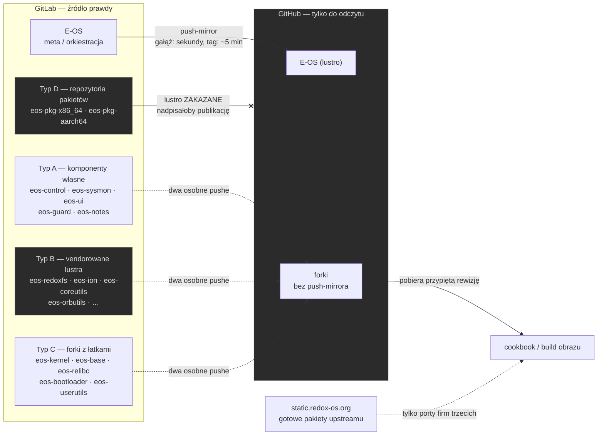

# Topologia repozytoriów

30 repozytoriów w `repos.toml`, cztery typy o różnych regułach (`CLAUDE.md` §11).
**Kierunek luster ma znaczenie:** GitLab jest źródłem prawdy, a przepisy pobierają
przypięte rewizje z lustra GitHuba.

## Co z tego wynika w praktyce

| | |
|---|---|
| **Meta-repo** | push **tylko na GitLab** — ręczny push na GitHuba ściga się z lustrem |
| **Forki (A/B/C)** | **dwa** pushe, każdy zweryfikowany `git ls-remote` przed podbiciem pina (§1.6) |
| **Pakiety (D)** | lustro **zakazane** — `eos-setup-mirrors.sh` pomija `role = "pkg"` (`U-158`) |
| **Kasowanie** | lustro replikuje pushe, **nie kasowania** — usunięcie gałęzi wykonuje się osobno |
