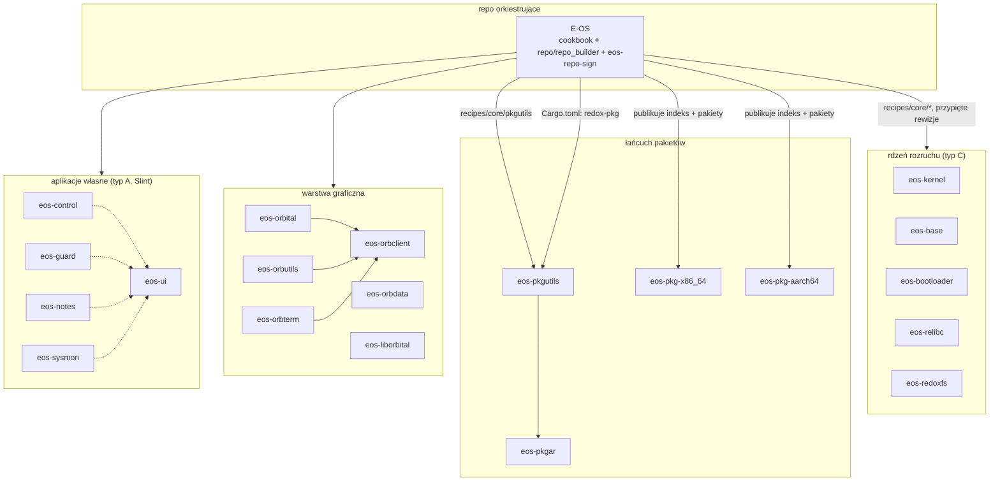

# Faza 0 — inwentaryzacja ekosystemu E-OS

**Data:** 2026-08-30 · **Zakres:** wszystkie repozytoria osiągalne z tego repo · **Tryb:** wyłącznie do odczytu, nic nie usunięto i nie zmieniono poza tym plikiem
**HEAD repo głównego w chwili pomiaru:** `51cac0382` (`main`) · **Gałąź robocza tej fazy:** `chore/phase0-inventory`

> **Metoda i jej granice.** Każda liczba w tym dokumencie pochodzi z wykonanego polecenia — `glab api`,
> `gh api`, `git`, `curl`, `gitleaks` — a nie z dokumentacji projektu ani z pamięci. Tam, gdzie czegoś
> nie dało się sprawdzić, jest znacznik `[NIEZWERYFIKOWANE]` i pozycja w §12. **Rozbieżności między tym,
> co projekt o sobie pisze, a tym, co zmierzono, są raportowane na korzyść pomiaru** — i wskazane
> wprost, bo to one są najcenniejsze.

---

## 1. Uniwersum repozytoriów

**30 repozytoriów** w grupie GitLab `e-os`, wszystkie **publiczne**, wszystkie z lustrem na GitHubie
(`Gh0s777tt/*`). Liczba zgadza się z rejestrem `repos.toml` (30 wpisów) i z deklaracją w `CLAUDE.md` §11.

- **Źródło prawdy:** GitLab (`gitlab.com/e-os/*`) — zgodnie z `docs/adr/0001-gitlab-as-source-of-truth.md`.
- **Lustro:** GitHub. Repo główne ma działające lustro automatyczne; **forki go nie mają** i wymagają
  dwóch ręcznych pushy (potwierdzone praktyką w tej sesji).
- **Poza ekosystemem:** konto GitHub `Gh0s777tt` ma **97 repozytoriów**; 30 to lustra E-OS,
  1 to repozytorium profilowe (`Gh0s777tt/Gh0s777tt`), pozostałe **66 nie zostało zbadane** — nie ma
  śladów powiązania z E-OS. `[NIEZWERYFIKOWANE]` — patrz §12.
- **Submodułów brak** (`.gitmodules` nie istnieje). Zależności międzyrepozytoryjne idą przez
  `repos.toml` + `Cargo.toml` + receptury cookbooka, nie przez git.

### 1.1 Klasyfikacja (pole `type` w `repos.toml`, definicje w `CLAUDE.md` §11)

| Typ | Znaczenie | Liczba | Repozytoria |
|---|---|---|---|
| **A** | komponent własny E-OS, pełne standardy projektu | 6 | `E-OS`, `eos-control`, `eos-sysmon`, `eos-ui`, `eos-guard`, `eos-notes` |
| **B** | vendorowane lustro redox-os, **tylko do odczytu** | 10 | `eos-coreutils`, `eos-extrautils`, `eos-ion`, `eos-netdb`, `eos-netutils`, `eos-orbterm`, `eos-redox-fatfs`, `eos-redoxer`, `eos-orbclient`, `eos-liborbital` |
| **C** | fork z łatkami E-OS | 12 | `eos-kernel`, `eos-base`, `eos-relibc`, `eos-bootloader`, `eos-userutils`, `eos-redoxfs`, `eos-orbutils`, `eos-orbdata`, `eos-pkgutils`, `eos-installer`, `eos-orbital`, `eos-pkgar` |
| **D** | repozytoria artefaktowe (opublikowane pakiety) | 2 | `eos-pkg-x86_64`, `eos-pkg-aarch64` |

**26 z 30** jest przypiętych rewizją w recepturze (`pinned_in_recipe = true`); nieprzypięte to `E-OS`
(meta) oraz `eos-ui`, `eos-pkg-x86_64`, `eos-pkg-aarch64`.

---

## 0. Dziesięć najważniejszych ustaleń

| # | Ustalenie | Waga | Gdzie |
|---|---|---|---|
| 1 | **Poprawka bezpieczeństwa jest w obrazie, ale nie w narzędziach hosta.** `Cargo.toml` bierze `pkgar-core` z upstreamu, a obraz buduje fork z poprawką `cb8ae7b` (`U-067`/`R-F03`) chroniącą przed przepełnieniem offsetu i **paniką osiągalną przez atakującego** na skróconym `.pkgar`. Host parsuje pakiety nieutwardzonym kodem (`src/cook/cook_build.rs:119`). | **wysoka** | §3.1 |
| 2 | **Całe CI nie działa od 2026-08-28 03:01** — 45 z 46 pipeline'ów czerwonych, przyczyna `ci_quota_exceeded`, zadania kończą się w 0 s. Nie działa żadna bramka: skan sekretów, integralność, przypięcia, dryf luster, aktualność dokumentacji. | **wysoka** | §4 |
| 3 | **Build ciągnie źródła z lustra, nie ze źródła prawdy.** 22 z 26 receptur wskazuje `github.com/Gh0s777tt/*`, mimo że `ADR-0001` ustala GitLab jako źródło prawdy, a GitHub jako lustro tylko do odczytu. Lustra forków nie mają automatycznej synchronizacji. | **wysoka** | §3.2 |
| 4 | **Fałszywy alarm `gitleaks` czeka w ukryciu.** `keys/eos-pkg-signing.pub.toml` (klucz **publiczny**) jest zgłaszany jako sekret; plik dodano 29 sierpnia, czyli **po** ostatnim udanym pipeline'ie. Po odnowieniu limitu `secret-scan` padnie i będzie wyglądał na regresję. **Zgodnie z regułą 4 nic tu nie zmieniałem.** | **wysoka** | §4.1, §11 |
| 5 | **`eos-pkg-aarch64` ma rozłączne historie na GitLabie i GitHubie** — dwa różne repozytoria pod jedną nazwą. Wersja GitHubowa niesie 79 opublikowanych pakietów, GitLabowa sam opis. **Żaden mechanizm nie porównuje głów między hostami.** | **wysoka** | §5.2 |
| 6 | **Cztery aplikacje własne przypinają dwie różne rewizje wspólnego backendu `eos-ui`** — i wszystkie ciągną go z GitHuba. Obraz niesie dwie kopie „wspólnej" biblioteki. | średnia | §14 |
| 7 | **`CLAUDE.md` przeczy sam sobie**: §11 twierdzi, że `scripts/sync-forks.sh` nie ma w tym repo — skrypt istnieje (2241 B, od 11 lipca), a §0 mówi wprost, że jest. Do tego §0 podaje trzy nieaktualne liczby (12 zadań CI zamiast 17, 38 dokumentów zamiast 56, 38 skryptów zamiast 58). | średnia | §6.1–6.2 |
| 8 | **Bramka sprawdza obecność zamiast aktualności.** `ci-integrity.sh` robi `grep -q 'SYNC:'` na README; marker deklaruje `U-152`, a CHANGELOG jest na `U-224` — **72 pozycje rozjazdu**, bramka zielona. | średnia | §6.3 |
| 9 | **Piętnaście README-ów forków podaje nieaktualną rewizję przypięcia**, a trzy repozytoria z nazwą `eos-*` (`eos-installer`, `eos-orbital`, `eos-relibc`) mają README **bez ani jednej wzmianki o E-OS** na budowanej gałęzi. | średnia | §15.2–15.3 |
| 10 | **Repo główne jest wzorowo czyste**: zero śledzonych śmieci, zero plików > 1 MB, zero nieśledzonych, wszystkie **26 przypięć zgodnych** z głowami gałęzi. Śmieci w pozostałych repozytoriach (~48 MB binariów) są **odziedziczone z upstreamu** i **nie należy ich sprzątać** — kosztowałoby to dywergencję przy każdej synchronizacji. | pozytywne | §8.1, §5.1, §16 |

**Rzeczy, które działają i warto o nich wiedzieć:** wszystkie 26 przypięć zgadza się co do znaku;
opublikowany indeks aarch64 (79 pakietów) **weryfikuje się naszym kluczem hybrydowym obiema
połowami**; `Cargo.lock` przypina każdą zależność, więc powtarzalność budowania jest zachowana;
`gitleaks` na 8153 commitach nie znalazł ani jednego prawdziwego sekretu.

### 1.2 Pełna tabela (wszystkie wartości zmierzone przez API, 2026-08-30)

| Repo | Typ / rola | Gałąź dom. | Ost. aktywność | Commity | Rozmiar | Języki (top 2) | Tagi | Gałęzie | MR/Iss | Lustro GH |
|---|---|---|---|---|---|---|---|---|---|---|
| `E-OS` | A — własny E-OS / meta | `main` | 2026-08-30 | 10176 | 44.3 MB | Rust 41%, Shell 36% | 3 | 5 | 0/0 | zgodne |
| `eos-base` | C — fork z łatkami / core-critical | `eos-july` | 2026-08-28 | 3275 | 6.4 MB | Rust 99%, Makefile 0% | 0 | 2 | 0/0 | zgodne |
| `eos-bootloader` | C — fork z łatkami / core-critical | `eos-rebased` | 2026-08-29 | 357 | 0.5 MB | Rust 81%, Assembly 13% | 0 | 2 | 0/0 | zgodne |
| `eos-control` | A — własny E-OS / gui | `main` | 2026-07-24 | 14 | 0.4 MB | Rust 79%, Slint 21% | 0 | 1 | 0/0 | zgodne |
| `eos-coreutils` | B — lustro (RO) / core | `master` | 2026-07-14 | 593 | 0.6 MB | Rust 100% | 0 | 2 | 0/0 | zgodne |
| `eos-extrautils` | B — lustro (RO) / core | `master` | 2026-07-14 | 268 | 0.3 MB | Rust 100% | 0 | 2 | 0/0 | zgodne |
| `eos-guard` | A — własny E-OS / gui | `main` | 2026-07-18 | 2 | 0.1 MB | Rust 81%, Slint 19% | 0 | 1 | 0/0 | zgodne |
| `eos-installer` | C — fork z łatkami / core | `master` | 2026-08-27 | 384 | 0.9 MB | Rust 99%, Shell 1% | 42 | 3 | 0/0 | zgodne |
| `eos-ion` | B — lustro (RO) / core | `master` | 2026-07-14 | 2217 | 4.7 MB | Rust 97%, Shell 2% | 4 | 3 | 0/0 | zgodne |
| `eos-kernel` | C — fork z łatkami / core-critical | `eos-july` | 2026-08-29 | 2778 | 5.1 MB | Rust 99%, Assembly 1% | 0 | 2 | 0/0 | zgodne |
| `eos-liborbital` | B — lustro (RO) / lib | `master` | 2026-07-17 | 55 | 0.1 MB | Rust 81%, C 16% | 0 | 1 | 0/0 | zgodne |
| `eos-netdb` | B — lustro (RO) / core | `master` | 2026-07-14 | 4 | 0.2 MB | — | 0 | 1 | 0/0 | zgodne |
| `eos-netutils` | B — lustro (RO) / core | `master` | 2026-07-14 | 259 | 0.3 MB | Rust 100% | 0 | 3 | 0/0 | zgodne |
| `eos-notes` | A — własny E-OS / gui | `main` | 2026-07-18 | 7 | 0.1 MB | Rust 74%, Slint 26% | 0 | 1 | 0/0 | zgodne |
| `eos-orbclient` | B — lustro (RO) / gui | `master` | 2026-07-17 | 500 | 1.8 MB | Rust 100% | 44 | 8 | 0/0 | zgodne |
| `eos-orbdata` | C — fork z łatkami / gui | `master` | 2026-07-14 | 51 | 5.4 MB | — | 0 | 2 | 0/0 | zgodne |
| `eos-orbital` | C — fork z łatkami / gui | `master` | 2026-07-19 | 511 | 0.9 MB | Rust 100%, Shell 0% | 0 | 3 | 0/0 | zgodne |
| `eos-orbterm` | B — lustro (RO) / gui | `master` | 2026-07-14 | 416 | 3.7 MB | Rust 100% | 1 | 2 | 0/0 | zgodne |
| `eos-orbutils` | C — fork z łatkami / gui | `master` | 2026-07-19 | 535 | 4.2 MB | Rust 100%, CSS 0% | 0 | 7 | 0/0 | zgodne |
| `eos-pkg-aarch64` | D — artefakty / pkg | `main` | 2026-07-14 | 2 | 0.0 MB | — | 0 | 1 | 0/0 | **ROZJAZD** |
| `eos-pkg-x86_64` | D — artefakty / pkg | `main` | 2026-07-14 | 2 | 0.0 MB | — | 0 | 1 | 0/0 | zgodne |
| `eos-pkgar` | C — fork z łatkami / core | `master` | 2026-07-14 | 176 | 0.3 MB | Rust 98%, Shell 2% | 20 | 3 | 0/0 | zgodne |
| `eos-pkgutils` | C — fork z łatkami / core | `master` | 2026-08-29 | 307 | 0.4 MB | Rust 100%, Shell 0% | 18 | 4 | 0/0 | zgodne |
| `eos-redox-fatfs` | B — lustro (RO) / lib | `master` | 2026-07-14 | 92 | 0.3 MB | Rust 100% | 0 | 2 | 0/0 | zgodne |
| `eos-redoxer` | B — lustro (RO) / dev | `master` | 2026-07-14 | 354 | 0.5 MB | Rust 95%, Nix 3% | 67 | 3 | 0/0 | zgodne |
| `eos-redoxfs` | C — fork z łatkami / core-critical | `master` | 2026-08-27 | 519 | 0.8 MB | Rust 100%, Shell 0% | 44 | 2 | 0/0 | zgodne |
| `eos-relibc` | C — fork z łatkami / core-critical | `eos-july` | 2026-07-17 | 4984 | 8.7 MB | Rust 77%, C 19% | 0 | 3 | 0/0 | zgodne |
| `eos-sysmon` | A — własny E-OS / gui | `main` | 2026-07-19 | 1 | 0.1 MB | Rust 75%, Slint 25% | 0 | 1 | 0/0 | zgodne |
| `eos-ui` | A — własny E-OS / lib | `main` | 2026-07-18 | 3 | 0.0 MB | Rust 100% | 0 | 1 | 0/0 | zgodne |
| `eos-userutils` | C — fork z łatkami / core | `eos-july` | 2026-08-22 | 207 | 0.3 MB | Rust 100% | 0 | 2 | 0/0 | zgodne |

> **Jak czytać kolumnę „Tagi".** Wysokie liczby (`eos-redoxer` 67, `eos-orbclient` 44, `eos-redoxfs` 44,
> `eos-installer` 42, `eos-pkgar` 20, `eos-pkgutils` 18) to **tagi odziedziczone z upstreamu Redox**,
> a nie wydania E-OS. Jedyne wydania E-OS to trzy tagi w repo głównym: `eos-base-2026-06-06`,
> `v0.1.0`, `v0.2.0`.
>
> **Kolumna „MR/Iss" jest zerowa w każdym z 30 repozytoriów.** To nie błąd odczytu — w całej historii
> repo głównego jest **0 merge requestów** (`state=all`). Konsekwencje w §7.3.

---

## 2. Graf zależności

Zmierzony z trzech źródeł: `repos.toml` (pole `recipe` + `pinned_rev`), `Cargo.toml` repo głównego
oraz receptur w `recipes/core/*`. Krawędź „buduje/konsumuje" znaczy: artefakt po lewej powstaje
z kodu po prawej.



**Krawędzie potwierdzone dowodem:**

| Od | Do | Dowód |
|---|---|---|
| `E-OS` | `eos-pkgutils` | `Cargo.toml:46` — `redox-pkg = { git = ".../eos-pkgutils.git", rev = "e28063ee…" }` |
| `E-OS` | 26 repozytoriów | `repos.toml`, pola `recipe` + `pinned_rev`; każda rewizja zweryfikowana wobec głowy gałęzi (§5.1) |
| `E-OS` | `eos-pkg-aarch64` | opublikowany indeks pod `gh0s777tt.github.io/eos-pkg-aarch64` weryfikuje się kluczem z `keys/eos-repo-sign.pub.toml` (§6.2) |
| `eos-control/guard/notes/sysmon` | Slint | rozkład języków z API: Slint 19–26% w każdym z tych czterech |

**Sieroty (brak krawędzi w obie strony):** `eos-ui` — jest typu A, ale **nie jest przypięty w żadnej
recepturze** i nie występuje w `Cargo.toml`. Rozkład języków to Rust 100%, 3 commity, 33 kB.
Czym jest w produkcie — `[NIEZWERYFIKOWANE]`, §12.

---

## 3. Łańcuch dostaw — najpoważniejsze znalezisko fazy

### 3.1 Poprawka bezpieczeństwa jest w obrazie, ale **nie ma jej w narzędziach hosta**

`Cargo.toml` repo głównego bierze `pkgar` / `pkgar-core` / `pkgar-keys` z **upstreamu**
(`gitlab.redox-os.org/redox-os/pkgar.git`), a obraz buduje **nasz fork** `eos-pkgar`
(`recipes/core/pkgar`, przypięty `78e644ad5`).

Fork ma **2 commity ponad** rewizją, z której budują się narzędzia hosta (`ee2bcb2af`, wg
`Cargo.lock`). Jeden z nich, `cb8ae7b` (`U-067` / `R-F03`), to **poprawka bezpieczeństwa**
w `pkgar-core/src/package.rs`:

```rust
// E-OS R-F03: guard the absolute-offset math against overflow from a
// hostile entry.offset / header size instead of wrapping silently.
let offset = (self.header().total_size()? as u64)
    .checked_add(entry.offset)
    .and_then(|o| o.checked_add(offset))
    .ok_or(Error::Overflow)?;
```

oraz — z komentarza tego samego commita, cytat dosłowny — usunięcie paniki
„*(attacker-reachable via a truncated .pkgar)*" w `read_at`, gdzie stare
`buf.copy_from_slice(..)` panikowało przy niezgodnej długości.

**Dlaczego to ma znaczenie.** `src/cook/cook_build.rs:119` woła `pkgar_core::PackageSrc::read_entries`
na plikach `.pkgar` **po stronie hosta budującego** (`src/cook/cook_build.rs:2-3, 116, 615`). To jest
dokładnie ta ścieżka, którą poprawka utwardza. Efekt: **utwardzony parser jedzie na urządzeniu,
a nieutwardzony na maszynie budującej** — spreparowany lub skrócony `.pkgar` podany narzędziom hosta
wciąż trafia w oryginalną panikę / przepełnienie.

**To ta sama klasa wady, którą dziś zamknięto dla `redox-pkg`** (`U-223`: wydawca i klient budowały się
z różnych baz kodu). Pozostają trzy dalsze przypadki: `pkgar` (3 skrzynki), `redox_installer`, `redoxer`.

| Zależność (Cargo.toml) | Host buduje z | Obraz buduje z | Rewizja przypięta w `Cargo.lock` |
|---|---|---|---|
| `pkgar`, `pkgar-core`, `pkgar-keys` | upstream redox-os | `eos-pkgar` `78e644ad5` | `ee2bcb2af` |
| `redox_installer` | upstream redox-os | `eos-installer` `c8d32ad39` | `1c2534e44` |
| `redoxer` | upstream redox-os | `eos-redoxer` `974c1482c` | `e4c40952b` |
| `redox-pkg` | **`eos-pkgutils`** ✅ | `eos-pkgutils` `e28063ee2` | `e28063ee2` |

Powtarzalność budowania **nie jest zagrożona** — `Cargo.lock` przypina konkretne commity dla
wszystkich pięciu. Zagrożona jest **zgodność między tym, co produkuje pakiety, a tym, co je czyta**.

### 3.2 Build zależy od lustra, nie od źródła prawdy

`docs/adr/0001-gitlab-as-source-of-truth.md` ustala GitLab jako źródło prawdy, a GitHub jako
lustro **tylko do odczytu**. Pomiar receptur mówi coś innego:

- **22 z 26** receptur w `recipes/core/*` i `recipes/gui/*` ciągnie źródła z `github.com/Gh0s777tt/*`
- **4** z `gitlab.com/e-os/*`
- `Cargo.toml:46` (`redox-pkg`) — również GitHub. **Ten wpis dodałem dzisiaj**, powielając istniejący
  wzorzec; wymieniam to wprost, bo audyt bez tego byłby niepełny.

Ryzyko nie jest teoretyczne: lustra forków **nie mają automatycznej synchronizacji** (wymagają dwóch
ręcznych pushy), a w §5.2 udokumentowano **żywy rozjazd** jednego z nich. Build biorący źródła
z lustra bierze to, co na lustrze akurat jest.

---

## 4. CI — cała siatka bezpieczeństwa jest wyłączona

`.gitlab-ci.yml` definiuje **17 zadań w 5 etapach**: `secret-scan`, `integrity`, `pin-check`,
`mirror-drift`, `rebase-check`, `docs-currency`, `rust-checks`, `shell-lint`, `coverage`, `sbom`,
`rustdoc`, `pages`, `docs-pdf`, `semantic-release`, `build-image`, `build-image-x86_64`, `renovate`.

**Żadne z nich nie wykonało się od 2026-08-28 03:01.**

| Pomiar | Wartość |
|---|---|
| Ostatni **udany** pipeline | `#2798481832`, 2026-08-28T03:01:30 |
| Pipeline'ów od tamtej pory | 46, z czego **45 nieudanych** |
| Powód (próbka 12 pipeline'ów) | `ci_quota_exceeded` — jednolicie |
| Czas trwania zadań | **0 s** — zadania nie startują, nie zawodzą merytorycznie |

To znaczy, że przez ~2 dni **nie działa ani jedna bramka**: nie skanuje sekretów, nie sprawdza
integralności, nie weryfikuje przypięć, nie wykrywa dryfu luster, nie pilnuje aktualności
dokumentacji. Commity idą prosto na `main` (§7.3), więc nie ma też drugiej pary oczu.

> **Uwaga interpretacyjna.** Pipeline'y pokazują się jako *failed*, co łatwo pomylić z „testy nie
> przechodzą". Przyczyna jest infrastrukturalna — wyczerpany limit minut — i **nie mówi nic o jakości
> kodu**. Poprzedni audyt (`AUDIT-2026-08-14` §2) notował czerwone CI z **innych** powodów (dryf
> przypięć, brak kontenera na runnerze); te zostały naprawione. To nawrót problemu, nie ten sam problem.

### 4.1 Ukryta awaria bramki, która wyjdzie dopiero po odnowieniu limitu

`gitleaks` uruchomiony lokalnie na pełnej historii (8153 commity, konfiguracja `.gitleaks.toml`)
zgłasza **1 trafienie**:

```
generic-api-key   keys/eos-pkg-signing.pub.toml   linia 1
```

- Plik ma **74 B** i jedno pole `pkey` o wartości **64 znaków hex = 32 bajty** — to rozmiar
  **publicznego** klucza ed25519. Klucz tajny pkgar ma format z `salt`, `nonce` i zaszyfrowanym
  blobem (por. `build/id_ed25519.toml`). **To fałszywy alarm.**
- Plik dodano **2026-08-29** (commit `03aa86a93`), czyli **po** ostatnim udanym pipeline'ie.
- Ścieżka **nie jest** na liście dozwolonych w `.gitleaks.toml`, a `gitleaks` zgłasza ją także
  **bez** tej konfiguracji.

**Wniosek:** gdy limit CI się odnowi, `secret-scan` padnie — i będzie wyglądał na regresję, choć jest
to fałszywy alarm czekający od 29 sierpnia. **Zgodnie z regułą 4 nie zmieniam tu niczego** —
rekomendacja w §11.

### 4.2 GitHub Actions nie istnieje

Brak katalogu `.github/workflows/` (zweryfikowane: `git ls-files .github` zwraca `CODEOWNERS`,
`FUNDING.yml`, dwa szablony zgłoszeń, `config.yml`, `PULL_REQUEST_TEMPLATE.md`, `dependabot.yml`).
`.github/dependabot.yml` wyjaśnia to komentarzem: *„GitHub Actions is disabled account-wide
(ROADMAP R-004) and the workflows were removed"*. Spójne — ale znaczy, że po stronie GitHuba
**żadna weryfikacja nie zachodzi**, a to tam wskazują 22 z 26 receptur (§3.2).

---

## 5. Stan synchronizacji

### 5.1 Przypięcia — bez zarzutu

Wszystkie **26** przypiętych rewizji z `repos.toml` zgadzają się **co do znaku** z głową
odpowiedniej gałęzi na GitLabie. **Zero rozjazdów.** To najlepiej utrzymany element ekosystemu.

Jedno odstępstwo strukturalne: **`eos-pkgutils` jest jedynym repozytorium, w którym przypięta gałąź
nie jest gałęzią domyślną** — przypinamy `eos`, domyślna to `master`.

| Pomiar | Wartość |
|---|---|
| `master` (domyślna) — ostatni commit | 2026-07-14 |
| `eos` (przypięta) — ostatni commit | 2026-08-30 |
| Różnica | `master` ma 1 własny commit, `eos` ma **9** |
| Commity o manifeście / rollbacku na `master` | **0** |

Kto otworzy `gitlab.com/e-os/eos-pkgutils`, wyląduje na `master` — czyli na kodzie **bez** całej
warstwy egzekwowania podpisów (`V2-MS13`/`14`/`15`).

### 5.2 Lustro GitLab ↔ GitHub — jeden żywy rozjazd

Porównano głowę gałęzi domyślnej po obu stronach dla wszystkich 30 repozytoriów
(`git ls-remote`): **29 zgodnych, 1 rozjazd**.

**`eos-pkg-aarch64`** — historie są **rozłączne**, bez wspólnego przodka:

| Host | HEAD | Historia |
|---|---|---|
| GitLab | `3440427d9` | 2 commity: `Initial commit` → `docs(readme): opis repo artefaktowego pakietow (ETAP 2)` |
| GitHub | `45da41db3` | 1 commit: `pkg repo aarch64-unknown-redox: 78 packages, build_id "6e7f6432b…"` |

To nie jest opóźnienie lustra — to **dwa różne repozytoria pod jedną nazwą**. Wersja GitHubowa niesie
faktycznie opublikowane pakiety, GitLabowa sam opis.

**Żaden mechanizm tego nie pilnuje.** `scripts/eos-mirror-drift.sh` mierzy co innego — zgodność
*zadeklarowanego typu* repozytorium z jego zawartością (lustro vs fork), nie równość głów między
hostami. Przeszukanie `scripts/*.sh` nie znalazło skryptu porównującego GitLab z GitHubem.
Do tego `mirror-drift` biegnie tylko w pipeline'ach `schedule` i `web` — a te też nie działają (§4).

### 5.3 Gałęzie nieaktualne

**74 gałęzie** w 30 repozytoriach. **28 nie-domyślnych jest starszych niż 180 dni**, tylko 5 z nich
jest scalonych. Najstarsza pochodzi z **2016 roku**, najmłodsza „nieaktualna" z 2024-10-16.

| Repo | Nieaktualnych gałęzi | Najstarsza |
|---|---|---|
| `eos-orbclient` | 7 | `Canvas` (2018-06-26) |
| `eos-orbutils` | 6 | `orbtk-next` (2019-05-16) |
| `eos-netutils`, `eos-pkgar`, `eos-pkgutils`, `eos-redoxer` | po 2 | `tokio` (2017-09-16) |
| `eos-coreutils`, `eos-extrautils`, `eos-installer`, `eos-ion`, `eos-orbital`, `eos-orbterm`, `eos-redox-fatfs` | po 1 | `strace` (2016-06-03) |

To **gałęzie odziedziczone z upstreamu Redox** przy klonowaniu forków, nie porzucona praca E-OS.
Nie szkodzą, ale zaśmiecają widok repozytorium i mylą przy przeglądaniu.

### 5.4 Repo główne

- Gałęzie zdalne: `main`, `lts/0.1`, `archive/pre-migration-de-phase1`, `archive/redox-mirror-2019`,
  `archive/redox-0.4.1` — archiwa są nazwane jawnie i zrozumiałe.
- **Gałąź lokalna `docs/honesty-pass-u124-u128`**: w pełni scalona do `main` (**0 własnych commitów**),
  bez odpowiednika zdalnego, ostatni commit 2026-08-16. Kandydat do usunięcia (§11).
- Katalog roboczy **czysty**: `git status` nie pokazuje ani jednego pliku nieśledzonego.
- Klony lokalne (`~/eos-ecosystem/`): `eos-bootloader`, `eos-kernel`, `eos-pkgutils` — wszystkie
  na przypiętych rewizjach, **0 niezacommitowanych zmian**, śledzą swoje gałęzie zdalne.

### 5.5 Tagi

Trzy tagi w repo głównym; **tylko jeden jest podpisany**:

| Tag | Data | `git verify-tag` |
|---|---|---|
| `eos-base-2026-06-06` | 2026-06-06 | brak podpisu |
| `v0.1.0` | 2026-06-07 | brak podpisu |
| `v0.2.0` | 2026-08-22 | **OK** |

---

## 6. Dokumentacja — sprzeczności i nieaktualności

### 6.1 `CLAUDE.md` przeczy sam sobie w sprawie synchronizacji luster

`CLAUDE.md` §11 (wiersz 415), o dziesięciu lustrach typu B:

> „Synchronizacja wyłącznie przez `scripts/sync-forks.sh` (patrz §0 — skryptu **nie ma w tym repo**,
> należy do repo orkiestrującego)."

`CLAUDE.md` §0 (wiersz 23), tabela „stan faktyczny":

> „**Skrypty** | 38 w `scripts/`, w tym `sync-forks.sh` i `publish-repo-pages.sh` — **oba obecne lokalnie**"

**Pomiar rozstrzyga na korzyść §0:** `scripts/sync-forks.sh` istnieje — 2241 B, 50 linii, dodany
2026-07-11, nagłówek: *„Sync the E-OS vendored Redox mirrors with upstream redox-os"*. §11 jest
**nieprawdziwe**, i to podwójnie: powołuje się na §0, które mówi coś przeciwnego, oraz odsyła do
„repo orkiestrującego", którym — wg §0 — **jest to samo repo**.

Waga: średnia, ale realna. §11 wysyła współpracownika po mechanizm synchronizacji dziesięciu
repozytoriów do miejsca, które nie istnieje.

### 6.2 Tabela „stan faktyczny" w `CLAUDE.md` §0 jest nieaktualna

Sekcja deklaruje w tytule „**przeskanowane, nie założone**". Pomiar z dziś:

| Twierdzenie §0 | Pomiar | Różnica |
|---|---|---|
| CI: „12 zadań / 5 etapów" | **17 zadań / 5 etapów** | +5 zadań |
| „38 plików `.md` w `docs/`" | **56** śledzonych `.md` | +18 |
| „38 skryptów w `scripts/`" | **58** śledzonych plików | +20 |

Do tego wypisana lista etapów zawiera zadania, które **nie istnieją** w obecnym `.gitlab-ci.yml`
w podanym kształcie, i **pomija** istniejące: `mirror-drift`, `rebase-check`, `coverage`, `sbom`,
`rustdoc`.

### 6.3 Bramka, która sprawdza obecność zamiast aktualności

`README.md:5` niesie marker kontraktu:

```
<!-- SYNC: v0.2.0 · Unreleased U-152 · 2026-08-22 — keep this file in step with CHANGELOG.md/ROADMAP.md -->
```

Najnowszy wpis w `CHANGELOG.md` to **`U-224`**. Marker deklaruje `U-152` — **72 pozycje w tyle**.

Dlaczego nikt tego nie złapał: `scripts/ci-integrity.sh` kontrola 3 robi dosłownie

```bash
elif grep -q 'SYNC:' README.md; then
  ok "README SYNC marker present"
```

— sprawdza **obecność napisu, nigdy jego wartość**. Marker może pokazywać `U-152` w nieskończoność,
a bramka pozostanie zielona. Zadanie `docs-currency` też tego nie łapie: weryfikuje jedynie, czy
zmianie kodu towarzyszy zmiana w `docs/`/`README`/`CHANGELOG`.

> To ta sama klasa wady, którą opisano dziś w `CLAUDE.md` §21.6: **kontrola, która potrafi tylko
> przejść, nie jest kontrolą.**

### 6.4 Dwa dokumenty architektury

| Plik | Rozmiar | Ostatnia zmiana | Sekcje |
|---|---|---|---|
| `ARCHITECTURE.md` | 5719 B | 2026-08-14 | The layers · What each layer is · How it is built & shipped |
| `docs/architecture/overview.md` | 3912 B | 2026-08-16 | Boot flow · The kernel · Schemes · Component map · How E-OS differs from upstream |

Zakresy się nakładają, ale dokumenty **odsyłają do siebie wzajemnie** (po jednym odwołaniu w każdą
stronę), więc to nie jest sprzeczność — to **nieudokumentowany podział**. Nigdzie nie jest napisane,
który jest wejściem dla nowej osoby. Trzeci plik, `docs/architecture/README.md` (508 B), to indeks
diagramów i nie duplikuje niczego.

### 6.5 `ROADMAP.md` — poprawnie zarchiwizowany, nie duplikat

`ROADMAP.md` (120 kB) istnieje obok `ROADMAP-v2.md` (57 kB), ale niesie jawny baner: *„ARCHIWUM
(scalone do ROADMAP-v2.md)… 67 pozycji zrobionych zostaje tutaj jako zapis historyczny — to jest
jedyny powód, dla którego ten plik nadal istnieje."* **To świadoma decyzja, nie zaległość.**

### 6.6 Dwa boty aktualizujące zależności

Współistnieją `renovate.json` i `.github/dependabot.yml`. Nakładanie jest **udokumentowane jako
przejściowe** — komentarz w `dependabot.yml` wskazuje `R-007` („until Renovate on GitLab replaces
Dependabot"). Ale:

- `renovate.json` ma `"automerge": true` dla aktualizacji `patch`,
- w repo głównym jest **0 merge requestów w całej historii** i **żadnej gałęzi** wyglądającej na
  Renovate (gałęzie: `main`, `lts/0.1`, trzy `archive/*`).

Czy Renovate jest w ogóle zainstalowany — `[NIEZWERYFIKOWANE]`, §12.

### 6.7 Dokumentacja publikowana

| Adres | Stan |
|---|---|
| `e-os.gitlab.io/e-os` | **żywy**, HTTP 200, tytuł „Introduction - E-OS Documentation" |
| `gh0s777tt.github.io/E-OS` | **HTTP 404 — „Site not found"** |

Poprzedni audyt (`AUDIT-2026-08-14` §2) notował wersję GitHubową jako „zamrożoną w stanie sprzed
lipca". Dziś jej **nie ma wcale**. Waga niska: żaden śledzony plik nie kieruje tam użytkownika —
trzy wystąpienia adresu to wzmianki historyczne w `CHANGELOG.md`, `ROADMAP.md` i poprzednim audycie.

---

## 7. Repozytorium główne `E-OS` — struktura

**3352 śledzone pliki w `recipes/`**, 72 w `docs/`, 58 w `scripts/`, 47 w `assets/`, 40 w `config/`,
22 w `src/`. Katalog roboczy waży **10 GB**, `.git` — **381 MB**; różnica to wynik budowania,
w całości ignorowany (§8).

### 7.1 Katalogi najwyższego poziomu

| Katalog | Plików (śledzonych) | Rola | Dowód |
|---|---|---|---|
| `recipes/` | 3352 | receptury cookbooka — definicje pakietów; 27 kategorii | struktura katalogów |
| `docs/` | 72 | dokumentacja mdBook + 6 ADR + `docs/audit/` + 18 zrzutów ekranu | `book.toml`, `docs/SUMMARY.md` |
| `scripts/` | 58 | automatyzacja: budowanie, podpisywanie, publikacja, kontrole CI | nagłówki plików |
| `assets/` | 47 | grafika marki (SVG/PNG) — banery, ekrany logowania | nazwy plików |
| `config/` | 40 | konfiguracje obrazu per architektura + warianty (`desktop`, `server`, `minimal`…) | `config/x86_64/eos.toml` |
| `src/` | 22 | **vendorowany `redox_cookbook`** — binarki `repo`, `repo_builder`, `cookbook_redoxer` | `CLAUDE.md` §0 |
| `upstream/` | 18 | **15 łatek przygotowanych do zgłoszenia upstreamowi** (aarch64) + opisy MR | `upstream/README.md` |
| `mk/` | 11 | fragmenty GNU Make (`config.mk`, `disk.mk`, `qemu.mk`, `ci.mk`…) | nazwy plików |
| `bin/` | 7 | opakowania toolchaina (`*-llvm-config`, `*-pkg-config`) | nazwy plików |
| `.github/` | 7 | szablony, `CODEOWNERS`, `dependabot.yml` — **bez `workflows/`** | `git ls-files` |
| `podman/` | 5 | pliki kontenerów budowania (`redox-base`, `redox-gdb`, `redox-toolchain`) | nazwy plików |
| `keys/` | 5 | **wyłącznie połowy publiczne** kluczy + `README` + katalog `wycofane/` | §9 |
| `tools/` | 4 | `eos-repo-sign` — hybrydowe podpisywanie manifestu (ed25519 + ML-DSA-65) | `tools/eos-repo-sign/src/main.rs` |
| `patches/` | 3 | dwie łatki brandingowe stosowane przy budowaniu | nazwy plików |
| `.gitlab/` | 3 | szablony zgłoszeń i MR-ów po stronie GitLaba | nazwy plików |
| `sbom/` | 2 | CycloneDX SBOM — **tylko dla 0.1.0** (§7.4) | nazwy plików |
| `licenses/` | 1 | tekst licencji MIT Redoksa (dziedziczenie) | `NOTICE` |
| `.cargo/` | 1 | `config.toml` — cele i linkery per architektura | zawartość |

**`recipes/wip/` to 2932 z 3352 receptur (87%)** — odziedziczone z upstreamu porty w toku, nie
kuratorowany zbiór E-OS. Warto o tym wiedzieć, patrząc na „liczbę pakietów".

### 7.2 Architektury

`config/` zawiera cztery katalogi architektur, ale **tylko dwie są budowane**:

| Architektura | Plików | `eos.toml` | Status |
|---|---|---|---|
| `x86_64` | 8 | **jest** | budowana (`scripts/eos-build.sh:17`) |
| `aarch64` | 7 | **jest** | budowana |
| `i586` | 5 | brak | odziedziczona z upstreamu |
| `riscv64gc` | 4 | brak | odziedziczona z upstreamu |

**Nie są to martwe pliki.** `i586` ma 20 odwołań poza własnym katalogiem, `riscv64gc` — 22
(`build.sh`, `mk/config.mk`, `.cargo/config.toml`, `bin/*-llvm-config`). To generyczna
infrastruktura upstreamu; usunięcie samych katalogów zostawiłoby wiszące odwołania.
**Nie trafiają na listę do usunięcia.**

### 7.3 Proces — zero merge requestów w całej historii

| Pomiar | Wartość |
|---|---|
| MR-ów w repo głównym (`state=all`) | **0** |
| Otwartych MR-ów we wszystkich 30 repozytoriach | 0 |
| Otwartych zgłoszeń we wszystkich 30 repozytoriach | 0 |

`CONTRIBUTING.md` opisuje przy tym proces oparty na MR-ach: *„**Fork** and create a topic branch off
`main`"*, *„Keep PRs **small** — they're reviewed faster"*. **Ten proces nigdy nie został użyty.**
Potwierdza to komentarz w `.gitlab-ci.yml:83-85`: *„There have been zero merge requests in this
project's history — every commit went straight to main. A gate that has never run is not a gate,
it is a file."*

Uboczny skutek: `CONTRIBUTING.md` mówi „PRs" (język GitHuba), choć źródłem prawdy jest GitLab.

### 7.4 SBOM jest nieaktualny

`sbom/` zawiera wyłącznie `eos-0.1.0-aarch64.cdx.json` i `eos-0.1.0-x86_64.cdx.json`.
Bieżący wydany tag to **`v0.2.0`** (2026-08-22) — **nie ma dla niego SBOM-u w repozytorium**.
Zadanie CI `sbom` generuje pliki do `sbom-out/` jako artefakt z `expire_in: 30 days`
i **nie commituje ich** — więc nie powstaje trwały ślad per wydanie.

### 7.5 Łatki dla upstreamu bez statusu zgłoszenia

`upstream/` zawiera **15 łatek** (`.patch`) z gotowymi opisami MR-ów (`MR-DESCRIPTIONS.md`).
**Żadna z 15 nie niesie jawnego statusu wobec upstreamu** (szukano: `upstream-status`, `status:`,
`submitted`, `accepted`, `zgłoszon`). `ROADMAP-v2.md` również nie śledzi ich zgłoszenia.
Nie da się dziś odpowiedzieć, czy zostały wysłane — `[NIEZWERYFIKOWANE]`, §12.

---

## 8. Śmieci

### 8.1 Pod kontrolą wersji — repo główne jest czyste

| Kategoria | Wynik |
|---|---|
| `.DS_Store`, `Thumbs.db`, `node_modules/`, `__pycache__/`, `*.bak`, `*.orig`, `*.rej`, `*.swp`, `*.log`, `*~`, `*_old`, „copy of *" | **0 plików śledzonych** |
| Pliki AppleDouble (`._*`) śledzone | **0** |
| Pliki śledzone > 1 MB | **0** |
| Pliki nieśledzone i nieignorowane | **0** |

**Nie ma czego usuwać z historii.** To rzadki i dobry wynik jak na repozytorium z 10 176 commitami.

### 8.2 Na dysku — 9,6 GB wyniku budowania, poprawnie ignorowanego

| Ścieżka | Rozmiar | Ignorowana | Uwaga |
|---|---|---|---|
| `recipes/` | 6,6 GB | częściowo | 3352 śledzone receptury + katalogi `target/`, `source/` |
| `repo/` | 1,7 GB | **tak** (cała) | zbudowane pakiety `.pkgar` — 0 plików śledzonych |
| `tools/` | 881 MB | częściowo | 4 śledzone pliki + `target/` |
| `release/` | 221 MB | **tak** (zawartość) | archiwa `eos-repo-*.tar.gz` |
| `build/` | 56 MB | **tak** (cała) | wynik budowania |
| `.git/` | 381 MB | — | |

Największy pojedynczy element: **`recipes/wip/` — 5,8 GB**.

### 8.3 Śmieci systemu plików (ignorowane, ale realne)

| Wzorzec | Sztuk na dysku |
|---|---|
| `._*` (AppleDouble, artefakt exFAT) | **899** |
| `.DS_Store` | 6 |
| `*.log`, `*.bak`, `*.orig` | 0 |

Dodatkowo w `.git/` znaleziono **32 pliki `._*`**, w tym `._pack-*.idx`, które git próbował czytać
jako indeksy paczek — stąd ostrzeżenie `error: non-monotonic index`. Usunięto je w trakcie tej sesji
(operacja na katalogu `.git`, nie na treści repozytorium; `git fsck` po niej przechodzi czysto).

Poza repozytorium: `~/eos-artifacts/` zawierało **56 logów debugowych z 28–29 sierpnia** (~1 GB),
usuniętych zgodnie z regułą higieny `CLAUDE.md` §21.

---

## 9. Pliki projektowe repozytorium głównego

Ocena 1–5 wg użyteczności dla osoby nowej; uzasadnienie oparte na treści, nie na obecności.

| Plik | Jest | Rozmiar | Ost. zmiana | Ocena | Uzasadnienie |
|---|---|---|---|---|---|
| `README.md` | ✅ | 21,9 kB | 2026-08-22 | **4** | konkretny, z odnośnikami i statusem funkcji; **−1** za marker SYNC 72 pozycje w tyle (§6.3) |
| `LICENSE` | ✅ | 34,5 kB | 2026-06-18 | **5** | pełny tekst AGPL-3.0; `NOTICE` poprawnie opisuje dziedziczenie MIT z Redoksa |
| `CHANGELOG.md` | ✅ | 374 kB | 2026-08-30 | **5** | 1067 linii, prowadzony do `U-224`, każdy wpis z uzasadnieniem i pomiarem |
| `CONTRIBUTING.md` | ✅ | 3,5 kB | 2026-07-19 | **2** | opisuje proces MR-owy, który **nigdy nie był użyty** (0 MR-ów); mówi „PRs" przy GitLabie jako źródle prawdy |
| `CODE_OF_CONDUCT.md` | ✅ | 2,3 kB | 2026-06-07 | **3** | standardowy tekst z jednym adresem kontaktowym; nieruszany od czerwca |
| `SECURITY.md` | ✅ | 5,0 kB | 2026-08-28 | **4** | dwa realne kanały zgłoszeń (GitHub Security Advisories + e-mail), świeży |
| `ROADMAP-v2.md` | ✅ | 57 kB | 2026-08-30 | **5** | jedyna prowadzona roadmapa, 637 linii, ze statusami i rejestrem `R-*` |
| `ROADMAP.md` | ✅ | 120 kB | 2026-08-29 | **4** | archiwum z jawnym banerem wyjaśniającym, po co istnieje (§6.5) |
| `ARCHITECTURE.md` | ✅ | 5,7 kB | 2026-08-14 | **3** | poprawny, ale dubluje zakres z `docs/architecture/overview.md` bez wskazania, który jest wejściem (§6.4) |
| `CLAUDE.md` | ✅ | 59 kB | 2026-08-30 | **3** | obszerny i aktywnie prowadzony, ale §0 ma trzy nieaktualne liczby, a §11 przeczy §0 (§6.1–6.2) |
| `.gitignore` | ✅ | 2,7 kB | 2026-08-29 | **5** | skuteczny — 0 śmieci śledzonych, 0 plików nieśledzonych-nieignorowanych |
| `.editorconfig` | ✅ | 396 B | 2026-07-14 | **4** | jawnie pomyślany jako wspólny dla całego ekosystemu |
| `.gitlab-ci.yml` | ✅ | 22,8 kB | — | **4** | 17 zadań, komentarze wyjaśniają *dlaczego*; **−1** bo część bramek biegnie dopiero po publikacji na `main` |
| `.github/workflows/` | ❌ | — | — | — | nie istnieje; GitHub Actions wyłączone na koncie (`R-004`) |
| `.github/ISSUE_TEMPLATE/` | ✅ | 2 szablony | 2026-06-07 | **3** | `bug_report.yml`, `feature_request.yml`, `config.yml` — obecne, nigdy nieużyte (0 zgłoszeń) |
| `PULL_REQUEST_TEMPLATE.md` | ✅ | 927 B | 2026-06-07 | **2** | nigdy nieużyty (0 MR-ów/PR-ów) |
| `.github/dependabot.yml` | ✅ | 668 B | 2026-07-14 | **3** | świadomie zawężony, z komentarzem wyjaśniającym; dubluje się z Renovate (§6.6) |
| `CODEOWNERS` | ✅ | 635 B | 2026-06-07 | **2** | istnieje, ale bez MR-ów nie ma czego egzekwować |
| `Cargo.toml` + `Cargo.lock` | ✅ | 2,1 / 37,8 kB | 2026-08-30 | **3** | lock przypina wszystko; **−2** za rozjazd wydawca–konsument z §3.1 |

---

## 10. Stan publikacji — asymetria między architekturami

Repozytoria typu D miały być parą. **Nie są.**

| | `eos-pkg-aarch64` | `eos-pkg-x86_64` |
|---|---|---|
| Zawartość na GitHubie | `.nojekyll`, `README.md`, `index.html`, katalog `pkg/` | **tylko `README.md`** |
| GitHub Pages | **HTTP 200** — serwuje indeks | HTTP 404 na każdej ścieżce |
| Wpisów pakietów w `repo.toml` | **79** | — |
| `repo.toml.sig` | **HTTP 200** | — |
| Podpis wobec `keys/eos-repo-sign.pub.toml` | **ed25519 OK + ML-DSA-65 OK, kod wyjścia 0** | — |
| `serial` / `expires` w indeksie | **brak obu** | — |
| `id_ed25519.pub.toml` (klucz pakietów) | **HTTP 404** | — |

Trzy wnioski, każdy zmierzony:

1. **Łańcuch publikacji działał w produkcji.** Żywy indeks aarch64 weryfikuje się naszym kluczem
   hybrydowym — obiema połowami. To najmocniejszy dowód, że warstwa 3 nie jest tylko kodem.
2. **Żywy indeks nie ma ochrony przed cofnięciem ani zamrożeniem.** Został opublikowany przed
   `V2-MS15`, więc nie niesie `serial` ani `expires`. Nowa ochrona zacznie działać dopiero
   przy następnej publikacji.
3. **`id_ed25519.pub.toml` zwraca 404.** Klient pobiera klucz pakietów z tego samego hosta co
   pakiety; pod opublikowanym adresem tego pliku nie ma. Co robi w tej sytuacji `pkg` na urządzeniu —
   **`[NIEZWERYFIKOWANE]`**, §12. To pytanie o działającą instalację, nie o kosmetykę.

---

## 11. Sekrety — czysto, z jednym fałszywym alarmem do świadomej decyzji

`gitleaks 8.30.1`, pełna historia, **8153 przeskanowane commity, 9,41 MB**:

- **Zero prawdziwych sekretów.**
- **Jedno trafienie**, opisane w §4.1: `keys/eos-pkg-signing.pub.toml` — plik 74 B z jednym polem
  `pkey` o wartości 32 bajtów, czyli **publiczna** połowa ed25519.

Katalog `keys/` zawiera wyłącznie połowy publiczne oraz `README.md` (5688 B), który *opisuje*
obchodzenie się z kluczami tajnymi — stąd trafienia na słowa „private/secret" przy prostym grepie,
bez materiału klucza.

**Zgodnie z regułą 4 nie wprowadzam tu żadnej zmiany.** Decyzja należy do właściciela; wariant
najmniej ryzykowny to dopisanie ścieżki do `[allowlist]` w `.gitleaks.toml` **z uzasadnieniem
w komentarzu**, tak jak zrobiono dla `Cargo.lock`.

---

## 12. Propozycje usunięcia — **nic nie usunięto, to jest tylko wniosek**

| # | Cel | Uzasadnienie | Dowód z historii | Ryzyko |
|---|---|---|---|---|
| P1 | gałąź lokalna `docs/honesty-pass-u124-u128` | w pełni scalona do `main` | `git rev-list --left-right --count main...gałąź` → `100  0`; brak odpowiednika zdalnego | **żadne** — treść jest w `main` |
| P2 | 23 nieaktualne gałęzie w 13 forkach (28 minus 5 już scalonych) | odziedziczone z upstreamu Redox, najstarsza z 2016 | `committed_date` każdej gałęzi z API | **niskie**; są też u upstreamu, do odtworzenia |
| P3 | 899 plików `._*` i 6 `.DS_Store` na dysku | artefakt exFAT, ignorowane, zaśmiecają wyszukiwanie | nie są śledzone (`git ls-files` → 0) | **żadne** — nie ma ich w repozytorium |
| P4 | `recipes/wip/` — 5,8 GB na dysku | 87% drzewa receptur; porty w toku odziedziczone z upstreamu | 2932 śledzone pliki | **wysokie** — są śledzone; to decyzja produktowa, **nie porządkowa** |

**Świadomie NIE proponuję do usunięcia:** `config/i586`, `config/riscv64gc` (20 i 22 odwołania poza
własnym katalogiem — §7.2), `ROADMAP.md` (jawne archiwum — §6.5), `docs/reference/upstream-redox-readme.md` i
`docs/reference/upstream-redox-contributing.md` (zachowanie atrybucji upstreamu).

---

## 13. Pytania otwarte — `[NIEZWERYFIKOWANE]`

Rzeczy, których **nie dało się** ustalić z dostępnych narzędzi. Żadna nie została zgadnięta.

| # | Pytanie | Dlaczego nierozstrzygnięte | Jak rozstrzygnąć |
|---|---|---|---|
| Q1 | Czy `pkg` na urządzeniu działa, skoro `id_ed25519.pub.toml` na opublikowanym hoście zwraca **404**? | wymaga uruchomienia klienta wobec żywego repozytorium; nie da się orzec z API | `pkg update` na obrazie aarch64 wobec `gh0s777tt.github.io/eos-pkg-aarch64` |
| Q2 | Czy 15 łatek w `upstream/` zostało zgłoszonych do Redoksa? | brak pola statusu w łatkach i w roadmapie; nie mam dostępu do MR-ów `gitlab.redox-os.org` | sprawdzić MR-y w upstreamie albo dopisać status do każdej łatki |
| Q3 | Czy Renovate jest w ogóle zainstalowany na projekcie GitLab? | `renovate.json` istnieje, ale nie ma **żadnej** gałęzi ani MR-a od Renovate | panel integracji projektu na GitLabie |
| Q4 | Czy któreś z pozostałych **66** repozytoriów na koncie GitHub należy do produktu? | nie badano; brak śladów w `repos.toml`, `Cargo.toml`, dokumentacji | przegląd listy przez właściciela |
| Q5 | Kiedy odnowi się limit minut CI na GitLabie i czy przewidziano runner własny? | limit i cykl rozliczeniowy nie są widoczne przez API dla tego konta | ustawienia rozliczeń grupy `e-os` |
| Q6 | Czy rozjazd `eos-pkg-aarch64` (rozłączne historie) jest zamierzony? | obie strony wyglądają celowo: GitLab = opis, GitHub = artefakty | decyzja właściciela, którą stronę uznać za prawdziwą |
| Q7 | Czy `eos-ui` powinien być przypięty w `repos.toml`? | jest realną zależnością czterech aplikacji, ale `pinned_in_recipe = false` | patrz §14 — dwie różne rewizje w użyciu |

---

## 14. Rozjazd rewizji `eos-ui` między aplikacjami

Cztery aplikacje typu A zależą od `eos-ui` w swoich `Cargo.toml` — i **przypinają dwie różne
rewizje**:

| Aplikacja | Przypięta rewizja `eos-ui` | Źródło |
|---|---|---|
| `eos-control` | `9fb3f3e4a3ecf1c152b03662db0723869206e5d6` | `github.com/Gh0s777tt/eos-ui.git` |
| `eos-sysmon` | `9fb3f3e4a3ecf1c152b03662db0723869206e5d6` | `github.com/Gh0s777tt/eos-ui.git` |
| `eos-guard` | `c53180d40e5b91f15c848c4c39b1a307b14831a1` | `github.com/Gh0s777tt/eos-ui.git` |
| `eos-notes` | `c53180d40e5b91f15c848c4c39b1a307b14831a1` | `github.com/Gh0s777tt/eos-ui.git` |

`9fb3f3e4a` jest **bieżącą głową** `eos-ui/main` (potwierdzone w §5.2). Zatem `eos-guard` i
`eos-notes` budują się na **starszym** wspólnym backendzie UI niż `eos-control` i `eos-sysmon`.

Dwie konsekwencje: obraz niesie **dwie różne kopie** tego samego „wspólnego" backendu, a poprawka
w `eos-ui` trafia tylko do połowy aplikacji, dopóki ktoś ręcznie nie podbije dwóch pozostałych.
Wszystkie cztery ciągną przy tym z **GitHuba**, nie z GitLaba (§3.2).

`eos-ui` nie ma własnej receptury (`recipes/*/eos-ui` nie istnieje) — wchodzi do obrazu jako
zależność Cargo aplikacji, dlatego nie widać go w `repos.toml` jako przypiętego.

---

## 15. Pliki projektowe w skali ekosystemu

Skan plikowy wszystkich 30 repozytoriów (agenci równolegli, wyniki skontrolowane wobec własnego
pomiaru — patrz §17).

| Plik | Obecny w | Uwaga |
|---|---|---|
| `README.md` | **30/30** | jedyny plik obecny wszędzie |
| `LICENSE` | 27/30 | brak w `eos-netdb`, `eos-pkg-aarch64`, `eos-pkg-x86_64` |
| `.gitignore` | 27/30 | te same trzy repozytoria |
| `.gitlab-ci.yml` | 22/30 | brak w 8: `eos-extrautils`, `eos-netdb`, `eos-netutils`, `eos-orbdata`, `eos-pkg-*`, `eos-redox-fatfs`, `eos-userutils` |
| `CONTRIBUTING.md` | 3/30 | |
| `CHANGELOG.md` | 2/30 | |
| `.editorconfig` | 2/30 | mimo że plik w repo głównym deklaruje: *„Keep this identical across all eos-* repos"* |
| `PULL_REQUEST_TEMPLATE.md`, `.github/ISSUE_TEMPLATE` | 2/30 | |
| `SECURITY.md`, `CODE_OF_CONDUCT.md`, `CODEOWNERS`, `ARCHITECTURE.md`, `CLAUDE.md`, `ROADMAP.md`, `dependabot.yml` | **1/30** | tylko repo główne |
| `.github/workflows` | **0/30** | zgodne z `R-004` (Actions wyłączone na koncie) |

**Brak `LICENSE` w `eos-netdb` nie jest zaniedbaniem E-OS.** Sprawdzone u źródła: upstream
`redox-os/netdb` zawiera **wyłącznie katalog `etc/`** — bez licencji i bez README. Nasze lustro
odwzorowuje go wiernie i dodatkowo **dodaje** README. Luka jest odziedziczona; pozostaje jednak
luką w repozytorium, które redystrybuujemy publicznie.

Dla `eos-pkg-*` brak `LICENSE`/`.gitignore` jest spójny z ich rolą — to repozytoria artefaktowe
(typ D), nie kod.

### 15.1 Jakość README wg typu repozytorium

| Typ | Średnia ocena README | Najsłabsze |
|---|---|---|
| **A** — własne E-OS | **4,5** (n=6) | `eos-notes`, `eos-sysmon`, `eos-ui` = 4 |
| **D** — artefakty | 4,0 (n=2) | — |
| **B** — lustra | 3,9 (n=10) | `eos-coreutils` = 3 |
| **C** — forki z łatkami | **2,8** (n=12) | `eos-kernel`, `eos-orbital`, `eos-installer` = 2 |

Wzorzec jest czytelny: **im bliżej kodu odziedziczonego, tym gorsza dokumentacja własna** — co ma
sens, ale forki typu C niosą **nasze łatki**, więc to właśnie tam brak opisu boli najbardziej.

### 15.2 Trzy repozytoria z nazwą `eos-*`, których README nie wspomina o E-OS ani razu

Zmierzone `grep -ci 'e-os'` na README z **gałęzi przypiętej przez build**:

| Repo | Gałąź | README | Wystąpień „e-os" | Pierwsza linia |
|---|---|---|---|---|
| `eos-installer` | `master` | 1321 B | **0** | `# Redox OS installer` |
| `eos-orbital` | `master` | 2871 B | **0** | `# Orbital` |
| `eos-relibc` | `eos-july` | 5630 B | **0** | `# Redox C Library (relibc)` |

Dla kontrastu `eos-base`, `eos-kernel` i `eos-userutils` mają po **4** wystąpienia na tych samych
gałęziach — czyli wzorzec „README dostosowany do E-OS" istnieje, tylko nie został zastosowany
wszędzie.

### 15.3 Piętnaście README-ów forków podaje **nieaktualną** rewizję przypięcia

README każdego forka zawiera sekcję w rodzaju:

> „The E-OS build pins this fork in [`recipes/core/coreutils/recipe.toml`] — branch **`master`** ·
> rev **`575a46d3b624`**"

Porównanie z `repos.toml` dla wszystkich 26 przypiętych repozytoriów: **15 README-ów podaje rewizję
niezgodną z faktycznym przypięciem.**

Przykład zweryfikowany do końca — `eos-coreutils`:

| Źródło | Rewizja |
|---|---|
| `recipes/core/coreutils/recipe.toml:5` | `049a259565ea9830cee34b594660f16547a073b3` |
| `README.md` forka | `575a46d3b624` |
| Relacja | `575a46d` istnieje, jest **1 commit starszy** |

To dryf dokumentacji, nie błąd budowania — receptura jest rozstrzygająca. Ale to **piętnaście
publicznie fałszywych twierdzeń**, których żadna bramka nie sprawdza. Pokrewny przypadek:
README `eos-pkgutils` na gałęzi domyślnej `master` opisuje `R-703` jako *„(On the `eos` branch;
pin integration pending)"*, choć integracja jest zrobiona i przypięta (§5.1).

---

## 16. Śmieci w pozostałych 29 repozytoriach — i dlaczego **nie** proponuję sprzątania

Skan zgłosił **27 pozycji** w 11 repozytoriach. Największe:

| Repo | Pozycja | Rozmiar / rodzaj |
|---|---|---|
| `eos-redox-fatfs` | `images/fat32.img`, `fat16.img`, `fat12.img` | 35,7 MB + 10,5 MB + 1,0 MB — binarne obrazy dysków |
| `eos-redoxfs` | `vendor/cpufeatures/` + `Cargo.toml.orig` + `.cargo-ok` | zvendorowana skrzynka z metadanymi rejestru |
| `eos-orbclient` | `res/unifont.font` | 1,05 MB binarny, generowany z `res/unifont.hex` |
| `eos-base` | `drivers/.../resources/disk.img`, `disk_mbr.img` | 524 kB + 2 kB |
| `eos-ion` | `sh-interrupt/catcher` | skompilowany ELF 64-bit obok własnego źródła C |
| `eos-relibc` | `src/sync/barrier.rs.unused`, `tests/stdio/*.out` | wyłączone źródło + wyjście testów |
| `eos-bootloader` | `.helix/config.toml`, `.helix/languages.toml` | konfiguracja edytora |
| `eos-orbutils` | `apps_deprecated/` | katalog nazwany „deprecated" |
| `eos-orbdata` | `usr/share/ui/LICENSE` | bajtowo identyczny z LICENSE w korzeniu |
| `eos-coreutils` | `proptest-regressions/bin/dd.txt` | ziarna proptestu |

**Sprawdziłem, czy to nasze.** Trzy losowo wybrane pozycje istnieją u upstreamu z kodem HTTP 200:

```
gitlab.redox-os.org/redox-os/redox-fatfs  images/fat32.img      → 200
gitlab.redox-os.org/redox-os/ion          sh-interrupt/catcher  → 200
gitlab.redox-os.org/redox-os/orbclient    res/unifont.font      → 200
```

**To jest odziedziczone z upstreamu, nie dodane przez E-OS.** A `CLAUDE.md` §11 mówi o lustrach
typu B wprost: *„Nigdy nie edytuj ręcznie… Każda ręczna zmiana to dywergencja, którą trzeba ponosić
przy **każdej** kolejnej synchronizacji"*.

**Wniosek: nie proponuję czyszczenia tych repozytoriów.** Usunięcie ~48 MB binariów kosztowałoby
dywergencję do odtworzenia przy każdej synchronizacji z upstreamem, w zamian za miejsce na dysku,
którego nikomu nie brakuje. To byłoby sprzątanie, które kosztuje więcej, niż daje.

Wyjątki warte rozważenia **osobno**, bo dotyczą naszych własnych decyzji, nie kodu upstreamu:
`.helix/` w `eos-bootloader` (konfiguracja edytora jednej osoby w forku typu C) oraz brak
`.editorconfig` w 28 z 30 repozytoriów, mimo że plik w repo głównym deklaruje się wspólnym
standardem ekosystemu.

---

## 17. Kontrola jakości tego audytu

Skan plikowy 30 repozytoriów wykonali agenci równolegli. **Ich wyniki zostały skontrolowane wobec
mojego własnego pomiaru**, zanim trafiły do tego dokumentu:

| Kontrola | Wynik |
|---|---|
| Identyfikatory projektów wobec listingu grupy | **0 niezgodności / 30** |
| `eos-guard`: liczba wpisów drzewa | agent 20 · mój pomiar 20 — **zgodne** |
| `eos-guard`: zestaw plików projektowych | **identyczny** |
| `E-OS`: zbiór plików w korzeniu | **identyczny co do pliku** |
| `E-OS`: `tree_total_entries` | agent **4000** · faktycznie **7121** — **ucięte** limitem stronicowania, który sam ustawiłem; skorygowane w §7 |
| Brak `LICENSE` w `eos-netdb` | potwierdzone niezależnie; **przyczyna skorygowana** — luka jest u upstreamu (§15) |
| „15 README-ów z nieaktualną rewizją" | potwierdzone; jeden przypadek prześledzony do commita (§15.3) |
| „Pięć forków z README upstreamu na budowanej gałęzi" | **skorygowane na trzy** — `eos-base`, `eos-kernel`, `eos-userutils` mają po 4 wzmianki o E-OS (§15.2) |

### 17.1 Błąd popełniony i naprawiony w trakcie

Pierwsze uruchomienie skanu dostało **ręcznie przepisane identyfikatory projektów. 21 z 30 było
błędnych** — zgadłem wzorzec numeracji zamiast odczytać wygenerowany plik. Błędny numer trafiał
**po cichu w inny projekt** albo dawał 404, więc wyniki dla tych 21 repozytoriów były bezwartościowe.

Wykryte kontrolą własną (`eos-netdb` i `eos-kernel` zwróciły „0 wpisów w drzewie", co nie mogło być
prawdą). Uruchomienie zatrzymano i przeprojektowano tak, żeby ten błąd był **niemożliwy**:
agenci rozwiązują projekt po ścieżce `e-os/<nazwa>`, a nie po numerze. Zła nazwa daje głośne 404;
zły numer trafiał cicho gdzie indziej.

Zapisuję to, bo audyt, który ukrywa własne pomyłki, jest wart tyle co dokumentacja, którą tu krytykuję.

---

## 18. Co robi ta faza, a czego nie robi

**Zrobione:** wyłącznie pomiar i ten dokument. Nie usunięto, nie przeniesiono i nie zmieniono
żadnego pliku w żadnym z 30 repozytoriów. Jedyna zmiana w repozytorium to dodanie tego pliku
na gałęzi `chore/phase0-inventory`. Nic nie wypchnięto.

**Jedna operacja poza tym**, wykonana zanim ta faza się zaczęła i wymieniona dla pełności:
usunięto 32 pliki `._*` z katalogu `.git/` (artefakty exFAT, które git próbował czytać jako
indeksy paczek) oraz 56 logów debugowych z `~/eos-artifacts/`. Ani jedno, ani drugie nie jest
treścią repozytorium; `git fsck` po tej operacji przechodzi czysto.

**Czeka na decyzję właściciela:**

1. Cztery propozycje usunięcia z §12 — **żadna nie została wykonana**.
2. Fałszywy alarm `gitleaks` z §11 — **nie ruszałem go zgodnie z regułą 4**.
3. Siedem pytań otwartych z §13.

**Czego ta faza świadomie nie robi:** nie ocenia jakości kodu, nie audytuje bezpieczeństwa poza
skanem sekretów i znaleziskiem z §3.1, nie sprawdza, czy obrazy się uruchamiają, i nie bada
66 repozytoriów na koncie GitHub, które nie wyglądają na powiązane z E-OS.
