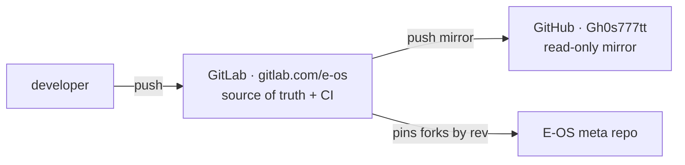

# Ecosystem components

E-OS is a Redox OS downstream: a **meta repo** (the cookbook + E-OS config, tools and docs) that **pins component forks** by exact commit. Every fork lives under [`gitlab.com/e-os`](https://gitlab.com/e-os) (source of truth) and is mirrored to [`github.com/Gh0s777tt`](https://github.com/Gh0s777tt) (read-only).

> This page is generated from [`repos.toml`](https://github.com/Gh0s777tt/E-OS/blob/main/repos.toml), the single source of truth for the repo list. Run `scripts/eos-repos.sh pins` to verify every recipe pin still matches its fork tip.

## Meta

| Repo | Pinned | E-OS changes vs upstream |
|------|--------|--------------------------|
| [E-OS](https://gitlab.com/e-os/e-os) | — | the cookbook, E-OS config, tools, docs |

## Core — critical (kernel / libc / fs / boot)

| Repo | Pinned | E-OS changes vs upstream |
|------|--------|--------------------------|
| [eos-base](https://gitlab.com/e-os/eos-base) | `eos-july` @ `98f22879` | RAID-1 daemon `raid1d`, `usbnetd`, aarch64 INTx routing, hardening |
| [eos-bootloader](https://gitlab.com/e-os/eos-bootloader) | `eos-rebased` @ `f1ba6657` | Crimson red/black theme + banner |
| [eos-kernel](https://gitlab.com/e-os/eos-kernel) | `eos-july` @ `c918080f` | mmap ASLR + W^X + overflow-checks; aarch64 INTx/RNG/timer/serial/crypto |
| [eos-redoxfs](https://gitlab.com/e-os/eos-redoxfs) | `master` @ `ce461328` | hardware AES-XTS (ARMv8 crypto) for FDE |
| [eos-relibc](https://gitlab.com/e-os/eos-relibc) | `eos-july` @ `7e9a95d0` | `ld.so` fixes (weak PLT, ET_EXEC overflow, TLS), ASLR link base |

## Core

| Repo | Pinned | E-OS changes vs upstream |
|------|--------|--------------------------|
| [eos-coreutils](https://gitlab.com/e-os/eos-coreutils) | `master` @ `575a46d3` | — |
| [eos-extrautils](https://gitlab.com/e-os/eos-extrautils) | `master` @ `97bf8c6b` | — |
| [eos-installer](https://gitlab.com/e-os/eos-installer) | `master` @ `05bf2eb4` | — |
| [eos-ion](https://gitlab.com/e-os/eos-ion) | `master` @ `1440704f` | — |
| [eos-netdb](https://gitlab.com/e-os/eos-netdb) | `master` @ `2c156062` | — |
| [eos-netutils](https://gitlab.com/e-os/eos-netutils) | `master` @ `ffea9718` | — |
| [eos-pkgar](https://gitlab.com/e-os/eos-pkgar) | `master` @ `cb8ae7b1` | `read_at` no longer panics on hostile `.pkgar` (R-F03) |
| [eos-pkgutils](https://gitlab.com/e-os/eos-pkgutils) | `master` @ `7e89ac2e` | client verifies `repo.toml` manifest signature (R-703, branch `eos`) |
| [eos-userutils](https://gitlab.com/e-os/eos-userutils) | `eos-july` @ `799088a1` | first-boot OOBE — forces password change (R-602) |

## GUI / desktop

| Repo | Pinned | E-OS changes vs upstream |
|------|--------|--------------------------|
| [eos-orbclient](https://gitlab.com/e-os/eos-orbclient) | `master` @ `fff0c817` | — |
| [eos-orbdata](https://gitlab.com/e-os/eos-orbdata) | `master` @ `27131a53` | E-OS branding assets |
| [eos-orbital](https://gitlab.com/e-os/eos-orbital) | `master` @ `b6de07ef` | — |
| [eos-orbterm](https://gitlab.com/e-os/eos-orbterm) | `master` @ `8ac49817` | — |
| [eos-orbutils](https://gitlab.com/e-os/eos-orbutils) | `master` @ `3ac6436a` | Crimson desktop (launcher/bg), `eos-settings`, `orblogin` greeter |

## Libraries

| Repo | Pinned | E-OS changes vs upstream |
|------|--------|--------------------------|
| [eos-liborbital](https://gitlab.com/e-os/eos-liborbital) | `master` @ `b0388fa7` | — |
| [eos-redox-fatfs](https://gitlab.com/e-os/eos-redox-fatfs) | `master` @ `b033abf0` | — |

## Dev tooling

| Repo | Pinned | E-OS changes vs upstream |
|------|--------|--------------------------|
| [eos-redoxer](https://gitlab.com/e-os/eos-redoxer) | `master` @ `a78d6b51` | — |

## Package repositories (artifacts)

| Repo | Pinned | E-OS changes vs upstream |
|------|--------|--------------------------|
| [eos-pkg-aarch64](https://gitlab.com/e-os/eos-pkg-aarch64) | — | built package repo (aarch64) — artifact, GitHub Pages |
| [eos-pkg-x86_64](https://gitlab.com/e-os/eos-pkg-x86_64) | — | built package repo (x86_64) — artifact, GitHub Pages |

## Hosting model

GitHub Actions is disabled account-wide, so **all CI runs on GitLab**; GitHub is a visibility mirror only. See the [main README](https://github.com/Gh0s777tt/E-OS#readme).
