# A visual tour of E-OS

Every capture below is the real system running under QEMU (x86_64 or aarch64) —
the same images the `[U-NNN]` CHANGELOG entries cite as proof. Full-resolution
originals live in `assets/screenshots/` in the repo; these copies are
web-optimized for the docs site (see `docs/img/README.md`).

## Boot → first login

The red/black Crimson chain from power-on to a usable desktop.

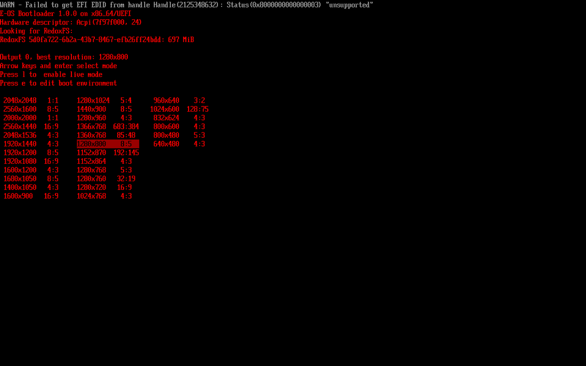
*The E-OS bootloader (fork `eos-bootloader`, branch `eos-rebased`).*

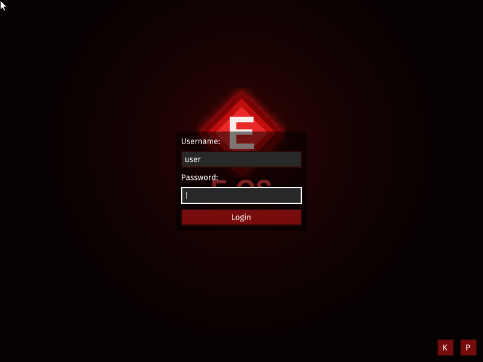
*The `orblogin` greeter (fork `eos-orbutils`).*

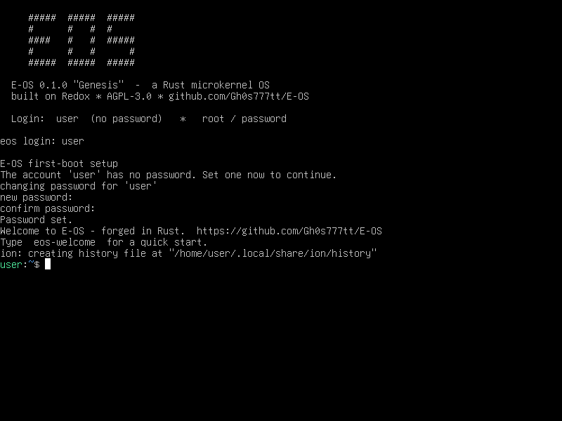
*First-boot OOBE (`R-602`, `U-076`–`U-079`): the shipped default credentials
cannot reach a shell — every path (text, serial, graphical) forces a password
change first.*

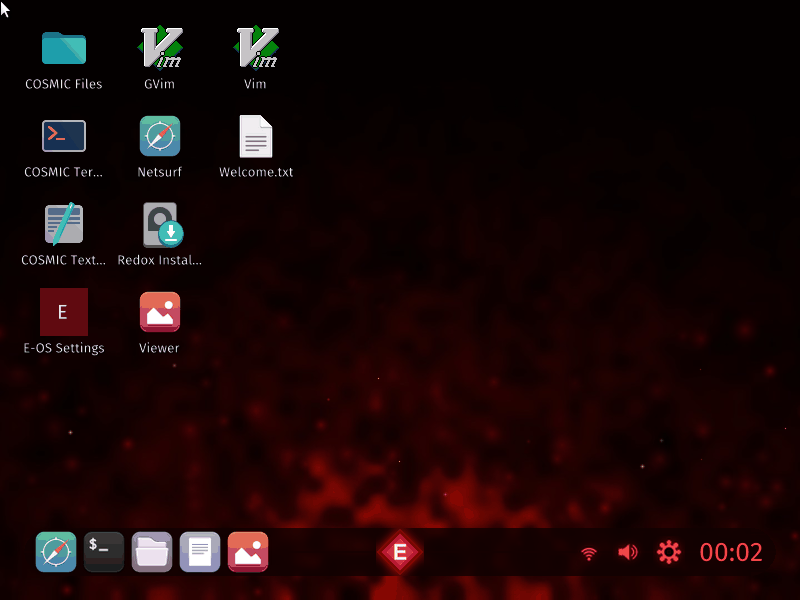
*The Crimson desktop right after the OOBE.*

## The desktop

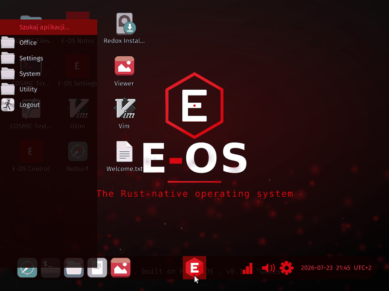
*The launcher with the native app set (`R-D08`: membership proven from the
built image, not the recipe list).*

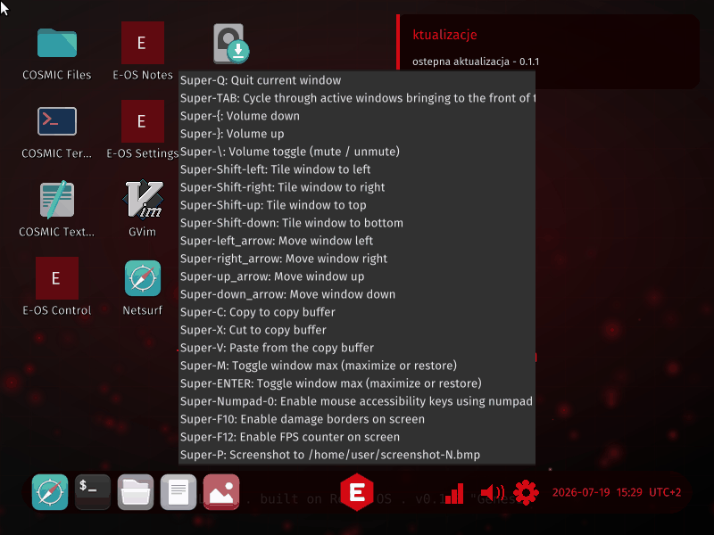
*Toast notifications (`U-098`–`U-102` wave: tray, notifications, screenshot
tool, launcher search).*

## eos-control — the control center

The native Crimson control center (`eos-control`, `U-095`+): one window for
system overview, processes + capabilities, security, storage, power, sound and
network.

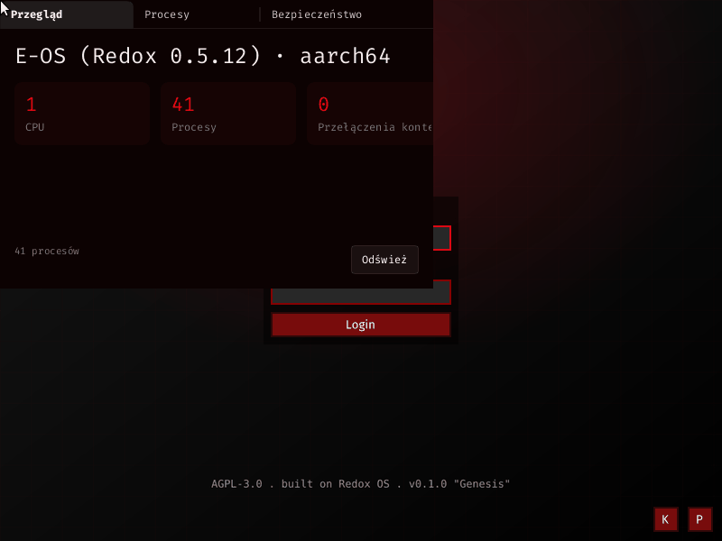
*Overview tab.*

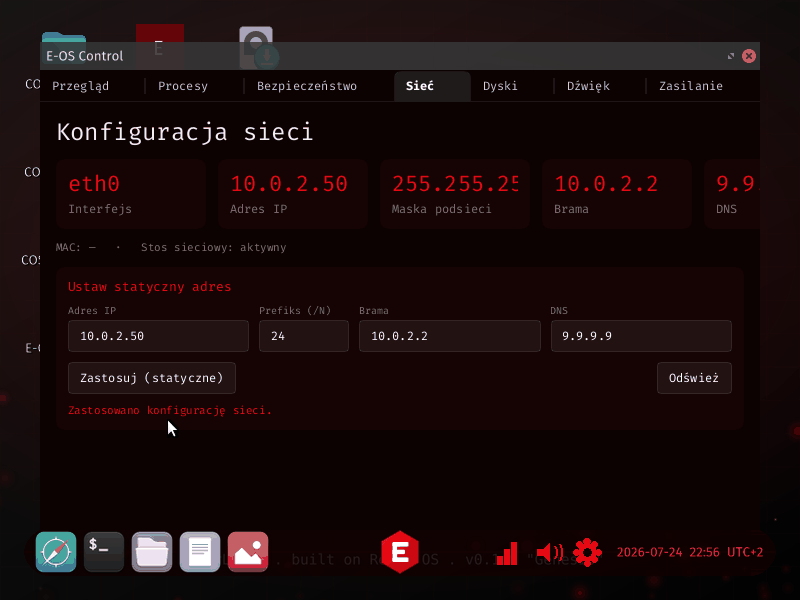
*The Network pane applying a static IPv4 config (`R-902`, `U-112`/`U-113`): the
GUI never runs as root — the change goes through the privileged `eos-netcfg`
shim, and the applied IP visibly flips the tile.*

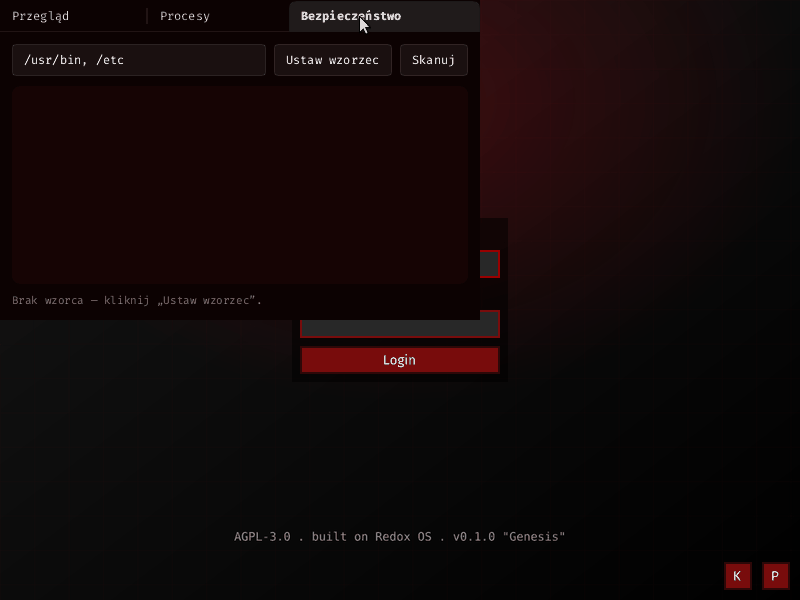
*Security tab.*

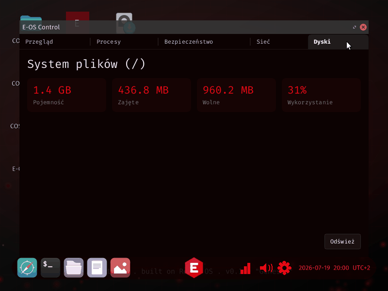
*Storage tab.*

## Native apps

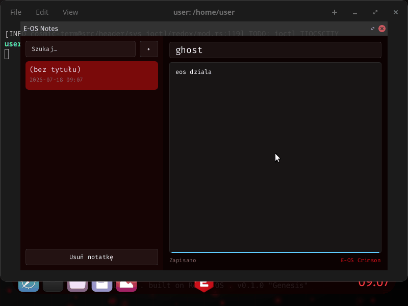
*eos-notes (`U-086`–`U-088`) — Slint + SQLite (WAL), built on the shared
`eos-ui` Slint-on-Orbital backend.*

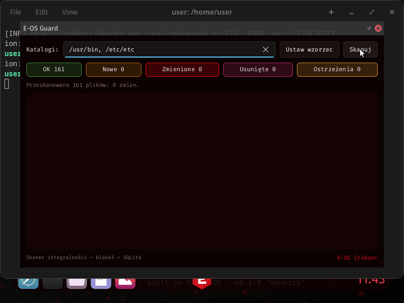
*eos-guard — the filesystem-integrity monitor.* **Not in the image** as of 2026-09-02: the repository
exists (type A, `repos.toml`) but no `[packages.eos-guard]` entry ships it — see `ROADMAP.md` `PR-002`.

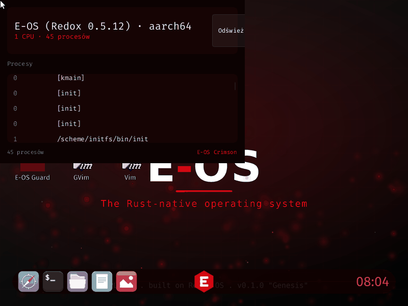
*eos-sysmon — the system monitor.* **Not in the image** as of 2026-09-02, for the same reason —
`ROADMAP.md` `PR-002` decides whether it ships or leaves the product list.

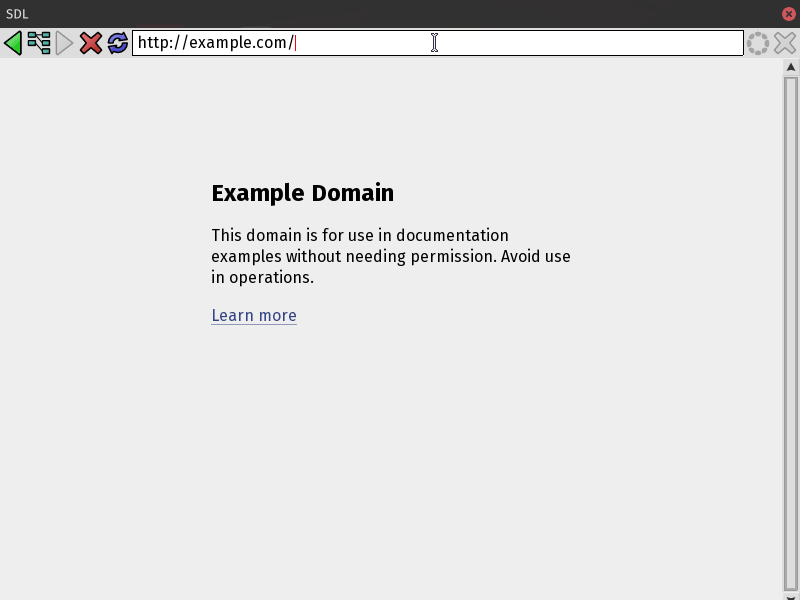
*NetSurf built from source as a PIE (`U-103`–`U-105`) — real web browsing.*

## aarch64

Both architectures boot to the desktop; aarch64 is the primary dev loop
(Apple-Silicon host).

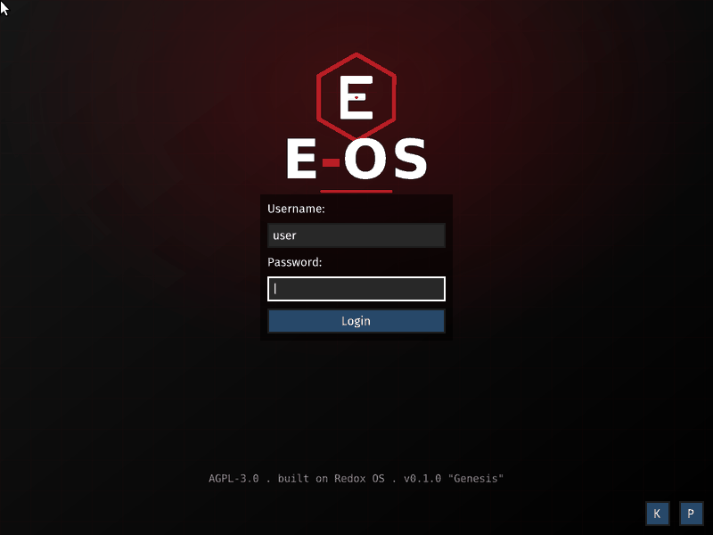
*The aarch64 live ISO at the greeter.*

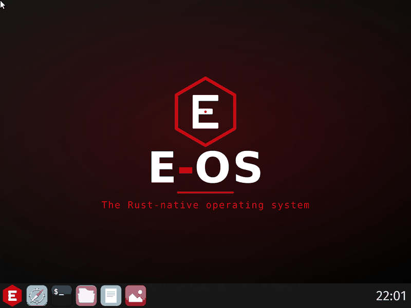
*The aarch64 Crimson desktop.*
