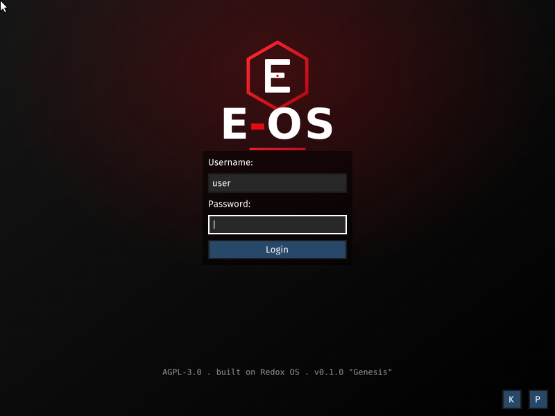

# 💿 Installing E-OS

E-OS ships a **graphical installer** as well as a text installer and the raw disk
image — pick whichever fits. Before anything, **verify your download** (see
[hardening.md](hardening.md)):

```sh
minisign -Vm SHA256SUMS -p eos-release.pub   # key: keys/eos-release.pub
sha256sum -c SHA256SUMS                        # checks the .img files
```

---

## 1. Just try it (no install)

The release image **is** a bootable system. Run it in a VM:

```sh
make CONFIG_NAME=eos qemu          # x86_64, KVM-accelerated
# or boot eos-0.1.0-x86_64.img in any UEFI VM (NVMe disk)
```

Default logins: **`user`** (no password) · **`root`** / `password`
— **change these** before real use ([hardening.md](hardening.md)).

### Live / installer medium (USB-style, read-only)

Besides the pre-installed `harddrive.img`, E-OS builds a **bootable live ISO** — a
read-only medium that boots the full system (greeter + `installer-gui`) so you can try
it and then install to a real disk, exactly like a Linux live USB:

```sh
make CONFIG_NAME=eos ARCH=x86_64  build/x86_64/eos/redox-live.iso   # or ARCH=aarch64
# → boot the .iso in a UEFI VM, or flash it to a USB stick (dd, see §4)
```

Both arches are **verified** to boot the live ISO to `eos login:` (QEMU/UEFI: "Switching
to live disk" → E-OS 0.1.0 "Genesis" → login, 0 exceptions on aarch64 **and** x86_64):



## 2. Graphical install (recommended)

E-OS includes **`redox_installer_gui`** — open **“Installer”** from the desktop
launcher (the red **E** menu). It walks you through:

- choosing the **target disk**,
- creating **users / passwords**,
- a **RedoxFS disk-encryption password (recommended)** → encrypted root
  (see [encryption.md](encryption.md)),
- the package set,

then writes E-OS to the disk. Reboot and remove the install medium.

## 3. Text install (headless)

For servers / no-GUI installs, run the TUI installer:

```sh
redox_installer_tui            # prompts for disk, users, encryption, packages
```

Both GUIs drive the same engine (`redox_installer`); a config-file install is also
supported (`redox_installer <config.toml> <disk>`), where
`[general] encrypt_disk = "…"` enables FDE non-interactively.

## 4. Flash the image directly

The `harddrive.img` is a ready GPT/UEFI disk image — write it straight to a USB
stick or disk:

```sh
sudo dd if=eos-0.1.0-x86_64.img of=/dev/sdX bs=4M conv=fsync status=progress
```

(Replace `/dev/sdX` with the real device — this **erases** it.) This path does not
prompt for encryption; use the installer (2/3) if you want an encrypted root.

## Architectures

- **x86_64** — boots end-to-end to the COSMIC desktop (UEFI, NVMe). Both the
  pre-installed image and the live ISO boot to `eos login:` with 0 exceptions.
- **aarch64** — **boots to the graphical E-OS greeter/login** under QEMU `virt` (UEFI),
  and the live ISO boots the same way (verified). The early-boot blockers that once
  stopped it (`R-401b` FEAT_RNG emulation and the follow-on PCIe-INTx / signal-ordering
  fixes) are **fixed** — see `upstream/`. The extra **COSMIC apps** (store/settings/reader)
  are still deferred on aarch64 because their `fontconfig → host:gperf` build dependency
  publishes a redoxer host toolchain only for x86_64-linux build hosts; the base desktop
  (greeter, cosmic-edit/files/term, orbital) is present. Build aarch64 on an x86_64-linux
  host to get the full COSMIC app set.

See also: [getting-started.md](getting-started.md) · [building.md](building.md).
