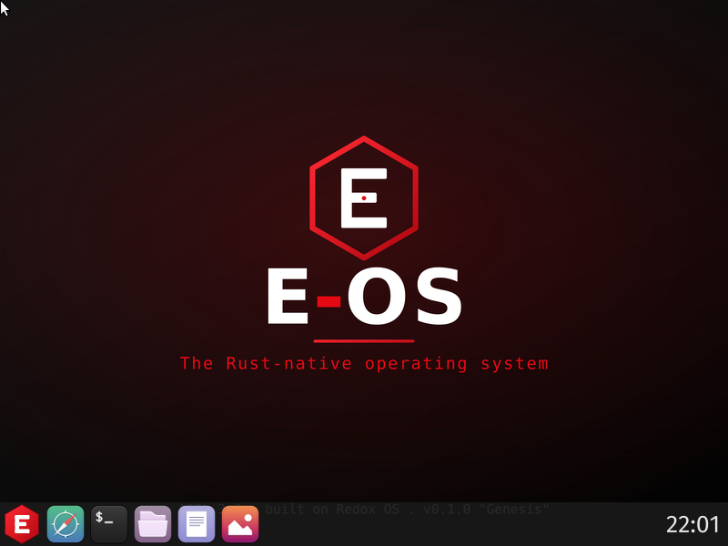

# 🐞 Known Issues

_No issue currently blocks a full **aarch64** or **x86_64** desktop boot._
Resolved items are kept below for the record.

---

## ✅ `R-401b / R-401c / R-401d` — aarch64 boot-to-login (RESOLVED 2026-06-08)

E-OS **aarch64** now boots under QEMU `virt` all the way to the graphical E-OS
COSMIC desktop (login greeter, wallpaper, taskbar, working USB keyboard).



The original report — a `redoxfs` root-mount Data Abort — turned out to be the
**last** symptom of a chain of **four** aarch64 bugs. The earlier diagnosis (an
upstream `redoxfs`/`relibc`/`PAGE_SIZE` memory bug) was **wrong**: `redoxfs` was the
last domino, not the cause. The tell is the serial cascade order — **`randd` crashes
first**, then a flood of `failed to generate random data: ENODEV`, then `nvmed`, then
`redoxfs`.

| # | Bug | Fix |
|---|---|---|
| `R-401b` | `randd` runs `mrs xN, RNDRRS` (FEAT_RNG, ARMv8.5) unconditionally → **UNDEF** on non-FEAT_RNG aarch64 (Cortex-A72/A53, Raspberry Pi, `-cpu cortex-a72`) → kills the `rand:` scheme → every daemon that seeds a HashMap panics `ENODEV` → cascade kills `nvmed` & `redoxfs` (the "Data Abort" in the original report). | **kernel:** trap-and-emulate `RNDR`/`RNDRRS` in the aarch64 synchronous-exception handler. |
| `R-401c` | aarch64 has **no MSI**; `nvmed` falls back to INTx but hard-codes `intx:false`, and the INTx IRQ is only *routed* when Redox boots from a **device tree**, not ACPI. | **base:** `nvmed` runs in INTx mode on non-x86. **Boot:** `-machine virt,acpi=off` forces device-tree boot, so the PCIe interrupt-map exists. |
| `R-401d` | the kernel reserved shared PCIe **INTx** GIC SPIs *exclusively* → `nvmed` failed with `open IRQ: EEXIST`. | **kernel:** allow shared phandle-IRQ opens (`irq_trigger` already fans out to every handle). |

The kernel & base fixes live in the **`Gh0s777tt/eos-kernel`** and
**`Gh0s777tt/eos-base`** forks (the `core/kernel` / `core/base` recipes are pinned
to them, so a fresh clone reproduces). Clean upstream patches + a submission guide
are in [`upstream/`](../upstream/README.md).

### Running the aarch64 image

```sh
qemu-system-aarch64 -machine virt,acpi=off -cpu cortex-a72 -m 2048 -smp 4 \
  -drive if=pflash,unit=0,file=/usr/share/AAVMF/AAVMF_CODE.fd,readonly=on,format=raw \
  -drive if=pflash,unit=1,file=AAVMF_VARS.fd,format=raw \
  -device ramfb -device qemu-xhci -device usb-kbd -device virtio-rng-pci -display none \
  -drive file=build/aarch64/eos/harddrive.img,if=none,id=disk0,format=raw \
  -device nvme,drive=disk0,serial=eos
```

> ℹ️ **`-machine virt,acpi=off` is no longer required** (as of `R-401f` — pcid now routes PCIe
> INTx from the ACPI `_PRT`). aarch64 boots under **both** ACPI (`-machine virt`) and device tree
> (`-machine virt,acpi=off`); the device-tree path stays the cleaner default. (The wallpaper
> crash once seen under ACPI was the relibc TLS bug below — fixed.) There is
> no KVM for aarch64 on an x86 host, so QEMU runs under TCG and the boot is slow (minutes).

### Remaining minor items (non-blocking)

- `netstack` / `audiod` exit on QEMU `virt` (no virtual net/audio device) — harmless.
- The emulated `RNDR`/`RNDRRS` entropy (R-401b) now folds in real **CPU-execution-timing
  jitter** (CNTVCT deltas across data-dependent work — the jitterentropy technique) on every
  read, a genuine entropy source on real non-FEAT_RNG hardware. It is still not a certified
  TRNG — a hardware RNG remains the ideal long-term source.

---

## ✅ `relibc verify()` — every aarch64 shell/desktop program aborted (RESOLVED 2026-06-08)

An earlier note here called this a "cosmetic, intermittent `/usr/bin/background`
null-deref inside relibc". That was wrong on every count:

- It is a **`brk #1`** — an explicit **abort/trap**, *not* a memory fault. The serial dump
  has `ESR_EL1` `EC=0x3C` ("BRK instruction execution"); the printed `FAR_EL1` is stale
  and irrelevant.
- It is **deterministic**, not intermittent: **every** `fork`+`exec`-spawned program
  aborted — `whoami`, `id`, `ls`, `env`, `background` (16/16). The aarch64 shell could not
  run a single external command. Only long-lived, init/`pcid`-spawned processes (drivers,
  the `ion` shell itself) survive — which is why the desktop still "rendered".
- It happens in **`relibc_start_v1`** (the program entry), *before* `main`.

**Root cause.** `relibc_start_v1` → `relibc_verify_host()` → `Sys::verify()`:

```rust
fn verify() -> bool {
    // SYS_YIELD is a no-op on Redox; the same number is a different, failing syscall
    // on Linux — a heuristic to refuse running a Redox binary on Linux.
    syscall::syscall5(syscall::number::SYS_YIELD, !0, !0, !0, !0, !0).is_ok()
}
```

On aarch64, `verify()`'s `YIELD` returns a stale `-1` (the input `x0`) instead of `0`, so it
concludes "not Redox" and aborts. (The kernel actually computes `0` correctly; the true root
cause — a signal-vs-syscall-return race — is the kernel bug fixed in `R-401e` below.)
Confirmed two ways: NOP-ing the abort
branch in `libc.so` made `whoami`/`ls`/`env` work with zero crashes, and the fault
symbolizes to the exact `brk #1` at `relibc_start_v1+0xf48` (a `handle_alloc_error`/abort
landing pad reached from the `cmn w0,#0x84; b.cs` error check right after the yield `svc`).

**Fix (relibc).** The [`Gh0s777tt/eos-relibc`](https://github.com/Gh0s777tt/eos-relibc)
fork (`eos` @ `beb93474`, recipe pinned) issues the yield for its side effect but does not
treat its unreliable result as fatal on aarch64; **x86_64 keeps the strict check**.
Verified by binary disasm + boot: `whoami`/`uname`/`ls`/`env` all run, zero aborts.
Upstream-ready patch: [`upstream/relibc/`](../upstream/relibc/).

**The real root fix (kernel) — `R-401e`, RESOLVED 2026-06-08.** The relibc change above is a
workaround; the kernel root cause is now fixed. It is *not* a "stale `x0` after `exec`": on
aarch64, `sched_yield` calls `signal_handler` **inside** the `YIELD` syscall, *before* the
SVC handler commits the return to `scratch.x0`, and aarch64 alone uses `scratch.x0` (the
return register) as `sig_archdep_reg()` (x86/x86_64 use the flags register, riscv64 a
temporary). So a signal delivered to a context during its yield saved the stale *input* `x0`
and `sigreturn` restored it over the real return (`0`) — breaking the first
signal-receiving `fork`+`exec` program (`whoami` was hit; init-spawned daemons were not).
The kernel now commits the yield return **before** the signal check (`cfg`-scoped to
aarch64), fixed in [`eos-kernel`](https://github.com/Gh0s777tt/eos-kernel) `@ 97ca1607` and
validated on the **unpatched-relibc** image (`whoami`/`uname`/`ls` run, 0 aborts). With the
kernel fixed, relibc has been **reverted to strict upstream** (`core/relibc` re-pinned to
`@ bcc1a0d4`); the production image was rebuilt with strict upstream relibc on the R-401e
kernel and boots with 0 aborts (disasm confirms the strict `verify()` abort branch is present
in the shipped `libc.so`, so it would abort 16/16 without the kernel fix). R-401e is the
upstream contribution (`upstream/kernel/0003-*`); the relibc workaround patch is retired.

---

## ✅ relibc TLS layout — every thread crashed on exit, BOTH arches (RESOLVED 2026-06-10, R-402a)

The long-deferred "intermittent `/usr/bin/background` null-deref" was root-caused with a
kernel-side fault-map dump: it is a **systemic relibc static-TLS bug** — every thread in a
thread-spawning program crashed **on exit** (`relibc::pthread::exit_current_thread` walking
the `CLEANUP_LL_HEAD` thread-local, which read garbage instead of NULL). ion background jobs
reproduce it deterministically: **5/5 on aarch64, 3/3 on x86_64** (the x86_64 case was
verified **pre-existing on unpatched upstream** relibc — it had simply never been exercised).

Two distinct mechanisms, both masked for most workloads by lucky zeroed memory:

- **aarch64/riscv64:** the linker stored x86-style end-relative `Master::offset`
  (`cum+memsz`) which the non-x86 `copy_masters`/DTV paths consume start-relative — every
  module's TLS image copied where nothing reads it (`.tdata` initializers silently zero) —
  plus the static TLSDESC descriptor missing the 16-byte aarch64 TCB bias (all
  dynamic-object TLS reads shifted −16, boundary variables reading the *neighbouring
  module's* memory), the TPOFF reloc using the x86 negative form, and `__tlsdesc_dynamic`
  subtracting the TCB pointer instead of TP (broken dlopen TLS).
- **x86/x86_64:** the backwards placement used the **raw `p_memsz`** for the
  distance-from-end while the static linker computes local-exec offsets from
  **`align_up(p_memsz, p_align)`** — for `ion` (`memsz 0x2c8`, `align 0x10`) the `.tdata`
  image landed 8 bytes above the local-exec plane, overlaying neighbouring thread-locals
  with shifted initializer bytes; Rust std's thread-dtor list head read a shifted nonzero
  constant and the std dtor walked a garbage list at thread exit (near-null fault at
  `0x70`). The x86 static-TLSDESC descriptor also had a wrong sign (corrected, though no
  current binary emits it).

**Fix:** explicit per-arch offset conventions in the
[`eos-relibc`](https://github.com/Gh0s777tt/eos-relibc) fork, branch `eos-tls` `@ 0d30e9ea`
(one clean commit over upstream `bcc1a0d4`; `core/relibc` re-pinned): x86/x86_64 keep the
backwards layout but with alignment-correct placement and a correctly signed TLSDESC;
aarch64/riscv64 use forward, `p_align`-aligned start-based offsets with the aarch64 TCB bias
in TLSDESC/TPOFF. **Verified:** the ion job repro goes **5/5 → 0 (aarch64)** and
**3/3 → 0 (x86_64)**; full production boots clean on both arches. Upstream has no fix on
`master`; the upstream-ready patch is `upstream/relibc/0001-*` and includes a regression test
(`tests/pthread/tls_initexit.c`) covering both failure modes.
